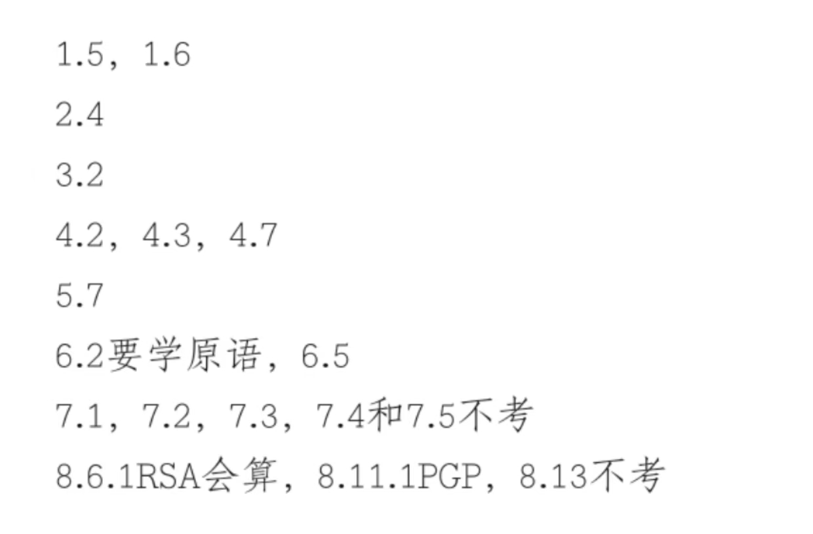
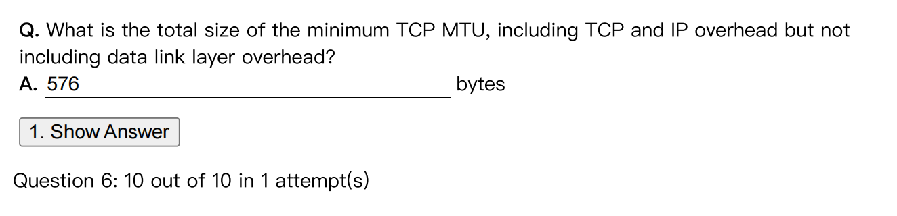
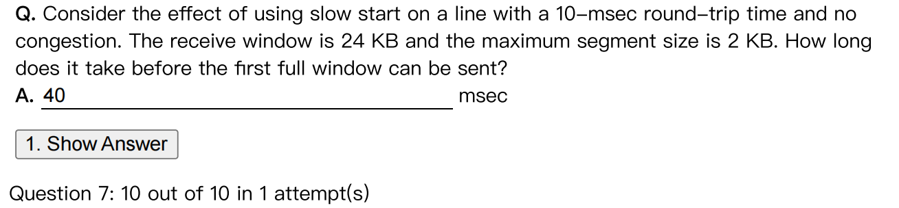
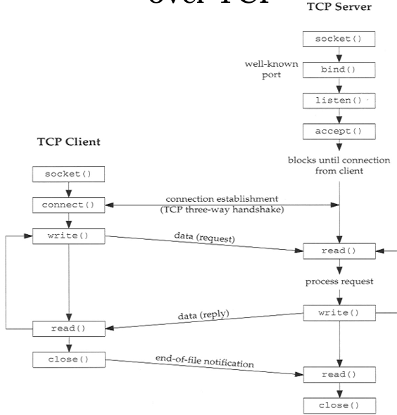

# 
计网考试总结

> 此部分仅为笔者复习 浙江大学 计算机网络部分的总结，仅供复习使用。

## 考试重点
> From 扣根哥

## Chapter1 
> 会避免考 OSI 模型，主要考的是hybrid model 混合模型
>
> 

- `protocol` `service` `interface` 是七层模型的三个重要的概念

- 五个服务原语
    - `CONNECT` `DISCONNECT` `SEND` `RECEIVE` `ERROR`

- `P2P` model 是 peer to peer 而不是 point to point 后者是PPP.
    - `peer to peer` 是指对等网络，是指在网络中没有中心节点，每个节点都是对等的，可以是客户端也可以是服务器。

## Chapter6 
### 6.2
- MSS : Maximum Segment Size
- MTU : Maximum Transmission Unit

题 : 

**解答** 20 + 20 + 536(payload) = 576 bytes

几个常见的 Headers 的大小：

- IP Header : 20 bytes
- TCP Header : 20 bytes
- UDP Header : 8 bytes
- Ethernet Header : 14 bytes

常见的端口号：

- HTTP : 80
- SMTP : 25
- FTP : 21
- Telnet : 23

0~1023 : Well-Known Ports
1024~49151 : Registered Ports
49152~65535 : Dynamic Ports (used for the client side)

### 6.5 TCP 
#### 有关滑动窗口
- the window size of the acknowledgement TCP segment : 指的是接收端的缓冲区大小
- congestion window size : 指的是发送端的缓冲区大小
二者取最小值

##### Slow Start mechanism
> 慢启动机制

也就是说，当一个连接建立的时候，发送端会先发送一个包，然后等待接收端的确认，确认之后，发送端会发送两个包，然后四个包，然后八个包，一直到达到一个阈值，这个阈值就是慢启动的阈值，当达到这个阈值之后，就会进入拥塞避免阶段，这个阶段的阈值就是慢启动的阈值的一半。
说人话就是，窗口大小会以指数级别增长，直到达到一个阈值，然后会以线性增长。

- 1->2 (2KB->4KB)
- 2->4 (4KB->8KB)
- 4->8 (8KB->16KB)
- 8->16 (16KB->24KB) 所以需要四轮的时间。

## 实验部分
> 因为每个班的实验不一样，有教改的部分，所以这边又说可能要考实验，所以只放一下年级各个教学班的唯二相同的实验之一的 `socket` 实验

### 会怎么考
1 . Which socket primitive is used to **block the caller** until a connection attempt arrives? 

- Answer : `accept()`

### 
