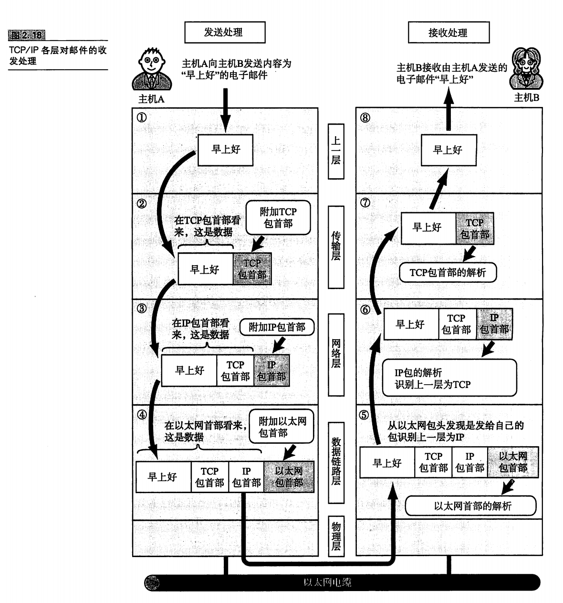

# 
TCP/IP

## Introduction TCP/IP 协议
> 其实指代的是利用IP进行通信时候所必须使用的协议群的统称
- 定义：
具体来说，IP 或 ICMP ，TCP 或 UDP，TELNET 或FTP，以及HTTP等都是属于TCP/IP的协议，他们与TCP或IP关系紧密，因此也有叫做 TCP/IP为网际协议族。

- 传输层 -> It is called Segment
- 网络层 ->It is called Packet 
- 数据链路层 -> It is called Frame

### 网络层

#### IP
> IP 地址 指的是对方主机的标识符

- 由于计算机网络的设计是分层设计，极其的抽象与封装，这导致无论数据链路层是怎么传播的，都不会影响到两个利用IP地址传输的设备传输过程。
##### 特点
- 不具有重发机制，即使是分组数据包未能到达对端主机，也不会进行重发，因此是 非可靠性传输协议

#### ICMP 
> Internet Control Message Protocol 互联网控制信息协议

作用是发送端的IP数据在发送途中如果遇到了异常，无法最终到达对端，那么需要给发送端发送ICMP的发生异常的通知。有时也用来进行网络诊断健康状况。
> 因为IP协议是不可重传的协议，那么在发生故障时，很自然的联想到需要让对方知道我们哪里出错了，ICMP就扮演了这个角色。

### 传输层
> 传输层最重要的功能就是能够让应用程序之间实现通信。因为双方的计算机上运行着许许多多的程序，那么要分清楚我们是哪几个程序之间进行通信就显得尤为重要。所以**端口**出现了。

> 同时传输层有两种传输协议 **TCP** (transfer control protocol)传输控制协议 与 **UDP** (User Datagram protocol) 用户数据传输协议

可以简单的理解为送信员给A家送信，然后A家中有小B，小C，小D 送信员要知道它要把邮件送给谁。 

#### Port 端口号
为了分清这个数据包是发送给谁/谁需要接收，在一个宿主机host中的各个应用程序也就被分配了对应的端口号便于区分。

用上图来简单的说明，在发送来的package被接收了，在某个**destination host**接收了这个数据包的时候，会解构得到TCPheader文件中的**destination port** 80，知道是发送给80端口的SYN包，将数据转发给80端口，然后一直监听着httpd程序即可。
这些服务器程序在UNIX系统中被称为是守护进程， httpd sshd 启动一个就表示它们接收客户端请求的inetd（互联网守护进程），超级守护进程会在接收到客户端请求以后创建新的进程并转化为其他的守护进程。

TCP 和 UDP 两者各有利弊，没有谁说有绝对的优与劣，只是实用场景不同，用到的时候也不同。
##### 数据的区分
因为可能出现两个数据包的 **source port**和**destination port** 完全相同的情况，就不能简单的通过端口号来区分，有的时候甚至两个IP地址也都是完全一样的，但是所用的传输协议不一样，可能是TCP也可能是UDP。因此，我们要保证5样东西完全一样，才能说明是一个通信。

- 源IP地址
- 目标IP地址
- 协议号 TCP/UDP
- 源端口号
- 目标端口号

##### 如何定义端口号
######  标准既定端口号
也就是说每个应用程序都是有它既定的端口号，尤其是一些HTTP,TELNET,FTP等的端口号都是固定的。(Well-Known Port Number)

###### 时序分配法
如果说上面的分配方法是静态的，那么这种方法就是Dynamic动态分配。此时服务端有必要
确定监听端口号，但是接收服务的客户端没必要确定端口号。可以等着让操作系统来分配，这样操作系统就可以动态的管理端口号了。

#### TCP 
> Transfer Control Protocol

 TCP协议是一种面向有连接的传输层协议，什么是有连接呢？就是表示的是我们要时刻跟踪信息的传输，要不断的给发送端进行相应 也就是 **sender** 和 **receiver** 之间是需要互相发送消息确认跟进消息进度的。可以正确的处理丢包/乱序/重传的问题。但是为了建立与断开链接，需要至少7次的发包和收包，导致网络流的浪费，因此不太适合用在视频会议这种方面。

##### 特点
- 可靠
- 面向连接的传输
- 自控制，指的是不需要应用程序考虑，应用程序在接收数据package的时候就已经默认是正确处理过的数据了。
- 但是慢，不能用于即时性很高的信息传输

##### TCP机制
> ack 确认应答 (acknowledge)

也就是说，TCP在两个对象建立起通信的时候，会形成类似对话一样的协议，你发什么，对方就要给你应答什么，直到你接收到了这个ack标志，说明之前的信息已经成功的接收到了。在一段时间内没有收到信息回复，就说明需要重新发送(RTO)。这里CS144的lab里做过。具体机制不细讲

###### 如何确认重发超时呢？

重发超时是指在重发数据之前，等待确认应答到来的那个特定的时间间隔（RTO），当时间超过了RTO则说明要重新发送这个数据，当重发的次数超过一定数量，就会自动的停止连接，并且通知应用通信异常强制终止。
 
##### TCP连接的三次握手
Tips： 三次握手指的是，我们在建立TCP连接的过程，需要发送3个包 **(客户端和服务器之间的互相发送总共三次)**，分别是 **SYN,SYN+ACK,ACK** 来确定，在此期间，我们都需要等待服务器给你acknowledge来确认是否成功接受。完成了三次握手才算真正的完成了TCP一个完整的过程。
**在三次握手的过程中，不仅仅是告诉了完成了TCP连接的建立，其实也是会包含一些元信息，比如MSS(Maximum Segment Size)最大消息长度等等，一些连接之间的消息传输规范都会包含在服务器发来的包中**

##### TCP连接的四次挥手

TCP的**四次挥手**和**三次握手**本质一样，其实就是应答交互。那么四次挥手就是客户端和服务端之间发送4个包进行断开连接的确认。

- FIN 第一次挥手，是客户端向服务端进行挥手。发出断开连接的请求
- ACK 第二次挥手，是服务器端向客户端进行的挥手，发出请求的应答，同意断开连接。
- FIN 第三次挥手，是服务器向客户端的挥手，发出请求，让客户端可以进行断开连接了。
- ACK 第四次挥手，是客户端向服务器端进行的挥手，表示的是同意了请求，正式断开连接。

##### 滑动窗口机制

因为如果我们每次只发一个段，还要等待完成应答之后才能继续发送，这样会在网络拥堵的时候造成性能大幅下降。因为会由于等待的时间延长而下降。我们这里考虑开个窗口**无需等待确认应答而可以继续发送数据的最大值，同时窗口中要记得保留窗口内的数据直到接收到了成功传输的应答的时候才可以停止。**

比如上图，我们设置了一个窗口，它有4个段。每成功接收到了一个数据应答的时候就进行滑动窗口。

##### 滑动窗口的窗口控制与重发
- case1 应答未能返回，这种情况下，如果数据已经达到了对端，那么我们也不需要重发。在利用了窗口控制之后，有些数据没有得到应答也不用重发，因为在TCP协议中，我们会有一个reassembler部分，也就是说我们得到的是服务器已经接收到的数据成功顺序排序的结果，比如没有收到1001的数据应答，但是收到了2001的数据应答，就说明服务端已经接收到了1001，只是因为某种原因，发回的应答没有收到，这种时候就应该直接把2001之前的buffer中的数据进行清除。

- case2 当窗口比较大的时候，这时候我们的接收到的应答如果超过了3次，都需要1001的报文进行重发，这时候就需要将1001序号的报文进行重发了。

#### UDP
> User Datagram Protocol
##### Introduction
 UDP有别于TCP，是一种面向无连接的传输协议，不会考虑对方是否真的收到了发送过去的数据，只负责发送。**那么检验的工作就交给应用程序解决**，就是简单的来说它很纯粹，一次只干一件事，那就是负责把数据传出去，就OK了。
##### 特点 

- 简单高效
- 面向无连接
- 可以随时的发送数据

##### 使用场景 （包少/即时）

- 包总量较少的通信DNS,SNMP
- 视频/音频等多媒体即时通信
- 限定于LAN等特定网络中的应用通信
- 广播通信

#### TCP 首部格式(header file format)

> 首先是为什么是32位？

因为，倘若是64位，我们就可以保证近似无限大，$2^{64}$来表示字节的索引实在是有点浪费了，因为对于TCP的首部来说空间是很宝贵的。因此我们考虑了一种$wrap \ number$也就是32位。然后起始的$SYN$是随机数`uint32_t`，然后进行循环表示类似下图的表来表示比较易懂。

- sequence number 序列号 表示的是发送数据的位置，也就是滑动窗口的左边缘。
- Acknowledgement Number 确认应答号 表示的是下一次应该收到的数据的序列号
- Data Offset 数据偏移 表示的是TCP所传输的数据部分应该从TCP包的哪一位开始计算，也可以看成是TCP首部长度。

- checkSum 校验和 作用是一种进行路由器内存故障或程序漏洞导致的数据是否被破坏的一种检查。**因为数据链路的FCS已经可以检查了在噪声干扰的通信途中出现的位错误**，那么这里的校验和就是看协议首部和数据是否被破坏。
**这里参考上面的UDPCheckSum**

- **Control Flag**控制位 每一位都有不同的作用

   

#### UDP 首部文件

就简单的来说，UDP的首部header中的checksum是可选的。如果不想检查就写全0.倘若想检查，那么很简单，我们就把checksum定义为前面所有segments之和取余之后的补码，这样就可以让所有加起来的和为$4'hFFFF$也就是全部为1.在检验的时候，如果发现有一位不为1，那么就说明差出现了错误。

- 为什么要计算UDP伪首部的理由？
因为对于TCP/IP中识别一个进行通信的应用需要5大要素，他们分别是
    - source IP 
    - destination IP
    - source Port
    - destination Port
    - protocol number **TCP/UDP**

### 应用层
> The Application layer here included 3 layers in the OSI 

#### WWW
浏览器与服务端之间通信所用的协议是HTTP(HyperText Transfer Protocol)超文本传输协议，而传输数据的主要格式就是HTML(HyperText Markup Language)超文本标识语言。WWW中的HTTP属于OSI应用层的协议，而HTML属于表示层的协议。

#### E-Mail
> SMTP Simple Mail Transfer Protocol

而电子邮件协议在MIME协议的拓展之后，可以发送出了文本格式的电子邮件了，而MIME协议也属于OSI参考模型的第六层----表示层。

#### FTP 
> File Transfer Protocol文件传输协议

FTP进行文件传输的时候会建立两个TCP连接，分别是发出传输请求时所需要用到的控制连接和实际传输所要用到的数据连接，其实也就是先要发送一个request请求和实际传输。

#### TELNET 和 SSH 
> 远程登录

### Package 包传输

我们的数据包其实是数据 + 若干头文件，因为计算机网络是分层的，那么我们在每个分层中都会为数据加一个header头文件，包含了该层的必要源信息，如发送目标地址以及协议相关的信息。从下一层来看，上一层收到的包全部都被认为是本层的数据，包括其他层未解构的头文件。

