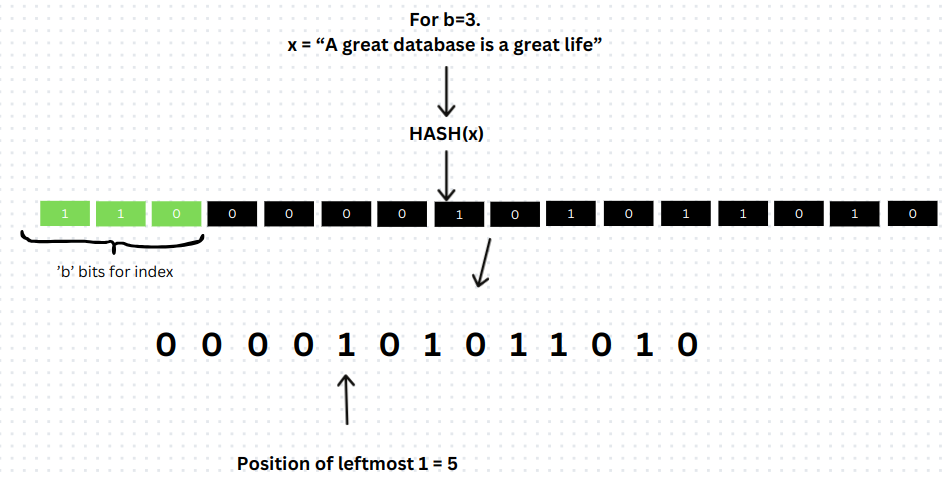
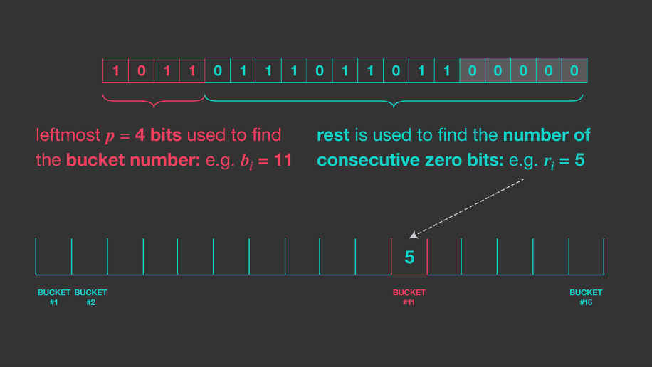
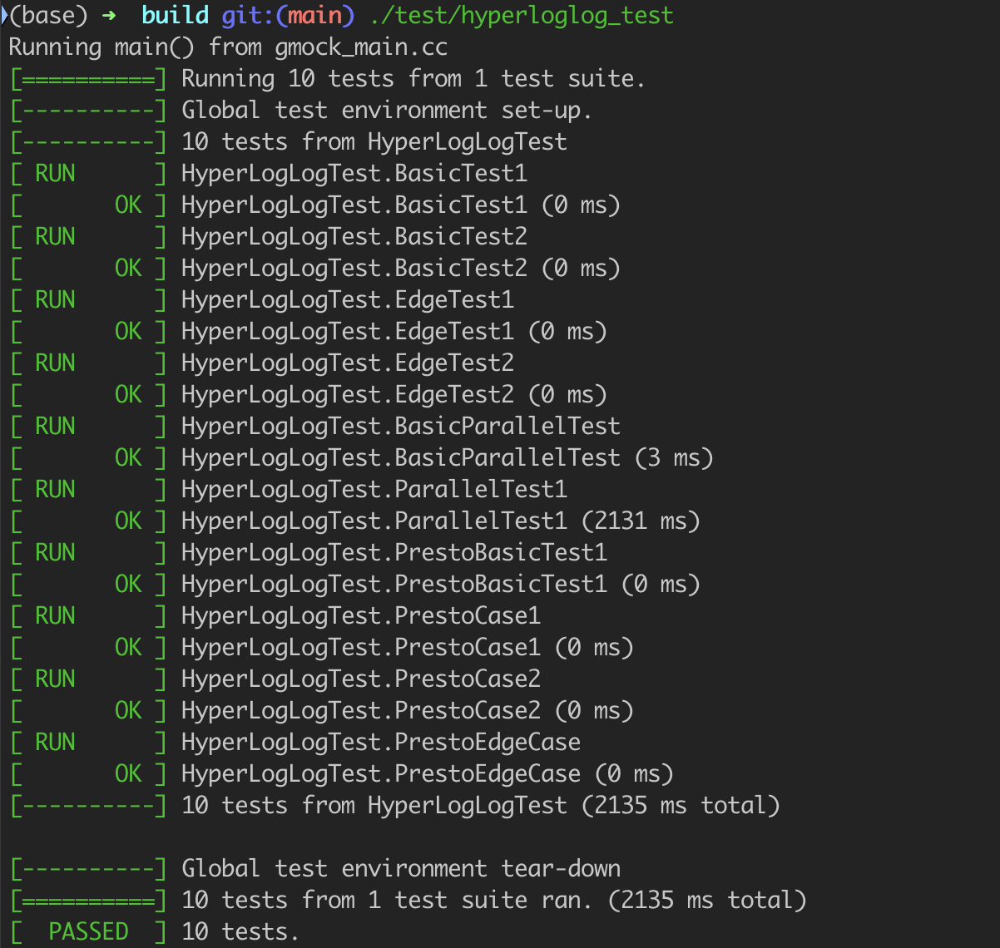
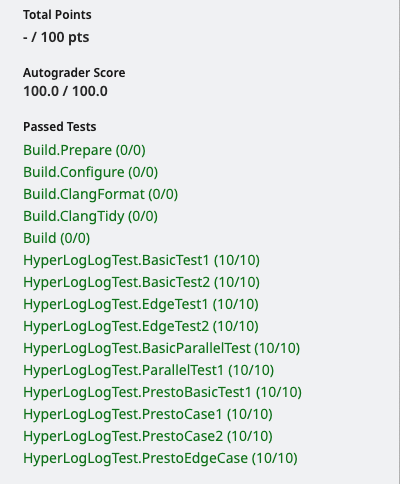

# 
Project0 实验报告

<a href = "https://15445.courses.cs.cmu.edu/fall2024/project0/">实验网址</a>

**Do not cheat!**

<a href ="https://github.com/Magnus031/BusTub/blob/main/src/primer/hyperloglog.cpp">My Code for General HLL</a>

<a href = "https://github.com/Magnus031/BusTub/blob/main/src/primer/hyperloglog_presto.cpp">My Code for Improved HLL</a>

## Problem description

This is a problem that we run across in our daily life. We want to count for the number of unique users in the website. The natural method is to list all the users in one list, and check for the duplicates. But it is impossible for the website which we have millions of users. So we need to find a more efficient way to solve this problem.

### Problem introduction

So this project, we will implement a data structure, HLL(HyperLogLog) to help us solve this problem. The following is the basic idea of the HLL algorithm.

> From the webiste wiki :
> The **HyperLogLog(HLL)** is a probablistic data structure that tracks the cardinality of large data sets. HyperLogLog is suited for scenarios like the above, **where the goal is to count the number of unique items in a massive data stream without explicitly storing every item.** HLL relies on a clever hashing mechanism and a compact data structure to provide accurate estimates of unique users while using only a fraction of the memory required by traditional methods. This makes HLL an essential tool in modern database analytics.

We can clearly know that we must use the Hashing to get the unique users, with the fastest speed and the least memory.

## Project Implementaion
This Project mainly wanted us to implement the HLL algorithm with 2 versions:

- General HLL
- Improved HLL

### General HLL
> This part is easy, the difficult point is to understand the HLL algorithm.

See the above picture, we can know that for the given object which convert to the hash value. We just use the hash value to get a register index, and get the register value use the remaining bits.

#### The main steps of the General HLL algorithm

- Step1 : For the given `KeyType object`, we use the `CalculateHash` function to get the hash value.

- Step2 : We use the first `b` bits, (`b` is a positive number), to get the register index.

- Step3 : For the remaining bits, we use the `PositionOfLeftmostOne` function to get the position of the leftmost one.(The left most zero number plus 1).

- Step4 : We update the register value with the maximum value of the current register value and the position of the leftmost one. `register[index] = max(register[index], position)`

- Step5 : Repeat the above steps for `n` times. 

- Step6 : We use the `CalculateCardinality` function to get the cardinality of the unique users.

$$
Cardinality = \frac{CONSTANT*m^2}{\sum_{i=1}^{m}2^{-register[i]}}
$$

> CONSTANT here we view it as `0.79402`, m is the number of registers.

### Improved HLL

<a href = "https://engineering.fb.com/2018/12/13/data-infrastructure/hyperloglog/">算法网址</a>

This algorithm has some differences with the General HLL.

1. It doesn't compute for the `leftmost` Position, but it computes for the `rightmost` zero. 
2. Every registers must be updated with the `rightmost` zero. And the ranges of the register value is about `[0,15]`, so we can use 4 bits to store the register value. And for the overflow, we have to use the `unordered_map overflow` to store the overflow value.
3. The `CalculateCardinality` function is the same as the General HLL. And do not forget to use the `overflow` in the calculation.

Warning: 

Actually, the project description provided has not say in detail for the when register value has been replace. So I spend some time on watching for the test files to know that If the register value is `0`. Then you do not need to upgrate, otherwise, every value you run across need to update.

## Test and Result

This project has no code meaningful. So I do not want to place the code here.

This is the local test result of the Project0.

The result of project0 in the Gradescope. AC! No hidden test.

