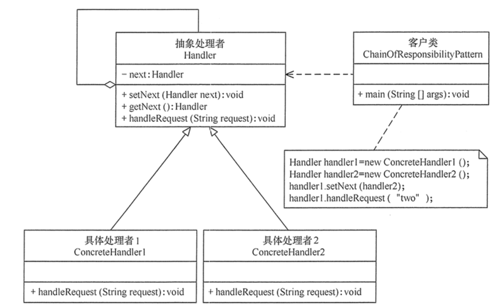

# <center>责任链模式</center>

## Introduction 

什么是 **责任链模式** 呢？

首先，我们需要知道的是，设计模式的本质就是 **解耦**，将一个大的系统分解成一个个小的模块，然后通过这些模块之间的协作，来完成一个大的系统。

那么 责任链的字面意思就是，为了避免**请求发送者** 与 **请求处理者** 耦合在一起，我们将  <span style = "color : red">所有请求的处理者通过前一对象记住其下一个对象的引用而连成一条链，当有请求发生的时候，可以将请求通过这一条链传递，直到有对象处理它为止。</span>

### 特点：

- `链表结构` ： 每个 `Handler` 会维护对下一个 `Handler` 的引用，形成一个链表结构。请求沿链传递直到被处理或者到达链表尾部为止。

- `动态组合` : 我们可以尝试利用 `Builder` 模式来构建责任链，或者通过集合来进行管理

#### 优先:
> 其实优点很显然

- **简化了对象** : 降低了对象之间的耦合程度，我们不需要知道哪个对象 `Handler` 会来帮我们进行处理，只需要将请求发送出去即可。
- **可拓展性** : 我们可以动态的在责任链上进行添加或者删除节点，从而实现动态的责任链。
- **灵活性** : 我们可以根据自己的需求来进行组合，从而实现不同的功能。

#### 缺点:
> 缺点也很显然

- **性能问题** : 因为责任链是一个链表结构，所以在处理请求的时候，会有一定的性能损耗。因为如果对应的责任链比较长，而 需要处理的 `Handler` 也处于链表的尾部，那么就会有一定的性能损耗。

- **调试问题** : 因为责任链是一个链表结构，所以在调试的时候，会有一定的困难，因为我们不知道请求是如何传递的，所以在调试的时候，会有一定的困难。


## 实现


```java
// 抽象处理器（类似链表节点）
public abstract class Handler {
    protected Handler next;
    public void setNext(Handler next) { this.next = next; }
    public abstract void handle(Request request);
}

// 具体处理器传递请求
public class ConcreteHandlerA extends Handler {
    @Override
    public void handle(Request request) {
        if (canHandle(request)) {
            // 处理请求...
        } else if (next != null) {
            next.handle(request); // 传递请求
        }
    }
}
```

首先，我们知道的是 责任链 本质上也是 `Handler`,对于不同的责任链对象，他们只是处理的请求和逻辑不同，我们即可利用 `Handler` 来进行抽象。

然后进入 `ConcreteHandlerA` 的逻辑，其实就是一个链表节点，我们首先判断是否可以处理这个请求，如果可以处理，那么就处理，否则就将请求传递给下一个节点。


## 应用场景

一个很简单的场景就是 -> **审批**

我们以 **请假** 为例，规定对于不同的请假时长，需要不同的审批人来进行审批。

- 请假 **2-3天** : 部门mentor审批
- 请假 **3-7天** : 部门leader审批
- 请假 **7天以上** : 部门manager审批

那么我们就可以抽象一个 类 `Role`,然后继承 `Handler` 来实现不同的审批逻辑。
