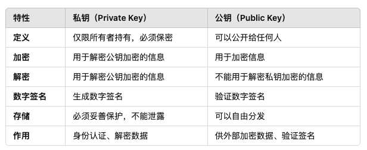

# 
加密

## 公钥和私钥的区别

> 首先，**公钥**和**私钥**属于非对称加密中的两个核心概念

公钥 : 字面意思就是公共的，也就是可以公开给任何人

私钥 : 字面意思就是私有的，只有自己知道

### 用于加密解密

发送方使用接收方的公钥进行加密，但是接收方需要自己的密钥进行解密。这样就保证了数据的安全性。

### 用作数字签名

用私钥进行签名，然后用公钥验证.

发送方用自己的**私钥**对数据**生成数字签名**。接收方用发送方的公钥对签名进行验证。

