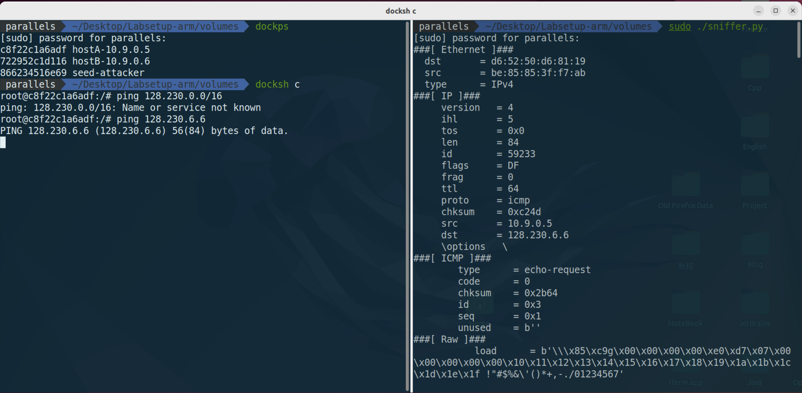

# <center>Network Lab1</center>

## Task1 使用 Scapy 嗅探和伪造数据包
### Task1.1 嗅探包

#### 1.1 A 观察现象

首先，我们使用 `ifconfig` 命令来查看当前的网络接口名称。ID 为 `br-987f0e60d6f5`

接下来我们在 `./volumes`目录下进行任务.

```python
#!/usr/bin/env python3
from scapy.all import *

def print_pkt(pkt):
    pkt.show()
    
pkt = sniff(iface="br-987f0e60d6f5",filter='icmp',prn=print_pkt)
```

我们首先发现，当不使用 `chmod a+x ./sniffer.py` 的时候，出现的情况是无法进行执行的，出现了`operation not permitted` 的错误。


接着，我们使用了`chmod a+x ./sniffer.py` 来进行权限的修改，然后再次执行，发现可以正常的进行嗅探。

如下图:
 攻击者正常的嗅探到了对应的数据包。

#### 1.1B 几个子任务
##### 只捕获 ICMP 包 

    这个任务和上面的内容是一样的，所以不重复粘图;

##### 捕获来自某个特定的 IP 地址并且目标端口号为 23 的TCP 包

> 我们将 `filter` 改成 `TCP` 

```python
#!/usr/bin/env python3
from scapy.all import *

def print_pkt(pkt):
    pkt.show()
    
pkt = sniff(iface="br-987f0e60d6f5",filter='src host 10.9.0.5 && dst port 23 && tcp',prn=print_pkt)
```

并且在 `10.9.0,5` 的容器中利用 `telnet` 来进行测试，如下图结果。


##### 捕获来自或去往某个特定网络的包。可以选择任意网络，例如 128.230.0.0/16，但不应选择与你的虚拟机连接的同一子网。

我们选择捕获 `src net 128.230.0.0/16` 和 `dst net 128.230.0.0/16` 的包。因此更改了以下代码:

```python
#!/usr/bin/env python3
from scapy.all import *

def print_pkt(pkt):
    pkt.show()
    
filter='dst net 128.230.0.0/16 || src net 128.230.0.0/16'
pkt = sniff(iface="br-987f0e60d6f5",filter=filter,prn=print_pkt)
```
测试一下结果，也就是我们在 `10.0.9.5` 中进行`ping`查看嗅探结果.


### Task1.2 伪造ICMP包

首先，我们继续进行监听。监听的类型为 `icmp`.其次，我们在攻击端进行伪造数据包的发送，伪造一个 `echo request` 来进行测试。下面是测试代码:
```python
from scapy.all import *

a = IP()
a.dst = '10.9.0.5'
b = ICMP()
p = a/b 
send(p)
```

接下来在 `attack` 端进行监听是否存在对应的数据包`echo response`。如下图:


我们可以明显的观察到，存在两种 `echo request` 和 `echo response` 的数据包。说明我们成功的伪造了数据包。


### Task 1.3 Traceroute 
使用 `Scapy` 来估计从虚拟机到目标距离，之间隔了多少个路由器。


下面是我的测试程序，主要的逻辑就是 维护一个 `ttl` 变量来进行测试，只有当抵达目标的时候才会停止增长.

```python
# /usr/bin/python3
from scapy.all import *

def custom_traceroute(target_ip, max_ttl=30):
    ttl = 1
    while ttl <= max_ttl:
        packet = IP(dst=target_ip, ttl=ttl) / ICMP(type=8, code=0)  
        response = sr1(packet, verbose=0, timeout=2)  
        
        # 无响应处理
        if response is None:
            print(f"TTL {ttl}: * (No Response)")
            ttl += 1
            continue
        
        # 检查是否为目标主机的响应（ICMP Echo Reply 或目标 IP 匹配）
        if response.type == 0 or response.src == target_ip:  
            print(f"TTL {ttl}: Reached Destination → {response.src}")
            break
        

        print(f"TTL {ttl}: Router → {response.src}")
        ttl += 1

```


### Task1.4 窃听和伪造结合
**ARP协议**是 Address Resolution Protocol 地址解析协议的缩写。主要的作用就是在 以太网环境下，数据的传输所依赖的并不是 IP 地址，而是MAC 地址，那么将IP地址转化成 MAC 地址的过程就是 ARP 协议的作用。

主要的思路就是，假设 `Host A` 给 `Host B` 发送数据包，`Host A` 会维护一个 `ARP` 表，存放的是 对于IP地址和 MAC 地址之间的映射。类似一个缓存的作用，如果此时 `Host A`发送的IP地址在 `ARP` 表中存在，那么就可以直接的将 IP 地址转化为对应的MAC包了。但是如果不存在，那么就会以广播的形式发送，请求对应的MAC地址。里面包含了发送端的 IP 和MAC地址，目标的IP地址和全是0的MAC地址，此时该网段的所有主机都能收到请求。但是只有Host B会对请求处理，因为他们都会将 发送的`ARP` 请求中的 `IP` 和自己的 `IP` 进行比较，如果相同，那么就会将自己的 `MAC` 地址发送给 `Host A`。这样 `Host A` 就可以将对应的 `IP` 转化为 `MAC` 地址了。

类似一个可以建立连接的过程，同时`HostB` 也会存放 `HostA` 的`IP`地址以及`MAC` 地址。

那么接下来的实验其实就比较好理解了。因为我们正常情况下，发送的 `echo request`,只有在目标的 `Host` 接收到了，才会有 `echo response`.但是我们这个实验要完成的就是，我们在 `Host A` 中发送一个 `echo request` 给 `Host B`,但是我们在 `Host B` 中伪造一个 `echo response` 给 `Host A`。这样就可以实现窃听和伪造的结合了。大体的思路就是，在 `Host A`中对某个 **存在与否的 IP** 进行 `ping`操作，然后我们 `attack` 端的目的就是对 `ICMP` 的 `echo request` 进行监听，一旦监听到了，就进行伪造 `echo response` 的操作。然后让 `Host A` 误以为是 `Host B` 发送的。


下面是我们的代码：

```python
# /usr/bin/python3

# 用户端
# ping x.x.x.x 

# 攻击端
#!/usr/bin/python3
from scapy.all import *

def spoof_pkt(pkt):
    # 当我们 sniff 到的 pkt 的类型为 8 -> echo_request 
    if ICMP in pkt and pkt[ICMP].type == 8:
        # 进行伪造 echo response
        print("Original Package ....")
        print("Source IP : pkt[IP].src")
        print("Destination IP : pkt[IP].dst")
        
        # 伪造一个 IP 数据包，从捕获到的pkt中获取源&&目标的Host
        ip = IP(src=pkt[IP].dst,dst=pkt[IP].src,ihl=pkt[IP].ihl)
        icmp = ICMP(type=0,id=pkt[ICMP].id,seq=pkt[ICMP].seq)
        data = pkt[Raw].load
        newPkt = ip/icmp/data
        
        print("We have spoofed the package")
        send(newPkt,verbose=0)

pkt = sniff(iface = "br-987f0e60d6f5",filter='icmp and src host 10.9.0.5',prn=spoof_pkt)

```

上面的代码其实思路也很简单，就是 两个逻辑 `嗅探` && `伪造`.

**下面是我们的测试结果:**

- `ping 1.2.3.4`


右图就是为了方便我们测试 `attack` 端是否嗅探到并且成功的伪造了数据包。发现已经成功，左边的图就是我们的 `ping` 的结果。一开始是没有回应的，但是在外面进行了嗅探之后，就接收到了回应。上面显示的`25% package loss` 是因为，为了进行对比，我故意先进行 `ping` 操作，然后再开启嗅探。

- `ping 10.9.0.99`
 

`10.9.0.99` 是一个子网内不存在的主机IP,会直接返回 `Destination Host Unreachable` 的错误。正常是无法进行`ping`操作的。为什么二者出现这样的区别，其实很好理解的就是，前者是一个互联网的IP地址，而后者是一个局域网的IP地址。前者的网关会优先默许(response会早于错误信息的到来)，而后者会因为 ARP 机制，无法找到对应局域网内的`Host`,也就是说无法进行`ARP解析`,网关会直接返回错误。

- `ping 8.8.8.8`


因为`8.8.8.8` 是真实存在的IP地址，所以会有正常的回应。所以我们看左边，接受到了两种类型的数据包。一种是我们的真实的`echo response`,另一种是我们进行伪造发送的`echo response`.这就是我们的实验的目的。

左边刚好 `9*2 = 18` 次，右边也伪造了 `9` 次。


**说明:** 我用了Deepseek来进行了`scapy`包中一些参数的详细解释，并且也熟悉了 `ping` 命令和 `telnet`命令的时候，同时平时没有用过`docker-compose.yml` 文件来建立多个容器，所以也学习了一下。