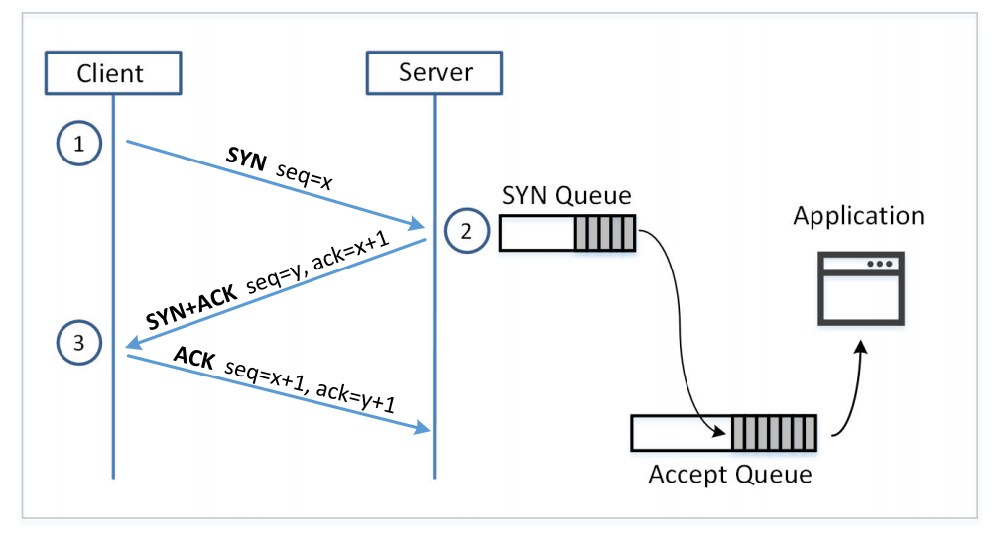

# 
TCP攻击

> 这部分笔记仅面向实验学习，具体的学习内容等考试周的时候再进行补充

## TCP 前置知识

一旦 TCP 连接建立，那么操作系统会为连接的每一端都维护两个缓冲区，分别是:(双工通道)
1. 发送缓冲区
2. 接收缓冲区

一旦一个应用需要发送数据的时候，它并不是直接构建一个包，而是将数据放入发送缓冲区，然后操作系统的TCP协议栈代码会将数据打包出去。为了避免小数据包带来的 **带宽浪费**，会刻意的等待一段时间，然后将缓冲区中的数据打包发送出去。

发送缓冲区中的每个字节都有一个序列号和它绑定，在 **TCP** 头部里有一个 seqence number,表示的是负载中的第一个字节对应的序列号，然后当包到达接收端的时候，TCP协议会利用TCP头部中的序列号将数据放进缓冲区中的正确接收位置。然后后续就会自动的进行排序这些数据包。

一旦一个数据被放进接收缓冲区，它们会被合并成一条数据流，包的边界会被忽略(**只有 TCP 会这样处理**)，这样的话，应用程序就可以像读取一个文件一样读取数据。

### TCP 头部

我们看上图，主要是分成两部分:

- `Source port` 从哪个端口发送出去的
- `Destination port` 发送到哪个端口
- `Sequence number` 序列号  -> 主要是发送方的发送序号，表示的是从发送方发来的负载中的第一个字节的序列号
- `Acknowledgement number` 确认号 -> 主要是接收方的接收序号，表示的是接收方期望接收的下一个字节的序列号 

- `Window Size` 表示的是 发送方希望对方能接受的字节数的上限

## SYN 泛洪攻击

> SYN 泛洪攻击 主要针对的是 **三次握手协议**

上述是三次握手的过程，我们可以发现，不仅仅是客户端需要初始化一个 `32bit` 的随机数，作为客户端给服务端发送的序列号，我们同时也需要服务端初始化一个 `32bit` 的随机数，作为服务端给客户端发送的序列号。 **这个是因为TCP协议的传输是双工的，客户端和服务端同时都作为消息的发送和接收方，那么就需要两个 sequence number 作为甄别**

当 服务端第一次接收到了 `Client` 发送的 `SYN` 包的时候，此时其实是半开工状态，也就是说只有从客户端到服务端的单方向通道被打开了，此时的数据会被放入服务端的接收缓冲区中，然后服务端会给客户端发送一个 `SYN+ACK` 包，表示的是服务端接收到了客户端的请求，并且服务端也准备好了。**服务端**接收到从**客户端**发来的 `ACK` 的包的时候，就说明了客户端也准备好了，此时服务端和客户端之间的通道就被打开了。此时就可以双工了。

- `SYN` 队列 
  - 半开放连接状态的存储区
- `Accept` 队列 
  - 已经建立连接的存储区，如果已经接收到了 `ACK` 包，那么就会将这个连接放入 `Accept` 队列中，清除 `SYN` 队列中的连接

当一个进程调用了`Accept()` 方法的时候，就会从 `Accept` 队列中取出一个连接，然后进行处理。

### SYN 泛洪攻击的原理
在了解了 TCP 协议中的握手原理之后，我们很自然的就能知道这其中的漏洞了。因为在第三次握手之前，服务端都会将连接存放在 `SYN` 的队列中，等到第三次握手的时候，才会将连接放入 `Accept` 队列中。那么如果有人不断的发送 `SYN` 包，那么就会导致 `SYN` 队列中的连接不断的增加，而服务端的资源是有限的，当 `SYN` 队列中的连接数超过了服务端的资源限制的时候，就会导致服务端无法处理正常的请求了。

所以我们只需要做三件事:

1. 大量的发送 SYN 包给指定的服务端
2. 不要完成握手协议的第三步，就能保证所有的 **连接** 都存储在 `SYN` 队列中
3. 使用大量的伪造 IP 源地址，来隐藏真正的攻击者的 IP 地址，避免被防火墙拦截

 值得注意的是，其实TCP协议在设计之初是考虑到了这个问题:

- 如果客户端完成了第三次的握手，那么就会将连接存放到 `Accept` 队列中，而不会存放在 `SYN` 队列中
- 如果一个连接在队列中存放了一段时间(假设是 40s)，但是没有完成第三次握手，那么就会被丢弃掉
- 如果服务器接收到半开放连接到 `RST` 数据包，那么相应的记录就会被移除掉