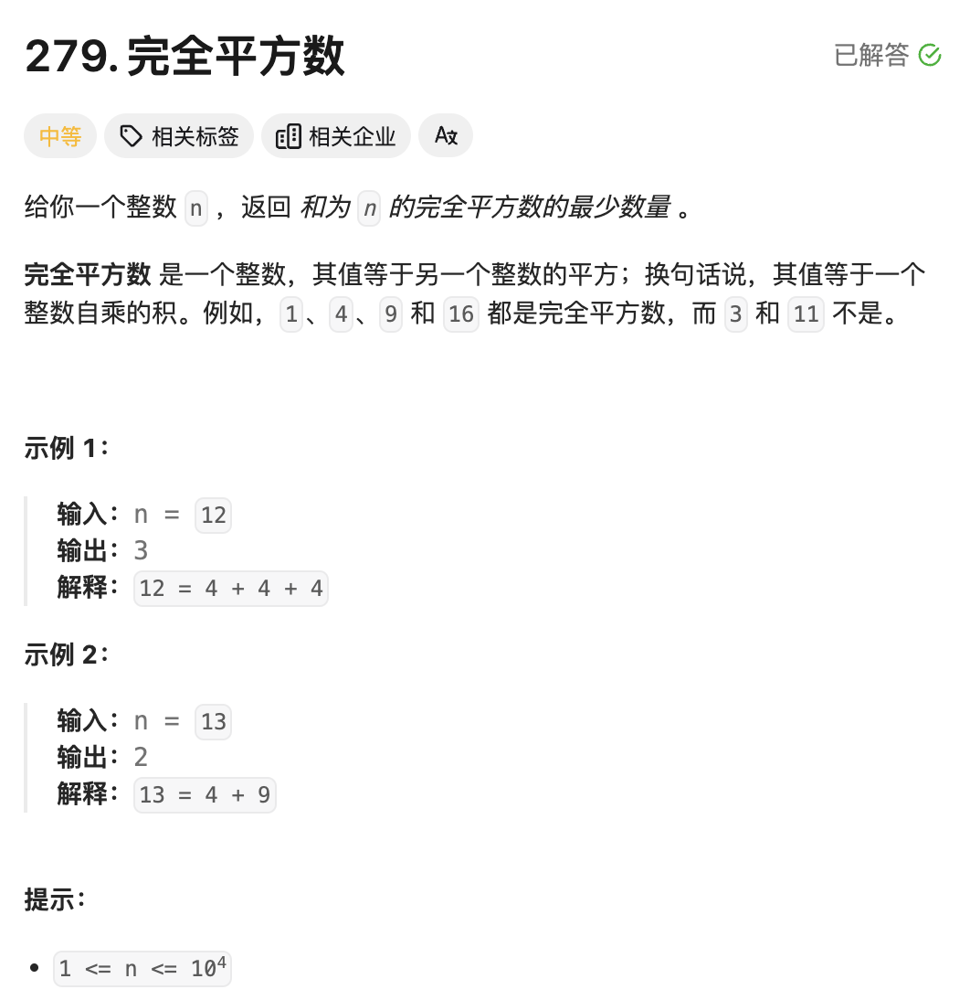
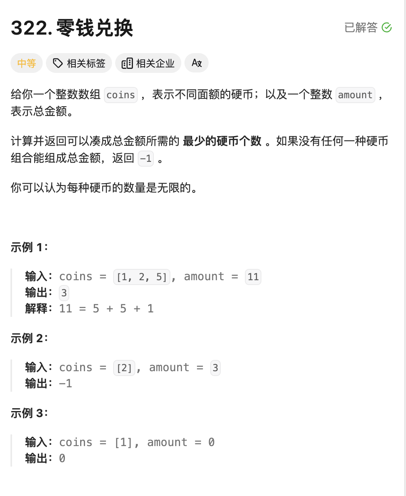
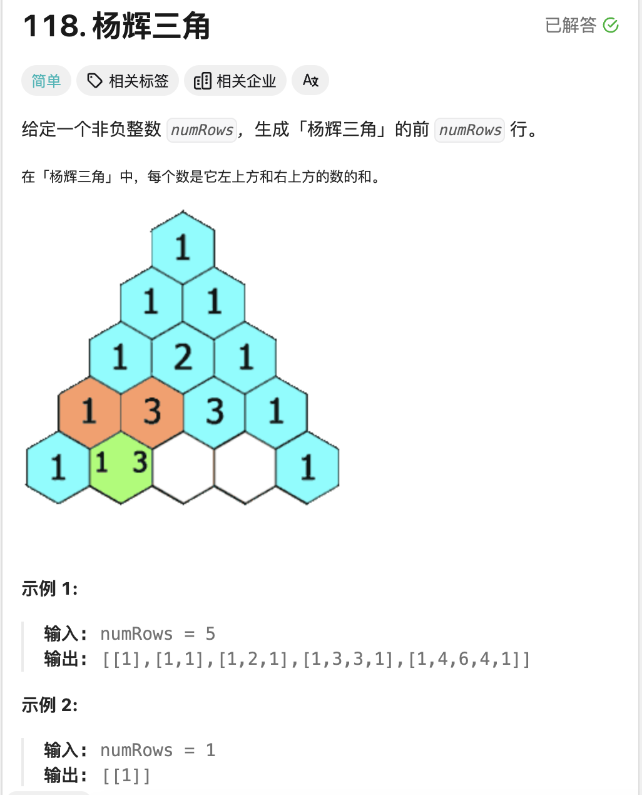
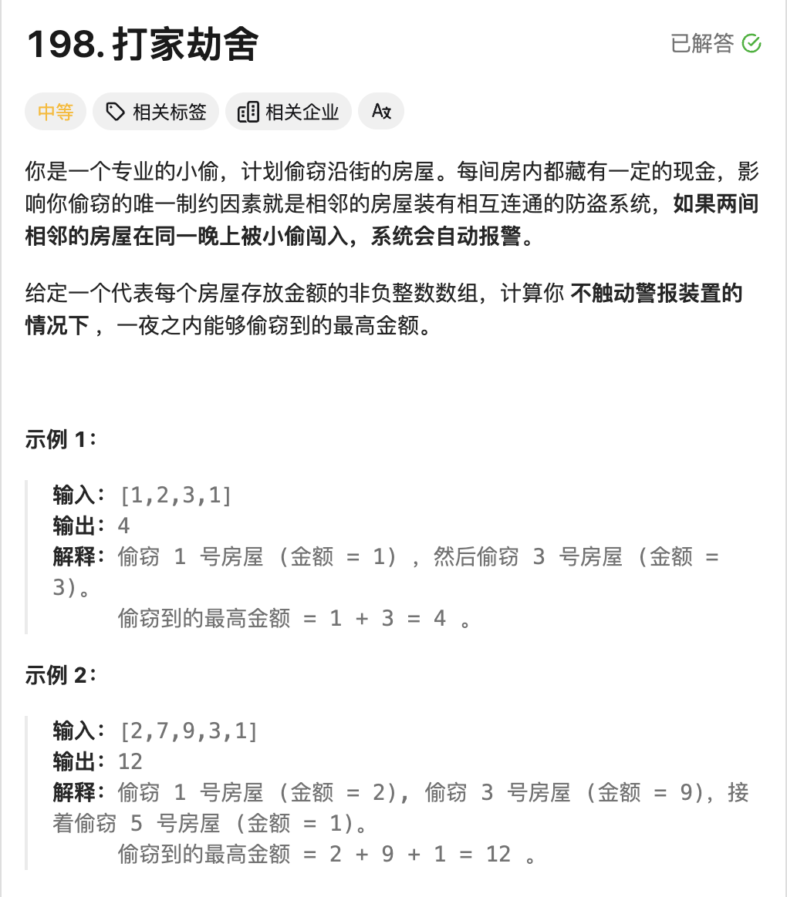
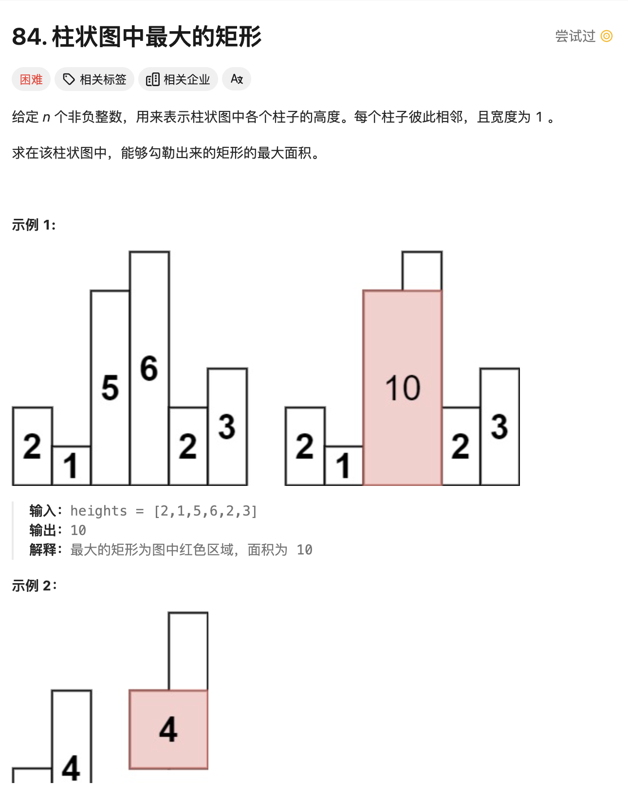
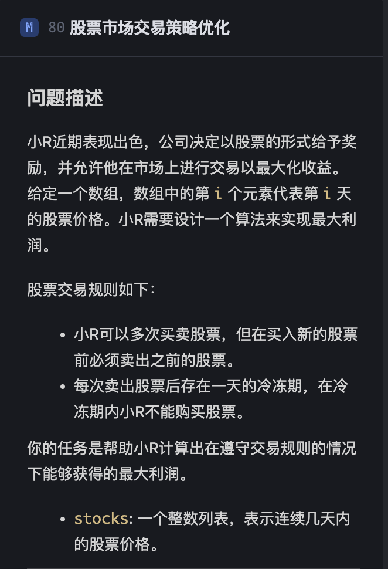
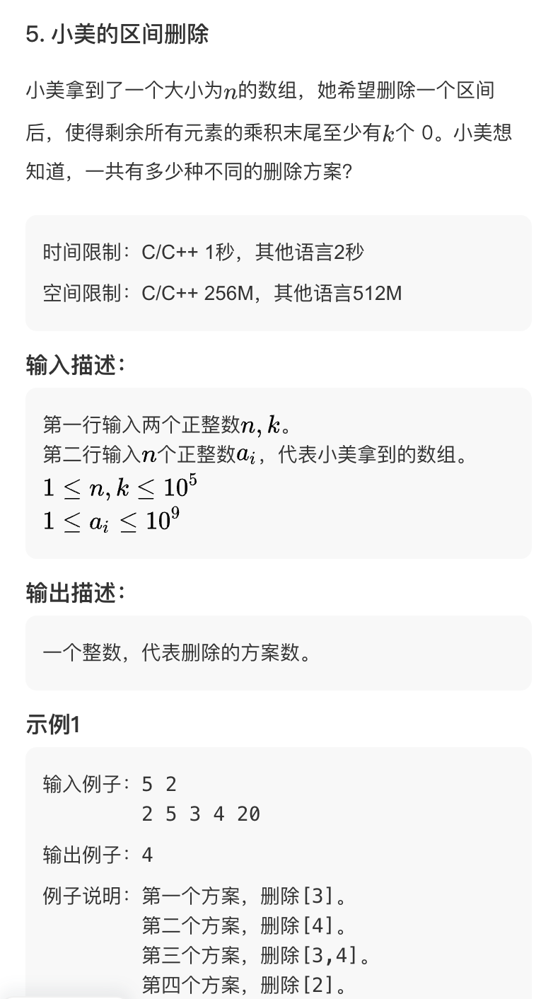

# **<center>动态规划</center>**

## Introduce 

> 下面是 `wiki` 上的定义:
> 
> Dynamic programming is both **a mathematical optimization** method and **an algorithmic paradigm.** The method was developed by Richard Bellman in the 1950s and has found applications in numerous fields, from aerospace engineering to economics.
> 
> In both contexts it refers to simplifying a complicated problem by breaking it down into simpler sub-problems in a recursive manner. While some decision problems cannot be taken apart this way, decisions that span several points in time do often break apart recursively. **Likewise, in computer science, if a problem can be solved optimally by breaking it into sub-problems and then recursively finding the optimal solutions to the sub-problems, then it is said to have optimal substructure.**
> 
> If sub-problems can be nested recursively inside larger problems, so that dynamic programming methods are applicable, then there is a relation between the value of the larger problem and the values of the sub-problems.[1] In the optimization literature this relationship is called the Bellman equation.

动态规划问题考虑的时候，主要的是找到**状态转移方程**，对于状态转移方程，可以说是利用之前解决的子问题来解决我们当前遇到的新的问题。比较形象的就是做表，我们将遍历到此刻的状态为止的所有子状态进行做表记录，当遇到后面的新的子问题的时候，就利用当前已获得的子状态来解决遇到的问题。

> Dynamic Programming 与 贪心算法的一点区别，二者都是考虑最优解来解决问题
> 但是 `DP` 考虑的是全局最优解 `global optimal solution`，因此需要通过比较当前所记录的状态。但是贪心所记录的是局部最优解，也就是当前的前提下所能获得的最优解。`local optimal solution`


## 例题
### 1 完全平方数
<a href = "https://leetcode.cn/problems/perfect-squares/?envType=study-plan-v2&envId=top-100-liked"> 题目来源</a>




#### **题解**
我们这里考虑**动态规划**，因为对于一个任意给定的`n`,我们都存在多种对于完全平方数的组合，那么怎么样才能知道最小的组合数呢？就需要动态规划了，我们定义一个表，当前`a[i]`中记录的就是最小的组合数目，好处是我们之后可以直接调用，可以免去很多的重复步骤。然后，我们对于$[1,m]$的每个表元素进行遍历。有点类似爬楼梯，为了方便理解，我们举个例子，`numSquare(12)`的求法。一开始我的错误思路是利用贪心，距离$12$最近的完全平方数是$9$，那么我就错误的以为$12$的最小组合就是$a[9]+a[3]$的次数.但其实他可以是$a[4]+a[4]+a[4]=3$
也就是有以下的状态转移方程：
$a[i] = \min\{a[j*j]+a[i-j*j]\}$
接下来的就简单了。

总结一下 这题就是 **动态规划**，目的是要找到状态转移方程，以及时间复杂度的话是近似成$O(N^\frac{3}{2})$
$∫_1^n​f(x)dx≤\sum_{i=1}^n​f(i)≤∫_0^n​f(x)dx$

#### Code

```cpp
class Solution {
public:
    int a[10000]={0};
    int numSquares(int n) {
        int m = (int)sqrt(n);
        if(m*m == n)
            return 1;
        for(int i=1;i<=m;i++){
            a[i*i] = 1;
        }
        for(int i=2;i<=n;i++){
            m = (int)sqrt(i);
            // i is square number;
            if(m*m==i)
                continue;
            else{
                // 往前遍历 看看是否存在
                a[i] = 10000;
                for(int j=m;j>=1;j--){
                    if(a[j*j]+a[i-j*j]<a[i])
                        a[i] = a[j*j]+a[i-j*j];
                }
            }
        }
        return a[n];
    }
};
```


### 2 零钱兑换

<a href = "https://leetcode.cn/problems/coin-change/?envType=study-plan-v2&envId=top-100-liked"> 题目来源</a>




####  **题解**
准确的来说，这题很简单，跟上一题就是一个模子里刻出来的，所以就不需要再赘述了。比较值得注意的是，**这题有一个$-1$也就是不存在的情况记得考虑一下**。别的没有问题了就。

#### Code
```cpp
class Solution {
public:
    int coinChange(vector<int>& coins, int amount) {
        if(amount == 0)
            return 0;
        sort(coins.begin(),coins.end());
        int a[amount+1];
        for(int i=0;i<=amount;i++)
            a[i]=-1;
        a[0] = 0;
        int index,q;
        int m = coins.size();
        for(q=0;q<m&&coins[q]<=amount;q++){
            if(amount==coins[q])
                return 1;
            a[coins[q]]=1;
        }
        // index 记录的是coins中不大于的最大索引坐标;
        index = q-1;
        for(int i=1;i<=amount;i++){
            if(a[i]==1)
                continue;
            else{
                int min = 10001;
                for(int j=0;j<=index&&coins[j]<i;j++){
                    if(a[coins[j]]==-1||a[i-coins[j]]==-1)
                        continue;
                    if(a[coins[j]]+a[i-coins[j]]<min)
                        min = a[coins[j]]+a[i-coins[j]];
                }
                if(min!=10001)
                    a[i]=min;
            }
        }
        return a[amount];
    }
};
```


### 3 杨辉三角


#### **题解**
杨辉三角，我们简单的看题目，可以知道，主要是看杨辉三角的简单状态转移方程，就是:

$$temp[j] = result[i-1][j-1] + result[i-1][j]$$ 

然后就是三角的周边都补上`1`即可。

#### Code
```cpp
class Solution {
public:
    vector<vector<int>> generate(int numRows) {
        vector<vector<int>> result;
        result.push_back({1});
        result.push_back({1,1});
        // initial;
        if( numRows == 1)
            return {{1}};
        else if(numRows==2)
            return result;
        for(int i=2;i<numRows;i++){
            // The number of this level elements number;
            int num = i+1;
            vector<int> tmp;
            tmp.resize(num);
            tmp[0] = 1;
            for(int j=1;j<num-1;j++){
                tmp[j] = result[i-1][j-1]+result[i-1][j];
            }
            tmp[num-1] = 1;
            result.push_back(tmp);
        }
        return result;
    }
};
```


### 4 打家劫舍




#### 题解1 
> 时间复杂度 $O(N)$

主要的思路是，就是我们设置的这个$money$数组的定义的区别，我们这个设置的是遍历到 $money[i]$ 的时候，表示的是遍历到这个房间的时候，我们已经获得的最大money数（包括自己）。
那么我们就很容易的得到状态转移方程：

$$ money[i] = \max\{nums[i]+money[i-2],money[i-1]\} $$

因为我们选择了自己`i`这个房间，那么只能考虑 `i-2`这个房间了，或者我们`i-1` 这个最优解。那么我们到最后的一个房间的时候，就自然是最优的。

#### Code
```cpp
class Solution {
public:
    int rob(vector<int>& nums) {
        int num = nums.size();
        if(num==1)
            return nums[0];
        else if(num == 2)
            return max(nums[0],nums[1]);
        vector<int> money;
        money.resize(num);
        money[0] = nums[0];
        money[1] = max(nums[0],nums[1]);
        for(int i=2;i<num;i++){
            // 可以选择不偷前一个房间
            money[i]=max(nums[i]+money[i-2],money[i-1]);
        }
        return max(money[num-1],money[num-2]);
    }
};

```


#### 题解2 
> 时间复杂度 $O(N^2)$


主要的思路是，就是我们设置的这个$money$数组的定义的**区别**，我们这个设置的是遍历到 $money[i]$ 的时候，**表示的是一定会选择了自己这个房间并且**遍历到这个房间的时候，我们已经获得的最大money数（包括自己）。
那么我们就很容易的得到状态转移方程：

$$ money[i]=nums[i]+max\{money[i-2]\}$$

因为我们选择了自己$i$这个房间，那么只能考虑 `i-2`这个房间了。所以我们最终的答案就是这个基础上的最后两个房间的取最大值即是我们的最终需要的答案。

#### Code
```cpp
class Solution {
public:
    int rob(vector<int>& nums) {
        int num = nums.size();
        vector<int> money;
        money.resize(num);
        money[0] = nums[0];
        money[1] = nums[1];
        for(int i=2;i<num;i++){
            // 可以选择不偷前一个房间
            int max = -1;
            for(int j = i-2;j>=0;j--){
                if(money[j]>max)
                    max = money[j];
            }
            money[i]=nums[i]+max;
        }
        return max(money[num-1],money[num-2]);
    }
};
```


### 5 和为 K 的子序列
<a href = "https://leetcode.cn/problems/subarray-sum-equals-k/description/?envType=study-plan-v2&envId=top-100-liked">题目来源 </a>


#### 题解1 暴力搜索
> 时间复杂度$O(N^2)$

暴力搜索的思路就是，就是遍历每一个组合$(i,j)$的子数组和，查看是否存在等于$k$的子数组。那么我们有递推式。

$$
result[i] =
\begin{cases} 
result[i-1] + nums[i] & \text{if } i > 0 \\
nums[0] & \text{if } i = 0 
\end{cases}
$$

一开始我的思路是开了一个$N*N$的数组，但是这样在跑测试的时候，内存超了。所以我们换思路，仅开一个$O(N)$的数组，然后利用递推式来验证是否为$k$.跑是跑通了，但还是花费了 $\frac{N*(N-1)}{2}$的时间，$O(N^2)$的时间还不是最优的。

#### Code
```cpp
class Solution {
public:
    int subarraySum(vector<int>& nums, int k) {
        int size = nums.size();
        vector<int>result;
        result.resize(size);
        int count = 0;
        result[0] = nums[0];
        if(result[0]==k)
            count++;
        for(int i=1;i<size;i++){
            result[i] = result[i-1] + nums[i];
        }

        for(int i = 1;i<size;i++){
            int temp = result[i];
            for(int j = 0;j<=i;j++){
                if(temp==k)
                    count++;
                temp -= nums[j];
            }
        }
        return count;
    }
};
```


#### 题解2 前缀和+哈希表优化
> 时间复杂度 $O(N)$

思路其实一开始的时候想到了，因为做过类似 **两数之和**的题目，这里也是一样，我们从左往右遍历，可以得到这样一个递推式：
$pre[j] - pre[i-1] == k$这个是我们要判断的式子，而$pre[j]$表示的就是$(0,j)$的前缀和，我们将上述的式子进行变换，得到下述的内容：
$pre[j]-k == pre[i-1]$
其实就很自然的想到是否存在问题使用哈希表，我们可以立马的得到用一个$mp$来存放。举个例子，当我们有这样的一串数组$\{1,2,3\},k=5$
那么我们就有

| i   | $pre[i]$ | $pre[i]-k$   |是否查到$mp[pre[i]-k]$|
|:---------:|:--------:|:---------:|:----:|
|  0    | 1    | -4    |Nope|
| 1    | 3    | -2    |Nope|
| 2   | 6    | 1    |**Find!**|

|k|mp[k]|
|:---:|:---:|
|0|1|
|**1**|**1**|
|3|1|

我们看上述的加黑例子，就是找到$\{2,3\}$这个和为$5$的子数组。

#### Code
```cpp
class Solution {
public:
    int subarraySum(vector<int>& nums, int k) {
        // mp 记录的是 截止 i 的前缀和
        unordered_map<int,int>mp;
        mp[0] = 1;
        int pre = 0,count = 0;
        for(int &num : nums){
            pre+=num;
            if(mp.find(pre-k)!=mp.end()){
                count+=mp[pre-k];
            }
            mp[pre]++;
        }
        return count;
    }
};

```

### 6 求矩形的最大面积
<a href = "https://leetcode.cn/problems/largest-rectangle-in-histogram/description/?envType=study-plan-v2&envId=top-100-liked">题目来源</a>



#### 题解 DP
> 时间复杂度 $O(N^2)$
Leetcode 给的既定时间复杂度是 $O(N)$ 所以这个动态规划的解法不是最优解。我们等下会考虑单调栈来解决这个问题。

看到这题很自然的想法就是开一个二维数字 `rectArray[len][len]`,其中的每个元素`rectArray[i][j]`,记录的是从`i`到`j`的最大可兼容的宽度，因为我们要求的是面积，已经知道的宽度是`j-i+1`,所以面积就可以很自然的知道。所以可以得到一个状态转移的方程:

$$
rectArray[i][j] = \min\{rectArray[i][j-1],height[j]\}
$$

然后每次的进行最大面积的更新即可。但很显然这个算法的时间复杂度是$O(N^2)$,不是最优解。我们会在Stack的解法中进行优化，我们选择单调栈来解决这个问题。
#### Code 
```cpp
class Solution {
public:
    int largestRectangleArea(vector<int>& heights) {
        int len = heights.size();
        vector<int> square;
        square.resize(len);
        int maxSquare = 0;
        for(int i=0;i<len;i++){
            square[i] = heights[i];
            if(heights[i]>maxSquare)
                maxSquare = heights[i];
        }
        // start represents the 2-arrays start coordinates;
        int start = 0;
        for(;start<len;start++){
            for(int j=start+1;j<len;j++){
                if(j == start+1){
                    square[j-1] = heights[j-1];
                }
                square[j] = min(square[j-1],heights[j]); 
                int s = (j-start+1)*(square[j]);
                if(s>maxSquare)
                    maxSquare = s;
            }
        }
        return maxSquare;
    }
};
```


### 7 股票市场交易策略优化
[题目链接](https://www.marscode.cn/practice/vkjvr8kynj72ek?problem_id=7414004855076012076)





#### 题解 DP 
这题的思路其实是开一个多状态的数组。不同以往的使用可能一维的数组，我们这里因为有三状态 : 

- 当日持有股票
- 当日不持有股票，但是处于冷静期
- 当日不持有股票，也不处于冷静期

所以我们这里开辟了一个数据 `dp[days][3]` 分别来表示`i` 天的时候，三种状态的最大利润，方便后面的状态转移方程的使用。我们可以得到状态转移方程：

我们进行逻辑的分析:

- 对于 `dp[i][0]` 表示的是第 `i` 天持有股票的最大利润，其实就是表示的是两种情况。有可能是前一天的股票继承到了今天，我们依旧没有抛售，也有可能是今天买入了股票，所以我们取两者的最大值。因为我们 `dp` 表示的是遍历多日以来的最大利润，所以我们选择 `Math.max(dp[i-1][0],dp[i-1][2]-stocks[i])`


- 对于 `dp[i][1]` 表示的是第 `i` 天下的当日不持有股票，而且处于冷静期，其实这个就属于比较简单的，因为我们只有一种情况，就是前一天持有股票，今天卖出了，所以我们可以得到 `dp[i][1] = dp[i-1][0] + stocks[i]`


- 对于 `dp[i][2]` 表示的是第 `i` 天不持有股票，也不处于冷静期，这个就是比较简单的，因为我们只有两种情况，一种是前一天就不持有股票，也不处于冷静期，另一种是前一天处于冷静期，今天不持有股票，所以我们可以得到 `dp[i][2] = Math.max(dp[i-1][2],dp[i-1][1])`


**这个冷静期我们就可以简单的理解为 股票售出日**，因为我们在抛售股票的过程中，都是要在下一次购买前，售出所有的股票，所以我们就仅仅考虑单日即可。

 
#### Code
```java
public class Main {
    public static int solution(int[] stocks) {
        // Please write your code here
        int days = stocks.length;
        int [][] dp = new int[days][3];
        // dp[i][0] 表示的是第i天结束持有股票的最大利润
        // dp[i][1] 表示的是第i天结束不持有股票且处于冷静期的最大利润
        // dp[i][2] 表示的是第i天结束不持有股票且不处于冷静期的最大利润;

        dp[0][0] = -stocks[0];
        dp[0][1] = 0;
        dp[0][2] = 0;

        for(int i=1;i<days;i++){
            dp[i][0] = Math.max(dp[i-1][0],dp[i-1][2]-stocks[i]);
            dp[i][1] = dp[i-1][0] + stocks[i];
            dp[i][2] = Math.max(dp[i-1][2],dp[i-1][1]);
        }

        return Math.max(dp[days-1][1],dp[days-1][2]);  
    }


    public static void main(String[] args) {
        // You can add more test cases here
        System.out.println(solution(new int[]{1, 2}) == 1);
        System.out.println(solution(new int[]{2, 1}) == 0);
        System.out.println(solution(new int[]{1, 2, 3, 0, 2}) == 3);
        System.out.println(solution(new int[]{2, 3, 4, 5, 6, 7}) == 5);
        System.out.println(solution(new int[]{1, 6, 2, 7, 13, 2, 8}) == 12);
    }
}
```


### 8 小美的区间删除


#### 题解 前缀和
这里的前缀和的目的是什么呢？ 其实可以这样理解，我们是在这个数组中选择一个区间进行删除，其实就是看看这个区间内的乘积存在多少个 `0`。对于结尾存在 `0`,我们可以换一种思路 **`0`是怎么产生的呢？2*5 = 10**,所以我们就可以查看这个区间内存在多少个 `2` 和 `5`，以及删去了这个区间内的数字之后，剩下的区间内的乘积是否还可以存在 `k` 个 `0`. 

所以根据刚刚的思路来看，我们可以很简单的进行 **前缀和**，我的做法是开两个 `dp[n]`, `dp[i]` 表示的是 `[0:i]` 区间内存在的`2` 或者 `5` 的个数。那么我们接下来的做法其实就是 简单的枚举区间的右端点，然后利用 二分查找的方法找到左端点。 这里有一个需要注意的是 **左端点是否可以取到**，我的做法是 判断当前的右端点 `index`,截止到它的 `2` 和 `5` 是否小于等于可以允许删除的个数。如果小于等于，那么我们就可以取到左端点，否则就不能取到左端点。

然后就可以很快的解决了。

#### Code
```cpp
#include <bits/stdc++.h>
using namespace std;

int count4Mul(long long index,int k);
vector<int> dp2;
vector<int> dp5;
int c,d;
int getIndex2(int index);
int getIndex5(int index);
int main() {
    int n,k;
    cin >> n >> k;
    vector<long long>a;

    for(int i=0;i<n;i++){
        long long temp;
        cin >> temp;
        a.push_back(temp);
    }
    dp2.assign(n,0);
    dp5.assign(n,0);
    // used to record for the [1,j] the number of 2; 
    dp2[0] = count4Mul(a[0],2);
    dp5[0] = count4Mul(a[0],5);
    for(int i=1;i<n;i++){
        auto it = a[i];
        dp2[i] = dp2[i-1] + count4Mul(it,2);
        dp5[i] = dp5[i-1] + count4Mul(it,5);
    }
    // 表示的是可以接受的 2 和 5 的count;
    c = dp2[n-1] - k;
    d = dp5[n-1] - k;

    long long sum = 0;
    if(dp2[0]<=c && dp5[0] <=d)
        sum +=1;

    for(int i=1;i<n;i++){
        int res1 = getIndex2(i);
        if(dp2[i]<=c)
            res1--;
        int res2 = getIndex5(i);
        if(dp5[i]<=d)
            res2--;
        sum += (i - max(res1,res2));
    }
    cout << sum << endl;

}
// 64 位输出请用 printf("%lld")
int count4Mul(long long index,int k){
    int count = 0;
    while(index%k==0){
        index /= k;
        count++;
    }
    return count;
}

int getIndex2(int index){
    int a = (dp2[index] - c) < 0 ? 0 : dp2[index]-c;
    int left = 0;
    int right = index;
    while(left<right){
        int mid = (left + right)/2;
        if(dp2[mid]<a){
            left = mid+1;
        }else{
            // dp2[mid] >=a;
            right = mid;
        }
    }
    return left;
}

int getIndex5(int index){
    int a = (dp5[index] - d) < 0 ? 0 : dp5[index]-d;
    int left = 0;
    int right = index;
    while(left<right){
        int mid = (left + right)/2;
        if(dp5[mid]<a){
            left = mid+1;
        }else{
            // dp2[mid] >=a;
            right = mid;
        }
    }
    return left;
}
```


<style>
img {
  display: block;
  margin-left: auto;
  margin-right: auto;
  width : 80%;
  border-radius: 15px; /* 将图片设置为圆形 */
  
}
</style>