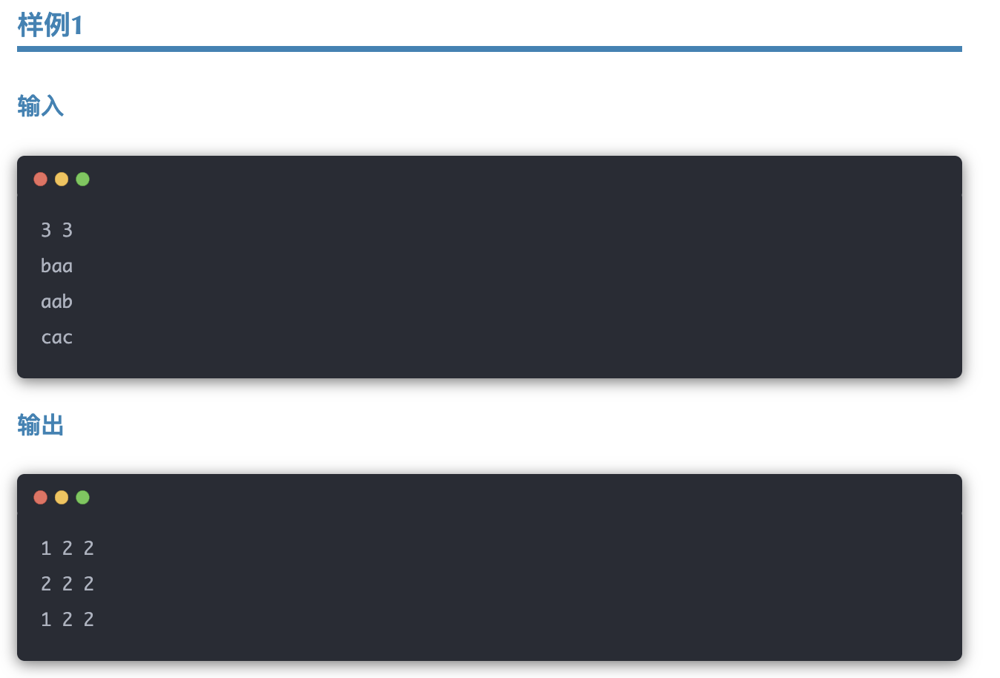

# <center>图</center>

### 1. 不同部落问题

**题源，美团笔试**

某国的领土可以看作行列的矩阵，一共个$n*m$单元格，每一个单元格中都有一个部落。我们使用 $(i,j)$ 表示矩阵中从上往下数第行和从左往右数第列的单元格，里面的部族名为小写字母 $s_{i,j}$

同一个部族的成员如果**彼此相邻**，那么他们更进一步的被称作**亲密部落**。更具体地，若存在这样两个单元格 $(x,y)$ 和 $(p,q)$，使得$|x-p| + |y-q| = 1$ 且 $s_{i,j} = s_{p,q}$，那么我们称他们属于同一个亲密部落。现在小红想让你回答，对于任意这个单元格上的部族，其所在亲密部落与多少个非自己部族的部族相邻。在本题中，我们认为两个单元格 $(x,y)$  和 $(p,q)$是相邻的,当且仅当$|x-p| + |y-q| = 1$ (四相邻)。



#### 题解
这题其实就是图的遍历的拓展，我们只需要加一个 **记忆化** 的操作即可。这里我做了以下的优化:

- 开了一个全局的 `visited` 数组来标记是否访问过
- 开了一个 `stack<pair<int,int>>path` 记录已经访问过的路径
- 开了一个 `set<char>mpSet` 来存储当前部落的相邻部落


#### Code

```cpp
#include <bits/stdc++.h>
using namespace std;

int n, m;
vector<int> dx = {0, 1, 0, -1};
vector<int> dy = {1, 0, -1, 0};

void DFS(int i, int j, vector<vector<char>>& graph, set<char>& mpSet, queue<pair<int, int>>& path, vector<vector<bool>>& visited);
bool isValid(int i, int j);

int main() {
    cin >> n >> m;
    vector<vector<bool>> visited(n, vector<bool>(m, false));
    vector<vector<char>> graph(n, vector<char>(m));

    // 读取输入
    for (int i = 0; i < n; i++) {
        for (int j = 0; j < m; j++) {
            cin >> graph[i][j];
        }
    }

    vector<vector<int>> res(n, vector<int>(m, 0));

    for (int i = 0; i < n; i++) {
        for (int j = 0; j < m; j++) {
            if (!visited[i][j]) {
                set<char> mpSet;
                queue<pair<int, int>> path;
                DFS(i, j, graph, mpSet, path, visited);
                
                int num = mpSet.size(); // 计算邻接部落数
                while (!path.empty()) {
                    auto [x, y] = path.front();
                    path.pop();
                    res[x][y] = num;
                }
            }
        }
    }

    // 输出结果
    for (int i = 0; i < n; i++) {
        for (int j = 0; j < m; j++) {
            cout << res[i][j] << (j == m - 1 ? "\n" : " ");
        }
    }
}

bool isValid(int i, int j) {
    return (i >= 0 && i < n && j >= 0 && j < m);
}

void DFS(int i, int j, vector<vector<char>>& graph, set<char>& mpSet, queue<pair<int, int>>& path, vector<vector<bool>>& visited) {
    stack<pair<int, int>> stk;
    stk.push({i, j});
    char c = graph[i][j];

    while (!stk.empty()) {
        auto [x, y] = stk.top();
        stk.pop();

        if (!isValid(x, y) || visited[x][y])
            continue;

        visited[x][y] = true;
        path.push({x, y});

        for (int k = 0; k < 4; k++) {
            int nx = x + dx[k];
            int ny = y + dy[k];

            if (!isValid(nx, ny))
                continue;

            if (graph[nx][ny] == c && !visited[nx][ny]) {
                stk.push({nx, ny});
            } else if (graph[nx][ny] != c) {
                mpSet.insert(graph[nx][ny]);
            }
        }
    }
}
```