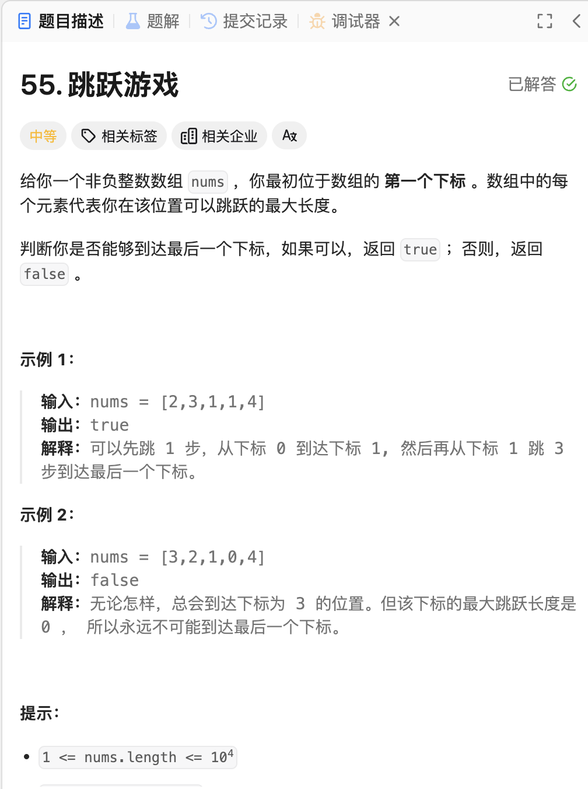

# <center>贪心算法</center>

## Introduce

贪心算法，字面意思就是选取当前状态下的最优解，也就是本地最优解`local optimal solution`
> 下面是 `wiki` 的定义:
> 
> A greedy algorithm is any algorithm that follows the problem-solving heuristic of making the locally optimal choice at each stage.[1] In many problems, a greedy strategy does not produce an optimal solution, but **a greedy heuristic can yield locally optimal solutions** that approximate a globally optimal solution in a reasonable amount of time.

> For example, a greedy strategy for the travelling salesman problem (which is of high computational complexity) is the following heuristic: "At each step of the journey, visit the nearest unvisited city." This heuristic does not intend to find the best solution, but it terminates in a reasonable number of steps; finding an optimal solution to such a complex problem typically requires unreasonably many steps. 


## 例题
### 1 跳跃游戏

<a href = "https://leetcode.cn/problems/jump-game/description/?envType=study-plan-v2&envId=top-100-liked"> 题目来源</a>



#### 题解
我们这题主要是贪心算法。我们首先定义一个$distance$数组，他的作用是记录每一个位置$i$，所能跳到的最大位置。我们首先进行一遍遍历。然后按顺序依次遍历从该点开始到能跳跃的最大距离的过程中寻找下一个能跳跃的最大距离，依次往复，我们模拟跳跃的过程，这其中其实就是运用了贪心的算法，**选取当前状态中能跃迁的最大值进行跳跃。**

#### Code
```cpp
class Solution {
public:
    bool canJump(vector<int>& nums) {
        vector<int> distance;
        int len = nums.size();
        if(len==1)
            return true;
        for(int i =0;i<len;i++){
            // temp represents that the next boundary position that we can jump;
            distance.push_back(nums[i]+i);
        }
        int index = 0;
        for(int j=0;j<=len-2;){
            // The case that after we update the array, we get the destination, avoid ;
            if(distance[j]>=len-1)
                return true;
            int max = distance[j];
            for(int p = j+1;p<=distance[j];p++){
                if(distance[p]>max){
                    index = p;
                    max = distance[p];
                }
            }
            if(distance[j]==max)
                break;
            j = index;
        } 
        return false;
    }
};
```

### 2 跳跃游戏II

<a href = "https://leetcode.cn/problems/jump-game-ii/?envType=study-plan-v2&envId=top-100-liked">题目来源</a>


#### 题解
这题就更简单了。在上一题的基础上加一个`count`作为记录跳跃次数即可。**over**


### 3 划分字母区间

<a href = "https://leetcode.cn/problems/partition-labels/description/?envType=study-plan-v2&envId=top-100-liked/">题目来源</a>
> 其实这题就是 合并最大连续区间的变式


#### 题解

我们首先要明白这题的一个思路就是 **同一个字母最多出现在一个字符串内**，换句话说就是简单的理解为，不同的字符串段内不可能出现相同的字母。更简单的说法是，一种字母只可能出现在同一个字符串段内。所以我们这一题的贪心思路就是 **我们要找到保证最大的字符串段** 来包含某一字母。

那么思路就很简单了，我们的首要目标就是找到每个字母对应的区间。然后进行区间的合并。然后就没了。这题的区间合并我选择了使用`priority_queue`来进行合并。然后进行遍历，找到最大的区间即可。

#### Code
```cpp
class Solution {
public:
    vector<int> partitionLabels(string s) {
        set<char> charSet;
        map<char,pair<int,int>> mp;
        int len = s.length();
        for(int i=0;i<len;i++){
            char c = s[i];
            // find it;
            if(charSet.find(c)==charSet.end()){
                charSet.insert(c);
                mp.insert(make_pair(c,make_pair(i,i)));
            }else{
                mp[c].second = i;
            }
        }
        // combine the interval;
        priority_queue<pair<int,int>,vector<pair<int,int>>,greater<pair<int,int>>>pq;
        for(auto it:mp){
            pq.push(it.second);
        }
        // it stores for the intervals;
        vector<int> result;
        auto interval = pq.top();
        int a = 0;
        int b = interval.second;
        pq.pop();
        while(!pq.empty()){
            interval = pq.top();
            pq.pop();
            if(interval.first>=a&&interval.second<=b)
                continue;
            else if(interval.first<b&&interval.second>b){
                b = interval.second;
            }else if(interval.first==b+1){
                result.push_back(b-a+1);
                a = b+1;
                b = interval.second;
            }
        }
        result.push_back(b-a+1);
        return result;
    }
};
```

### 4  二叉树供暖器
> 这题比较困难，困住我比较久,主要是自己一开始把问题想的过简单了

[题目链接](https://www.marscode.cn/practice/vkjvr8kynj72ek?problem_id=7414004855075815468) 

#### 题解
这题的思路主要是分为两部分:

- 建树，通过给的层序遍历的数组进行二叉树的建立
- 利用贪心来进行递归的供暖器的放置

##### 建树

首先是层序遍历来进行建树，我们使用 `BFS` 来模拟层序遍历，根据提供的数组来建立二叉树。只需要一个`index` 来作为数组的索引即可。然后一个队列来存放当前访问到的节点即可。我们都让默认的节点值为 `0`。因为后续节点值是有用的，会进行统一的设置。


##### 供暖器的放置

首先，我们要知道的是，供暖期的性质 **可以让自己的节点，自己的父节点，以及两个自己的子节点都能接收到供暖**。那么我们首先对 `val` 值进行设置

- `val == 0` 表示的是这个节点，我们进行了布置供暖器
- `val == 1` 表示的是这个节点，我们没有布置供暖器 , 但是供暖享受到了
- `val == 2` 表示的是这个节点，没有享受到供暖，也没有布置供暖器


然后我们要考虑到是最小的数目，其实就是一个贪心的思想。我们首先知道，一个节点如果安装了供暖，那么它可以让与自己链接有关的最直接的三层都能享受到供暖。那么我们就可以利用这个性质来进行递归的判断。首先，我们的想法就是 叶子 节点不提供供暖。反而让父节点来提供。如果让叶节点来提供供暖的话，那么我们就会牺牲了一层的供暖。所以我们的思路就是，从叶节点开始，逐步向上进行递归的判断。 **值得注意的是，我们这里选择后序遍历树，最后再判断 根节点**

接下来的就是简单的 case 判断:

- Step1: 调用 `postorderTree` 函数来获取 左右子树的供暖情况，如果是空的节点，我们都默认它们已经被供暖了。
- Step2:  

    - Case 1: `left == 1 && right == 1` 表示的是左右子树都被供暖了，但是没有供暖器。因为我们是从叶节点开始的遍历，所以这里就不可能是由父节点来提供的供暖，也就是说这两个节点享受到的供暖都是由自己的子节点来提供的。所以我们就设置 `root.val = 2`;表示的是这个节点没有被供暖。
    - Case 2: `left == 2 || right == 2` 表示的是左右子树有一个没有被供暖，那么我们就需要在这个节点上安装供暖器。所以我们就设置 `root.val = 0` 表示的是这个节点被供暖了。同时需要 `result++` 表示的是我们安装了一个供暖器。
    - Case 3: `left == 0 || right == 0` 表示的是左右子树有一个节点被供暖了，那么我们就不需要在这个节点上安装供暖器。所以我们就设置 `root.val = 1` 表示的是这个节点没有被供暖，但是享受到了供暖。

- Step3 : 返回值。我们在对 `postorderTree(root)` 的时候，也要最后判断一下我们的`root`的受到供暖的情况，如果是 `2` 的话，那么我们就需要安装一个供暖器。所以我们就需要 `result++` 表示的是我们安装了一个供暖器。 

其实逻辑是简单的，但是自己好像把问题想的另一种情况，导致了自己的思路不够清晰。

#### Code
```java
import java.util.LinkedList;
import java.util.Queue;
import java.util.Stack;

class Node{
        int val;
        Node left;
        Node right;
        public Node(int val){
            this.val = val;
            left = null;
            right = null;
        }
    }

public class Main {
    
    public static int solution(int[] nodes) {
        // Please write your code here
        result = 0;
        Node root = buildTree(nodes);

        if(postorderTree(root) == 2){
            result++;
        }
        return result;
    }

    static int result = 0;
    public static Node buildTree(int[] nodes){
        // Base case
        if(nodes == null || nodes[0] == 0)
            return null;

        Node root = new Node(0);
        Queue<Node> queue = new LinkedList<>();
        queue.offer(root);

        int i = 1;    
        int len = nodes.length;
        while(!queue.isEmpty()&& i < len){
            Node current = queue.peek();
            queue.poll();

            // we find the node has left node;
            if(i<len && nodes[i] == 1){
                current.left = new Node(0);
                queue.offer(current.left);
            }
            i++;

            // we find the node has right node;
            if(i<len&&nodes[i] ==1){
                current.right = new Node(0);
                queue.offer(current.right);
            }
            i++;
        }
        return root;
    }

    /**
     * 3 state:
     * 0 -> 已经安装上供暖;
     * 1 -> 蹭到了，未安装;
     * 2 -> 未供暖;
     * @param root
     * @return
     */
    public static int postorderTree(Node root){
        // The null node represents it has been offered warm;
        if(root == null)
            return 1;
        
        int left = postorderTree(root.left);

        int right = postorderTree(root.right);

        // it turns to the root;
        if(left == 1 && right == 1){
            return 2;
        }

        if(left == 2 || right == 2){
            result++;
            return 0;
        }

        if(left == 0 || right == 0 )
            return 1;

        return 1;
    }


    public static void main(String[] args) {
        //  You can add more test cases here
        int[] nodes1 = {1, 1, 0, 1, 1};
        int[] nodes2 = {1, 0, 1, 1, 0, 1, 0, 1, 0, 1, 0, 0, 1, 1};
        int[] nodes3 = {1, 1, 0, 0, 1, 1, 0, 0, 1, 0, 1, 1, 0, 0, 1};

        System.out.println(solution(nodes1) == 1);
        System.out.println(solution(nodes2) == 3);
        System.out.println(solution(nodes3) == 3);
    }
}
```


### 5 最长有效括号
[题目链接](https://leetcode.cn/problems/longest-valid-parentheses/description/?envType=study-plan-v2&envId=top-100-liked)


#### 题解

其实，我们将这个题进行抽象，我们可以很自然的发现，其实就是一个区间合并的问题。对于 $()$ 一对 $(i,j)$ 索引，我们只需要利用栈来记录每个`(`的索引，然后遇到`)`的时候，我们就可以将这个区间进行合并。然后我们就可以得到所有的有效括号的区间。接下来就是合并区间的问题了。我们可以利用`set`来存储这些区间，然后进行合并区间。最后我们就可以得到最长的有效括号的长度。

#### Code
```cpp
class Solution {
public:
    int longestValidParentheses(string s) {
        // base case
        if(s.length()==0||s.length()==1)
            return 0;
        stack<int> sk;
        // 我们的思路是将子串中的有效的对数，都用 (i,j) 进行表示，接下来要做的就是合并子区间
        // 合并完子区间，我们就能知道具体的情况了
        set<pair<int,int>> mpSet;
        int len = s.length();
        for(int i=0;i<len;i++){
            char c = s[i];
            if(c == '('){
                sk.push(i);
            }else if(c == ')'){
                if(sk.empty())
                    continue;
                else{
                    auto it = sk.top();
                    sk.pop();
                    mpSet.insert(make_pair(it,i));
                }
            }
        }
        if(mpSet.empty())
            return 0;
        int res = zipInterval(mpSet);
        return res;
    }


private:
    int zipInterval(set<pair<int,int>>mpSet){
        bool flag = false;
        int left = 0;
        int right = 0;
        int res = 0;
        for(auto pair : mpSet){
            if(!flag){
                left = pair.first;
                right = pair.second;
                flag = true;
            }else{
                // the next pair;
                if(pair.first == right+1){
                    right = pair.second;
                }else if(pair.first>left && pair.second<right){
                    continue;
                }else{
                    if(res < right - left + 1)
                        res = right - left + 1;
                    left = pair.first;
                    right = pair.second;
                }
            }
        }
        if(res < right - left + 1)
            res = right - left + 1;
        return res;
    }
};
```

<style>
img {
  display: block;
  margin-left: auto;
  margin-right: auto;
  width : 80%;
  border-radius: 15px; /* 将图片设置为圆形 */
  
}
</style>