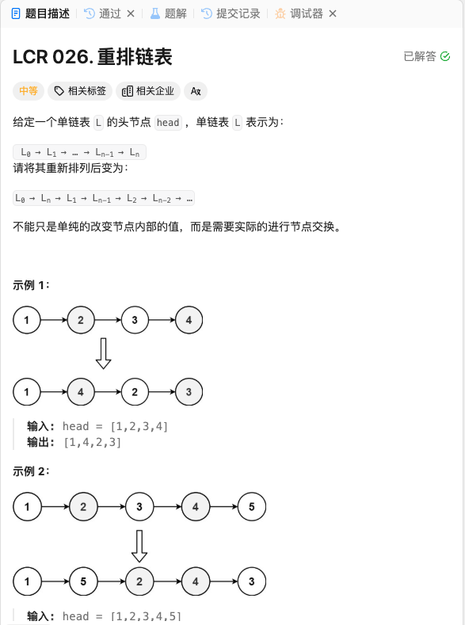

# <center>List</center>
> 这个篇章放的是有关链表的一些题目记录情况


### 1 反转链表
这题过于经典，就不放题目地址和图片参考了，就是简单的来说给出这样的定义的一个链表，你需要将它翻转过来。我们用`C++`来实现。

这个是链表的定义
```cpp
struct ListNode{
    int val;
    ListNode* next;
    ListNode(int x):val(x),next(nullptr){}
}
```

#### 题解
我们这里使用迭代的办法来进行翻转。定义三个链表指针 `prev`, `cur`,和 `next` 依次遍历，然后就可以得到翻转后的链表。

#### Code

```cpp
class Solution {

ListNode* reverseList(ListNode* head){
    ListNode* prev = nullptr;
    ListNode* cur = head;
    while(cur!=nullptr){
        ListNode* next = cur->next;
        cur->next = prev;
        prev = cur;
        cur = next;
    }
    return prev;
}

}
```


### 2 重排链表
> 这题来自字节，想了很久，发现其实很简单

<a href = "https://leetcode.cn/problems/LGjMqU/description/?envType=company&envId=bytedance&favoriteSlug=bytedance-thirty-days">题目链接</a>




#### 题解 
其实题目很简单，我们要做的只有两步，先反转后半段链表，然后再交叉合并前后半段的链表即可。那么第一个操作如何进行呢？我们使用快慢指针，后面的链表反转就很简单了。然后合并的时候我们就正常的遍历合并即可。


#### Code
```cpp
class Solution {
public:
    void reorderList(ListNode* head) {
        if(head->next==nullptr)
            return ;
        ListNode* fast = head;
        ListNode* slow = head;
        while(fast!=nullptr&&fast->next!=nullptr){
            slow = slow->next;
            fast = fast->next;
            if(fast->next == nullptr){
                break;
            }
            fast = fast->next;
        }   
        // reverse the second half list;
        slow ->next = reverseList(slow->next);
        ListNode* list1 = slow ->next;
        slow ->next = nullptr;

        printList(head);
        cout << endl;
        printList(list1);

        combineTwoList(head,list1);

    }

    ListNode* reverseList(ListNode* head){
        ListNode* pre = nullptr;
        ListNode* cur = head;
        while(cur!=nullptr){
            ListNode* next = cur->next;
            cur->next = pre;
            pre = cur;
            cur = next;
        }
        return pre;
    }
    
    // use for Debug
    void printList(ListNode* list){
        while(list!=nullptr){
            cout << list->val << " ";
            list = list->next;
        }
    }

    ListNode* combineTwoList(ListNode* list1,ListNode* list2){
        if(list2 == nullptr)
            return nullptr;
        ListNode* head = list1;
        ListNode* temp1 = nullptr;
        ListNode* temp2 = nullptr;

        while(list2!=nullptr){
            temp1 = list1->next;
            temp2 = list2->next;

            list1->next = list2;
            list2->next = temp1;

            list1 = temp1;
            list2 = temp2;
        }
        return head;
    }
};
```


<style>
    img{
        margin-left : auto;
        margin-right: auto;
        display:block;
        width:80%;
        border-radius:15px;
    }
</style>

