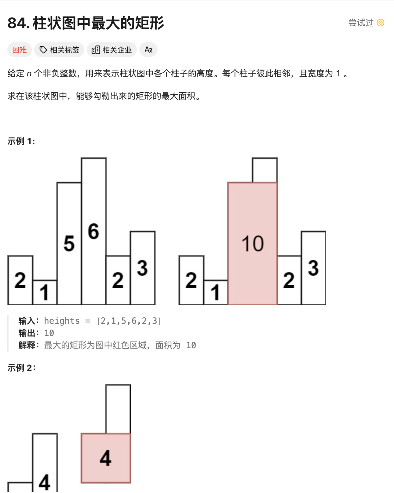

# <center>Stack</center>

## Introduce


### 1. 求最大的矩形面积
<a href = "https://leetcode.cn/problems/largest-rectangle-in-histogram/description/?envType=study-plan-v2&envId=top-100-liked">题目来源</a>




#### 题解
> 时间复杂度 O(N)
我们很自然的想到用DP来解决这个问题，但是奈何时间复杂度有点高于题设。所以我们选择用单调栈来解决这个问题。

换种思路，我们很自然的想到对于每一个柱子段，最大的面积往往是由最低的那根柱子来决定的，所以我们其实换种思路就是需要找到所有数组中的单调不递减的序列，然后只需要维护一个变量来记录最大的面积即可。

- 首先，我们的目的是遍历整个数组，找到所有的单调不递减的序列。
- 其次，我们维护一个单调递增的栈，一旦遇到一个比栈顶元素小的元素，那么我们就可以开始计算最大的矩形面积了。
    1. 情况1 如果在弹出一个栈顶元素之后，栈为空，那么我们可以计算的宽度就是 `i-(-1) -1 = i`,说明当前的这个柱子是当前遍历为止的最小值。所以我们就可以计算它的宽度为`i`;
    2. 情况2 如果弹出一个栈顶元素之后，栈不为空，那么我们就可以正常的从后往前计算宽度 `i - st.top() -1` 
- 每次计算完宽度之后，我们就可以计算面积了，`height * width`，然后更新最大面积即可。
- 同时我们做了一个比较巧妙的处理，就是遍历完了之后，我们在数组中加入一个高度为0的柱子，这样就可以保证最后一个柱子也可以被计算到。也就是处理栈中剩余的元素。

#### Code
```cpp
class Solution {
public:
    int largestRectangleArea(vector<int>& heights) {
        int n = heights.size();
        stack<int> st;  // 单调栈，存储柱子的下标
        int maxArea = 0;

        for (int i = 0; i <= n; i++) {
            // 当前柱子的高度（如果是最后一个柱子，高度为0）
            int h = (i == n) ? 0 : heights[i];

            // 如果当前柱子的高度小于栈顶柱子的高度，弹出栈顶柱子并计算面积
            while (!st.empty() && h < heights[st.top()]) {
                int height = heights[st.top()];  // 弹出的柱子的高度
                st.pop();
                int width = st.empty() ? i : (i - st.top() - 1);  // 计算宽度
                maxArea = max(maxArea, height * width);  // 更新最大面积
            }

            // 将当前柱子的下标压入栈
            st.push(i);
        }

        return maxArea;
    }
};
```
