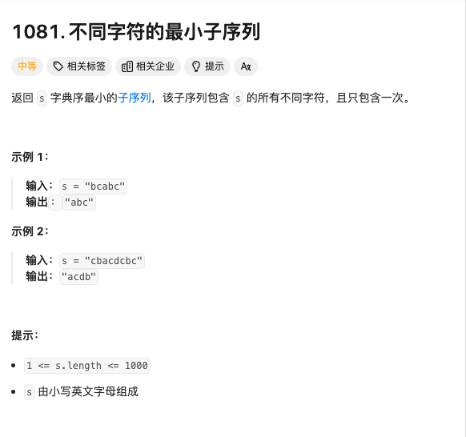

# <center>String</center>

> 本章主要讲述的就是各种常见的字符串有关的问题

Q1 :寻找字典序最小的字符串

我们对于处理这种问题，尤其是在处理名为 `字典序最小` 的时候，其实应该想到的是单调栈的问题，也就是说在一个连续的字符串中，找到那个最小的`i`,在`s[i]>s[i+1]` 的时候，并且删掉这个字符即可。


### 1 不同字符的最小子序列

<a href = "https://leetcode.cn/problems/smallest-subsequence-of-distinct-characters/description/?envType=company&envId=bytedance&favoriteSlug=bytedance-thirty-days">题目地址</a>




#### 题解

有了上面的总体思路，我们就知道了要在这样的字符串中寻找字典序最小的子序列，其实就是维护一个**单调栈**。它的目的就是存放从前往后遍历的字符串结果。我们每遍历一个字符，如果这个字符在**单调栈**中并没有出现过，就可以直接的加入栈中。否则的话需要进行条件判断。倘若这个字符比栈顶元素小，也就是出现了 `s[i] > s[i+1]` 的情况。我们就需要判断这个栈顶元素是否在后续的字符串中还会出现，倘若不再出现了，那我们就停止删除这个栈顶元素。否则的话我们就进行删除，并且添入刚遇到的这个字符。

#### Code
```cpp
class Solution {
public:
    string smallestSubsequence(string s) {
        int num[26];
        vector<int> visited(26);
        string res;
        for(auto c:s){
            num[c-'a']++;
        }
        int len = s.length();
        for(int i=0;i<len;i++){
            if(!visited[s[i]-'a']){
                while(!res.empty()&&res.back()>s[i]){
                    if(num[res.back()-'a']>0){
                        visited[res.back()-'a'] = 0;
                        res.pop_back();
                    }else{
                        break;
                    }
                }
                visited[s[i]-'a'] = 1;
                res.push_back(s[i]);
            }
            num[s[i]-'a']--;
        }
        return res;
    }
};
```

### 2. 小苯的魔法染色
小红面前有一个长为 $n$ 的墙 $a$,（墙由一个个格子构成，方便起见用一个字符串表示），小红想将墙 $a$ **染成全红色的**，因此她找到了小苯。小苯是一个魔法师，可以对墙进行施法。墙上施法后的部分会被染红。
施法的具体过程：首先，小苯会选择一段区间 $ [l,r] (1≤l≤r≤n)$，接着立马，墙上的 $[l,r]$ 这段区间就会被染红。例如 $a=WRWWR$，小苯选择 $[1,3]$ 后，$a$ 就会变成 $RRRWR$。（其中 $R$ 表示红色，$W$ 表示白色。）

小苯可以施法不超过 $m$ 次，但小红不想小苯因使用魔法太多而走火入魔，因此她限制小苯每一次选择施法的区间长度都必须在 $k$ 以内。
（区间 $[l,r]$ 的长度为 $r-l+1$。）
现在小苯想知道自己施法能使得墙全部被染红的最小 $k$ 值是多少，请你帮帮他吧。


#### 题解

其实这题，有点类似滑动窗口，就是对于连续字符串的处理。我们需要做的就是找到一个最小的 $K$ 值，可以让我们的所有 $W$ 都能被染成红色。那么其实就是一个很简单思路，我们对左端点进行枚举，然后找到最大的符合条件的右端点。然后再转下一个左端点。这样的话，我们就可以找到最小的 $K$ 值。上面这个方法自然是好的，但是我们这里把 **二分查找** 也放入其中，这样的话，我们就可以找到最小的 $K$ 值。时间复杂度也能降到比较低的程度 $O(\log N)$


#### Code
```cpp
#include <iostream>
#include <queue>
#include <vector>
using namespace std;

int main() {
    int n, m;
    cin >> n >> m;
    string s;
    cin >> s;
    // Here positions used to record for the w position;
    priority_queue<int, vector<int>, greater<int>> positions;
    for (int i = 0; i < n; ++i) {
        if (s[i] == 'W') {
            positions.push(i);
        }
    }

    if (positions.empty()) {
        cout << 0 << endl;
        return 0;
    }

    int left = 1, right = n, res = n;
    
    while (left <= right) {
        // 这里mid 指的是区间的长度k;我们利用二分查找来进行判断;
        int mid = (left + right) / 2;
        // cnt 表示的是染色次数恶意恶意
        int cnt = 0;
        priority_queue<int, vector<int>, greater<int>> q = positions;

        while (!q.empty()) {
            int start = q.top();
            q.pop();
            cnt++;
            while (!q.empty() && q.top() <= start + mid - 1) {
                q.pop();
            }
        }

        if (cnt <= m) {
            res = mid;
            right = mid - 1;
        } else {
            left = mid + 1;
        }
    }

    cout << res << endl;
    return 0;
}
```


### 3. 删除区间
> 题源: 淘天真题

小苯有一个长度为 $n$ 的数组 $a$，他想要使得数组 $a$ 有序（单调不降）。为此，他必须选择一段区间 $[l,r](1≤l≤r≤n)$，将数组的这一段删除，其他的部分（如果存在的话）就按顺序拼在一起。现在他想知道有多少种不同的选择区间的方案。

注：小苯认为，空数组也满足有序，即你可以选择 $[1,n]$ 这个区间。


#### 题解

我好像没有放双指针的专题，所以我就把这题放在字符串的处理中。这题主要就是找到一个区间，使得删除这个区间后，剩下的数组是有序的。我们可以用双指针来进行处理。我们可以找到一个最小的 $l$ 值，使得 $a[l] > a[l+1]$，然后再找到一个最大的 $r$ 值，使得 $a[r-1] > a[r]$。这样的话，我们就可以找到一个区间，使得删除这个区间后，剩下的数组是有序的。同时需要注意的是 如果 $left_edge < right_edge$ 的情况，我们需要把两端的长度都算上，因为有可能是 $[1,l]$ 和 $[r,n]$ 这样的情况。

**二分查找很关键，我们需要尽可能的降低时间复杂度，尤其是在这种单调的序列中，我们使用二分查找来帮助完成定位具体的position**


#### Code
```cpp
#include <bits/stdc++.h>
using namespace std;

int main() {
    int n;
    cin >> n;
    vector<long long> a;

    // base case
    if(n==0){
        cout << 0 << endl;
        return 0;
    }else if(n==1){
        cout << 1 << endl;
        return 0;
    }


    // input part;
    for(int i=0;i<n;i++){
        long long temp;
        cin >> temp;
        a.push_back(temp);
    }
    int left_edge = 0;
    int right_edge = n-1;
    // find the left max edge where has ascending order; 
    for(;left_edge<n-1;){
        if(a[left_edge] <= a[left_edge+1])
            left_edge++;
        else{
            break;
        }
    }

    // find the right min edge where has descanding order;
    for(;right_edge>0;){
        if(a[right_edge] >= a[right_edge-1])
            right_edge--;
        else{
            break;
        }
    }


    int count = 0;
    
    if(left_edge<right_edge){
        count += left_edge +1;
        count += (n -right_edge) +1;
    }
    
    for(;right_edge<n;right_edge++){
        int temp = a[right_edge];
        int left = 0;
        int right = left_edge;
        while(left < right){
            int mid = (left + right)/2;
            // find the max elements which <= temp;
            if(a[mid]>temp){
                right = mid-1;
            }else{
                left = mid+1;
            }
        }
        if(a[left]<=temp)
            count += left+1;
        else 
            count += left;
    }

    cout << count;
}
// 64 位输出请用 printf("%lld")
```


<style>
img{
    display : block;
    margin-left : auto;
    margin-right : auto;
    width : 85%;
    border-radius : 15px;
}
</style>
