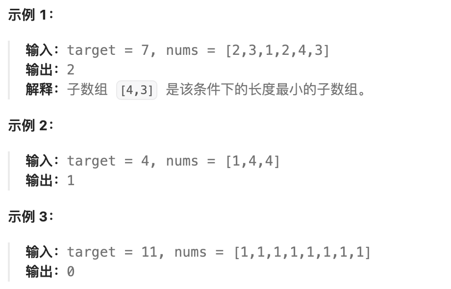

# <center>滑动窗口</center>
> 滑动窗口其实是一种思想，在解题的时候避免了暴力枚举而产生的大量冗余，常见的运用在数组遍历的时候需要找到的**一段连续的具有某个特征的**数据

因为我们需要找到的是一段连续的区间，那么需要做的是:

- 先找到一段符合条件的子区间
  - 开始维护两个左右指针
  - 同时维护若干个变量 -> **用于保证左右指针区间内部符合条件**
- 进行循环往复的执行维护区间的操作，直到遍历完整个数组/连续区域


## 例题
### 1 长度最小的子数组
<a href = "https://leetcode.cn/problems/minimum-size-subarray-sum/description/?envType=company&envId=bytedance&favoriteSlug=bytedance-thirty-days">题目来源</a>

给定一个含有`n`个正整数的数组和一个正整数`target`。
找出该数组中满足其总和大于等于 `target` 的长度最小的 
子数组 `[numsl, numsl+1, ..., numsr-1, numsr]` ，并返回其长度。如果不存在符合条件的子数组，返回`0`。



```cpp
class Solution {
public:
    int minSubArrayLen(int target, vector<int>& nums) {
        int len = nums.size();
        int min = -1;
        int sum = 0;
        for(int i=0;i<len;i++){
            sum += nums[i];
            if(sum>=target){
                min = i+1;
                break;
            }
        }
        if(min==-1)
            // it indicates that it doesn't exist;
            return 0;
        int left = 0;
        int right = min;
        while(right<len){
            for(;sum>=target;left++){
                sum -= nums[left];
            }
            if(right-left+1 < min)
                min = right-left+1;
            for(;sum<target&&right<len;right++)
                sum += nums[right];
        }
        if(right==len&&sum>target){
            for(;sum>=target;left++){
                sum-=nums[left];
            }
        }
        min = (min > right - left + 1) ? right - left + 1 : min;

        return min;
    }
};
```
#### 题解
这题的思路就比较清晰，就是先找到一个符合条件 **(sum >= target)** 的数组，然后开始维护左右两个指针
`left` 和 `right`,通过右移 `left` 左指针，我们可以得到缩小后的区间长度(update),但右移`right`指针的目的是获得全新的符合条件的区间，依次往复。
**同时，在遍历完整个数组的时候，我们要对`left`指针单独做一次右移处理，来做最后的一次更新最小区间的操作。** 

### 2 滑动窗口的最大值
<a href = "https://leetcode.cn/problems/sliding-window-maximum/description/?envType=study-plan-v2&envId=top-100-liked">题目来源</a>

给你一个整数数组 `nums`，有一个大小为 `k` 的滑动窗口从数组的最左侧移动到数组的最右侧。你只可以看到在滑动窗口内的 `k` 个数字。滑动窗口每次只向右移动一位。

返回 *滑动窗口中的最大值* 。


```cpp
class Solution {
public:
    vector<int> maxSlidingWindow(vector<int>& nums, int k) {
        vector<int>result;
        priority_queue<pair<int,int>> pq;
        int len = nums.size();
        for(int i=0;i<k;i++){
            pq.emplace(nums[i],i);
        }
        result.push_back(pq.top().first);
        for(int i = k;i<len;i++){
            pq.emplace(nums[i],i);
            while(pq.top().second<=i-k){
                pq.pop();
            }
            result.push_back(pq.top().first);
        }
        return result;
    }
};
```

#### 题解
简单的来说就是，我们构造了一个最大堆`priority_queue<pair<int,int>> pq`,里面存放的是一个元组$(nums[i],i)$，然后我们只需要维护这个最大堆即可，在每次将窗口往右平移的过程中，我们时刻关注最大堆的堆顶，很自然的想到，我们只需要每次维护的时候，观察这个堆顶元素是否是**滑块内**的最大值即可。倘若这个最大值不是滑块内，那么我们就将这个堆顶弹出，以此类推。直到堆顶的元素是滑块内的最大值。这样的好处是不用像我们一开始的方案一样，如果出现了滑块最左边是之前滑块内的最大元素，在向右边移动的一个单位之后，就迅速的对剩下的内容进行`sort`。这个做法的时间成本其实是挺大的，尤其是在如果我们在一个降序的序列中，那么就等于说每次都要进行排序，例如以下的情况：

$$\{10,9,8,7,6,5,4,3,2,1\},k = 3$$

那么就是每次都需要重新排序，但倘若维护一个简单的最大堆，我们的单步操作也只需$O(\log{N})$的复杂度，就算是每一步都需要维护，那也只需要$O(N\log{N})$的复杂度，但倘若是$O(N\log{N})$的内置排序，如果遇到特殊情况，就需要$O(N^2\log{N})$的时间复杂度。这可是一笔很大的开销！

<style>
img {
  display: block;
  margin-left: auto;
  margin-right: auto;
  width : 80%;
  border-radius: 15px; /* 将图片设置为圆形 */
  
}
</style>