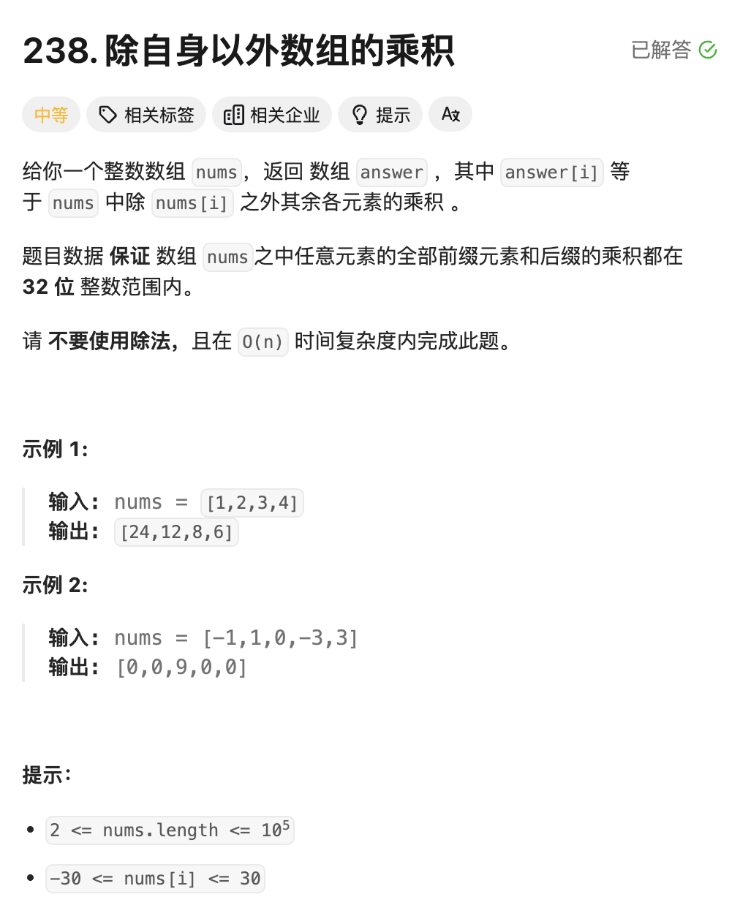
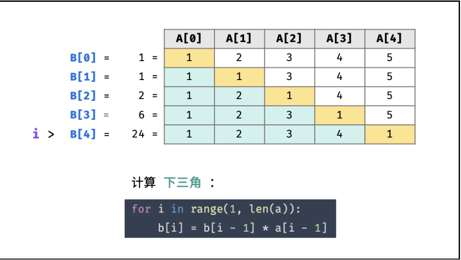
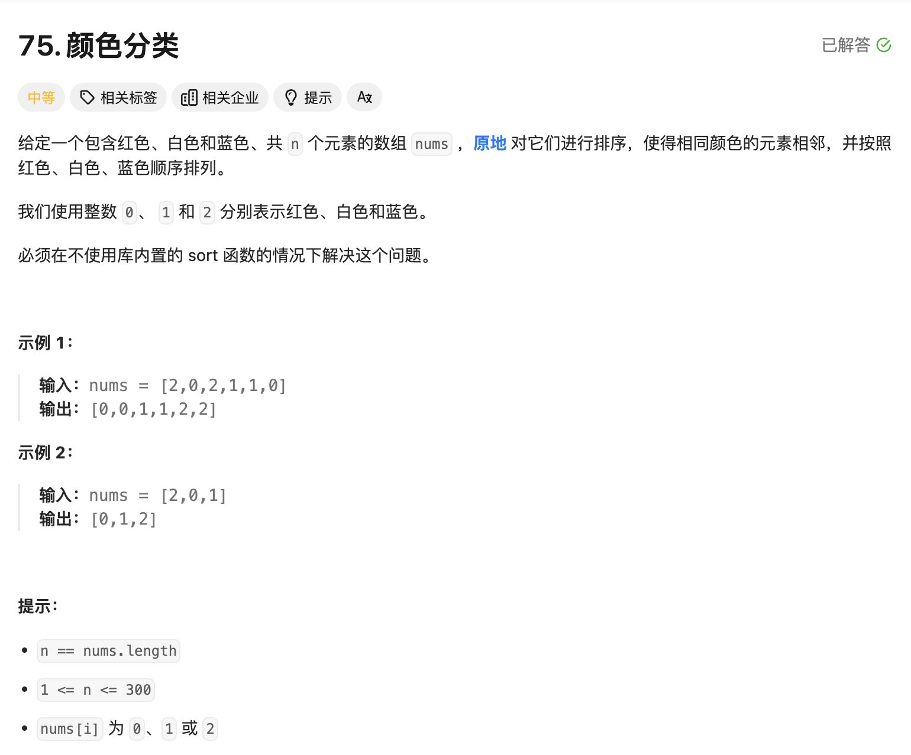
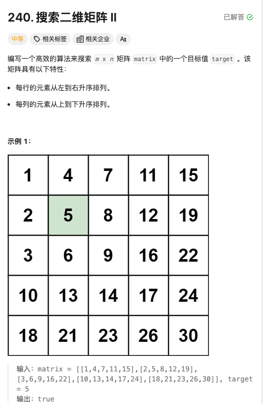

# <center>智力题</center>

智力题好像思路都是比较随机应变，不太好做归类，就放在一块儿了

### 1.除自身以外的数组乘积
<a href = "https://leetcode.cn/problems/product-of-array-except-self/description/?envType=study-plan-v2&envId=top-100-liked"> 题目地址 </a>



#### 题解
这题一开始自己不太会做，感觉很难做到$O(N)$ 的复杂度，尤其是在给定不能利用除法的条件下。后面仔细想了一下，其实是有规律可循的，我们利用上三角和下三角进行两次遍历即可。如下图就很好理解了:




为什么这么说呢，我们看上图，先可以得到一个状态方程为:

$$
B[i] = B[i-1] * A[i-1] 
$$

也就是说，我们第一轮的时候，就可以总体遍历一遍，然后的话就可以得到下三角的结果。紧接着我们来处理上三角的结果。这个时候，我们就可以从最后来进行遍历。这个时候需要一个临时变量来存储上三角的迭代想乘结果。这个是第二个状态方程:

$$
tmp *= A[i]
$$


#### Code
```cpp
class Solution {
public:
    vector<int> productExceptSelf(vector<int>& nums) {
        int temp = 1;
        vector<int> result;
        int len = nums.size();
        result.resize(len);
        result.assign(len,1);
        // Here we compute for the low-trangle;
        for(int i=1;i<len;i++){
            result[i] = result[i-1]*nums[i-1];
            cout<<result[i]<<" ";
        }

        // Then we compute for the top-trangle;
        for(int i=len-2;i>=0;i--){
            temp*= nums[i+1];
            result[i] *= temp;
        }
        return result;
    }
};
```

## 排序Sort

### 1 颜色分类

<a href = "https://leetcode.cn/problems/sort-colors/description/?envType=study-plan-v2&envId=top-100-liked">题目地址</a>



#### 题解

我们很自然的想到的办法就是简单的排序，但是时间复杂度都太高了，最起码也要 $O(NlogN)$,我们观察到这题有个特点就是只有3种颜色，我们只需要分类放好即可。我们想到了什么？ **快排的子过程**，我们在**QuickSorting**的时候，就有这一步，指定一个 **ptr** ，然后进行分类，将小于的放在左边，大于的放在右边，这样的话，我们就可以很自然的想到这个方法。其实就是一样的过程。


#### Code
```cpp
class Solution {
public:
    void sortColors(vector<int>& nums) {
        int left = 0;
        int right = nums.size()-1;
        int curr = 0;
        while(curr<=right){
            if(nums[curr] == 0){
                int temp = nums[left];
                nums[left] = nums[curr];
                nums[curr] = temp;
                curr ++;
                left ++;
            }else if(nums[curr]==1){
                curr++;
            }else{
                int temp = nums[right];
                nums[right] = nums[curr];
                nums[curr] = temp;
                right--;
            }
        }

    }
};
```


## 查找Search

### 1 探索二维矩阵 II
<a href = "https://leetcode.cn/problems/search-a-2d-matrix-ii/description/?envType=study-plan-v2&envId=top-100-liked">题目地址</a>

> 本题其实是二分查找的一个变式



#### 题解

看到查找+有序，我认为很自然的就会往二分查找的方向去想。这样的二维矩阵其实也是，不过有个巧妙的点就在于，**我们选择了矩阵的右上角作为起点来进行查找**，这样的话我们可以很自然的走完整个矩阵。也就是只有两个方向，向左和向下。


#### Code
```cpp
class Solution {
public:
    bool searchMatrix(vector<vector<int>>& matrix, int target) {
        int m = matrix.size();
        int n = matrix[0].size();
        int minN = matrix[0][0];
        int maxN = matrix[m-1][n-1];
        if(target>maxN||target<minN)
            return false;
        int x = 0;
        int y = n-1;
        while(x<m&&y>=0){
            int value = matrix[x][y];
            if(value == target)
                return true;
            else if(value > target){
                y--;
            }else{
                x++;
            }
        }
        return false;
    }
};
``` 

<style>
img {
  display: block;
  margin-left: auto;
  margin-right: auto;
  width : 80%;
  border-radius: 15px; /* 将图片设置为圆形 */
  
}
</style>