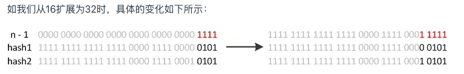
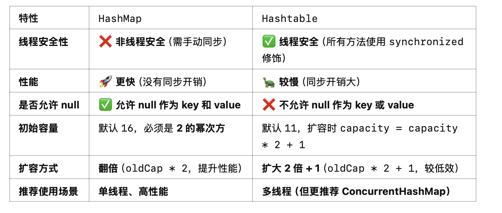

# <center>Java集合</center>


## Map 

### HashMap

#### 如何对 `Map` 中的元素进行遍历呢？你能想到几种方法

1. 我们可以使用 `for-each`循环和`entrySet()` 方法

    这个方法的优点就是可以获得 `Map` 中的`entry`，可以同时获得`key` 和 `value`

2. 如果我们想只要`key`的话，就可以只用`for-each` 和 `keySet()`方法

3. 如果我们只想要`value`的话，就可以只用`for-each` 和 `values()`方法

4. 我们可以使用迭代器`Iterator` 和 `entrySet()`方法

5. 使用 `Lambda` 表达式和 `foreach` 方法

6. 使用流来进行遍历


下面是我们的遍历方法

```java
public void test(Map<String,Integer> map){

    // 1. 使用 entrySet() 方法
    for(Map.Entry<String,Integer> entry : map.entrySet()){
        System.out.println(entry.getKey() + " : " + entry.getValue());
    }

    // 2. 使用 keySet() 方法
    for(String key : map.keySet()){
        System.out.println(key);
    }

    // 3. 使用 values() 方法
    for(Integer value : map.values()){
        System.out.println(value);
    }

    // 4. 使用迭代器
    Iterator<Map.Entry<String,Integer>> iterator = map.entrySet().iterator();

    // 5. 使用 Lambda 表达式
    map.forEach((key,value) -> {
        System.out.println(key + " : " + value);
    });

    // 6. 使用流
    map.entrySet().stream().forEach(entry -> {
        System.out.println(entry.getKey() + " : " + entry.getValue());
    });

}


```


#### 请简单的介绍一下`HashMap`的工作原理
> 具体的源码分析可以看我的另一篇文章[HashMap源码分析]()

首先，我们知道 `HashMap` 是 Java的`Map`的一个实现类。其中的实现是依托于**数组**和**链表**的。因为是 `HashMap` 所以我们想要查找的时间复杂度做到 `O(1)` 因此采用了数组来作为`buckets` 桶。然后我们处理哈希冲突的办法是 **拉链法**，也就是说如果发生了哈希冲突，我们就将这个元素放到链表的下一个位置。因此我们数组的元素类型是一个 `Node<K,V>`。但是我们知道，如果当冲突的元素比较多的时候，还采用链表的话，查找的时间复杂度就会变成了`O(N)`
因此我们先查看数组是否需要扩容`<64`，当容量小于等于 `64` 的时候，我们优先选择扩容，其次再进行切换成红黑树。


然后值得注意的是，如果当某个桶的容量小于`6`的时候，红黑树会退化成链表。


#### HashMap 是线程安全的吗？

不是线程安全的，我们在实现的过程中没有使用到`Synchornized`关键字，因此在多线程的情况下，可能会出现`ConcurrentModificationException`异常。

但是如果需要线程安全的话，可以使用`ConcurrentHashMap`，它是线程安全的。


**所以顺带提一句，HashMap的`get()`方法一定安全吗**

- 线程不安全
- `get(null)` 是安全的，前提是初始化过了，否则会抛出`NullPointerException`

#### 能不能简单的介绍一下 `HashMap` 的 `put` 方法呢？

我们的 `put` 方法是将元素放入`HashMap` 的方法。但是它只是一个暴露在外面的方法，真正实现的
方法其实是`putVal`。首先我们会查看`HashMap`中是否有初始化，如果没有初始化的话，我们会进行初始化，也就是
扩容操作。然后就可以直接的插入元素了。但是如果已经初始化过了。我们就会利用`index = (n - 1) & hash`来计算出它的索引值
然后我们就可以直接的插入元素了。

如果我们找到了一样的`key`,那么就可以直接的进行覆盖，并且返回旧的`value`。
倘若没有找到一样的，就先利用 **拉链法** 来处理哈希冲突，同时维护链表的节点数。如果节点数大于`8`
那么我们就会切换成红黑树。先将链表中的元素转化为红黑树，然后再进行插入，如果它本身就已经是红黑树了，那么就直接插入。

**同时不要忘记了，还要检查负载因子是否大于`0.75`**

#### 为什么 `HashMap` 的`Key`值要选取`String`呢？

我们回归本质，因为`String`对象是不可变的，而这正好是符合`HashMap`的要求的。因为`HashMap`的`key`是不可变的，如果我们的`key`是可变的话，那么就会出现问题。因为我们的`key`是通过`hashCode()`方法来计算的，如果我们的`key`是可变的话，那么我们的`hashCode`就会发生变化，那么我们就找不到这个元素了。
也就是说其实是要保证 `Map`的稳定性。

#### 为什么 `HashMap` 的容量一定要是 `2` 的幂次方呢？
为了提高计算效率。因为 `Hash`值的计算会涉及到位运算，而位运算的效率是非常高的。这样就可以比较高效的找到对应的桶

#### 如果我们的`HashMap`往其中放了`20`个元素，那么我们需要扩容几次呢？

这里就要看 `HashMap` 中的默认值了。因为 `20` 肯定会小于数组的长度 `64`,所以不用考虑会因为
哈希冲突过多导致的切换红黑树。我们只需要考虑负载因子的问题。默认的负载因子是 `0.75`，也就是说当我们的元素个数大于 `16 * 0.75 = 12` 的时候，就会进行扩容。所以我们只需要扩容一次。
变成`32`的数组长度，`32*0.75=24`，所以我们极端情况只需要扩容一次。

#### HashMap 中为什么要使用红黑树，而不是效率更高的 AVL 树呢？

因为 `AVL` 虽然查询效率比红黑树高，但是它的缺点就是过于古板，也就是说要满足 `AVL` 的要求是比比较高的。
但是红黑树属于 **弱平衡树**，不会像 **AVL** 那样严格，而连锁导致的可能导致的不停进行的左旋和右旋操作。


#### HashMap 中重写的 `hashCode()` 和 `equals()` 方法的作用是什么？有什么需要注意的事项？
> 其实问的就是为什么还要重写？

因为可能会存在两个不同的`key`通过`hashCode()`方法计算出来的值是一样的，这就是所谓的哈希冲突。所以我们需要重写`hashCode()`和`equals()`方法来保证我们的`key`是唯一的。

```java
public final int hashCode() {
    return Objects.hashCode(key) ^ Objects.hashCode(value);
}

public final boolean equals(Object o) {
    if (o == this)
        return true;
    if (o instanceof Map.Entry) {
        Map.Entry<?,?> e = (Map.Entry<?,?>)o;
        if (Objects.equals(key, e.getKey()) &&
            Objects.equals(value, e.getValue()))
            return true;
    }
    return false;
}
```

我们这里的`hashcode` 为了避免出现上述情况，选择了将`key`和`value`再进行了一次异或操作。这样还能重复的概率是极低的。
而`equals`方法则是判断两个对象是否相等，如果相等的话，就返回`true`，否则返回`false`。要进行的是深度比较。


#### 说说 HashMap 中的扩容机制
主要就是分为两步:

- 加倍数组的长度
- 将旧Hash值放入新的Hash表中

当我们扩容的时候，`HashMap`的容量是`2`的幂次方的优势就体现出来了。我们首先了解

`index = (n-1) & hash` 



下面就是例子，可能会原地不动，或者前进`2的幂次`
这样可以保证我们的性能最大化，尽可能的进行位运算。

#### HashMap 和 HashTable 的区别




