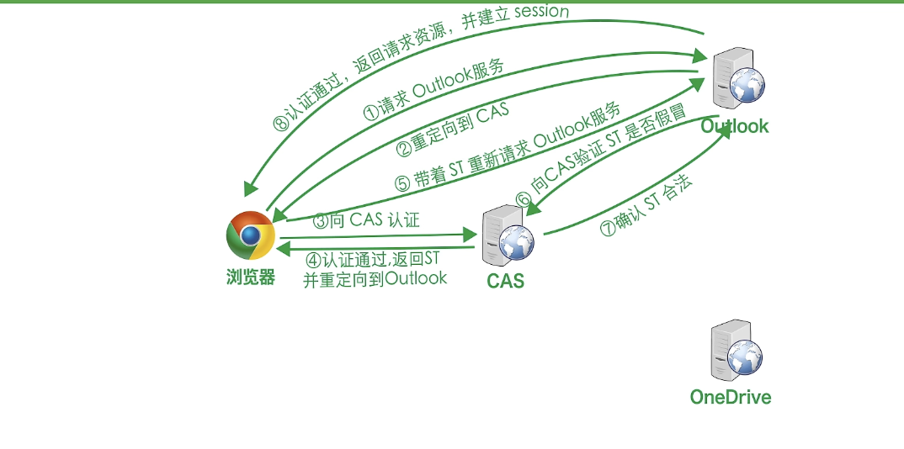
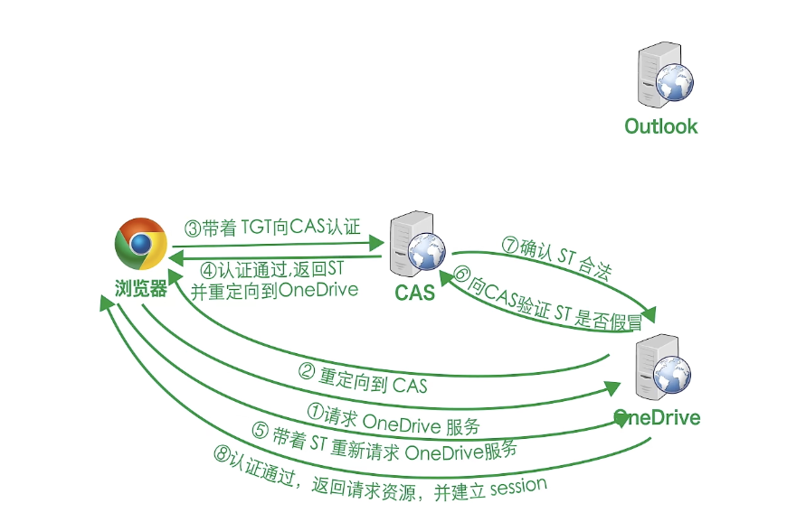

# 
SSO单点登录

## Introduction
什么是 **SSO单点登录**? 其实就是在多个应用场景系统中，用户只需要登录一次就可以访问相互信任的应用系统。这样就可以减少用户的重复登录，提高用户体验。

举一个简单的例子:
例如在访问网易账号中心 `reg.163.com`的时候，登录之后，访问以下的站点都是登录状态:

- 网易直播 : `v.163.com` 
- 网易博客 : `blog.163.com` 
...

一般情况下，一个企业只会一个域名，通过二级域名来区分不同的系统。所以我们可以直接的进行将 `cookie` 的域设置为顶域。`Set-Cookie : CASTGC=TGT-....`

### 设计目标

- 单点登录
- 单点登出
- 支持跨域的单点登录
- 支持跨域的单点登出

## CAS 协议
CAS 是中央认证服务 **Central Authentication Service** 的缩写，每个单点服务架构都需要实现一个 CAS 服务，用于认证用户的身份。

- 服务标识:

    指的是 每个系统或者应用会从 **CAS** 中获得一个标识，也就是类似 `ID` 的东西，用于标识这个应用。让每个应用可以被正确的识别。 **唯一性**

- TGT ticket

    `TGT` 是 `Ticket Granting Ticket` 的缩写，是一个用于标识用户身份的票据。用户登录成功之后，会获得一个 `TGT`，然后通过这个 `TGT` 来获取 `ST`。我觉得这里有点类似 API 开放平台中的 API Key 的概念，系统不用知道你的具体身份，只需要知道你的 `TGT` 就可以了。也就是 **你拿到这个票根就能代表你的身份即可** 有了它，你就可以去访问其他的应用了。

- ST ticket

    `ST` 是 `Service Ticket` 的缩写，是一个用于标识用户请求的票据。用户拿着 `TGT` 去请求 `ST`，然后通过这个 `ST` 来访问其他的应用。这个 `ST` 是有时效性的，一般是一次性的。也就是说，你拿着这个票根去访问其他的应用，其他的应用会验证这个票根的有效性，然后返回给你相应的资源。

### 具体的实现流程

 

我们可以举一个例子进行说明。比如我们要进行 `微软` 的单点登录。我们要实现的效果是，在我们登录了 `outLook` 之后，也可以免登录 `oneDrive`.下面我们就对这个过程进行阐述。

登录 `outLook` 的过程:

1. 我们首先请求 `outLook` 的服务，也就是登录页面。进行正常的登录
2. 我们在完成了登录的操作之后，会被重定向到 `CAS`。
3. **因为我们是要实现的是单点登录**，所以整个登录包括校验的过程，都是需要重定向到 CAS 服务的。在定向到 `CAS` 之后，会由 `CAS` 类似后台管理一样，去校验我们的账号密码是否正确(**也就是校验用户身份**).
4. 校验成功之后，会给用户发送 `TGT` 通票，然后因为 `CAS` 是知道了我们需要访问的是 `outLook`，所以会给我们返回一个 `ST` 服务票。
5. 这个时候，从客户端发起的请求被加入了 `ST` 的票根，然后进行重新请求 `outLook` 这个服务
6. `outLook` 这个服务会向 `CAS` 服务发起请求，验证这个 `ST` 是否有效，如果有效，就会返回给我们相应的资源。
7. 认证通过，返回资源，同时 `outLook` 会给你建立 `session`,方便后续的访问。

登录 `oneDrive` 的过程:

我们接下来看上图:

1. 我们在请求 `oneDrive` 的时候，这个时候**默认是第一次，没有建立Session**
2. 然后会被重定向到 `CAS` 进行身份的认证
3. 因为我们在 客户端会记录 `TGT` 的票根，所以我们会携带这个票根去请求 `CAS` 服务
4. `CAS` 服务会验证这个 `TGT` 是否有效，如果有效，就会返回给我们 `ST` 服务票，并且会将我们重定向到 `oneDrive` 服务
5. 我们会带着 `ST` 重新请求 `oneDrive` 服务
6. 因为 `oneDrive` 没有跟我们建立 `session`，所以需要我们去校验这个 `ST` 是否有效，如果有效，就会返回给我们相应的资源。
7. 认证通过，返回资源，同时 `oneDrive` 会给你建立 `session`,方便后续的访问。