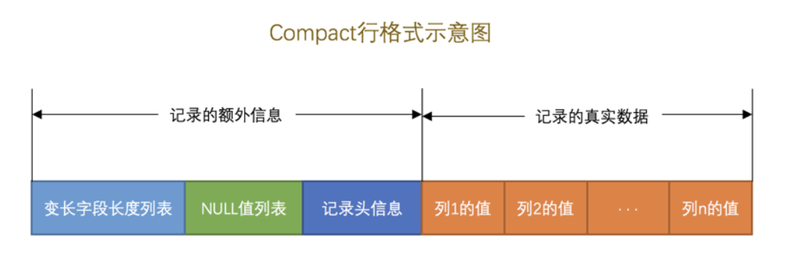
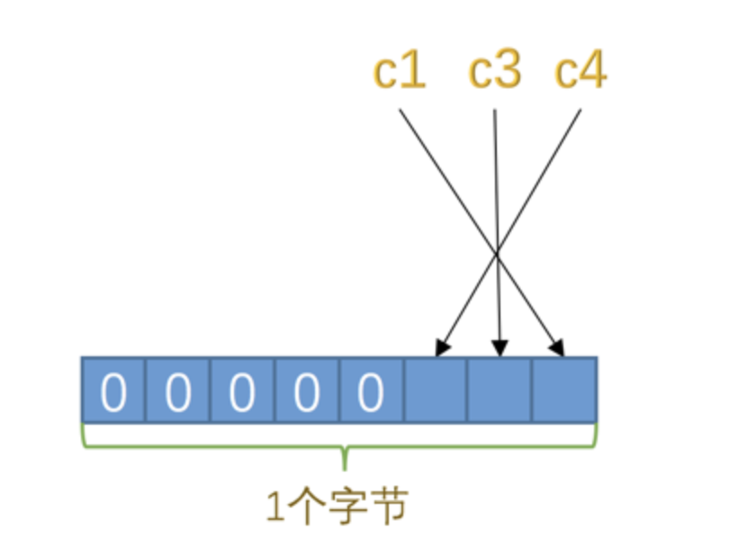
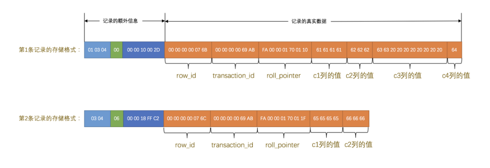

# <center>InnoDB</center>

> 什么是 `InnoDB` ?
>
> Mysql 的默认存储引擎，支持事务，行级锁，外键约束等特性。


## InnoDB 页的介绍

我们需要数据库中的数据具有持久化的特性，所以我们的所有的数据都是储存在磁盘上的。但是我们的数据操作是在内存中进行的。在处理下写入或者修改请求，还需要把内存中的数据刷新到磁盘上。这个时候就需要用到 `InnoDB` 的页的概念。

我们在 InnoDB 中采取了以 16KB 为单位的页来管理数据。这样的好处就是可以减少磁盘 I/O 操作的次数，提高数据的读写效率。
**也就是在一般情况下，一次最少从磁盘中读取16KB的内容到内存中，一次最少把内存中的16KB刷新到磁盘中**

### InnoDB 行的格式

InnoDB中的行的格式存在四种:

- `Compact` 
- `Redundant` 
- `Dynamic` 
- `Compressed` 

```sql
// 创建表的时候指定行的格式
CREATE TABLE t1 (i INT) ROW_FORMAT=COMPACT;

mysql> CREATE TABLE record_format_demo (
    ->     c1 VARCHAR(10),
    ->     c2 VARCHAR(10) NOT NULL,
    ->     c3 CHAR(10),
    ->     c4 VARCHAR(10)
    -> ) CHARSET=ascii ROW_FORMAT=COMPACT;

```

#### COMPACT 行格式



我们看上图，`COMPACT` 的行格式其实就是分成两部分，一部分就是 记录额外信息，还有另一部分就是记录真实的数据。

在 记录的额外信息部分，有三部分内容:

- `变长字段长度列表` : 记录了每个变长字段的长度

    - `VAR` 系列 : `varchar` , `varbinary`
    - `text`
    - `blog` ... 

举个例子: 我们有三组数据 `"a"`,`"bb"`,`"ccc"` ,那么我们的长度列表就是 `1,2,3` 

在 InnDB 有几个参数是我们需要知道的:

- `W` : 表示的是某个字符集中表示一个字符最多使用的字节数, 比如 `UTF8`  
- `M` : 对于变长类型 `varchart(M)` -> 表示的是这种类型最多可以储存的字符数
- `L` : 表示的是实际字符串的长度

二进制位按照列的顺序 **逆序** 排列，也就是说最后一个列的长度在最前面，第一个列的长度在最后面。


- `NULL列` : 用一个位来表示是否为 `NULL` , `1` 表示 `NULL` , `0` 表示 `NOT NULL`。因为我们要保证 `NULL值列表`必须用整数个字节的位表示，如果使用的二进制个数不是整数个字节，那么就需要用 `0` 来填充。（高位）




- 记录头信息 : 它是由固定的5个字节组成，也就是 40个二进制位，不同的位置表示不同的意思。其实就是有点类似元信息的存储头

- 记录的真实数据

除了我们自己定义的列数据定义以外，`Mysql` 会为每个记录默认增加一些列 :

- `row_id` 行ID 不是必须需要的 -> 只有在没有主键的时候，才会有这个列
- `transaction_id` 事务ID **必须需要的**
- `roll_pointer` 回滚指针 **必须需要的**



所以最终的`Compact` 行格式存储的数据就如上图所示


#### CHAR(M) 列的存储格式
我们之所以会没有在 `record_format_demo` 表中的变长类型存放定长类型的列数据，这个是因为 `ascii` 码中的字符集的字符是定长的，但是我们如果使用的是 `gbk`/`utf8` 这种字符集的话，我们就需要使用 `CHAR(M)` 来存放定长的数据。因为不能保证字符的长度是固定的。


### Redundant 行格式