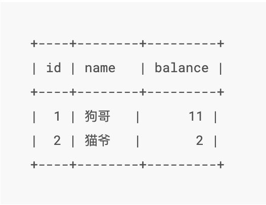
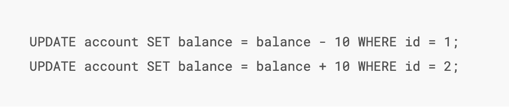
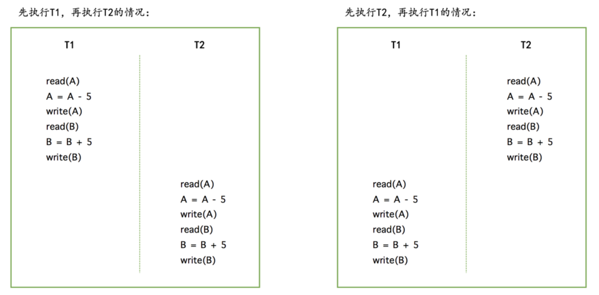
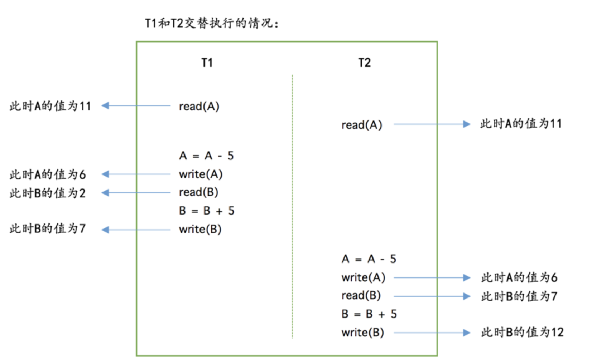
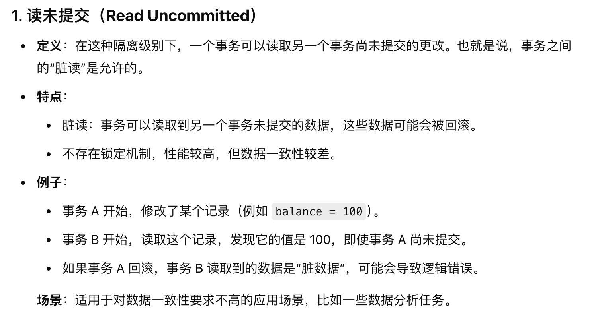
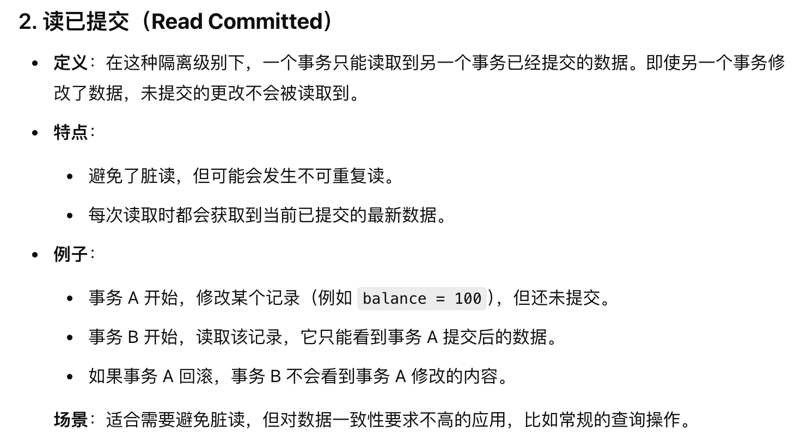
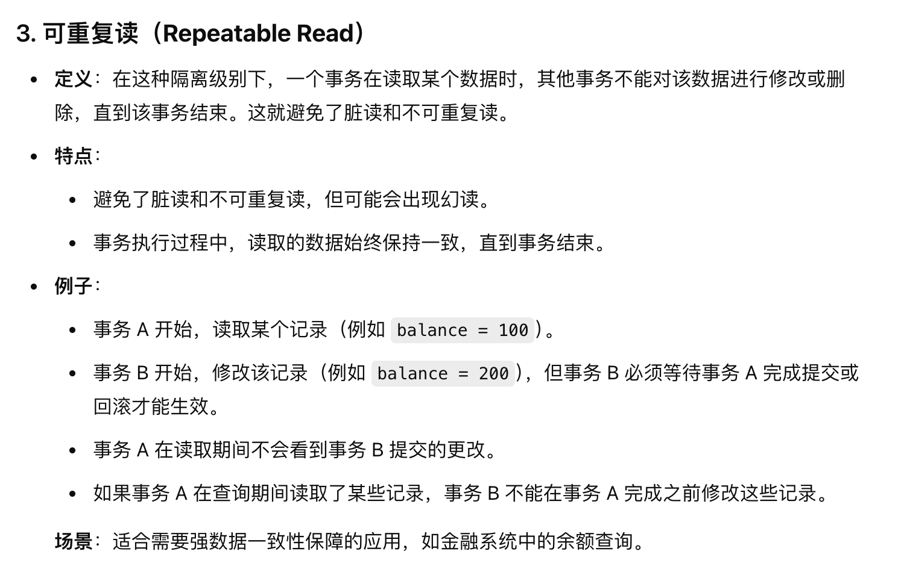
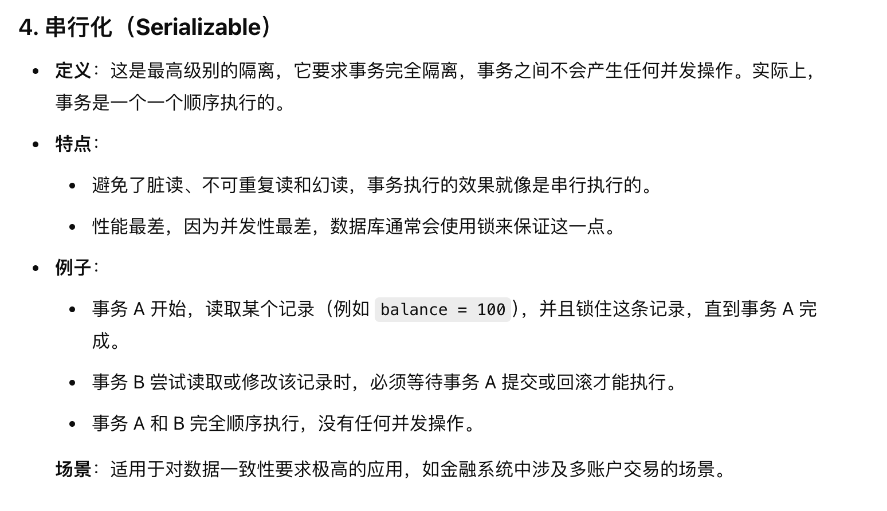

# <center>DB</center>

## 数据库的分类
1. 关系型数据库

      - Mysql 
      - PostgreSQL 
      - Oracle 
      - SQLServer

2. 非关系型数据库 Nosql 
      -  Redis  
      -  MongoDB

## 数据库完整性设计

- **实体完整性:**

    1. 确保每个表中的主键**唯一**而且**非空**
    2. 例如，在学生表中 **学号** 是主键

- **参照完整性:**

    1. 保证两个表之间的关系是正确的，<span style = "color:red">确保表之间的外键关系有效，即外间的值必须被存储在被引用表的主键中</span>
    2. 例如，在学生表中，学生的学号是一个外键，那么这个外键必然是一个已经存在的学号

- **域完整性:**

    1. 确保表中的每个字段 符合其 **数据类型** 、**范围**
    **业务规则**
    2. 例如，在员工表中 **年龄** 必须大于0，且小于120。

- **用户定义的完整性:**
    
    1. 根据业务需求自定义的完整性规则，通常通过 **​触发器（Triggers）​** 或 **​存储过程（Stored Procedures）**​ 实现。
    2. 比如 在库存表中，当库存数量低于安全库存的时候，触发警告。


## 数据库的特征
> 同时需要知道的是，对于关系数据库和非关系数据库的选择来说，如果强烈需要的是保证ACID的特性的，那么我们通常会选择关系型数据库，反之我们会选择非关系型数据库。

**ACID** 是数据库事务的四个特性，指的是原子性（Atomicity）、一致性（Consistency）、隔离性（Isolation）和持久性（Durability）。

下面以一个例子来进行阐述数据库事务的四个特性：



### Atomicity 原子性

> 可以这样的理解，我们把一次事务看成是现实世界中的一次 **状态切换** 

原子性，也就是字面意思，要求的是让某个单位事务中的多个子操作都看成一个整体，要么都成功，要么都失败。

假设 上面图中的用户A 要给用户B 转账 `10` r。那么就会经历下面这个过程:



我们需要保证的是，这个事务是一整个完成的，也就是说 既有前者扣款成功，又有后者的到账。否则的话就会出现中途丢失的状况，这并不算一个事务的完成。

当然我们现在也只是在逻辑的层面进行，其实具体到数据库的实现细节，可能还有`buffer pool` 中的一些实现细节，比如先修改到缓存页，再写入磁盘，抑或是有关脏页的写与读等等，是一系列的操作。

### Isolation 隔离性
> 隔离性的字面意思就是隔离，也就是说在一个事务中的操作不会影响到其他事务的操作。

每个事务之间是独立的，同时事务与事务之间不会影响到其他事务的操作。
简单的例子，我们想让刚刚的一次性转账10r分成了两次进行操作，每次都只转5r，那么就产生了两个事务。



但事实上，以上的操作其实并不是这样的那么简单的单个进行完才会轮到下一个进行的。如果是这样的话，效率太低了，事实上是很多操作可能会并发的进行。就像体系结构的流水线中的乱序一样，很多指令的原单位操作会有乱序的并入，而我们的隔离性要保证的是，就算是乱序的并入，也要保证最终结果的正确。

我们看下面这个例子，就会发现这样的一个问题，如果我们的隔离性不够好，那么就会出现这样的一个问题，就是我们的事务之间会相互影响。本来A应该只剩下了1r，因为进行了两次的转账，但是A的钱变成了6r。有一次转账的操作，但是A少扣钱了。这个就是一次比较失败的隔离。


#### 不考虑隔离性的情况，会出现的问题

-  **脏读(Dirty Read)**：一个事务读取到了另一个事务未提交的数据

比如事务A读到了一个数据库中的数据，但是由于某种原因，事务B回滚了，导致事务A读到了一个不正确的数据。

-  **不可重复读(Nonrepeated Read)**：一个事务读取到了另一个事务已经提交的数据

一个简单的例子，比如事务A读取了一个数据，然后事务B修改了这个数据，然后事务A再次读取这个数据，发现数据已经发生了变化。

-  **幻读(Phantom Read)**：一个事务读取到了另一个事务插入的数据

事务A对表中的所有行的某个数据进行了修改操作，但是此时事务B的某项操作，导致又插入了一行数据，这个时候事务A再次读取这个表，发现多了一行数据。或者是发现又回到了自己更改之前的情况，这个就是幻读。

> 前者和后面两者的区别是 whether the data is commited. 前者脏读只是读取了未提交的数据，但是后者是读取了已经提交的数据。


### Consistency 一致性
这里的一致性其实就是指的是，我们数据库中的数据要和现实世界的数据约束是一致的。**(All defined rule)** 一个最简单的例子就是银行账户的`balance` 不能为负数。    

Mysql 在保证一致性的时候，可以做出以下努力：

1. 在建立表的时候，就规定如 `NOT NULL` 这样的量词限定
2. 我们可以添加 `Check` 语法来自定义约束
   ```sql
   CREATE TABLE account (
    id INT NOT NULL AUTO_INCREMENT COMMENT '自增id',
    name VARCHAR(100) COMMENT '客户名称',
    balance INT COMMENT '余额',
    PRIMARY KEY (id),
    CHECK (balance >= 0) 
    );
   ```
但这里有个不足的地方就是，虽然我们以 `Check` 子句来限定了`account`表，但是在后续插入或者更新记录的时候，就不会去检查这个约束了。这个时候就需要我们自己来进行检查了。

3. 我们可以定义触发器来进行约束条件的检查，来保证一致性。
   ```sql
   CREATE TRIGGER check_balance
   BEFORE INSERT ON account
   FOR EACH ROW
   BEGIN
    IF NEW.balance < 0 THEN
        SIGNAL SQLSTATE '45000'
        SET MESSAGE_TEXT = 'balance must be >= 0';
    END IF;
   END;
   ```

可以这么说，**原子性**和**隔离性**都是保证**一致性**的一个手段。


### Durability 持久性
> 字面意思就是持久性，也就是说一旦事务完成，那么它的结果就是永久的。
> 

不会因为系统的崩溃而丢失。该事务的转换数据库操作所修改的数据会在磁盘上保留下来，无论发生了什么事故，本次转换的结果都不会丢失。以便后续的undo和redo操作。


## 数据库的三大范式
### 第一范式 1NF
> 要保证每一列的原子性，也就是说每一列的值都是不可再分的。


## 索引

### `InnoDB` 中是 聚集索引，而 `MyISAM` 中是非聚集索引
这里就有一个概念，什么是 **聚集索引**？

这个其实是数据库在磁盘中存储数据的方式，比如 **聚集索引**，就是以 **InnoDB**为例，我们建表的时候，指明了主键，那么数据的存储就不像我们狭义的表一样，一行行的存储，而是自动的形成了一棵 B+Tree, **整棵树就变成了一个索引**.这个也就是为什么一张表只能有一个主键，只能有一个 **聚集索引** 的原因。

优点是 **查询的速度极快 $O(\log(N))$** 也就是只需要层数就行。但是缺点也很明显，我们需要更大的代价来维护 **B+Tree**,每次有新的数据写入的时候，DBMS 都需要维护这个 **B+Tree**.

而 **非聚集索引**，其实跟聚集索引的本质差别就是，聚集索引可以直接查到了数据，但是前者只能查到对应数据的 **主键**,是需要在查到了主键的前提下，去遍历一遍数据的。但我们可以不用局限于通过主键来建立B+Tree,而是可以通过其他的列来建立索引，这样就可以通过其他的列来查找数据了。


#### 索引存在很多种类型:
- **单列索引** : 就是一个列上的索引
- **复合索引** : 就是多个列上的索引, 其实就是每个非叶节点上的值是一个元组，按照我们的元组的顺序来进行排列。


## MVCC
多版本并发控制，其实就是指不同的事物在同一时期所读取到的数据是不同版本的。从而解决了脏读和不可重复读的问题。


> 怎么实现的？
> 在每行字段中都添加两个字段用来记录这行数据的创建时间，以及何时过期。但 InnoDB并不储存这些事件发生的实际时间，相反它只存储这些事件发生的系统版本号。这个是随着事务创建而不断增长的数字.


所以很简单的就是每个事务开始的时候，会记录它自己的相关版本号，每个查询必须去检查每行数据的版本号是否与自己相同。这样就可以避免了脏读和不可重复读的问题。**为什么没有解决幻读？准确的来说 MVCC可以利用快照来解决部分的幻读问题，但是不能解决所有的幻读问题，因为修改的时候，始终还是使用 当前读**


- `当前读` : 指的是在读取数据的时候，会去读取最新的数据，而不是读取快照。
- `快照读` : 指的是在读取数据的时候，会去读取快照，而不是最新的数据。比如我们平时使用的 `select *** from *** where ***` 就是快照读，其他的都是当前读。后续的查询语句会利用这个 `ReadView`可以在 `undoLog` 版本中找到事事务开始时候的数据，从而保证了每次查询数据都是一样的。


MVCC 有点类似我们的乐观锁，也就是默认觉得不会发生冲突，所以对于是否是最新的数据没有特别大的关注。那么我们会使用 `next-key` 来作为解决获取实时数据的手段，但是代价就是需要加锁。


## 真题
### 1. 什么是数据库的隔离级别?
> 这题要在理解过 AICD 之后再回来看会比较好理解

数据库的隔离级别就是指的是数据库事务的隔离程度，也就是说在一个事务中的操作对于其他事务的影响程度。上面的笔记中提及了有关事务如果没有隔离性会发生的问题，现在我们就利用四种隔离级别来解决问题。

#### Read Uncommitted 未提交读




#### Read Committed 读提交



#### Repeatable Read 可重复读



#### Serializable 序列化




### 2. 讲一下 脏读，不可重复读，幻读的区别？

- **脏读**，也就是字面意思，读到了脏数据。一个事务读到了另一个事务没有提交 `uncommitted` 的数据
- **不可重复读**，主要面向的是当一个事务A的过程中有多次需要进行对同一个记录的读操作，但是在这过程中有一个事务B对这个记录进行了修改，所以事务A在多次读取这个记录的时候，发现这个记录的值发生了变化。
- **幻读**，幻读更加侧重的是一个事务已经对某条记录进行了修改，比如把某个对象的性别改为了 `1` ,但是事务B在事务A修改之后，又添加了一条记录，把性别改为了`0`.这样等事务A重新查询的时候，出现了幻觉。


### 3. 执行一条 `sql` 语句的过程是怎么样的？

- 建立连接 -> 管理连接，校验用户身份
- 查询缓存 (Mysql 8.0已经删除了这个模块) 
- 解析 sql 语句，看语法是否正确

    - 词法分析
    - 语法分析
    - 构建语法树
- 执行 sql 语句
    - 预处理
> 这里提一句，为什么**mysql8.0**要删除查询缓存这个模块？
> 原因是 **设计缺陷导致的性能问题**

首先，我们要知道 mysql 中的缓存是用来存放 `select` 语句的查询结果的，下次执行相同的语句的时候，可以直接返回结果。但是弊端就在于以下的几个原因:

- **锁竞争和拓展性差** ：因为在查询缓存的时候，读写需要加全局锁，就导致高并发场景下，会产生大量的锁竞争，导致性能降低。
- **缓存失效频繁** : 缓存成立的前提条件是，这个缓存的数据和数据库中的一致，如果在写多读少的情况下，需要频繁的更新缓存，反而导致效率下降。
- **内存占用过大** : 由于缓存是存放在内存中的，如果缓存的数据量过大，就会导致内存的占用过大，而且还会导致内存的不稳定。


#### 4. mysql中的三种引擎的区别是什么？

- `InnoDB` 是 mysql 的默认引擎，支持事务，行级锁，外键约束... 适用于高并发的读写操作 **最小的锁的粒度是行锁**
- `MyISAM` 不支持事务，表级锁，适用于读操作比较多的场景,优点就是内存消耗比较小，存储空间的占用也比较小 **最小的锁的粒度是表锁，所以当对某行数据进行更新操作的时候，整张表就会被锁住，其他对这张表的操作都将阻塞**
- `Memory` : 字面意思，就是数据存储在内存中，而不是在磁盘中，优点就是性能好，但是当重启了或者是断电了，数据就会丢失。 **所以 Memory 中使用的是 hash索引，因为对于性能的要求是最高的**

#### 5. Mysql 中的B+Tree有没有进行什么优化？
`mysql` 中的`B+tree`在相邻的两个子叶节点之间加入了指针来指向下一个节点，可以提高查询的性能。


#### 6. 数据管理中数据文件大体分为几种?

- `db.opt` : 数据库的配置文件,存储的是数据库的默认字符集，字符校验规则。
- `t_order.frm` : 表结构文件，存储的是表的结构信息，比如字段名，字段类型等。
- `t_order.ibd` : 表数据文件


#### 7. 索引优化，能不能给一些建议？
- 前缀索引优化，就是说对于那些字段长度比较大的字段，我们选择利用这个字段的前 N 个字符进行建立索引:

```sql
CREATE INDEX idx_name ON t_order(name(10));
```

从而减小开销成本，但是需要注意的是，我们也要保证它的区分度比较高，`N` 不能过分小。 以索引 `email` 为例，我们可以以`email`字段的前 `10` 个字符进行建立索引。

- 覆盖索引优化:

覆盖索引就是指的是，我们的查询语句中的字段都在索引中，那么就不需要再去查找数据了，直接就可以返回结果。

从而可以避免一次回表。简单来说就是我们需要谁，就把谁放到索引中。


- 主键索引最好自增，这样也方便我们建立聚集索引，因为聚集索引的本质就是 B+Tree,而 B+Tree 的特点就是有序的，所以我们的主键最好是自增的，这样可以保证插入的时候，不会出现数据的移动，从而提高性能。


- 防止索引失效：
    - 在查询的时候，尽量不要使用 `!=` 或者 `<>` 这样的操作符，因为这样会导致索引失效，从而导致全表扫描。
    - 在查询的时候，尽量不要使用 `or` 这样的操作符，因为这样也会导致索引失效，从而导致全表扫描。
    - 在查询的时候，尽量不要使用 `like` 这样的操作符，因为这样也会导致索引失效，从而导致全表扫描。


#### 8. mysql 是如何解决事务并发的问题？

- **锁机制** : 通过锁机制来保证事务的隔离性，从而保证事务的一致性。

    - 表锁
    - 行锁

- **MVCC** 多版本并发控制:

- 事务隔离级别的控制

#### 9. 在MVCC下，哪两种操作会导致幻读？

假设两个事务 A 与 B

- 对于快照读来说，事务 A 读取了一条记录，然后事务 B 插入了一条记录，这个时候事务 A 再次读取这个表，发现多了一条记录，这就是幻读。先进行了 `select` 发现是查询不出来的，然后事务B插入了一条记录，然后事务A对这条记录更新，然后再次进行查询，也就是看到了事务B插入的记录了。这就是 **幻读**。

- 对于当前读来说，事务A先进行了快照读，然后之后事务B进行了插入，然后事务A再执行了 当前读 就会得到多一条语句此时就发生了幻读。


<style>
img{
    display : block;
    margin-left : auto;
    margin-right : auto;
    width : 85%;
    border-radius : 15px;
}
</style>


