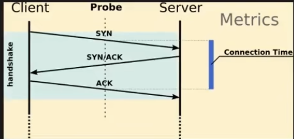
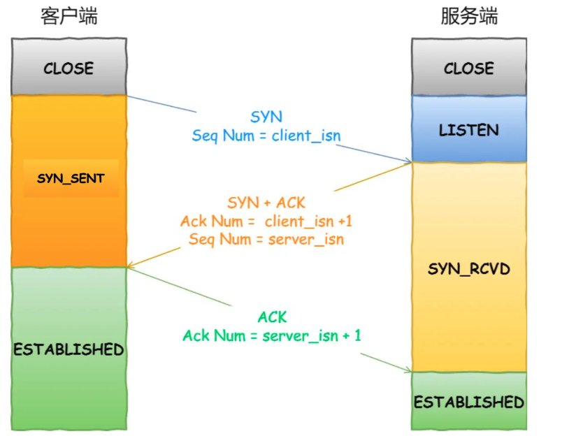
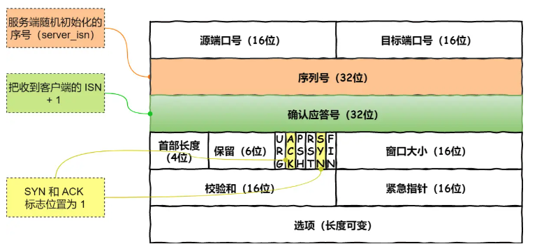

# 
面试

## 传输层
### Q1 请详细介绍一下 TCP 的三次握手机制，为什么要三次握手?

- 为什么需要握手?
- 为什么是三次?

> 我们一切从本质出发，就是 TCP 协议的特点就是 **可靠性**.那么为了保证消息接受的可靠性。也就是说需要双方确认，也就是一方发送消息，要等到接收到接收方发来的 **reply**之后，这才说明这一段消息是发送成功的，值只要它没有 **reply**,那么发送方就一定要一直发，这就是 **可靠性**。因此我们很自然的知道，如何确认我们的消息已经成功的发出去了？我们选择了给传输的消息进行编号，也就是说让每一段消息都有一个序列号。 **TCP是双工，也就是客户端和服务端都可以进行发送请求**，在大家互相发的过程中，我们就需要序列号来进行确认，否则没有办法知道我们应该接收到的是谁发来的什么消息。序列号不能从 **0** 开始的，是一个 **32** 位的随机数字，所以我们需要一个 **32** 位的数字来进行确认。这就是为什么我们需要三次握手的原因。

> 为什么要3次握手呢？而不是4次呢？
> 首先，我们在`close connection`的时候，是允许半打开状态，也就是说可以只有一方关闭，另一方还可以继续发送消息。`server` 说我关链接了，但`client`没有关，是可以继续长时间的给 `server` 发送消息的。在 Linux操作系统中，不会对半打开状态设置超时时间，但是握手的时候，不允许出现半打开状态，所以我们需要三次握手。

TCP 协议的特点就是 **可靠性** 和 **面向连接** 上面已经介绍了可靠性。那么我们的握手过程其实就是建立连接的一个过程。

前两次握手的目的是为了建立连接，所以不能携带数据，第三次握手是可以携带数据的。

下面来具体讲一下这个过程:

- Step1 : 首先 `CLient` 和 `Sever` 都处于 `CLOSED` 状态，先是服务器主动监听某个端口,处于 `LISTEN`状态。表示服务器开始等待客户端的连接请求。

- Step2 : `Client` 开始初始化一个 `32位` 的序列号，作为 `SYN` 包的序列号，然后发送一个 `SYN`(Synchronize 同步) 包给 `Server`，表示我要连接你，同时我给你一个序列号，你给我一个序列号。此时 客户端处于 `SYN-SENT` 状态

- Step3 : 服务端接收到了客户端的 `SYN` 报文，首先自己也随机初始化自己的序列号 `server_ISN`,将序列号填入 TCP 首部中。并且把`TCP`首部的确认应答号字段填入`SYN+1`.看上图的部首中具有的两部分，用于确认序列号和确认应答号。并且把 `SYN 和 ACK` 包都置1.然后把这个包发送给客户端。此时服务端处于 `SYN-RECEIVED` 状态

- Step4 : 客户端接收到了服务端的 `SYN+ACK` 包，然后将 `ACK` 置1，同时将 `ACK` 包的序列号填入 `server_ISN+1`，然后发送给服务端。此时客户端处于 `ESTABLISHED` 状态

这里  `ACK` 的作用:

- 1. 保证连接的可靠性
- 2. 确保双方都清楚知道对方的状态
- 3.防止 SYN 重传，如果没有 `ACK` 确认，客户端可能误以为服务端没有收到 `SYN` 包，会重发 `SYN` 包，这样会导致服务端收到多个 `SYN` 包，这样就会导致冗余和混乱。

###  Q2 三次握手的原因

