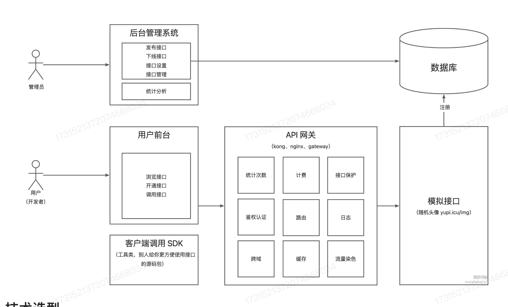

# <center>API开放平台</center>
## 项目介绍
背景 : 

- 前端开发需要调用后台接口
- 使用现成的系统的功能

**做一个 API 接口平台:**

1. 防止攻击（安全性）
2. 不能随便调用 (限制、开通)
3. 统计调用次数
4. 计费
5. 流量保护
6. API接入

做一个提供API接口调用的平台:

**用户 :**

用户可以注册登陆，开通接口调用权限，用户可以使用接口

**管理员 :**

可以对用户进行管理，可以对接口进行管理（发布/下线接口），可以对接口进行监控、以及可视化调用情况、数据统计。

## 业务流程



三个子系统 : 

- 接口后台管理系统

- 前台用户管理系统
    - 接口文档
    - 在线调试

- 提供接口的系统

- API 网关 
    -  统计次数
    -  流量计费
    -  接口保护
    -  鉴权
    -  日志
    -  跨域

    > Kong、nginx、gateway...


- 第三方调用的 SDK 

## 技术选型

- 前端 : 
    - React 
    - Ant Design Pro
    - Umi
    - Umi Request(Axios的封装)

- 后端 : 

    - Spring Boot
    - 做一个SDK
    - 网关实现?
       
## 计划

Part1 : 

- 项目设计、选型
- 基础项目的搭建
- 接口管理
- 用户查看接口


Part2 : 

- 接口调用
- 接口文档展示、接口在线调用
- 保证调用的安全性 (API 签名认证)


Part3 :

- 统计用户调用次数
- 限流
- 计费
- 日志
- 开通

## 需求分析

1. 管理员可以进行接口的增删改查
2. 用户可以访问前台，查看接口文档


## 项目脚手架


## 基础功能


### 开发调用的接口

因为我们已经成功的开发了接口，但是不能让用户每次都在浏览器地址栏中输入接口地址来调用它。这个时候就要考虑调用者怎么进行调用？

- 通过前端调用

- 通过后端调用

通过安全考虑，我们基本上都选择利用后端调用第三方的API.这样就可以保证我们的接口地址不会泄露。

#### HTTP调用

- HttpClient
- RestTemplate
- 第三方库(OKHTTP,Hutool)


我们创建了 `Client` 包，目的是负责与用户进行交互，处理用户请求，以及调用服务端提供的API接口等任务的实现。

### 讲讲 API 签名认证？
想一个很现实的问题，比如我们的接口最多同时允许100个人进行访问，资源是有限的。因此我们就需要尽可能的保护接口资源。因为如果遇到了恶意攻击可能会侵占我们的服务器资源，所以我们必须为接口设置保护信息。比如限制用户的接口每秒访问上限次数（实施请求的频次限额控制）。这样就可以保护我们的服务器资源。

这里就有一个很自然的想法就是 我们要确定到底是谁调用了我们的接口？这个是比较关键的。也就是 **鉴权**，举个简单的例子，管理员如果要下线某个接口，那么我们就需要进行管理员的相关验证？

-> 把问题转化 我们应该如何获取用户信息？

- 假设我是前端，我直接发起请求，没有登陆的操作，没有输入帐号和密码，那么我们怎么知道是谁在调用我们的接口？这里就引入了API签名认证的概念。


**API 签名调用的过程**

- Step1 : 签发签名
- Step2 : 使用签名/校验签名

那么比较自然的想法就是，让每次的调用请求都带上两个东西 **accessKey** 和 **secretKey** 从而可以实现无状态的请求。这样即使你之前没有来过，只要这次状态正确即可。

> 与 Token / Session 的区别就是 二者的强调点有很大的不同:
> API 签名认证 强调的是 **防止篡改请求/请求完整性**
> 而后者更强调的是身份的认证

API 签名设计是一个比较开放的问题，会涉及以下的问题:

- `AccessKey`
- `SecretKey`
- `用户请求参数`
- `sign`
- `random value` 防止重放攻击
- `timestamp` 校验时间戳是否过期


### 开发简单的SDK
开发者只需要关心调用哪些接口，传递哪些参数，就跟调用自己的项目一样简单

#### SDK 的具体设计过程

> 首先，我们要明确客户端设计的SDK需求与定位，避免过于繁琐的设计

1. 引入相关的依赖，这些依赖是我们需要设计的SDK的基础，有两个依赖是我们必须引入的:
   
   - `spring-boot-configuration-processor` : 用于处理配置文件
   - `spring-boot-autoconfigure` : 用于自动配置 

       这个模块的作用是根据项目的类路径`（classpath）`和配置文件`（如 application.properties 或 application.yml）`中的信息，自动配置 `Spring` 应用所需要的各种组件和功能，而不需要开发者手动进行大量的配置。 简而言之就是SDK可以通过我们用户的配置文件来自动的生成 `Bean` 对象。

    我在 `API` 平台设计中，设计了一个 SDK，就以 `secretKey` 和 `accessKey` 为两个配置参数，然后就可以通过这个两个参数的设置，可以自动的配置一个 `Bean` 对象。我们在引入依赖的时候，只需要引入这两个依赖，然后在配置文件中配置好 `secretKey` 和 `accessKey` 就可以自动的生成一个 `Bean` 对象。然后通过`@Resource`这个注解就可以注入这个 `Bean` 对象，然后就可以调用这个 `Bean` 对象的方法了。

2. 编写配置类，用于创建一个客户端Bean对象。并且给`Bean`对象添加上`@ConfigurationProperties(prefix = "api")` 注解，用于自动的从配置文件中读取配置。

3. 注册配置类，我们在 `META-INF` 的目录下创建一个 `spring.factories` 文件，然后在这个文件中添加我们的配置类的路径，这样就可以自动的注册我们的配置类了。这里用到了工厂模式。就是知道后面的配置文件中可以自动的注册我们已经写好的配置类。

4. 开发业务代码
5. 使用 `mvn install` 打包SDK
6. 在项目中引入SDK，即可使用

#### `pom.xml` 文件中的 `build` 标签的作用
`<build></build>` 中包含的就是`Maven`在执行各种任务(如编译、打包、测试)的核心。就比如 
```xml
<build>
    <plugins>
        <plugin>
            <groupId>org.apache.maven.plugins</groupId>
            <artifactId>maven-compiler-plugin</artifactId>
            <version>3.8.1</version>
            <configuration>
                <source>1.8</source>
                <target>1.8</target>
            </configuration>
        </plugin>
    </plugins>
</build>
```
上面的代码就是表明配置 `maven-compile-plugin` 用于编译Java代码，配置`maven-jar-plugin`用于打包JAR文件。

### 第三期 :接口上线和下线的功能

- 管理员 ： 可以对接口进行上线和下线的操作
- 用户在前端可以 **浏览接口**、**查看接口相关的文档**、**在线调试接口的功能**、**申请签名**
- 统计用户调用接口次数
- 优化系统 - API 网关

后台接口:

发布接口: (仅管理员可操作)

  1. 校验这个接口是否存在
  2. 判断这个接口是否可以调用
  3. 修改接口的状态 -> 1

下线接口: (仅管理员可操作)

   1. 校验这个接口是否存在
   2. 下线这个接口 -> 修改状态为 2

### 第4期 : 用户接口关系
#### 设计表
> 这个是用户和接口的多对多关系

- `id` 主键 long
- `userId` 用户Id long 
- `interfaceId` 接口Id long
- `create_time` 创建时间 current_timestamp
- `update_time` 更新时间 current_timestamp
- `is_delete` 是否删除 tinyint
- `number` 调用次数 int
- `left_num` 剩余调用次数 int
- `status` 状态 0-正常 1-禁用 tinyint


### 网关
> 可以简单的理解为火车站，进行统一的检票，对于不同的车厢而言

我们这里的网关其实也是，又有点类似代理，用户在调用接口的时候，不用考虑是哪个项目团队进行调用，只需要通过网关进行调用即可。会由网关来帮助他进行处理，获得结果。

#### 网关的应用场景

1. 路由 

    转发的作用，比如有接口A 和 接口B 网关会记录这样的信息，根据用户访问的地址和参数，转发请求到对应的接口;

2. 鉴权

    统一鉴权，无论访问什么接口，都需要鉴权。我们直接把业务逻辑中抽离出来了
3. 跨域

    统一处理跨域的问题
    
4. 缓存

    统一的业务处理，每个接口中都要做的通用逻辑，放到上层的网关中进行处理

5. 流量染色

    区分用户的来源，防止绕过网关进行访问

    给每个请求加上一个标记，这个标记就是染色，分配一个 traceID

6. 统一业务场景

7. 访问控制

    黑白名单，限制 DDOS ip攻击

8. 负载均衡

    在路由的基础上，跨域转发到某台服务器上

9.  发布控制

    灰度发布控制 给新接口分配 一部分的流量，等发现稳定了之后，才会慢慢的覆盖

10. 接口保护
    1.  限制请求
    2.  信息脱敏
    3.  降级（熔断）
    4.  限流

11. 统一日志

    统一日志记录，方便后期的分析;

12. 统一文档

    将下游的项目文档进行聚合;

#### 网关的分类

- 业务网关（微服务网关）

    将请求转发到不同的项目业务,请求业务逻辑

- 全局网关

    可能没有那么多的业务逻辑，进行负载均衡，流量控制等

#### 实现

- 全局网关 Nginx 和 Kong(API网关)

- 业务网关 **Spring Cloud Gateway**，取代了 Zuul 性能高，用Java来实现


两种配置方式:

- 编程式:
- 配置式:

## 总结