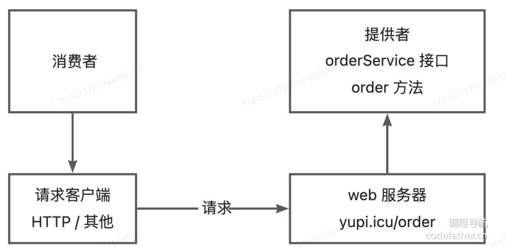
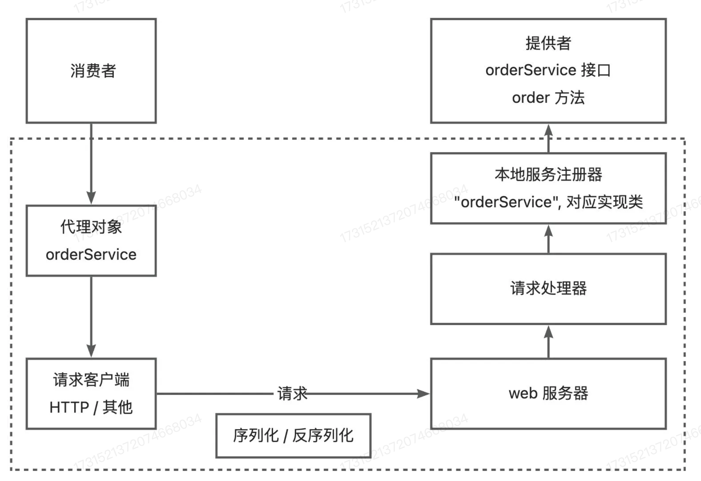
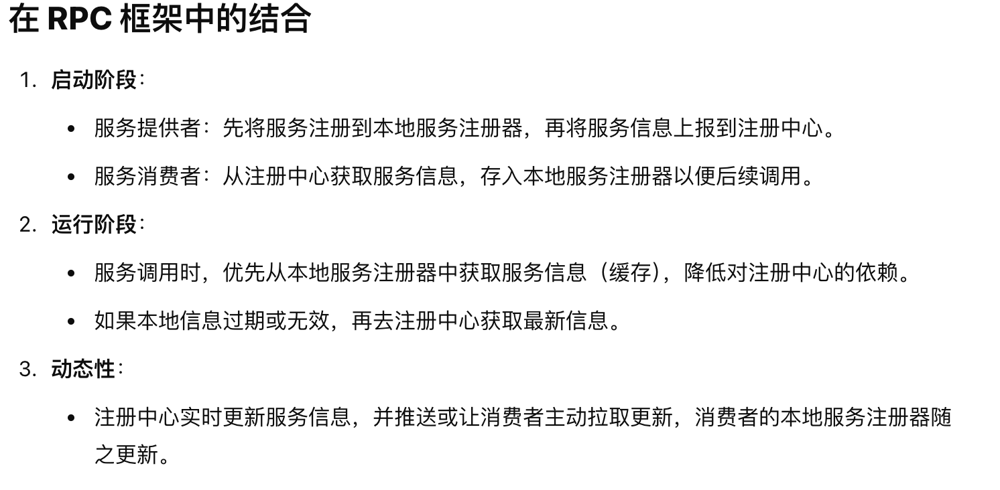
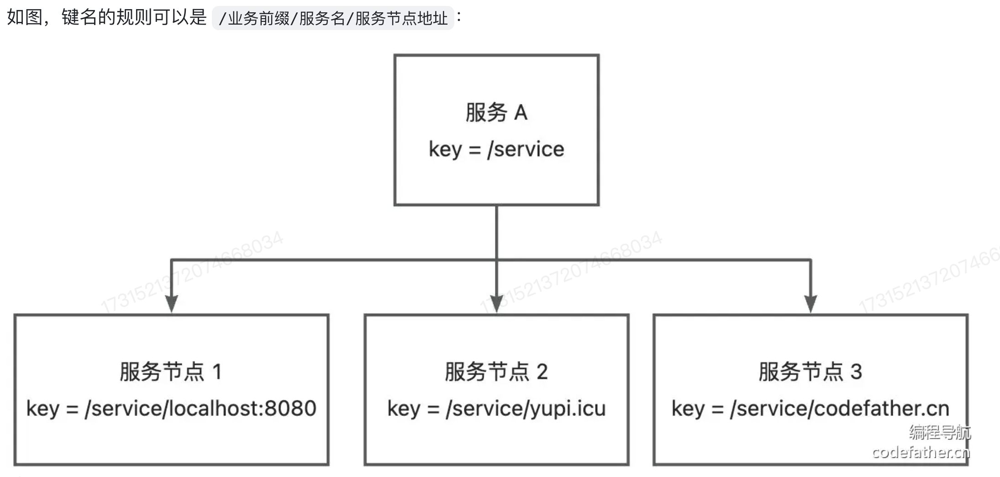
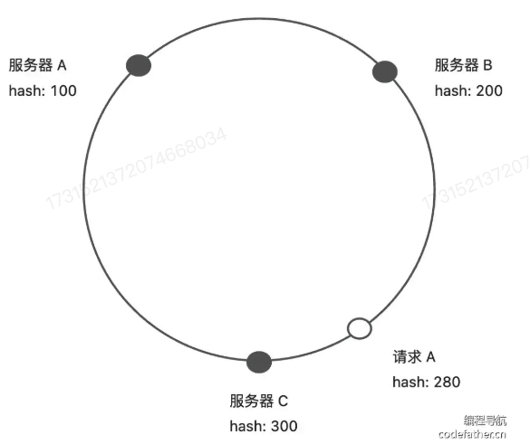
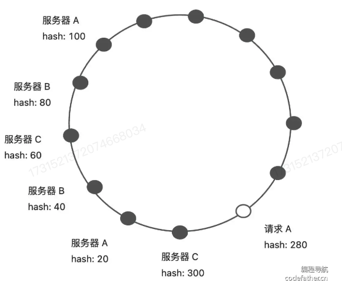

# <center>手写RPC框架</center>

<a href = "https://github.com/Magnus031/TryRPC">项目链接</a>

## Introduce
**RPC** (Remote Procedure Call) 远程过程调用，是一种通过网络从远程计算机程序上请求服务，而不需要了解底层网络技术的协议。RPC协议假定某些传输协议的存在，如TCP或UDP，为通信程序之间携带信息数据。在OSI网络通信模型中，RPC跨越了传输层和应用层。
> 目的就是使得开发者可以轻松调用远程服务，快速开发分布式系统。

首先，我们要明白，在**RPC框架**中有两个重要的概念：
那就是 **服务提供者** 和 **服务消费者**。我们需要做的就是为这两个角色提供一个通用的框架，使得他们可以轻松的调用远程服务。

我们可以这样理解，消费者想要调用提供者，就需要提供者启动一个`web服务`，然后通过`request`发送`HTTP`或者其他的协议请求来调用。



其次，我们再想一个问题。如果提供者提供了许多的服务和方法，那么消费者如何知道提供者提供了哪些服务呢？这就需要提供者提供一个**服务注册中心**，将自己提供的服务注册到**服务注册中心**，消费者通过**服务注册中心**获取提供者提供的服务。
> 简单的理解就是 提供者提供了一个 `请求服务器` 根据客户端的请求参数来进行不同的处理和调用不同的服务和方法。

**An example :**
消费者要调用 `orderService` 服务的`order`方法，可以发送请求，参数为 `service = orderService，method=order`,然后请求处理器会根据`service`从服务注册器中找到对应的服务实现类，并且通过`Java`的反射机制调用`method`指定的方法。

值得注意的是，由于Java对象无法直接在网络中传输，那么我们就需要将传输的参数进行序列化和反序列化操作。

如下图所示，就简单的把RPC框架的流程图给搞定了。


上图只是简易的 **RPC框架** 事实上需要考虑的问题还有很多。我们先进行一个简单的实现，然后再进行优化。


接下来是 RPC 框架的实现
首先，我们创建了一个 Java的工程项目，然后创建了以下的几个模块：

`rpc-common` : 存放的是公共模块,需要同时被消费者和服务者引入，主要是编写和服务相关的接口和数据类型。
`rpc-consumer` : 存放的是消费者模块
`rpc-productor` : 存放的是提供者模块
`rpc-easy` : 用于存放简单的实现模块用来测试

首先要做的就是给每个模块加上依赖，主要的是让他们模块之间可以相互调用。其次，我们在`rpc-easy`模块，引入了`Vertx` 框架，这个是一个NIO 非阻塞的高性能框架。 

> **注册中心：**
> 注册中心是分布式系统中很重要的组件，主要负责的是服务的注册与发现，它帮助服务提供者和消费者动态的找到彼此，确保系统的高可用性和可拓展性。就是它提供了一个中间平台，让服务提供者和消费者可以相互注册和发现。

在 **RPC框架** 中又出现了缓存这个概念。我们这里区分两个概念:
- 本地服务注册器
- 注册中心




### 序列化与反序列化
因为 Java 对象是存活于 JVM 虚拟机中的，如果想要在其他位置储存并访问，或者在网络中进行传输，无论是响应还是请求，都需要进行序列化与反序列化。

### 请求处理器 
请求处理器是一个核心的组件，主要负责处理消费者的请求，根据请求的参数来调用对应的服务和方法。
我们看下面的代码：
```java
        // 创建一个 监听端口并处理请求的对象
        server.requestHandler(new HttpServerHandler());

       // 处理请求
       server.requestHandler(request ->{
           // 处理 HTTP 请求
           // request.uri() return the source of request
           System.out.println("Received request " + request.method() + " "+ request.uri());

           // 发送响应请求
           // 如果正确地接受了请求，我们将返回一个成功响应;
           request.response().putHeader("content-type", "text/plain").end("Hello from Vert.x HTTP Server");
       });
```

上下两段都是进行逻辑请求处理的内容，上面是通过传入我们封装段一个 `HttpServerHandler`的对象，但是后面我们是直接在`requestHandler`中自己模拟了一个对象。但后续的代码我们会进行第一种情况。复用性更好，尽量的减少耦合。

#### 请求处理器的封装
```java
public class HttpServerHandler implements Handler<HttpServerRequest> {
    /**
     * This class is used to handler the request from the client.
     * 1. 反序列化请求为对象，并从请求对象中获取参数
     * 2. 根据服务名称从本地注册中心获取服务实例
     * 3. 反射调用服务实例的方法
     * 4. 将调用结果封装为响应对象并序列化返回
     */
    @Override
    public void handle(HttpServerRequest request) {
        // 指定序列化器皿
        final Serializer serializer = new JdkSerializer();

        // 记录日志
        System.out.println("Received request " + request.method() + " " + request.uri());

        // 异步处理HTTP请求
        request.bodyHandler(body -> {
            byte[] bytes = body.getBytes();
            RpcRequest rpcRequest = null;
            try {
                rpcRequest = serializer.deserialize(bytes, RpcRequest.class);
            } catch (Exception e) {
                e.printStackTrace();
            }

            // 构造响应结果对象
            RpcResponse rpcResponse = new RpcResponse();

            if (rpcRequest == null) {
                rpcResponse.setMessage("Request is null");
                doResponse(request, rpcResponse, serializer);
                return;
            }

            // 通过反射方法调用服务器端的方法
            try{
                Class<?> implClass = LocalRegister.get(rpcRequest.getServiceName());
                // 因为我们是通过反射来寻找，也就是函数标签 -> 函数名字 + 参数类型 来找到某个设备中的函数
                Method method = implClass.getMethod(rpcRequest.getMethodName(), rpcRequest.getParameterTypes());
                Object result = method.invoke(implClass.newInstance(),rpcRequest.getArgs());

                // 封装返回的结果
                rpcResponse.setData(result);
                rpcResponse.setDataType(method.getReturnType());
                rpcResponse.setData("ok");
            }catch (Exception e){
                e.printStackTrace();
                rpcResponse.setMessage(e.getMessage());
                rpcResponse.setException(e);
            }

            // 处理响应结果
            doResponse(request, rpcResponse, serializer);
        });
    }

    /**
     * 处理响应结果
     * @param request
     * @param rpcResponse
     * @param serializer
     */
    void doResponse(HttpServerRequest request, RpcResponse rpcResponse, Serializer serializer) {
        // 序列化响应结果，并且通过HTTP响应返回给客户端。
        HttpServerResponse httpServerResponse = request.response().putHeader("content-type", "application/json");
        try{
            byte[] serialized = serializer.serialize(rpcResponse);
            httpServerResponse.end(Buffer.buffer(serialized));
        } catch (IOException e) {
            e.printStackTrace();
            httpServerResponse.end(Buffer.buffer());
        }
    }
}
```

首先，我们可以想一想这个请求处理器类的逻辑：
1. 首先是需要反序列化请求为对象，并且从中获取参数和服务名称。
2. 然后通过服务名称在本地注册中心中获取对应的服务实例
3. 通过反射调用服务实例的方法
4. 将调用结果封装为响应对象并序列化返回

逻辑很清楚，我们就按照这些逻辑来进行代码的编写。
同时有几个需要注意的点：
1. 不同的web服务器对应的请求的处理器实现的方式是不同的，比如`Vert.x`中是利用实现 `Handler<HttpServerRequest>` 接口来自定义请求处理器。并且可以通过`request.bodyHandler`来处理异步的请求。


### 消费者发起调用 -- 代理
> 我们上面主要实现的是提供者的服务，那么接下来就是消费者的服务了。

#### 静态代理
静态代理是指为每一个特定类型的接口或对象，编写一个代理类。
但静态代理的缺点也很明显，我们要给每一个服务接口都写一个实现类，但这样的灵活性很差。所以我们选择动态代理。

```java
public class UserServiceProxy implements UserService {

    @Override
    public User getUser(User user) {
        // Serialize the object;
        Serializer serializer = new JdkSerializer();

        // 发送请求
        // -> 构造了一个 rpcRequest 对象,利用 @Builder 注解
        RpcRequest rpcRequest = RpcRequest.builder()
                .serviceName(UserService.class.getName())
                .methodName("getUser")
                .parameterTypes(new Class<?>[]{User.class})
                .args(new Object[]{user})
                .build();

        try{
            byte[] bodyBytes = serializer.serialize(rpcRequest);
            // 发送请求
            byte[] result;

            // 模拟了一个 HTTP 请求的过程;
            try(HttpResponse httpResponse = HttpRequest.post("http://localhost:8080/")
                    .header("Content-Type", "application/json")
                    .body(bodyBytes)
                    .execute()){
                result = httpResponse.bodyBytes();
            }
            RpcResponse rpcResponse = serializer.deserialize(result, RpcResponse.class);
            return (User) rpcResponse.getData();

        }catch(Exception e){
            e.printStackTrace();
        }

        return null;
    }
}

```

### 动态代理
动态代理是指在运行时动态生成代理类，这样就可以不用为每一个服务接口都写一个实现类。 我们根据要生成的对象类型，自动生成一个代理对象。也就是生成一个可以代替模拟HTTP请求的对象。


### 工厂的设计模式

略，后面再补充。

## 设置全局配置
> 因为一开始我们在简易的版本中在程序里硬编码了这些配置，不利于维护，而且具有较低的复用性。所以我们应当允许在引入框架项目通过编写配置文件来自定义配置。 **一般情况来说，服务的消费者和提供者应该是具有相同的RPC配置**

### 设计方案


 首先，我们新建一个Module为`rpc-core`用于存放拓展版本的RPC框架。
 于是，我们在模块中新建了一个包为`utils`用于存放工具类。并且定义了一个`rpcConfig` 函数用于保存配置信息。


### `rpcCore/utils/RpcConfig.java`
一开始，我们仅考虑比较简单的配置文件

- `name` : 设备名称
- `version` : 版本号
- `serveHost` : 服务器主机号
- `servePort` : 服务器端口号
 
## Mock 设置
Mock 的作用是在实际开发和测试的过程中可能会出现无法直接访问真实的远程服务，或者访问真实的远程服务会出现不可控的影响，例如网络延迟，服务不稳定等问题，所以在这种情况下，我们需要用mock服务来模拟远程服务的行为。以便进行接口的测试、开发和调试。

### 动态代理
动态创建对象的方法 -- 动态代理，创建远程调用对象，我们通过动态代理创建一个 **调用方法的时候返回固定值** 的对象。


## 序列化器与SPI机制
无论是请求或者是响应，都会涉及参数的传输。而Java的对象是存活在JVM虚拟机中的，所以我们如果想要在其他的位置进行存储并访问，或者在网络中进行传输，就需要进行序列化和反序列化操作。

### 还需要考虑的问题：
- 有没有更好的序列化器实现方式
- 如何让使用者指定使用的序列化器
- 如何让使用框架的使用者自己定制序列化器

### 几种主流的序列化方式
- JSON
  - 优点：通用性好，可读性好
  - 缺点：序列化和反序列化效率低，因为


### 动态的更改指定的序列化方式
-> 仅仅需要更改配置文件的选项，从而可以自己定义指定对应的序列化器

> 对于所有可自定义选项的，我们都可以通过配置文件来进行配置，然后通过读取配置文件的方式来进行自定义选择。


### 自定义序列化器 SPI 机制

> BackGround: 如果开发者不想使用我们框架内内置的序列化器，想要自己定义一个新的序列化器，但是又不能修改我们的源码，这个时候就需要使用SPI机制。

SPI 机制 ： Service Provider Interface 服务提供接口，是Java提供的一套用来被第三方实现或者扩展的API。它可以用来启用框架的扩展和替换组件。简单的来说就是允许服务提供者通过特定的配置文件将自己定义的实现类注册到系统中，然后系统通过反射机制动态加载这些实现类，而不需要修改原始框架代码，从而实现类系统的解耦

一个典型的SPI应用场景就是JDBC的使用，不同的数据库驱动程序开发者可以使用SPI机制将自己的驱动程序注册到JVM中，然后JVM通过反射机制动态加载这些驱动程序，从而实现了数据库驱动程序的解耦。

思路很简单，只需要RPC框架能够读取用户自定义的类的路径，然后加载这个类，作为Serializer的实现类。

## 注册中心
### 注册中心核心能力
1. 数据分布式存储：集中的注册信息数据存储/读取/共享
2. 服务注册：服务提供者上报服务信息到注册中心
3. 服务发现：服务消费者从注册中心获取服务信息
4. 心跳检测：注册中心定时检测服务提供者的存活状态
5. 服务注销：服务提供者下线时，从注册中心删除服务信息

### 中间件的选取
> 我们需要一个可以集中存储和读取数据的中间件，还具有数据过期、数据监听的功能，以便我们进行移除失效的节点，更新节点列表。

我们在RPC框架中选择的是 `Ectd` 云原生组件。

`Ectd`中具有两个特性：

1. 租约: 用于维持键值对的生命周期，当租约到期时，对应的键值对将被删除
2. 监听: 可以监听键值对的变化，当键值对发生变化时，可以及时通知监听者

> 另外，`Ectd` 还有一个强一致性的优势

### Raft一致性算法

> 旨在实现一个容错且一致的分布式系统的**日志复制机制**，其核心目标就是让一组节点在部分节点发生故障的时候，依然能够对外提供一致的服务。

- 集群角色
  - Leader 集群中的主节点，负责处理客户端请求，将日志复制到其他节点
  - Follower 集群中的从节点，负责接收Leader的日志，并且持久化到本地
  - Candidate 集群中的候选人，负责选举Leader

- 日志复制
    Raft通过将日志从Leader复制到Follower，确保所有节点的日志顺序一致。日志条目最终被提交后，状态机应用这些日志以保持一致性。

- 选举机制
当集群中的Leader失效时，Follower会超时并发起选举，选出一个新的Leader。

- 状态一致性
Raft保证日志条目以相同的顺序存储在所有节点中，并确保只对提交的日志条目生效。

**也就是，始终会有一个Leader节点，负责处理客户端请求，将日志复制到其他节点。**

#### Follower投票的核心规则
1. 任期规则

每次投票只针对当前任期（Term）。Follower会记录它已经投过票的Candidate，如果某个Candidate在本任期内已经获得了Follower的投票，那么Follower不会再投票给其他Candidate。
如果收到的投票请求来自一个更高任期的Candidate，Follower会更新自己的任期号并考虑投票。
2. 日志完整性检查
   
Raft的一个重要原则是投票时优先选择**日志较新**的Candidate，以保证一致性：

Follower会比较自己的日志和请求投票的Candidate的日志，优先将票投给拥有更新日志的Candidate。
两个日志谁更新的判断依据是：
任期号（Term）：最后一条日志的任期号更大的Candidate日志更新。
日志长度（Index）：如果任期号相同，日志更长的Candidate日志更新。
3. 请求条件
Follower只有在以下条件都满足时，才会投票给一个Candidate：

Candidate的任期号（Term）不小于Follower的任期号。
Candidate的日志至少和Follower一样新（基于上述日志完整性检查规则）。
Follower当前未投过票，或者已经投票但当前的Candidate是其投票对象。

> 简单的来说，Raft算法保证的是，集群中的各个节点的投票只会由两个因素决定，一个是**任期(Term)** 也就是最后一条日志的任期号，另一个是**日志的长度(Index)**。始终保证最新的日志的为Leader节点。


### 存储结构的设计
> 这些都是我们应该考虑的问题
- Key 怎么设计？
- Value 怎么设计？
- Key 什么时候过期？ 

下面我们提供了两种结构设计的方案:
1. 层级结构 将服务理解为文件夹，将服务对应的多个节点理解为文件夹下的文件。用查前缀的方式来访问某个服务的所有节点。



2. 列表结构，将左右的服务节点以列表的形式整体作为value

### etcdkeeper的使用
Step1 : 先进行 etcd 的安装
Step2 : 运行 etcdkeeper

## 注册中心的优化
### 心跳检测机制 和 续费机制
- 什么是心跳检测机制？
    
    字面意思就是定期判断服务是否还存活，如果不存活了，就将其从注册中心移除。
    心跳检测的应用场景非常广，尤其是在分布式，微服务的系统中，比如集群管理，服务健康检测等... 主要的还是类似一个轮询的机制，定期的检测服务是否还存活。

    下面是一个简单的`HeartBeat`的实现:
    ```java
        @RestController
        class HealthCheckController{

            // 心跳检测接口
            @GetMapping("/actuator/health")
            public String healthCheck(){
                // 这里可以添加一些其他的健康检测逻辑。
                return "ok";
            }
        }
    ```
### 方案设计
> 首先，我们要明确的是最关键的两个因素是 **定时** 和 **网络请求** 

我们RPC框架中使用的是 Etcd 中间件作为注册中心，所以实现心跳检测是比较简单的，因为`Etcd` 自带了key的过期检测机制。**那么心跳检测的一个比较简单的实现方式就很自然的实现了，我们给每个服务同时设定自动续费的机制，重置自己的倒计时，倘若这个节点已经宕机了，不续费，那么Etcd就可以对这个节点进行删除。**


总的实现思路就是: 

1. 服务提供者在向 注册中心 提供了需要服务注册的请求，那么注册中心就会注册一个这样的服务，然后设置了一个`TTL`，进行维护这个服务。
2. 等这个服务被删除了之后，就会立刻通知服务注册中心，然后服务注册中心定期就会重新的注册这个服务。值得注意的一点是，**续费时间不能大于过期时间**.

> 一个小问题，服务注册者怎么知道自己应该续费什么服务呢？这个时候，我们在注册中心的Map就派上了用场，我们只需要访问这个Map中的Key,那些被删除的Key就是需要续费的服务。

### 服务节点下线机制
> 当服务提供者的节点宕机的时候，我们应该从注册中心中移除掉这个已经宕机的节点。否则的话就会影响消费调用，所以我们就提供了一套服务节点下线机制。


- 主动下线 

    我们在接口函数中只需要指明是哪个节点我们需要下线即可。然后我们就会将这个节点从注册中心中移除。

- 被动下线 

    当心跳检测的时候发现某个节点已经宕机了，我们就可以利用`Etcd`的`key`过期机制来进行自动的移除。

> 这里补充一个有关 JVM 的机制, `ShutDownHook` 是一个线程，当 JVM 关闭的时候，会调用这个线程。我们可以在这个线程中进行一些资源的释放，比如说关闭一些连接，释放一些资源等等。

我们在倘若发现了服务的宕机之后，选择了直接的抛出异常，然后这里就使用到了 `JVM` 中的 `ShutDownHook` 机制，直接被动的将服务进行下线。


### 服务端的缓存
因为我们通常服务的节点更新频率并不是很高，所以在服务消费者从注册中心获取服务列表的时候，我们可以将这个服务列表进行缓存，然后定期的去刷新这个缓存。这样的话，我们就可以减少对注册中心的访问，提高了性能。

#### 1. 添加本地缓存
...


## 自定义协议
首先，我们要明确的是 `HTTP` 协议和 `RPC` 协议其实是有区别的。二者并不等价，同时二者也不是可以归为一类，事实上前者是后者的一个实现方式罢了。也就是可以这样理解，我要完成从家到学校的路程，我可以选择走路，骑车，坐车等等，这些都是实现方式，但是目的是一样的。而本次实验，我使用的是`Vert.x`中的`HTTPServer`作为服务的提供者，那么我们就需要自定义一个协议来进行服务的调用。

当然，选择`HTTP`是一种比较简单的实现方式，适合初学者入手。但是我们这里选择了可以自定义的满足我们的需求的协议。`RPC`更侧重于性能，因为是服务的调用，所以我们需要更快的速度，更高的性能。


## 负载均衡 (Load Balance)
> 这里提供一篇文章可以学习 <a href = "https://blog.csdn.net/weixin_41701290/article/details/140386321">Source</a>

### 需求分析
我们在`RPC` 框架的实现中，可以发现有些服务可以是集群的，也就是说一个服务可以有多个节点进行提供服务。但是我们一开始为了功能的实现，比较简单的进行了每次都选择第一个节点进行服务。这样是不好的，因为这样会导致负载不均衡，有些节点可能会被压力过大，有些节点可能会被压力过小。并没有充分利用节点有多个这个优势。所以我们需要一个负载均衡的机制，来解决每次只选取第一个节点作为服务的问题。

什么是**负载均衡**呢？
> 负载均衡是一种技术，用来在多个服务器之间分配负载，以达到最大的性能，最小的延迟，最大的可用性，最大的可伸缩性等等。

事实上我们也有多层的负载均衡，就比如我们需要有代理服务器，但是一台代理服务器也可能有多个节点，因为假设有1w个请求，估计这个代理服务器也会崩溃，所以在不同的层次上都需要负载均衡。


#### 常见的负载均衡算法

1. 轮询 (Round Robin)

    我们可以把所有的服务器放在一个圆环里，然后中间有个指针顺时针进行访问，**这种情况比较适合服务器性能比较均衡的情况**。

1. 随机 (Random)

    随机的选择一个服务器进行访问，**这种情况适合服务器性能比较均衡的情况而且负载比较均衡的情况**。

1. 加权轮询 (Weighted Round Robin)

    这种情况适合服务器性能不均衡的情况，我们可以给每个服务器设置一个权重，然后按照权重进行访问。
    
    举个例子 : 假设我们有五台服务器（1-带宽 1000MB 和 4-带宽 100MB的服务器）那么访问顺序可能是 

    - 1,1,1,2 
    - 1,1,1,3 
    - 1,1,1,4 
    - 1,1,1,5

1. 加权随机

    这种情况适合服务器性能不均衡的情况，我们可以给每个服务器设置一个权重，然后按照权重进行访问。跟上面的加权轮询差不多，只是这里是随机的访问。

1. 最少连接 (Least Connections)

    选择当前连接数最少的服务器进行访问，**这种情况适合服务器性能不均衡的情况**。同时要求连接是长连接。

1. IP Hash

    根据请求的IP地址进行Hash，然后根据Hash值来选择服务器进行访问，**这种情况适合服务器性能比较均衡的情况**。这种是适用于需要保证绘画一致性的场景。


### 一致性Hash算法
> 这个是一个很重要的知识点

其实就是将整个`Hash`空间进行分配，划分成一个环状，然后根据请求的`Hash`值来选择服务器进行访问。这样的话，当某个服务器宕机的时候，只会影响到这个服务器的请求，而不会影响到其他的服务器的请求。



举个例子，假设 我们的请求 的`hash`值是`280`.那么我们就会选择距离这个`hash`值最近的服务器进行访问。

利用`Hash`一致，我们可以避免两种问题 

- 节点下线

如果我们是正常的轮询的话，那么当某个节点下线的时候，那么这个节点的请求就会被分配到其他的节点上，这样就会导致负载不均衡。但是如果我们使用了一致性`Hash`算法，那么这个节点下线的时候，只会影响到这个节点的请求，而不会影响到其他的节点的请求。

- 资源倾斜

可以将物理节点映射到虚拟节点，这样可以以更小的粒度进行负载均衡，避免资源倾斜。尽可能的让请求均匀的分布到各个节点上。




<style>
img{
    display : block;
    margin-left : auto;
    margin-right : auto;
    width : 85%;
    border-radius : 15px;
}
</style>


