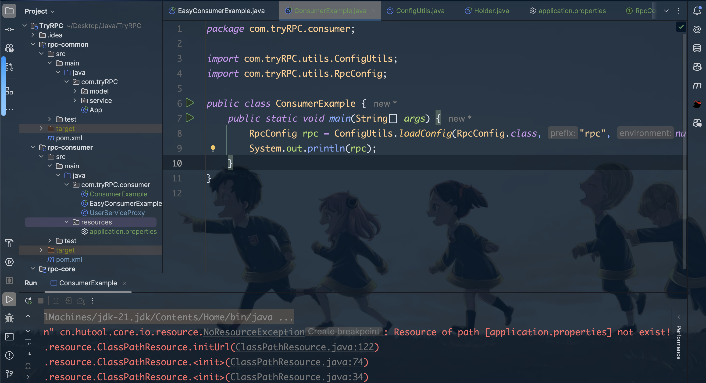

# <center>RPC 心得&TODO</center>

> 这个文档是我在完成RPC框架的过程中的一些心得，以及一些TODO。需要我来进行实现的。


## 心得
### 问题1. Resources下的properties文件not exist的问题。
我们在使用自己写的`loadConfigure`方法的时候，调用了`hutools`的`toBean`方法，但是它并不能找到 `application.properties`这个文件的地址。



**[问题解决] :** 首先，我们要知道的是

`resources`包中存放都是资源文件，包含程序运行时候的各种所需要的资源文件:

1. 配置文件 `.properties` `.xml` `.yml`等
2. 静态资源文件 `.css` `.js` `.jpg`等
3. 模板文件
4. 数据文件 `.txt` `.csv`等

其次，我们要知道的是，`resources`包下的文件在编译后会被放到`target`目录下的`classes`文件夹中，所以我们在使用的时候，要注意这个问题。

目的就是统一管理资源。**地址**是 `src/main/resources`。 这个很重要，不然的话我们就会出现上面的问题，我们发现是把`resources`包放错地方了。

### 心得2 记得及时的手动构建项目
`mvn clean install`
 一定要记得及时的构建项目，不然的话，我们在修改了代码之后，可能会出现一些问题，比如说，我们的`resources`包下的文件没有及时的被编译，这样的话，我们在运行的时候就会出现一些问题。

### 心得3 了解了src和target的区别
我们以RPC的`monitor` Feature 为例:
我们可以利用 `ConfigUtils` 类来加载文件，但是，加载出来的是 `target` 目录下的文件，而不是 `src` 目录下的文件。所以我们如果想监听对当前文件的修改，我这里选择的是监听`src`目录下的文件，而不是`target`目录下的文件。所以就需要它的绝对路径。不能使用通过类加载器来获得的路径。需要实现的是一个什么功能呢？因为当前的是开发环境，所以我可能会及时的更改配置文件，所以我需要一个监听器，来监听配置文件的变化，然后及时的加载配置文件。但是如果我使用的是`target`下的目录文件，其实就不需要监听了，因为我每次都会重新构建项目，所以配置文件也会被重新加载。


## TODO 
### 全局配置加载
#### Part1. 添加对于`yaml`文件的支持
因为 `hutools` 本身的 `Props` 类只支持 `properties` 文件的读取，所以我们需要自己来实现对于 `yaml` 文件的读取。

首先，我们通过观察 `hutools` 对于 `properties` 文件的读取，我们发现它是通过 `toBean` 方法来读取的，它`extends` 了`Java`中的`properties`接口。

- Step1: 引入 `snakeYaml`的依赖
```xml
<dependency>
            <groupId>org.yaml</groupId>
            <artifactId>snakeyaml</artifactId>
            <version>2.0</version>
</dependency>
```
- Step2: 实现 `loadConfigYaml` 
```java
public static <T> T loadConfigYaml(Class<T> tClass,String prefix,String environment){

        // 创建 Yaml 对象;
        Yaml yaml = new Yaml();
        System.out.println("Now we are loading the yaml file.");
        StringBuilder builder = new StringBuilder("application");
        if(!StrUtil.isBlankIfStr(environment)) {
            builder.append("-").append(environment);
        }
        // Because that this is a yaml file.
        builder.append(".yaml");

        // 加载配置文件;
        // 从资源文件夹中加载 yaml 文件，并将其转化为 InputStream 输入流对象 以供 SnakeYaml 读取和解析
        /**
         * 类加载器
         * 首先，我们这里的 {@code ConfigUtils.class.getClassLoader()} 是一个类加载器对象，因为我们的
         * 配置文件是放在 resources 目录下的，而在打包项目的时候，resources 目录下的文件会被打包到 jar 包中，存在于JVM的类路径中。
         * 如果想要准确的读取resources目录下的文件，我们就需要使用类加载器来正确的读取文件。
         */
        try(InputStream in = ConfigUtils.class.getClassLoader().getResourceAsStream(builder.toString())){
            if(in == null){
                throw new Exception("Sorry,the yaml file is not found.");
            }
            return yaml.loadAs(in,tClass);
        }catch (Exception e){
            //log.info("[Error] : We cannot load the yaml file.");
            e.printStackTrace();
        }
        return null;
    }
```

#### Part2. 支持监听配置文件的变化
> 因为我们会经常遇到的一个问题就是，会手动的对配置文件进行更改，我们需要能够及时的监听到这个文件的变化，然后重新加载这个文件。

参考 `hutools` 的 `WatchMonitor` 类的使用。

但是我们这个会出现一个问题，就是我们想要监听的文件是在 `resources` 包下的，这个文件在编译后会被放到 `target` 目录下的 `classes` 文件夹中，所以我们在使用的时候，要注意这个问题。


<style>
img{
    display : block;
    margin-left : auto;
    margin-right : auto;
    width : 85%;
    border-radius : 15px;
}
</style>
