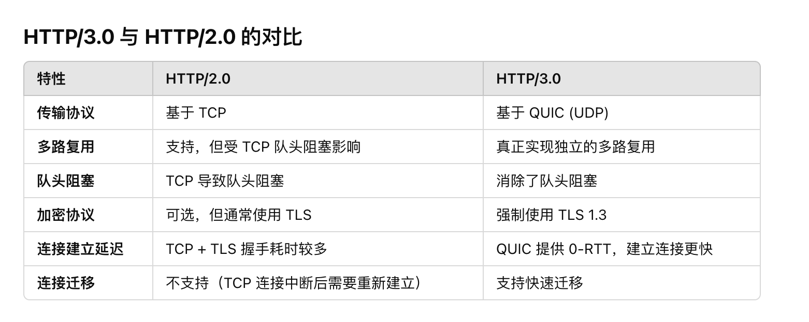

# <center>一面记录</center>

**BackGround:** 
本人的第一次面试，具体的公司不太方便透露，但是面试的内容还是挺值得反思的。估计是没有二面了... 面试官给我来了一句 **任重而道远** 啊，Code 是比较稳的，感觉在很紧张的前提下也能写个大概，但是在项目和基础知识上还是有很大的欠缺。尤其是八股文。真的感觉要掌握的东西太多了，不过也是一次很好的经历。

## Code Review 二叉树的最大宽度

<a href="https://leetcode.cn/problems/maximum-width-of-binary-tree/description/?envType=company&envId=bytedance&favoriteSlug=bytedance-thirty-days">题目地址</a>

自己幸好是写出来了，但是这个手搓和LeetCode上的有不同就是需要自己定义`struct TreeNode`.自己平时直接写函数用现成的定义写惯了之后，一时间有点懵b。但幸好也是写出来了。

> 下面的代码是自己写完之后凭记忆速搓出来的，可能会有bug

```cpp
#include<bits/stdc++.h>
using namespace std;
struct TreeNode{
    TreeNode* left;
    TreeNode* right;
    int val;

    TreeNode(){}
    TreeNode(int val){
        this.val = val;
    }
}
int getMaxWidth(TreeNode* root);
int main(){
    cout << "HelloWorld" << endl;
    return 0;
}
int getMaxWidth(TreeNode* root){
    if(root == nullptr)
        return 0;
    int maxNum = 1;
    queue<TreeNode*> qe;
    // used to store the next 
    queue<TreeNode*> nextQe;
    queue<int> index;
    qe.push(root);
    while(!qe.empty()){
        TreeNode* temp = qe.front();
        qe.pop();

        if(temp->left!=nullptr){
            nextQe.push(temp->left);
            index.push(temp->val*2);
        }

        if(temp->right!=nullptr){
            nextQe.push(temp->right);
            index.push(temp->val*2+1);
        }

        if(qe.empty()){
            int size = index.size();
            if(size>=2){
                maxNum = max(maxNum,index.back()-index.front()+1);
            }
            while(!nextQe.empty()){
                qe.push(nextQe.front());
                nextQe.pop();
            }
            while(!index.empty()){
                index.pop();
            }
        }
    }

    return MaxNum;
}

```


## 面试过程中的问题
> 没有很细节的问项目，可以约等于说没有问项目，但是很明显的感觉到自己的八股有着极大的欠缺，感觉是需要多花点时间在这个上面。

### 1. HTTP/2.0 你有没有了解过？

这里介绍一下 HTTP 家族的几种协议:
> 首先 HTTP (HyperText Transfer Protocol) 超文本传输协议。

#### HTTP/1.0
> 发布于 1996年，是第一个被广泛使用的版本

几个特性 :

1. 无状态，也就是服务端不会记录下客户端的状态，只是简单的响应请求
2. (Short-lived Connection) 短连接，也就是每次请求都会单独的建立一个TCP连接，处理完请求之后就会断开连接。
   
    例子，如果一个网页需要多次的请求资源，那么就需要建立多次的连接，效率十分的低下。

3. 请求方法: 只有三种

    - GET
    - POST
    - HEAD 

4. 缺乏缓存机制，主要通过 `Expires` 头部字段来指定资源的过期时间

5. 不支持虚拟主机，请求中没有`host`字段

#### HTTP/1.1
> 发布于 1999年，是HTTP/1.1 的改进版本，这一个是用途最广泛的版本

几个特性:

1. 持久连接: 也就是说HTTP/1.1 是保持了 `keep-alive` 的连接，一个TCP请求可以发送多个HTTP请求，避免了进行重复的连接与断开。

2. 支持了更多的请求方式: 比如 `PUT` `DELETE` `OPTIONS` `TRACE` `CONNECT` 也就是我们常说的 RESTFUL API，使得更具有针对性与灵活性。

3. 缓存机制的改进，引进了 `Cache-Control` 和 `ETag` 头部字段，使得缓存管理的更加灵活与高效。

4. 支持了虚拟主机，使得一个服务器可以承载多个域名。比如 `www.example.com`和`www.example.org`可以在同一个服务器上。

5. 改进的安全性: HTTP/1.1引入了更多与身份验证相关的字段 (如 `Proxy-Authenticate` 和 `WWW-Authenticate`) 

6. 分块传输编码: 

    - 允许服务器分块的发送响应数据，无需事先知道数据的总长度
    - 提升了动态内容的效率，比如视频流，音频流等

#### 为什么需要有`HTTP/2.0` ?难道不是 `HTTP/1.1`就够了吗？
> 实则不然，HTTP/1.1 在很多方面都有着不足之处


1. `HTTP/1.1` 是一个基于文本的协议，但后者是一个基于二进制的协议，这样就可以更加的高效的进行传输与解析，所有数据都会被分割成`frame`再通过`stream`进行发送。

2. `HTTP/1.1` 有一个比较严重的问题就是 `队头阻塞` ，也就是如果同一个连接下，如果有多个请求，倘若一个请求被阻塞了，那么其他的请求就会被阻塞，极大的降低了效率。

3. `HTTP/1.0` 有较高的延迟。在利用`TCP`连接的时候，不仅需要3次握手，`TLS`还需要额外的握手，建立连接的延迟会比较大。

相比之下，`HTTP/2.0` 有着更多的优化和改进的地方，我们具体来看下面的`HTTP/2.0`


#### HTTP/2.0
> 什么是 HTTP/2.0 ? HTTP/2.0 是一种二进制协议，而不是文本协议。这个协议是由Google推出的，基于SPDY协议的基础上进行了改进。
>
> 为了方便记忆，可以把HTTP/2.0的 2 想成是Binary的意思。

1. 字面意思，`HTTP/2.0` 是一个二进制的协议，也就是说会具有更高的传输效率和更快的解析效率。

2. 多路复用: `HTTP/2.0` 支持多路复用，也就是说可以在一个连接上同时进行多个请求，避免了队头阻塞的问题。我们看到上面的`HTTP/1.1` 的协议，具有的问题是请求都是在一个队列里，如果一个请求被阻塞了，那么其他的请求就会被阻塞。但是我们在`HTTP/2.0` 中，一个连接可以同时发送多个请求，这样就避免了队头阻塞的问题。

3. 头部压缩: `HTTP/2.0` 使用了`HPACK`算法来对头部进行压缩，这样就减少了传输的大小，提高了传输的效率。可以给`payLoad` 带来更多的空间。

4. 具有服务器推送的功能: 也就是说服务器可以在客户端请求之前就把一些资源推送给客户端，这样就可以提高加载的速度。
   
    举个简单的例子，如果一个网页需要加载一个`css`文件，那么服务器可以在客户端请求之前就把这个`css`文件推送给客户端，这样就可以提高加载的速度。

5. 考虑了优先级:也就是priority,对于不同的数据流来说，可以设置不同的优先级，这样就可以保证重要的数据流可以优先传输。

6. 安全性: `HTTP/2.0` 默认是使用`TLS`加密的，这样就提高了安全性。

#### HTTP/3.0
> 感觉 `HTTP/3.0` 考的不是很多，我就简单的列个表格



集中注意几个区别,`HTTP/3.0` 相较 `HTTP/2.0` 具有更高的性能(因为使用了 UDP 来作为传输协议)，完全解决了`队头阻塞`的问题；

#### 一个衍生出来的问题，`HTTP/3.0` 使用了`UDP`作为传输协议，那么可靠性如果保证呢？

我们这里就引入了一个概念，`QUIC` 协议来保证了数据的可靠性。

几个重点 : 

1. 数据包的序号
2. 重传机制
3. 确认机制

其实我们观察到，跟`TCP`其实有很多相似的地方。因为确认可靠性就那么几种方法。我们使用`UDP`更快，只需要附加上这些机制就可以了。


### 2. 你有没有了解过 `HTTPS` ? 
放到计算机网络那一part


### 3. 你有没有了解过 Java 的 `自动回收机制` ？
> Java GC 

### 4. 你有没有了解过 `HashMap` 的实现呢？一般会用在哪里？
> 详细见我的Blog中的源码解析部分


