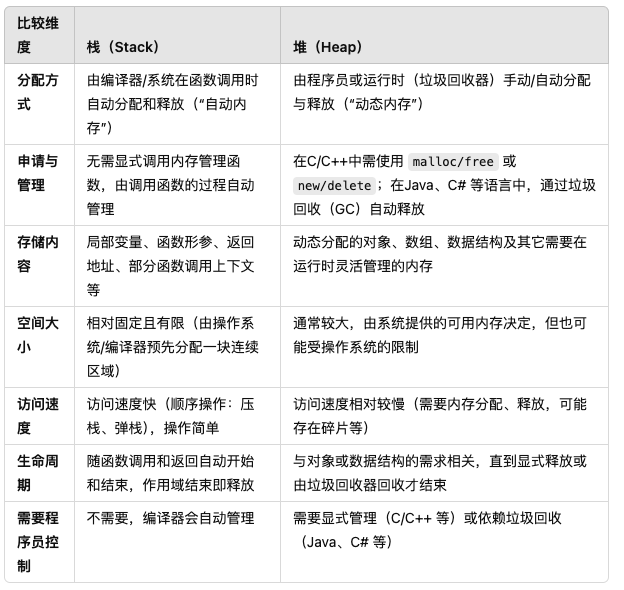

# 
第一套

题源 : 腾讯WXG 一共5面

## 一面

### 堆和栈的区别,哪个是需要程序员控制的？

首先，栈和堆都是指不同的内存区域。他们在内存管理方面有比较显著的差异;

- 堆 (Heap) 
    - **分配释放方式：** 需要程序员手动或由垃圾回收（GC）机制管理。在C/C++中通常通过malloc/free或new/delete进行分配与释放；在有GC的语言（如Java、C#）中，分配是由程序员触发的，而释放则通过垃圾回收自动完成（但仍是从堆上分配的）。
    - **存储内容：** 主要用于存放动态分配的对象、数据结构等。
    - **内存空间大小：** 通常要比栈大得多，但具体大小也与系统、运行环境有关。
    - **访问速度：** 由于需要管理分配与释放，以及可能产生碎片整理等操作，访问速度相对栈会慢一些。

- 栈 (Stack) 
  
    - **分配释放方式：**由编译器/系统自动管理。函数调用时，会在栈上为局部变量和形参分配空间，函数返回时自动释放这些空间。
    - **存储内容：**主要用于存放函数的局部变量、形参以及一些函数调用所需的上下文（如返回地址等）。
    - **内存空间大小：**通常比较有限，一般在编译时就已经确定最大大小。
    - **访问速度：**由于是系统自动分配，且是顺序操作（压栈、弹栈），访问速度通常较快。

> 二者从本质上来说，其实就跟管理他们的对象是密切相关的，因为栈是由系统/编译器自己管理的，所以就速度就比较快，但是局限性也比较大。所以我们不太能分配过多的位置空间。而堆的话也相反。

#### 什么是栈溢出？如何避免？

因为栈是存放的空间比较有限，而且存放的变量都是一些函数的局部变量和形参，所以无限递归或者分配过大的局部变量会导致栈溢出。

**怎么避免栈溢出呢？** 我们尽可能的把大数据分配到堆上去，进行动态的分配，然后控制好递归的深度。

#### 什么是堆溢出呢？
很自然的就知道了，堆溢出就是动态分配了过多的内存空间，超过了系统的限制，导致了堆溢出。

### Java的加锁方式有几种？

- **synchronized** 内置锁和监视器锁

- 调用 `Lock()` 接口的实现类
    
    - 重入锁 : ReentrantLock
    - 读写锁 : ReentrantReadWriteLock
    - 不可重入锁 : StampedLock 
- `synchronized` + `volatile` 关键字 双重检查锁 -》用在单例模式的时候
- `ThreadLocal` 线程本地变量 每个线程维护自己的变量副本,避免使用锁
    - 适合用于储存用户会话，数据库连接，避免线程间数据污染

### 不同进程中的 malloc 函数返回的值是否一样？
是一样的，因为操作系统中的每个进程是互相独立的。我们会为他们分配虚拟内存空间，所以每个进程的 malloc 函数返回的值是一样的。每个进程都是默认不存在其他进程的内存空间的。

### 栈和队列在操作系统中有哪些运用场景? 

队列 : 

- 进程调度 : 用在进程分配调度的时候，有几种算法是跟队列相关的。比如先进先出算法，还有一些跟优先级相关的算法。
- I/O 设备的管理 : I/O 维护所有等待的磁盘或者设备完成的进程
- 磁盘调度算法
- 线程池的实现

其实很好理解，队列就是用来排队的，当同一个资源有多个对象进行请求的时候，就需要让队列来完成这个任务。避免出现了饿死的情况

栈 : 

- 函数的调用和返回，是利用栈的特性来完成的，压栈和出栈的操作
- 内存管理的时候，有涉及到栈的使用。上述已经讲过了关于栈的内容
- 进程/线程的上下文切换，也是利用栈的特性来完成的。 每个线程都有 独立的栈，当 CPU 进行 线程切换 时：当前线程的栈帧（包括寄存器、PC 指针）被 保存在 PCB（进程控制块） 或 TCB（线程控制块） 中。
切换到新线程时，恢复其栈帧，继续执行。

### Java GC 的新和老分别是什么算法？

新 -> 新生代，存活率低，使用复制算法

老 -> 老生代，存活率高，使用 标记清除算法 + 标记整理算法

### TCP 和 UDP的区别是什么？二者的运用场景有什么不同？

- 有无连接？ TCP 协议是面向连接的，但是UDP是不面向连接的
- 传输可靠性？ TCP 是可靠的，UDP 是不可靠的
- 传输速度？ TCP 速度慢，UDP 速度快（因为 UDP 不用进行校验和多次握手）
- 流量控制? TCP 有流量控制，UDP 没有
- 拥塞控制？ TCP 是有慢启动，拥塞避免等机制，但是 UDP 没有
- 数据传输方式？ TCP 是流式传输，但是 UDP 是一次性传输

运用场景 : 以 微信为例，用户之间进行消息传输，是利用TCP的，但是UDP的话是用在视频传输的时候，因为视频传输的时候，我们不需要保证每一帧都是完整的，只要保证大部分帧都是完整的就可以了。

## 二面

### Java 中的HashMap 长度为什么是 2 的幂次?

两个目的: 

1. 减少多余的运算，提高效率。因为我们在扩容的时候，如果是2的幂次的话，我们只需要进行位运算就可以了，但是如果不是的话，我们就需要进行取余运算，这样就会增加运算的时间。

2. 减少碰撞的概率。因为我们在进行 hash 的时候，我们会进行 hash & (n-1) 的操作，这样就会减少碰撞的概率。

### HashMap 中如果不给初始的长度，那么第一次初始化是在哪里？

在第一次使用 `put` 方法的时候，会有一次校验。

### 如果让你设计一个线程池，你会考虑什么？

> 在面试中问到“如果让你来设计一个线程池，你会考虑什么？”这种比较开放的问题，往往是想考察候选人对并发、线程管理、资源调度、架构设计以及实践经验等方面的综合理解和能力。下面我会从两个角度进行回答：一个是如果我作为被面试者，我会从哪些方面思考和回答；另一个是如果我作为面试官，我希望听到什么、关注候选人的哪些点。

这个是一个开放性问题 

#### 线程池的需求分析与目标

> 为什么需要线程池呢？

- 提高性能 ：减少线程创建和销毁的开销，提高响应速度
- 资源的监控 : 方便控制并发线程数，防止系统过载
- 统一管理 : 方便对线程进行统一管理，如线程复用、线程安全等

就目标和需求来看，我们利用线程池其实就是为了能在一定的范围内进行控制并发线程，并且方便我们进行实时监管。

对于任务需求，主要就是分为两种， **CPU密集型** 和 **I/O密集型** 我们分别对这两种任务进行不同的处理。

#### 线程池的核心参数与基本的机制

- **CPU密集型** -> 主要的就是CPU利用率的侧重，数据处理，加密解密，图像/视频的编解码。不太会因为网络，或者磁盘I/O等原因出现大量阻塞。 

    - 线程数 : 我们建议线程数为 `CPU核心数+1`，因为上下文切换有开销，因为我们希望尽可能的让CPU处于一个高负荷状态，而不是一直被频繁的切换线程增大开销，降低性能。
    - 队列 ： 我们一般选择小而有界的队列，以免短时挤压任务太多而增加负担

- **IO密集型** -> 主要就是存在大量网络访问，或者磁盘IO的操作上
    - 线程数 : 我们建议线程稍微设置的多一些，这样就可以让部分线程在等待 IO 的时候，其他的线程就可以继续运行, 提高效率.一般是 `2*CPU核心数，或者 2-4 * CPU核心数`

然后是考虑一些最大线程数，我们可以根据需求预估一下突发流量的能力上限。
其他就是根据业务需求进行对于 线程池相关系数的调整。

- 并发级别? 
    - 预计的并发请求量有多大？
    - 是否存在流量突增的情况？是否需要临时的增加线程进行处理？
        -  **这一点就是对应着 最大线程数的设置上限，从而可以应对突增的流量情况**

- 任务类型

- 可用的资源？

    - 机器CPU核心数、内存、网络带宽如何？
    - 是否在容器环境呢？
    
        - 因为容器中可以利用的资源并不等于宿主机的CPU资源，同时容器也会对 内存进行限定。 

- 任务队列的选择？
    - 无界队列 
    - 有界队列
    - 优先级队列 
    
    虽然上述三种的队列各有优劣，但是我们更侧重后两者，避免出现了业务的无限拥堵导致的内存泄漏的情况。当然 优先级的话就要考虑我们的业务本身。基本上不会选择无界队列来作为我们的任务队列。

- 任务提交策略 

    这个应该都一样，先检查核心线程数是否满了，再考虑提交到任务队列，如果任务队列都满了，再考虑是不是可以重新开线程来进行处理。

- 拒绝策略 

    这个是按我们的业务而定的，一般有四种策略

    但是我们需要强调的是 **宁可让调用方感知到任务的繁忙，也好比吞掉请求而不知所踪。就像数据库中，我们会采用逻辑删除，而不会直接的把整条数据进行删除**

#### 线程池的生命周期与监控
因为我们采用线程池的一个很大的目的就是可以更好的监控我们的线程，而这里尤其是分布式场景，或者微服务的时候，我会考虑对接 Prometheus 这样的监控系统来进行检测，从而可以及时的调整扩容/JVM调参

#### 拓展与高级特性

当然，我们上述的一些考虑基本上都是考虑的是单节点的情况。也就是我们只在本地机上进行设置线程池，接下来我们可能会考虑分布式线程池。

- 异步处理，如果是 IO密集型的场景，我还会考虑异步框架来避免多线程的阻塞。
- 分布式线程池，引入调度中心，来进行负载均衡到各个节点上进行线程的调度。

### NIO模型下 Buffer 是双向吗？

Buffer不是双向的，是单向的。Channel是双向的。Buffer并不支持同时的读和写，需要调用flip()方法来切换读写模式。

## 一轮面委

### 为什么使用 协程 而不是 线程？

因为 协程 更加的轻量级，协程是在用户态进行的，而线程是在内核态进行的。所以协程的切换速度更快，而且协程的资源消耗更少。可以尽可能的避免上下文的切换锁代码

### 协程一定比线程好吗？

不一定，协程的优势在于轻量级，但是协程的缺点在于，协程是在用户态进行的，所以协程的生命周期是由用户来控制的，这样就会导致了一些问题，比如说，如果我们的协程出现了死循环，那么就会导致整个程序的崩溃。而线程的话，是由操作系统来进行调度的，所以线程的生命周期是由操作系统来控制的，这样就会避免了一些问题。可以看成一种 **trade-off**. 线程因为是交给操作系统来进行调度，那么如果某个线程崩溃了，那么操作系统会自动的进行回收，并不会影响到整个程序的运行。（因为是独立的）

### TCP 和 UDP 的区别

经典老番了，两个都是传输层的协议。具有各自的特点， **TCP** 的优势就在于 **可靠性** 和 **稳定性**，是一种面向连接的传输层协议。因为每次建立连接的时候，都需要进行握手，而且会有流量控制、阻塞控制等机制来保证数据的可靠性。而 **UDP** 虽然也是一种传输层的协议，但是它的优势在于快速，适合一些实时的网路传输，它不具备可靠性，因为它是无连接的，所以不会有握手等机制，所以速度会比较快。各有优势

### http 和 https的区别？
**https 协议是一个基于 http 协议的基础上，加上了 SSL/TLS 协议的一种加密传输协议**。所以 https 协议是安全的，而 http 协议是不安全的。https 协议的加密方式有很多种，比如说对称加密，非对称加密等。所以 https 协议是安全的，而 http 协议是不安全的。对于 https 协议来说，在普通的握手之后，会多一些进行证书认证的操作，我们以对称加密为例。客户端和服务端会在后续的加密握手的过程中分别传输自己的 random key，来组成公钥。

### https的数字证书的交换过程详细的说一下？

## 二轮面委

## HR 面