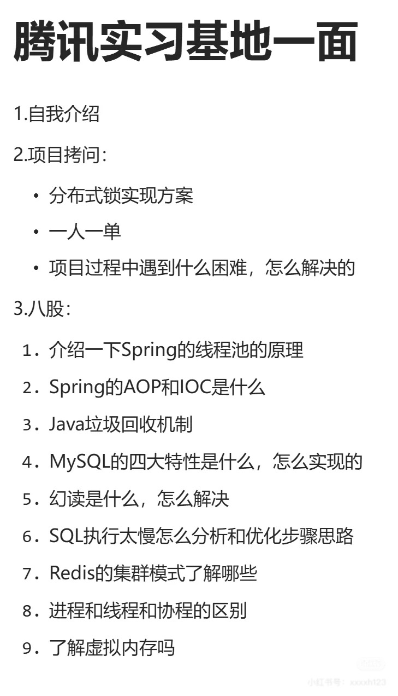
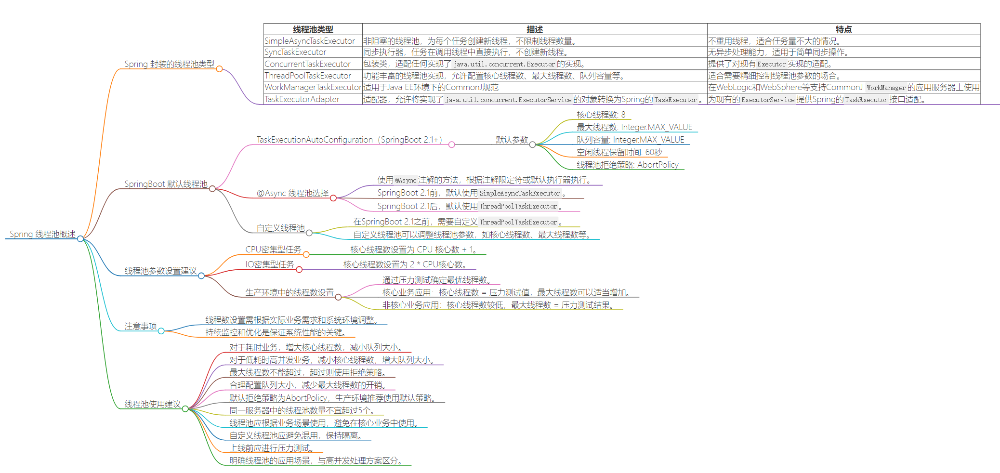

# <center>第二套</center>

> 题源 : 腾讯实习基地 1 面


## 一面 



### Q1 Spring 的线程池的原理是什么？

Spring 线程池相对于 Java 内置的线程池来说提供了更高级的线程池的管理功能，可以看成是一次升级。通常是通过 `TaskExecutor` 接口来实现的。

> 在 Spring 中的线程池更多的用在任务的异步和并发任务调度 两个方面

核心类:

- `TaskExecutor` : 这个是 Spring 提供的一个顶层接口，定义了异步执行任务的方法
- `ThreadPoolTaskExecutor` : 是 `TaskExecutor` 的一个实现类，是 Spring 提供的一个线程池的实现类
- `SimpleAsyncTaskExecutor` : 是 `TaskExecutor` 的另一个实现类，是一个简单的线程池实现类

Spring 线程池都是通过注解来驱动的，通过 `@EnableAsync`和`@Async` 注解来实现的自动使用线程池。

以一图蔽之 :




简单的来说就是,Spring 提供了的是默认的一些线程池的实现类，极大程度的方便了用户线程池的配置与使用。而且，由于考虑到Spring的异步任务调度，所以Spring的线程池的实现类都是实现了`TaskExecutor`接口的，这样就可以方便的进行任务的调度。相关的参数，我们只需要在 `application.yaml`
文件中进行配置即可，同时利用注解进行驱动。 

那么既然这样，Java默认的线程池好用吗？有以下的缺点:

- 资源耗尽风险，因为最大线程数是 `Integer.MAX_VALUE`，如果不设置的话，可能会导致资源耗尽.也就是说在高并发的情况下，很有可能会出现资源耗尽的情况。

- 简单暴力的拒绝策略，如果线程池满了，那么就会采用默认的拒绝策略，这个策略是直接抛出异常，这样就会导致任务的丢失。这个是我们不希望看见的。

- 队列无限增长
- 缺乏灵活性和控制

### Q2 Spring 的AOP和IOC是什么？


#### IOC 
首先是 IOC (Inversion of Control) 控制反转，是一种设计模式，表示的是对象的创建、管理和生命周期交给外部容器进行控制。在 Spring 框架中我们把这些管理的任务交给了容器来处理，我们只需要每次通过 SPring容器进行对象的获取，而不是需要自己去创建和管理它们。

一个简单的例子:
```java
@Component
public class MyService {
    private final MyRepository myRepository;

    @Autowired
    public MyService(MyRepository myRepository) {
        this.myRepository = myRepository;
    }
}
```

在这个例子中，我们可以看到 `MyService` 类中的 `MyRepository` 是通过 `@Autowired` 注解来进行注入的，这个注解就是 Spring IOC 的体现。我们不需要自工手动的去创建 `MyRepository` 对象，而是通过 Spring 容器来进行管理。

#### AOP

Aspect-Oriented Programming 面向切面编程

[具体的讲解](https://www.zhihu.com/question/344440064/answer/2518464038?utm_psn=1875174507670552577)


简单的来说就是，我们想实现对于业务代码逻辑的 **零侵入增强**，用以前的老方法就不行了，不管是继承，还是使用通用的 `Utils` 类的静态方法的抽取，都无法做到真正的零侵入。但是AOP可以做到这一点，我们把和核心业务代码无关但有用且冗余的代码抽离开来，配合上切入点表达式和通知，就构成了一个 `Aspect` 切面。然后根据切面对于目标方法的增强描述，在编译期或者运行是很好进行无侵入增强。


```java

@Aspect
public class UserAspect{

    // 注明了我们需要切入的点，是 UserService 中的所有方法 
    @Pointcut("execution(* com.example.demo.service.UserService.*(..))")
    public void point() {}
    
    // 在方法执行之前执行
    @Before(value = "point()")
    public void beforeRun(){
        System.out.println("before run");
    }


    // 在方法执行之后执行
    @After(value = "point()")
    public void afterRun(){
        System.out.println("after run");
    }
}
```


