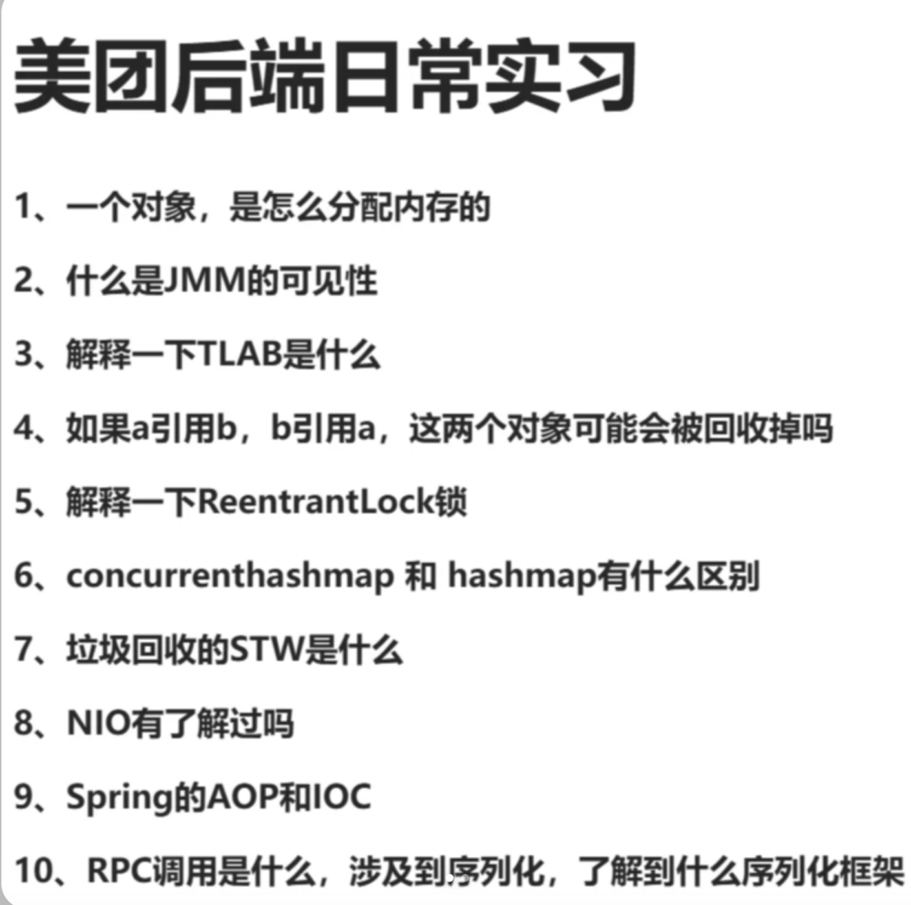

# <center>第三套</center>

> 美团后端实习 1 面





### Q1 一个对象，是怎么分配内存的？

首先，我们知道的是分配对象的位置是在 **堆** 上进行分配的。然后我们来详细介绍一下Java的分配对象的流程.

1. 检查类的元信息，确定对象的大小

    JVM 会先检查对象所属的类是否被加载了，解析了，正确的初始化了.如果没有被加载，那么就会先加载这个类。然后确定对象的大小。

2. 分配内存

    - JVM会对新对象分配内存，具体的分配方式取决于GC策略
    - 内存通常会从Heap中分配，堆有不同的区域
    - 对象通常会分配在新生代，但是如果是大对象，可能会直接分配在老年代。因为不太容易被回收，存活时间长。
3. 初始化零值

    分配的内存空间会被清零，保证对象的初始值是0/false/null

4. 设置请求头

    JVM会设置对象的请求头，包括对象的元数据信息，比如对象的哈希码，对象的GC信息等等

5. 执行构造方法 最终返回对象引用

#### 补充 : 内存分配策略

- **指针碰撞**，适用于没有那么多碎片的情况，堆上的内存空间比较连续的时候，这种方式会比较高效

- **空闲列表**，适用于内存不规整的堆，维护一个空闲块列表。这种的分配速度就比较慢


当然 JVM 也会有时候避免分配到堆上，从而提高性能。

(1) 栈上分配

通过 **逃逸分析** 如果JVM检测到了对象不会逃逸出方法，可以直接在栈上分配对象，方法执行完，栈帧销毁的时候，对象也会随之释放。

> **对象逃逸** : 指的是一个对象是否能在方法外或者线程的作用范围之外，被其他地方引用。

举个例子 

```java
public class Test{
    private static User globalUser;

    public void storeUser(){
        globalUser = new User();
    }
}
```
上面这个例子就是对象逃逸的例子，User对象的引用被储存到了 `globalUser` 这个全局变量中了，它可以被其他的方法或线程中被访问，因此就逃逸了。


JVM 通过 **逃逸分析**来判断对象是否会逃逸，并进行优化。

1. 栈上分配,如果 JVM 发现某个对象不会逃逸出方法范围，那么它可能会直接在栈上分配，而不是堆上分配，这样可以避免垃圾回收。
2. **标量替换** 对象数据可能被拆解，直接存在栈上的局部变量中，而不需要创建完整的对象。
3. **同步去除** 去除不必要的锁，提高效率。

(2) TLAB (Thread Local Allocation Buffer) 线程本地分配缓冲区

每个线程会在堆中预分配以小小块区域，对象创建时直接在 TLAB 内分配，减少同步开销，提高分配速度。对于小对象是比较有用的。 **如果是大对象的话，还是需要走常规的堆分配。**


### Q2 说一下什么是 JMM 的可见性?

因为在 Java 的多线程编程中，多个线程可能会同时访问和修改同一个共享变量。如果一个线程对共享变量进行了修改，另一个线程是否能够**立即看到**这个修改，取决于 JMM 的可见性机制。


举个例子 
```java
class Counter{
    private int count = 0;

    public void increase(){
        count++;
    }

    public int getCount(){
        return count;
    }
}
```

如果有两个线程同时调用 `increase` 方法，那么就会出现问题，因为 `count++` 操作并不是原子操作，它是分为三步的。**JMM**问题的根源就是在与 CPU 的缓存与寄存器机制。因为为了提高性能，现代CPU和操作系统的每个核心上都会有缓存机制，当一个线程修改了共享变量的值，但可能只是线程的本地缓存更新了，其他线程的缓存可能还会保持着旧值。


而为了解决这个问题，JMM中会有几个机制来帮助解决:

- 主内存和工作内存的同步 -> 主内存（各个线程共享的内存区域）/ 工作内存 每个线程都有自己的工作内存，线程对共享变量的所有操作都在工作内存中进行的，不直接在主内存中进行。

- volatile 关键字 -> 保证了可见性，禁止指令重排序 

    主要就是确保了一个线程对变量的修改立即会更新到主内存,而不是在工作内存中进行修改。其他线程可以立即看到这个变化。有点类似一个共享变量池的概念，每个线程都会从这个池子中读取变量的值。

- Synchronized 关键字 -> 保证了可见性，禁止指令重排序，同时也保证了原子性

    通过加锁的方式，保证了同一时刻只有一个线程可以访问共享变量，其他线程需要等待。这样就保证了可见性和原子性。


### Q3 请你说一下 TLAB 是什么?
我们首先知道的是在JVM的内存模型中，各个线程都是公用内存的，也就是说都会在堆里进行分配对象。同时一开始 除非是大对象，不然都是会分配到新生代的区域内。但这样就会有一个问题，在多核心多线程的时候，难以避免的就是会导致线程之间的竞争关系。

那么一个很自然的想法就是进行线程本地的内存分配，我们为每个线程单独在堆空间里分配一部分用来给某个线程专门的进行对象的分配。这样就可以避免线程之间的竞争关系，提高了分配的效率。**每个线程都会优先在属于自己的TLAB区域内进行对象的分配**，从而保证了各个线程之间互不干扰。等分配满了之后，就可以再次去堆上申请一块新的 TLAB 区域。

TLAB 的大小通常是几百KB,可以通过参数 `-XX:TLABSize` 来设置。


### Q4 如果 a 引用 b,b 引用 a，这两个对象可能会被回收掉吗？

对于 JVM 中的GC 回收机制，有一种已经过时的机制：

- 引用计数法 ： 倘若使用这种方式的话，那么就是互相循环引用的对象就不会被回收掉，因为他们的引用计数一直是 **1**
- 可达性分析法 ： 这种方法是现在比较常见的方法，通过建立有向图，并且遍历来进行对象引用的可达性分析，来判断是否可以回收这个对象。那么互相引用的情况就会不符合可达性分析，所以就可以被回收掉。

### Q5 解释一下 ReentrantLock 锁

首先 `ReentrantLock` 的含义是重入锁。举个例子，一个线程可以支持多次获取同一个锁，或者换种说法就是当一个线程已经获取了共享资源，那么在释放此资源之前，可以再次获得资源。一个很简单的情况就是递归调用。一般情况下，重入锁都是针对于独占锁的。也就是说如果其他的线程想要获取这个共享资源，需要等到某个占用这个共享资源的线程释放完毕所有的占用次数之后，才可以进行调用。


### Q6 concurrentHashMap 和 HashMap 有什么区别？

最大的区别就是 前者是线程安全的，但是后者是线程不安全的。concurrentHashMap是在 HashMap的基础上，支持并发访问。


### Q7 垃圾回收的 STW 是什么？

`STW` 是指 `Stop the world`，暂停世界，是指JVM会暂停应用程序的执行，直到垃圾回收过程完成。

为什么需要 `STW` 呢？ 
- `内存一致性` : 在 GC 过程中，JVM必须保持内存一致性，以避免出现正在使用的对象被回收，或者对象在回收的过程中被修改的情况。为此 JVM 会暂停应用程序的执行，防止线程在垃圾回收期间修改对象的状态。
- `GC复杂性` : 垃圾回收器必须对堆中的所有对象进行操作啊，可能涉及标记、清理、压缩、整理等操作，在这些过程中如果线程继续的话，可能会影响GC的正确性和效率。因此垃圾回收期间，应用程序线程会被暂停、直到回收结束。


#### STW 发生的时间
> STW 的发生时间和回收算法有很大的关系