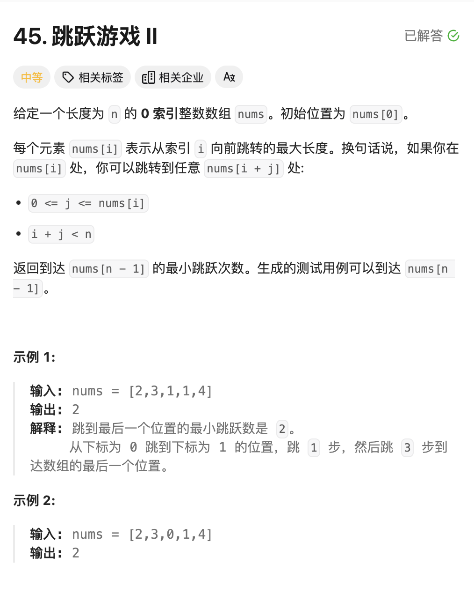

# **<center>LeetCode记录W1</center>**

## 10月14日 
### - **[动态规划]** **Hot100 279**
<a href = "https://leetcode.cn/problems/perfect-squares/?envType=study-plan-v2&envId=top-100-liked"> 题目来源</a>


```cpp
class Solution {
public:
    int a[10000]={0};
    int numSquares(int n) {
        int m = (int)sqrt(n);
        if(m*m == n)
            return 1;
        for(int i=1;i<=m;i++){
            a[i*i] = 1;
        }
        for(int i=2;i<=n;i++){
            m = (int)sqrt(i);
            // i is square number;
            if(m*m==i)
                continue;
            else{
                // 往前遍历 看看是否存在
                a[i] = 10000;
                for(int j=m;j>=1;j--){
                    if(a[j*j]+a[i-j*j]<a[i])
                        a[i] = a[j*j]+a[i-j*j];
                }
            }
        }
        return a[n];
    }
};
```

#### **题解：**
我们这里考虑**动态规划**，因为对于一个任意给定的`n`,我们都存在多种对于完全平方数的组合，那么怎么样才能知道最小的组合数呢？就需要动态规划了，我们定义一个表，当前`a[i]`中记录的就是最小的组合数目，好处是我们之后可以直接调用，可以免去很多的重复步骤。然后，我们对于$[1,m]$的每个表元素进行遍历。有点类似爬楼梯，为了方便理解，我们举个例子，`numSquare(12)`的求法。一开始我的错误思路是利用贪心，距离$12$最近的完全平方数是$9$，那么我就错误的以为$12$的最小组合就是$a[9]+a[3]$的次数.但其实他可以是$a[4]+a[4]+a[4]=3$
也就是有以下的状态转移方程：
$a[i] = \min\{a[j*j]+a[i-j*j]\}$
接下来的就简单了。

总结一下 这题就是 **动态规划**，目的是要找到状态转移方程，以及时间复杂度的话是近似成$O(N^\frac{3}{2})$
$∫_1^n​f(x)dx≤\sum_{i=1}^n​f(i)≤∫_0^n​f(x)dx$


### - **[动态规划]** **Hot100 322**

<a href = "https://leetcode.cn/problems/coin-change/?envType=study-plan-v2&envId=top-100-liked"> 题目来源</a>

 


```cpp
class Solution {
public:
    int coinChange(vector<int>& coins, int amount) {
        if(amount == 0)
            return 0;
        sort(coins.begin(),coins.end());
        int a[amount+1];
        for(int i=0;i<=amount;i++)
            a[i]=-1;
        a[0] = 0;
        int index,q;
        int m = coins.size();
        for(q=0;q<m&&coins[q]<=amount;q++){
            if(amount==coins[q])
                return 1;
            a[coins[q]]=1;
        }
        // index 记录的是coins中不大于的最大索引坐标;
        index = q-1;
        for(int i=1;i<=amount;i++){
            if(a[i]==1)
                continue;
            else{
                int min = 10001;
                for(int j=0;j<=index&&coins[j]<i;j++){
                    if(a[coins[j]]==-1||a[i-coins[j]]==-1)
                        continue;
                    if(a[coins[j]]+a[i-coins[j]]<min)
                        min = a[coins[j]]+a[i-coins[j]];
                }
                if(min!=10001)
                    a[i]=min;
            }
        }
        return a[amount];
    }
};
```

####  **题解**
准确的来说，这题很简单，跟上一题就是一个模子里刻出来的，所以就不需要再赘述了。比较值得注意的是，**这题有一个$-1$也就是不存在的情况记得考虑一下**。别的没有问题了就。


### - **动态规划** Hot100 T2 杨辉三角


```cpp
class Solution {
public:
    vector<vector<int>> generate(int numRows) {
        vector<vector<int>> result;
        result.push_back({1});
        result.push_back({1,1});
        // initial;
        if( numRows == 1)
            return {{1}};
        else if(numRows==2)
            return result;
        for(int i=2;i<numRows;i++){
            // The number of this level elements number;
            int num = i+1;
            vector<int> tmp;
            tmp.resize(num);
            tmp[0] = 1;
            for(int j=1;j<num-1;j++){
                tmp[j] = result[i-1][j-1]+result[i-1][j];
            }
            tmp[num-1] = 1;
            result.push_back(tmp);
        }
        return result;
    }
};
```

#### **题解**
杨辉三角，我们简单的看题目，可以知道，主要是看杨辉三角的简单状态转移方程，就是:

$temp[j] = result[i-1][j-1] + result[i-1][j]$ 
然后就是三角的周边都补上`1`即可。


### - **动态规划** Hot100 T3 打家劫舍


#### **题解1** 
##### 时间复杂度是$O(N)$ 

```cpp
class Solution {
public:
    int rob(vector<int>& nums) {
        int num = nums.size();
        if(num==1)
            return nums[0];
        else if(num == 2)
            return max(nums[0],nums[1]);
        vector<int> money;
        money.resize(num);
        money[0] = nums[0];
        money[1] = max(nums[0],nums[1]);
        for(int i=2;i<num;i++){
            // 可以选择不偷前一个房间
            money[i]=max(nums[i]+money[i-2],money[i-1]);
        }
        return max(money[num-1],money[num-2]);
    }
};

```
主要的思路是，就是我们设置的这个$money$数组的定义的区别，我们这个设置的是遍历到 $money[i]$ 的时候，表示的是遍历到这个房间的时候，我们已经获得的最大money数（包括自己）。
那么我们就很容易的得到状态转移方程：

$$ money[i] = \max\{nums[i]+money[i-2],money[i-1]\} $$

因为我们选择了自己`i`这个房间，那么只能考虑 `i-2`这个房间了，或者我们`i-1` 这个最优解。那么我们到最后的一个房间的时候，就自然是最优的。


#### 题解2 
##### 时间复杂度 $O(N^2)$

```cpp
class Solution {
public:
    int rob(vector<int>& nums) {
        int num = nums.size();
        vector<int> money;
        money.resize(num);
        money[0] = nums[0];
        money[1] = nums[1];
        for(int i=2;i<num;i++){
            // 可以选择不偷前一个房间
            int max = -1;
            for(int j = i-2;j>=0;j--){
                if(money[j]>max)
                    max = money[j];
            }
            money[i]=nums[i]+max;
        }
        return max(money[num-1],money[num-2]);
    }
};
```
主要的思路是，就是我们设置的这个$money$数组的定义的**区别**，我们这个设置的是遍历到 $money[i]$ 的时候，**表示的是一定会选择了自己这个房间并且**遍历到这个房间的时候，我们已经获得的最大money数（包括自己）。
那么我们就很容易的得到状态转移方程：

$$ money[i]=nums[i]+max\{money[i-2]\}$$

因为我们选择了自己$i$这个房间，那么只能考虑 `i-2`这个房间了。所以我们最终的答案就是这个基础上的最后两个房间的取最大值即是我们的最终需要的答案。

## 10月16日
### - 贪心算法 Hot100 T2 跳跃游戏

<a href = "https://leetcode.cn/problems/jump-game/description/?envType=study-plan-v2&envId=top-100-liked"> 题目来源</a>


```cpp
class Solution {
public:
    bool canJump(vector<int>& nums) {
        vector<int> distance;
        int len = nums.size();
        if(len==1)
            return true;
        for(int i =0;i<len;i++){
            // temp represents that the next boundary position that we can jump;
            distance.push_back(nums[i]+i);
        }
        int index = 0;
        for(int j=0;j<=len-2;){
            // The case that after we update the array, we get the destination, avoid ;
            if(distance[j]>=len-1)
                return true;
            int max = distance[j];
            for(int p = j+1;p<=distance[j];p++){
                if(distance[p]>max){
                    index = p;
                    max = distance[p];
                }
            }
            if(distance[j]==max)
                break;
            j = index;
        } 
        return false;
    }
};
```

#### 题解
我们这题主要是贪心算法。我们首先定义一个$distance$数组，他的作用是记录每一个位置$i$，所能跳到的最大位置。我们首先进行一遍遍历。然后按顺序依次遍历从该点开始到能跳跃的最大距离的过程中寻找下一个能跳跃的最大距离，依次往复，我们模拟跳跃的过程，这其中其实就是运用了贪心的算法，**选取当前状态中能跃迁的最大值进行跳跃。**


### - 贪心算法 Hot100 T3 跳跃游戏II


<a href = "https://leetcode.cn/problems/jump-game-ii/?envType=study-plan-v2&envId=top-100-liked">题目来源</a>


#### 题解
这题就更简单了。在上一题的基础上加一个`count`作为记录跳跃次数即可。**over**


### 10月20日
<a href = "https://leetcode.cn/problems/subarray-sum-equals-k/description/?envType=study-plan-v2&envId=top-100-liked">题目来源 </a>


#### 这题 我们提供两种解法:
#### 题解1 暴力搜索
##### 时间复杂度$O(N^2)$
```cpp
class Solution {
public:
    int subarraySum(vector<int>& nums, int k) {
        int size = nums.size();
        vector<int>result;
        result.resize(size);
        int count = 0;
        result[0] = nums[0];
        if(result[0]==k)
            count++;
        for(int i=1;i<size;i++){
            result[i] = result[i-1] + nums[i];
        }

        for(int i = 1;i<size;i++){
            int temp = result[i];
            for(int j = 0;j<=i;j++){
                if(temp==k)
                    count++;
                temp -= nums[j];
            }
        }
        return count;
    }
};
```

##### 思路：
暴力搜索的思路就是，就是遍历每一个组合$(i,j)$的子数组和，查看是否存在等于$k$的子数组。那么我们有递推式。

$$
result[i] =
\begin{cases} 
result[i-1] + nums[i] & \text{if } i > 0 \\
nums[0] & \text{if } i = 0 
\end{cases}
$$

一开始我的思路是开了一个$N*N$的数组，但是这样在跑测试的时候，内存超了。所以我们换思路，仅开一个$O(N)$的数组，然后利用递推式来验证是否为$k$.跑是跑通了，但还是花费了 $\frac{N*(N-1)}{2}$的时间，$O(N^2)$的时间还不是最优的。

#### 题解2 前缀和+哈希表优化
##### 时间复杂度 $O(N)$

```cpp
class Solution {
public:
    int subarraySum(vector<int>& nums, int k) {
        // mp 记录的是 截止 i 的前缀和
        unordered_map<int,int>mp;
        mp[0] = 1;
        int pre = 0,count = 0;
        for(int &num : nums){
            pre+=num;
            if(mp.find(pre-k)!=mp.end()){
                count+=mp[pre-k];
            }
            mp[pre]++;
        }
        return count;
    }
};

```

#### 思路
思路其实一开始的时候想到了，因为做过类似 **两数之和**的题目，这里也是一样，我们从左往右遍历，可以得到这样一个递推式：
$pre[j] - pre[i-1] == k$这个是我们要判断的式子，而$pre[j]$表示的就是$(0,j)$的前缀和，我们将上述的式子进行变换，得到下述的内容：
$pre[j]-k == pre[i-1]$
其实就很自然的想到是否存在问题使用哈希表，我们可以立马的得到用一个$mp$来存放。举个例子，当我们有这样的一串数组$\{1,2,3\},k=5$
那么我们就有

| i   | $pre[i]$ | $pre[i]-k$   |是否查到$mp[pre[i]-k]$|
|:---------:|:--------:|:---------:|:----:|
|  0    | 1    | -4    |Nope|
| 1    | 3    | -2    |Nope|
| 2   | 6    | 1    |**Find!**|

|k|mp[k]|
|:---:|:---:|
|0|1|
|**1**|**1**|
|3|1|

我们看上述的加黑例子，就是找到$\{2,3\}$这个和为$5$的子数组。


<style>
img {
  display: block;
  margin-left: auto;
  margin-right: auto;
  width : 80%;
  border-radius: 15px; /* 将图片设置为圆形 */
  
}
</style>