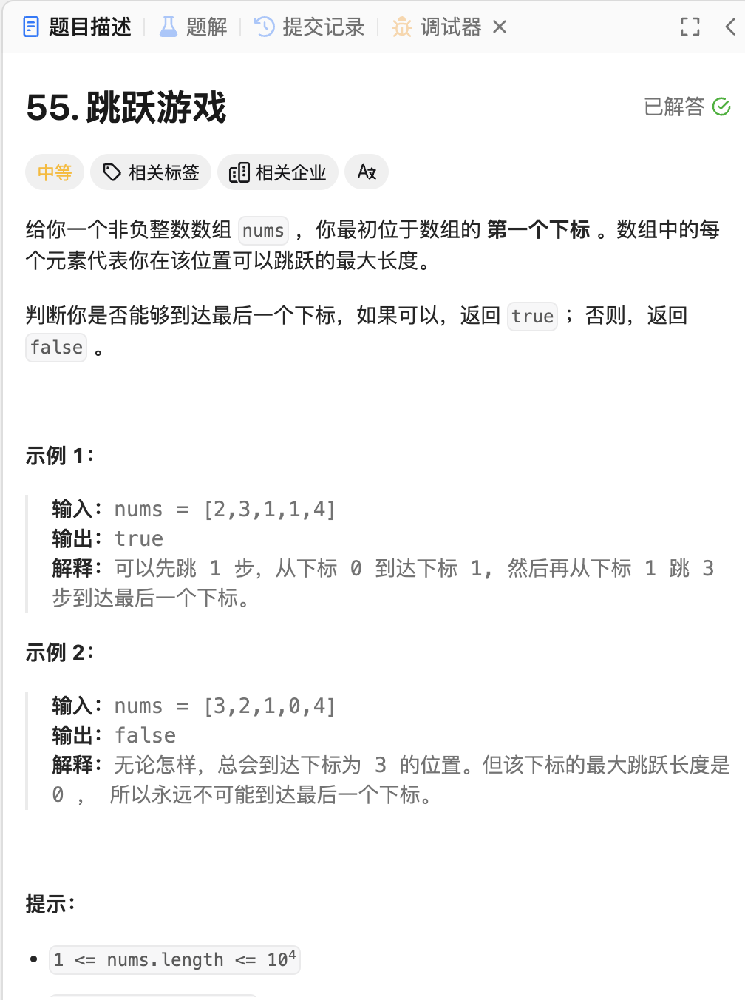
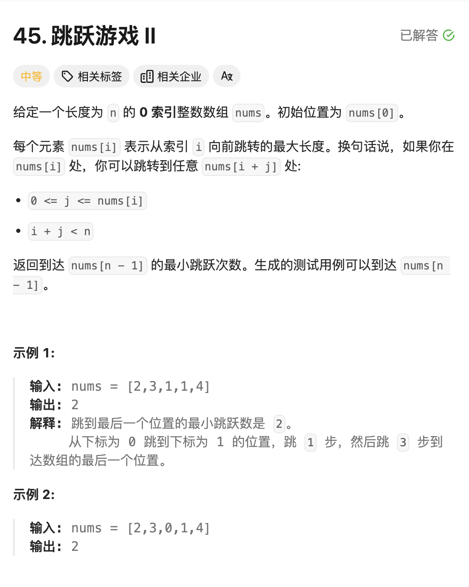

# <center>贪心算法</center>

## Introduce

贪心算法，字面意思就是选取当前状态下的最优解，也就是本地最优解`local optimal solution`
> 下面是 `wiki` 的定义:
> 
> A greedy algorithm is any algorithm that follows the problem-solving heuristic of making the locally optimal choice at each stage.[1] In many problems, a greedy strategy does not produce an optimal solution, but **a greedy heuristic can yield locally optimal solutions** that approximate a globally optimal solution in a reasonable amount of time.

> For example, a greedy strategy for the travelling salesman problem (which is of high computational complexity) is the following heuristic: "At each step of the journey, visit the nearest unvisited city." This heuristic does not intend to find the best solution, but it terminates in a reasonable number of steps; finding an optimal solution to such a complex problem typically requires unreasonably many steps. 


## 例题
### 1 跳跃游戏

<a href = "https://leetcode.cn/problems/jump-game/description/?envType=study-plan-v2&envId=top-100-liked"> 题目来源</a>



#### 题解
我们这题主要是贪心算法。我们首先定义一个$distance$数组，他的作用是记录每一个位置$i$，所能跳到的最大位置。我们首先进行一遍遍历。然后按顺序依次遍历从该点开始到能跳跃的最大距离的过程中寻找下一个能跳跃的最大距离，依次往复，我们模拟跳跃的过程，这其中其实就是运用了贪心的算法，**选取当前状态中能跃迁的最大值进行跳跃。**

#### Code
```cpp
class Solution {
public:
    bool canJump(vector<int>& nums) {
        vector<int> distance;
        int len = nums.size();
        if(len==1)
            return true;
        for(int i =0;i<len;i++){
            // temp represents that the next boundary position that we can jump;
            distance.push_back(nums[i]+i);
        }
        int index = 0;
        for(int j=0;j<=len-2;){
            // The case that after we update the array, we get the destination, avoid ;
            if(distance[j]>=len-1)
                return true;
            int max = distance[j];
            for(int p = j+1;p<=distance[j];p++){
                if(distance[p]>max){
                    index = p;
                    max = distance[p];
                }
            }
            if(distance[j]==max)
                break;
            j = index;
        } 
        return false;
    }
};
```

### 2 跳跃游戏II

<a href = "https://leetcode.cn/problems/jump-game-ii/?envType=study-plan-v2&envId=top-100-liked">题目来源</a>


#### 题解
这题就更简单了。在上一题的基础上加一个`count`作为记录跳跃次数即可。**over**


