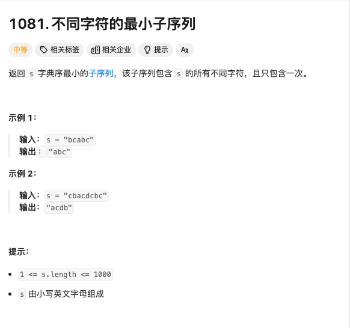

# <center>String</center>

> 本章主要讲述的就是各种常见的字符串有关的问题

Q1 :寻找字典序最小的字符串

我们对于处理这种问题，尤其是在处理名为 `字典序最小` 的时候，其实应该想到的是单调栈的问题，也就是说在一个连续的字符串中，找到那个最小的`i`,在`s[i]>s[i+1]` 的时候，并且删掉这个字符即可。


### 1 不同字符的最小子序列

<a href = "https://leetcode.cn/problems/smallest-subsequence-of-distinct-characters/description/?envType=company&envId=bytedance&favoriteSlug=bytedance-thirty-days">题目地址</a>




#### 题解

有了上面的总体思路，我们就知道了要在这样的字符串中寻找字典序最小的子序列，其实就是维护一个**单调栈**。它的目的就是存放从前往后遍历的字符串结果。我们每遍历一个字符，如果这个字符在**单调栈**中并没有出现过，就可以直接的加入栈中。否则的话需要进行条件判断。倘若这个字符比栈顶元素小，也就是出现了 `s[i] > s[i+1]` 的情况。我们就需要判断这个栈顶元素是否在后续的字符串中还会出现，倘若不再出现了，那我们就停止删除这个栈顶元素。否则的话我们就进行删除，并且添入刚遇到的这个字符。

#### Code
```cpp
class Solution {
public:
    string smallestSubsequence(string s) {
        int num[26];
        vector<int> visited(26);
        string res;
        for(auto c:s){
            num[c-'a']++;
        }
        int len = s.length();
        for(int i=0;i<len;i++){
            if(!visited[s[i]-'a']){
                while(!res.empty()&&res.back()>s[i]){
                    if(num[res.back()-'a']>0){
                        visited[res.back()-'a'] = 0;
                        res.pop_back();
                    }else{
                        break;
                    }
                }
                visited[s[i]-'a'] = 1;
                res.push_back(s[i]);
            }
            num[s[i]-'a']--;
        }
        return res;
    }
};
```


<style>
img{
    display : block;
    margin-left : auto;
    margin-right : auto;
    width : 85%;
    border-radius : 15px;
}
</style>
