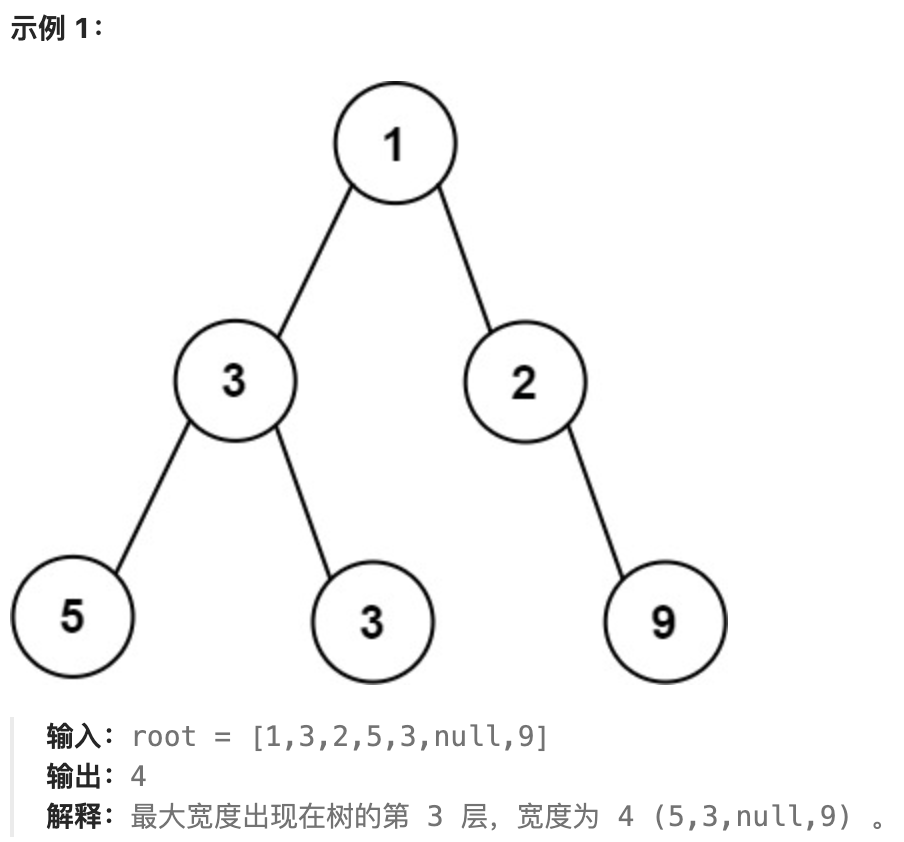

# <center>二叉树</center>

## 对于二叉树的常见几种解题策略
1. 递归
2. DFS
3. BFS

接下来，我们就围绕着这几点进行展开

## 例题
### 二叉树的最大宽度
> 题目来源字节

<a href = "https://leetcode.cn/problems/maximum-width-of-binary-tree/description/?envType=company&envId=bytedance&favoriteSlug=bytedance-thirty-days"> 题目来源</a>

给你一棵二叉树的根节点`root`，返回树的**最大宽度**。
树的**最大宽度**是所有层中最大的**宽度**。
每一层的**宽度**被定义为该层最左和最右的非空节点（**即，两个端点**）之间的长度。将这个二叉树视作与满二叉树结构相同，两端点间会出现一些延伸到这一层的`null`节点，这些`null`节点也计入长度。
题目数据保证答案将会在  `32 位` 带符号整数范围内。



**下面是简单的代码实现:**
```cpp
/**
 * Definition for a binary tree node.
 * struct TreeNode {
 *     int val;
 *     TreeNode *left;
 *     TreeNode *right;
 *     TreeNode() : val(0), left(nullptr), right(nullptr) {}
 *     TreeNode(int x) : val(x), left(nullptr), right(nullptr) {}
 *     TreeNode(int x, TreeNode *left, TreeNode *right) : val(x), left(left), right(right) {}
 * };
 */
class Solution {
public:
    int widthOfBinaryTree(TreeNode* root) {
        unsigned long long res = 1;
        vector<pair<TreeNode*, unsigned long long>>arr;
        arr.emplace_back(root,1L);
        while(!arr.empty()){
            vector<pair<TreeNode*,unsigned long long>>tmp;
            for(auto &[node,index]:arr){
                if(node->left)
                    tmp.emplace_back(node->left,index*2);
                if(node->right)
                    tmp.emplace_back(node->right,index*2+1);
            }
            res = max(res,arr.back().second-arr[0].second+1);
            arr = move(tmp);
        }
        return res;
       
    }

};
```
我们这题主要使用的是`BFS`来进行层序遍历，获得每一层的最左和最右边非`null`节点，从而获得每一层的宽度，依次遍历从而获得最大的二叉树宽度。
> 这里提一句，我们使用了 `move` 将`vector<pair<TreeNode* , unsigned long long>> tmp ` 复制给了 `res`

对于 `move` 可以参考  

<style>
img {
  display: block;
  margin-left: auto;
  margin-right: auto;
  width : 80%;
  border-radius: 15px; /* 将图片设置为圆形 */
  
}
</style>