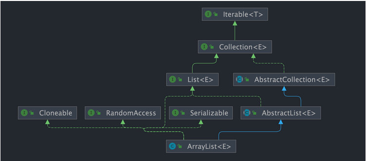

# <center>ArrayList</center>

> `ArrayList` 是一个 `List` 的实现类。这个链表是基于数组实现的，所以它的查询效率非常的高，但是插入和删除的效率就比较低了。`ArrayList` 是非线程安全的，如果需要线程安全的话，可以使用 `Vector` 或者是 `Collections.synchronizedList` 来进行包装。

## Introduce
首先，为什么需要有`ArrayList`? 

可能你会想，我们在`Java`中不是有`Array`了吗？为什么还需要`ArrayList`呢？ 

```java

public class Example{
    public static void main(String[] args){
        // Array
        int[] testArray = new int[10];
        
        // ArrayList
        ArrayList<Integer> testArrayList = new ArrayList<>();
    }
}
```

我们看上面的两个声明的数组，很明显的会发现前者是需要指定数组的大小的，但是后者不需要。这就是`ArrayList`的优势所在，它是一个动态数组，可以根据需要进行扩容。而`Array`是一个静态数组，一旦声明了大小，就不能进行扩容了。

同时我们还可以明确的一点是。它既然是一个`List`的实现类，那么它一定有它的优势。也就是它继承了很多个接口 `List` , `RandomAccess` , `Cloneable` , `Serializable`。这就意味着它可以进行随机访问，可以进行克隆，可以进行序列化等等。

```java

public class ArrayList<E> extends AbstractList<E>
        implements List<E>, RandomAccess, Cloneable, java.io.Serializable{

  }
```



## 源码分析

我们观察 `ArrayList` 的内部，会发现 `transient Object[] elementData` 这个数组。其实这里用了一个 `transient` 关键字。

- `transient` 关键字的作用:

    在编译的过程中告知编译器，这个变量不需要被序列化。也就是方便指明哪些不需要被序列化，以作区分。

我们主要围绕着 `ArrayList` 的扩容机制来进行分析，因为这个是和`Array`的最大区分。

### `ArrayList` 构造函数
> 首先是了解 `ArrayList` 的构造函数，我们能发现的是，它其实一开始是赋值了一个空数组，只有你往其中添加元素的时候，才会真的分配容量。

```java

// 下面是 ArrayList 的构造函数内部细节
/**
 * 默认初始容量大小
 */
private static final int DEFAULT_CAPACITY = 10;

private static final Object[] DEFAULTCAPACITY_EMPTY_ELEMENTDATA = {};

/**
 * 默认构造函数，使用初始容量10构造一个空列表(无参数构造)
 */
public ArrayList() {
    this.elementData = DEFAULTCAPACITY_EMPTY_ELEMENTDATA;
}

/**
 * 带初始容量参数的构造函数。（用户自己指定容量）
 */
public ArrayList(int initialCapacity) {
    if (initialCapacity > 0) {//初始容量大于0
        //创建initialCapacity大小的数组
        this.elementData = new Object[initialCapacity];
    } else if (initialCapacity == 0) {//初始容量等于0
        //创建空数组
        this.elementData = EMPTY_ELEMENTDATA;
    } else {//初始容量小于0，抛出异常
        throw new IllegalArgumentException("Illegal Capacity: " + initialCapacity);
    }
}


/**
 *构造包含指定collection元素的列表，这些元素利用该集合的迭代器按顺序返回
 *如果指定的集合为null，throws NullPointerException。
 */
public ArrayList(Collection<? extends E> c) {
    elementData = c.toArray();
    if ((size = elementData.length) != 0) {
        // c.toArray might (incorrectly) not return Object[] (see 6260652)
        if (elementData.getClass() != Object[].class)
            elementData = Arrays.copyOf(elementData, size, Object[].class);
    } else {
        // replace with empty array.
        this.elementData = EMPTY_ELEMENTDATA;
    }
}
```

简单的概括就是，我们在构造函数的时候，其实分为了三种情况:

- 我们直接利用无参构造函数,当使用无参构造函数的时候，就不会直接创建一个数组，而是使用了一个空数组。 **但是 JDK6 new 无参构造的 `ArrayList` 是直接初始创建了一个大小为10的数组**
- 我们指定了初始容量的构造函数
- 我们利用了`Collection`的构造函数，**值得注意的是，我们需要检查`elementData.getClass()!=Object[].class`** 这个是因为，`toArray()`方法可能会返回一个不是`Object[]`的数组。

### 常见的方法
#### `add(E e)` 

```java
public boolean add(E e){
    // 加元素之前，先调用ensureCapacityInternal方法
    ensureCapacityInternal(size + 1);  // Increments modCount!!
    // 这里看到ArrayList添加元素的实质就相当于为数组赋值
    elementData[size++] = e;
    return true;
}
```

- 返回值 : `boolean` , 如果添加成功，返回`true`，否则返回`false`。值得注意的是很多这种方法其实都是有返回值的，不能忽略。

这里有提到一个 `ensureCapacityInternal()`方法

#### `ensureCapacityInternal(int minCapacity)`

```java
// 根据给定的最小容量和当前数组元素来计算所需容量。
private static int calculateCapacity(Object[] elementData, int minCapacity) {
    // 如果当前数组元素为空数组（初始情况），返回默认容量和最小容量中的较大值作为所需容量
    if (elementData == DEFAULTCAPACITY_EMPTY_ELEMENTDATA) {
        return Math.max(DEFAULT_CAPACITY, minCapacity);
    }
    // 否则直接返回最小容量
    return minCapacity;
}

// 确保内部容量达到指定的最小容量。
private void ensureCapacityInternal(int minCapacity) {
    ensureExplicitCapacity(calculateCapacity(elementData, minCapacity));
}

//判断是否需要扩容
private void ensureExplicitCapacity(int minCapacity) {
    modCount++;
    //判断当前数组容量是否足以存储minCapacity个元素
    if (minCapacity - elementData.length > 0)
        //调用grow方法进行扩容
        grow(minCapacity);
}
```
简单的来说 `ensureCapacityInternal` 方法的作用就是判断当前数组的容量和我们已经规定的默认容量是否有超出，倘若超出了的话，就会进行扩容`grow()`.


注意区分两个参数:

- `minCapacity` : 传入的参数，表示我们需要的最小容量,也就是当前数组中需要存储的元素个数。
- `elementData.length` : 当前数组的长度，也就是当前数组的容量。


### `grow(int minCapacity)`

```java
/**
 * 要分配的最大数组大小
 */
private static final int MAX_ARRAY_SIZE = Integer.MAX_VALUE - 8;

/**
 * ArrayList扩容的核心方法。
 */
private void grow(int minCapacity) {
    // oldCapacity为旧容量，newCapacity为新容量
    int oldCapacity = elementData.length;
    // 将oldCapacity 右移一位，其效果相当于oldCapacity /2，
    // 我们知道位运算的速度远远快于整除运算，整句运算式的结果就是将新容量更新为旧容量的1.5倍，
    int newCapacity = oldCapacity + (oldCapacity >> 1);

    // 然后检查新容量是否大于最小需要容量，若还是小于最小需要容量，那么就把最小需要容量当作数组的新容量，
    if (newCapacity - minCapacity < 0)
        newCapacity = minCapacity;

    // 如果新容量大于 MAX_ARRAY_SIZE,进入(执行) `hugeCapacity()` 方法来比较 minCapacity 和 MAX_ARRAY_SIZE，
    // 如果minCapacity大于最大容量，则新容量则为`Integer.MAX_VALUE`，否则，新容量大小则为 MAX_ARRAY_SIZE 即为 `Integer.MAX_VALUE - 8`。
    if (newCapacity - MAX_ARRAY_SIZE > 0)
        newCapacity = hugeCapacity(minCapacity);

    // minCapacity is usually close to size, so this is a win:
    elementData = Arrays.copyOf(elementData, newCapacity);
}
```


我们接下来来看一下 `grow(int minCapacity)` 方法的具体实现。主要的思路就是 **通过位运算扩容成1.5倍** `newCapacity = oldCapacity + (oldCapacity>>1);` , 远远快于整数运算。

同时我们也要保证，我们的扩容不能超过 `MAX_ARRAY_SIZE`，这个是一个常量，表示数组的最大容量。如果超过了这个值，我们就需要调用 `hugeCapacity()` 方法来进行比较。


### `Arrays.copyOf()` 和 `System.arraycopy()` 方法

先来看一下 `System.arraycopy()` 方法

`native` 方法是指的是调用了本地方法，也就是说这个方法是由本地代码实现的，而不是由`Java`代码实现的。通常会调用一个本地方法来实现实际的数组复制操作。

```java
    // 我们发现 arraycopy 是一个 native 方法,接下来我们解释一下各个参数的具体意义
    /**
    *   复制数组
    * @param src 源数组
    * @param srcPos 源数组中的起始位置
    * @param dest 目标数组
    * @param destPos 目标数组中的起始位置
    * @param length 要复制的数组元素的数量
    */
    public static native void arraycopy(Object src,  int  srcPos,
                                        Object dest, int destPos,
                                        int length);
```


再来看一下 `Arrays.copyOf()`方法，是`java.util.Arrays`类中的一个静态方法，用于复制一个数组的指定部分，并且返回一个新的数组。不仅可以复制数组，还能对新数组的长度进行控制。

**倘若新数组的 `newLength` 的长度比原数组的长度长，我们就可以考虑多余的部分用默认值进行填充**

```java
public static int[] copyOf(int[] original, int newLength) {
      // 申请一个新的数组
        int[] copy = new int[newLength];
  // 调用System.arraycopy,将源数组中的数据进行拷贝,并返回新的数组
        System.arraycopy(original, 0, copy, 0,
                         Math.min(original.length, newLength));
        return copy;
    }
```


## 常见问题

### Q1:`ArrayList` 和 `Vector` 的区别
其实两者都是 `List` 的实现类，但是前者线程不安全，但是后者线程安全。

### Q2: `ArrayList` 和 `LinkedList` 的区别

- 是否保证线程安全 ? 
  
    二者都是线程不安全的，如果需要线程安全的话，可以使用 `Vector` 或者是 `Collections.synchronizedList` 来进行包装。

- 底层的数据结构 
    
    `ArrayList` 是基于数组实现的，所以它的查询效率非常的高，但是插入和删除的效率就比较低了。`LinkedList` 是基于**双向链表**实现的，所以它的插入和删除的效率非常的高，但是查询的效率就比较低了。


- 插入和删除是否受元素位置的影响：
    
    `ArrayList` 采用数组存储，所以插入和删除元素的时间复杂度受元素位置的影响。 比如：执行`add(E e)`方法的时候， `ArrayList` 会默认在将指定的元素追加到此列表的末尾，这种情况时间复杂度就是 `O(1)`。但是如果要在指定位置 `i` 插入和删除元素的话`（add(int index, E element)）`，时间复杂度就为 `O(n)`。因为在进行上述操作的时候集合中第 `i` 和第 `i` 个元素之后的`(n-i)`个元素都要执行向后位/向前移一位的操作。
    
    `LinkedList` 采用链表存储，所以在头尾插入或者删除元素不受元素位置的影响`（add(E e)、addFirst(E e)、addLast(E e)、removeFirst()、 removeLast()）`，时间复杂度为 `O(1)`，如果是要在指定位置 `i` 插入和删除元素的话`（add(int index, E element)，remove(Object o),remove(int index)）`， 时间复杂度为 `O(n)` ，因为需要先移动到指定位置再插入和删除。

### Q3: `ArrayList` 可以存放 `null` 吗？
可以的，因为它是一个泛型类，所以可以存放任何类型的数据。


### Q4: `Vector` 和 `Stack` 的区别

- `Vector` 和 `Stack` 两者都是线程安全，都是使用 `synchronized` 关键字来保证同步处理。

- `Stack` 继承自 `Vector`，所以它的底层实现也是基于数组的，但是它的方法都是同步的，所以它是线程安全的。

但是 `Stack` 现在已经被淘汰了，都是通过 `Deque` 来进行实现，因为 `Stack` 继承自 `Vector`，所以它的性能不是很好。