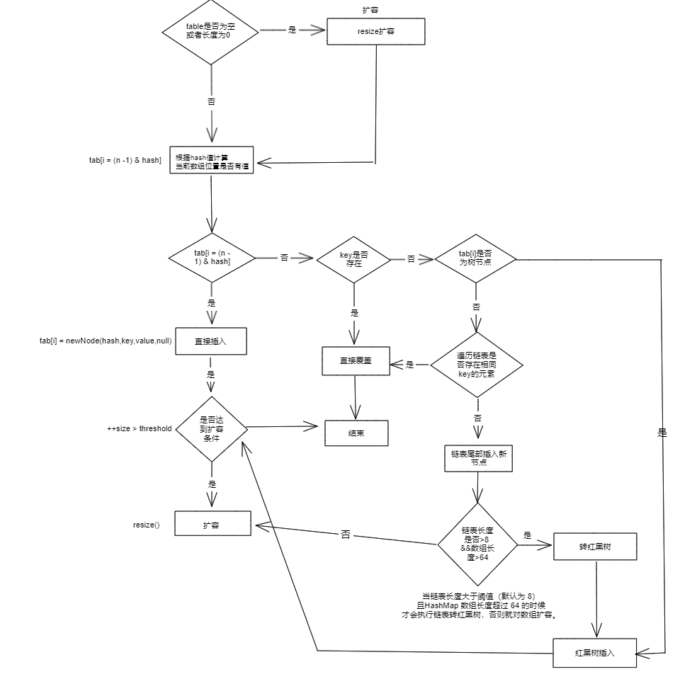

# <center>HashMap</center>

> HashMap 主要用来存放键值对，它是 基于HashMap的接口实现，常用的Java集合之一，但是 **它是非线程安全的**

几个需要注意的点: 

1. `HashMap` 可以储存 `null` 的键，但是只能有一个。`value` 可以有多个为 `null` 的值。

2. `JDK1.8` 之前的 `HashMap` 是利用 `拉链法` 来解决哈希冲突的，`JDK1.8` 之后。 也就是说主体还是数组，因为数组是查询效率最高的，但是如果遇到了哈希冲突的时候，我们就会选择利用链表或者是红黑树来解决。

**切换成红黑树进行操作有两个至关重要的条件:**

- 当某个元素的链表长度大于8的时候，也就是发生的哈希冲突的次数大于8次的时候，就会对此时的数组容量进行检查。

- 此时就会检查数组的长度是否大于64，如果小于64的话，就会进行扩容，扩容的时候会将链表转化成红黑树。**值得注意的是，我们是单个桶的转化，其他的桶照样是链表**


## HashMap 的内部成员变量

```java
public class HashMap<K,V> extends AbstractMap<K,V> implements Map<K,V>, Cloneable, Serializable {
    // 序列号
    private static final long serialVersionUID = 362498820763181265L;
    // 默认的初始容量是16
    static final int DEFAULT_INITIAL_CAPACITY = 1 << 4;
    // 最大容量
    static final int MAXIMUM_CAPACITY = 1 << 30;
    // 默认的负载因子
    static final float DEFAULT_LOAD_FACTOR = 0.75f;
    // 当桶(bucket)上的结点数大于等于这个值时会转成红黑树
    static final int TREEIFY_THRESHOLD = 8;
    // 当桶(bucket)上的结点数小于等于这个值时树转链表
    static final int UNTREEIFY_THRESHOLD = 6;
    // 桶中结构转化为红黑树对应的table的最小容量
    static final int MIN_TREEIFY_CAPACITY = 64;
    // 存储元素的数组，总是2的幂次倍
    transient Node<k,v>[] table;
    // 一个包含了映射中所有键值对的集合视图
    transient Set<map.entry<k,v>> entrySet;
    // 存放元素的个数，注意这个不等于数组的长度。
    transient int size;
    // 每次扩容和更改map结构的计数器
    transient int modCount;
    // 阈值(容量*负载因子) 当实际大小超过阈值时，会进行扩容
    int threshold;
    // 负载因子
    final float loadFactor;
}
```

我们逐个分析一下，首先它是一个继承了 `AbstractMap` 的类，实现了 `Map` 接口，同时也实现了 `Cloneable` 和 `Serializable` 接口。

- `Serializable` ： 实现了序列化接口意味着可以将`HashMap`对象储存到文件、数据库或者网络传输等操作中。同时也可以通过反序列化的方式将对象重新读取出来。

- `serialVersionUID` ： 序列号，用来标识类的版本，如果不显示的声明，编译器会自动生成一个序列号，但是这个序列号是根据类的内部细节生成的，如果类的内部细节发生了变化，那么序列号也会发生变化，这样就会导致反序列化失败。所以我们可以显示的声明一个序列号，这样就可以保证序列号不会发生变化。

- 定义了一些关于容量的参数，默认和最大
- 定义了一些关于树化的参数，比如树化的阈值，链表化的阈值，树化的最小容量

> loadFactor: 负载因子表示的数组存放数据的疏密程度，负载因子越大，数组中存放的数据越多，空间利用率高，但是查找效率降低，因为链表或者红黑树的长度会变长，负载因子越小，数组中存放的数据越少，空间利用率低，但是查找效率高，因为链表或者红黑树的长度会变短。

### 两类节点

#### `Node<K,V>` 

这个是 HashMap 中的默认存放元素的数组类型.

```java
// 继承自 Map.Entry<K,V>
static class Node<K,V> implements Map.Entry<K,V> {
       final int hash;// 哈希值，存放元素到hashmap中时用来与其他元素hash值比较
       final K key;//键
       V value;//值
       // 指向下一个节点,也就对应上了我们用链表来处理哈希冲突的情况
       Node<K,V> next;
       Node(int hash, K key, V value, Node<K,V> next) {
            this.hash = hash;
            this.key = key;
            this.value = value;
            this.next = next;
        }
        public final K getKey()        { return key; }
        public final V getValue()      { return value; }
        public final String toString() { return key + "=" + value; }
        // 重写hashCode()方法
        public final int hashCode() {
            return Objects.hashCode(key) ^ Objects.hashCode(value);
        }

        // 值得注意的是，这里的setValue()方法返回的是旧值
        public final V setValue(V newValue) {
            V oldValue = value;
            value = newValue;
            return oldValue;
        }
        // 重写 equals() 方法
        public final boolean equals(Object o) {
            if (o == this)
                return true;
            if (o instanceof Map.Entry) {
                Map.Entry<?,?> e = (Map.Entry<?,?>)o;
                if (Objects.equals(key, e.getKey()) &&
                    Objects.equals(value, e.getValue()))
                    return true;
            }
            return false;
        }
}
```

#### `TreeNode<K,V>` 红黑树的节点

```java
static final class TreeNode<K,V> extends LinkedHashMap.Entry<K,V> {
        TreeNode<K,V> parent;  // 父
        TreeNode<K,V> left;    // 左
        TreeNode<K,V> right;   // 右
        TreeNode<K,V> prev;    // needed to unlink next upon deletion
        boolean red;           // 判断颜色
        TreeNode(int hash, K key, V val, Node<K,V> next) {
            super(hash, key, val, next);
        }
        // 返回根节点
        final TreeNode<K,V> root() {
            for (TreeNode<K,V> r = this, p;;) {
                if ((p = r.parent) == null)
                    return r;
                r = p;
       }
```


## HashMap中的几个常见的方法


### HashMap 中的构造函数

HashMap中有四种构造函数，分别如下:
```java
    // 默认构造函数。
    public HashMap() {
        this.loadFactor = DEFAULT_LOAD_FACTOR; // all   other fields defaulted
     }

     // 包含另一个“Map”的构造函数
     public HashMap(Map<? extends K, ? extends V> m) {
         this.loadFactor = DEFAULT_LOAD_FACTOR;
         putMapEntries(m, false);//下面会分析到这个方法
     }

     // 指定“容量大小”的构造函数
     public HashMap(int initialCapacity) {
         this(initialCapacity, DEFAULT_LOAD_FACTOR);
     }

     // 指定“容量大小”和“负载因子”的构造函数
     public HashMap(int initialCapacity, float loadFactor) {
         if (initialCapacity < 0)
             throw new IllegalArgumentException("Illegal initial capacity: " + initialCapacity);
         if (initialCapacity > MAXIMUM_CAPACITY)
             initialCapacity = MAXIMUM_CAPACITY;
         if (loadFactor <= 0 || Float.isNaN(loadFactor))
             throw new IllegalArgumentException("Illegal load factor: " + loadFactor);
         this.loadFactor = loadFactor;
         // 初始容量暂时存放到 threshold ，在resize中再赋值给 newCap 进行table初始化
         this.threshold = tableSizeFor(initialCapacity);
     }
```

其实，我们仔细看这几种构造函数，就能发现他们对应的分别就是:

- 无参构造
- 有参构造
  
    - 利用已有的 `Map` 对象
    - 指定初始容量大小
    - 指定初始容量大小和负载因子
**HashMap中是没有 Capacity 这个字段的。只会将HashMap扩容到和Capacity 最接近的 $2^n$ 的容量**

#### `putMapEntries` 方法
我们在上面已经提及了有一种构造函数就是通过传入已知的一个`HashMap`来进行构造的，这个时候就会调用`putMapEntries`方法来进行处理。

```java
final void putMapEntries(Map<? extends K, ? extends V> m, boolean evict) {
    int s = m.size();
    if (s > 0) {
        // 判断table是否已经初始化
        if (table == null) { // pre-size
            /*
             * 未初始化，s为m的实际元素个数，ft=s/loadFactor => s=ft*loadFactor, 跟我们前面提到的
             * 阈值=容量*负载因子 是不是很像，是的，ft指的是要添加s个元素所需的最小的容量
             */
            float ft = ((float)s / loadFactor) + 1.0F;
            int t = ((ft < (float)MAXIMUM_CAPACITY) ?
                    (int)ft : MAXIMUM_CAPACITY);
            /*
             * 根据构造函数可知，table未初始化，threshold实际上是存放的初始化容量，如果添加s个元素所
             * 需的最小容量大于初始化容量，则将最小容量扩容为最接近的2的幂次方大小作为初始化。
             * 注意这里不是初始化阈值
             */
            if (t > threshold)
                threshold = tableSizeFor(t);
        }
        // 已初始化，并且m元素个数大于阈值，进行扩容处理
        else if (s > threshold)
            resize();
        // 将m中的所有元素添加至HashMap中，如果table未初始化，putVal中会调用resize初始化或扩容
        for (Map.Entry<? extends K, ? extends V> e : m.entrySet()) {
            K key = e.getKey();
            V value = e.getValue();
            putVal(hash(key), key, value, false, evict);
        }
    }
}
```

总的实现逻辑，其实就是分为两步:

- 是否需要扩容？是否装得下
- 将 `Map` 中的元素一个一个的放入 `HashMap` 中


接下来是 `HashMap` 中的一些常见的方法 :


1. `put` 方法
2. `get` 方法
3. `resize` 方法
4. `hash` 方法 

> 因为红黑树比较复杂，具体的实现细节就不展开了。

### ``put`` 方法



```java
public V put(K key, V value) {
    return putVal(hash(key), key, value, false, true);
}

/**
 * @param onlyIfAbsent 是否仅在键值不存在的时候进行插入
 * @param evict 是否在插入后删除最老的元素
 */
final V putVal(int hash, K key, V value, boolean onlyIfAbsent,
                   boolean evict) {
    Node<K,V>[] tab; Node<K,V> p; int n, i;
    // table未初始化或者长度为0，进行扩容
    if ((tab = table) == null || (n = tab.length) == 0)
        n = (tab = resize()).length;
    // (n - 1) & hash 确定元素存放在哪个桶中，桶为空，新生成结点放入桶中(此时，这个结点是放在数组中)
    if ((p = tab[i = (n - 1) & hash]) == null)
        tab[i] = newNode(hash, key, value, null);
    // 桶中已经存在元素（处理hash冲突）
    else {
        Node<K,V> e; K k;
        //快速判断第一个节点table[i]的key是否与插入的key一样，若相同就直接使用插入的值p替换掉旧的值e。
        if (p.hash == hash &&
            ((k = p.key) == key || (key != null && key.equals(k))))
                e = p;
        // 判断插入的是否是红黑树节点
        else if (p instanceof TreeNode)
            // 放入树中
            e = ((TreeNode<K,V>)p).putTreeVal(this, tab, hash, key, value);
        // 不是红黑树节点则说明为链表结点
        else {
            // 在链表最末插入结点
            for (int binCount = 0; ; ++binCount) {
                // 到达链表的尾部
                if ((e = p.next) == null) {
                    // 在尾部插入新结点
                    p.next = newNode(hash, key, value, null);
                    // 结点数量达到阈值(默认为 8 )，执行 treeifyBin 方法
                    // 这个方法会根据 HashMap 数组来决定是否转换为红黑树。
                    // 只有当数组长度大于或者等于 64 的情况下，才会执行转换红黑树操作，以减少搜索时间。否则，就是只是对数组扩容。
                    if (binCount >= TREEIFY_THRESHOLD - 1) // -1 for 1st
                        treeifyBin(tab, hash);
                    // 跳出循环
                    break;
                }
                // 判断链表中结点的key值与插入的元素的key值是否相等
                if (e.hash == hash &&
                    ((k = e.key) == key || (key != null && key.equals(k))))
                    // 相等，跳出循环
                    break;
                // 用于遍历桶中的链表，与前面的e = p.next组合，可以遍历链表
                p = e;
            }
        }
        // 表示在桶中找到key值、hash值与插入元素相等的结点
        if (e != null) {
            // 记录e的value
            V oldValue = e.value;
            // onlyIfAbsent为false或者旧值为null
            if (!onlyIfAbsent || oldValue == null)
                //用新值替换旧值
                e.value = value;
            // 访问后回调
            afterNodeAccess(e);
            // 返回旧值
            return oldValue;
        }
    }
    // 结构性修改
    ++modCount;
    // 实际大小大于阈值则扩容
    if (++size > threshold)
        resize();
    // 插入后回调
    afterNodeInsertion(evict);
    return null;
}
```

我们首先看，`put` 方法其实是由 `put+putVal` 方法组成的。具体的细节我们看 `putVal` 方法。

其实大体的逻辑思路就是 :

- 是否需要扩容
- 是否需要插入红黑树
- 插入元素

**因为是 HashMap 我们在对于 key 相同的键值存在的时候的处理办法选择的是直接覆盖**

- Step 1: 查看HashMap是否初始化，如果没有初始化，就进行初始化。也就是直接`resize`进行扩容

- Step 2: 确定元素存放在哪个桶里 `index = (n - 1) & hash`
    - 桶为空，则说明可以直接放入新的节点
    - 跳到Step3 进行判断
  
- Step3 : 因为桶中是有元素的，我们需要判断是否和`key`相同
    - 如果相同就直接覆盖
    - 如果不相同的话：**开始处理哈希冲突**
      - 如果是红黑树节点，就直接放入红黑树中即可 `e = ((TreeNode<K,V>)p).putTreeVal(this, tab, hash, key, value);`
      - 如果不是的话，我们就直接在链表的尾部进行插入新的节点，并且维护是否需要扩容/红黑树化的操作。

- Step4 : 覆盖旧值，我们上述的操作都是找到了对应的节点，然后进行了覆盖操作，最后返回旧值。
- Step5 : 结构性修改，如果实际大小大于阈值，则进行扩容操作。 

**Java的 LinkedHashMap 方法是用作LRU缓存的**


### `get` 方法

接下来分析 `get` 方法

```java
public V get(Object key) {
    Node<K,V> e;
    return (e = getNode(hash(key), key)) == null ? null : e.value;
}

final Node<K,V> getNode(int hash, Object key) {
    Node<K,V>[] tab; Node<K,V> first, e; int n; K k;
    if ((tab = table) != null && (n = tab.length) > 0 &&
        (first = tab[(n - 1) & hash]) != null) {
        // 数组元素相等
        if (first.hash == hash && // always check first node
            ((k = first.key) == key || (key != null && key.equals(k))))
            return first;
        // 桶中不止一个节点
        if ((e = first.next) != null) {
            // 在树中get
            if (first instanceof TreeNode)
                return ((TreeNode<K,V>)first).getTreeNode(hash, key);
            // 在链表中get
            do {
                if (e.hash == hash &&
                    ((k = e.key) == key || (key != null && key.equals(k))))
                    return e;
            } while ((e = e.next) != null);
        }
    }
    return null;
}
```

### `resize` 方法
```java
final Node<K,V>[] resize() {
    Node<K,V>[] oldTab = table;
    int oldCap = (oldTab == null) ? 0 : oldTab.length;
    int oldThr = threshold;
    int newCap, newThr = 0;
    if (oldCap > 0) {
        // 超过最大值就不再扩充了，就只好随你碰撞去吧
        if (oldCap >= MAXIMUM_CAPACITY) {
            threshold = Integer.MAX_VALUE;
            return oldTab;
        }
        // 没超过最大值，就扩充为原来的2倍
        else if ((newCap = oldCap << 1) < MAXIMUM_CAPACITY && oldCap >= DEFAULT_INITIAL_CAPACITY)
            newThr = oldThr << 1; // double threshold
    }
    else if (oldThr > 0) // initial capacity was placed in threshold
        // 创建对象时初始化容量大小放在threshold中，此时只需要将其作为新的数组容量
        newCap = oldThr;
    else {
        // signifies using defaults 无参构造函数创建的对象在这里计算容量和阈值
        newCap = DEFAULT_INITIAL_CAPACITY;
        newThr = (int)(DEFAULT_LOAD_FACTOR * DEFAULT_INITIAL_CAPACITY);
    }
    if (newThr == 0) {
        // 创建时指定了初始化容量或者负载因子，在这里进行阈值初始化，
    	// 或者扩容前的旧容量小于16，在这里计算新的resize上限
        float ft = (float)newCap * loadFactor;
        newThr = (newCap < MAXIMUM_CAPACITY && ft < (float)MAXIMUM_CAPACITY ? (int)ft : Integer.MAX_VALUE);
    }
    threshold = newThr;
    @SuppressWarnings({"rawtypes","unchecked"})
        Node<K,V>[] newTab = (Node<K,V>[])new Node[newCap];
    table = newTab;
    if (oldTab != null) {
        // 把每个bucket都移动到新的buckets中
        for (int j = 0; j < oldCap; ++j) {
            Node<K,V> e;
            if ((e = oldTab[j]) != null) {
                oldTab[j] = null;
                if (e.next == null)
                    // 只有一个节点，直接计算元素新的位置即可
                    newTab[e.hash & (newCap - 1)] = e;
                else if (e instanceof TreeNode)
                    // 将红黑树拆分成2棵子树，如果子树节点数小于等于 UNTREEIFY_THRESHOLD（默认为 6），则将子树转换为链表。
                    // 如果子树节点数大于 UNTREEIFY_THRESHOLD，则保持子树的树结构。
                    ((TreeNode<K,V>)e).split(this, newTab, j, oldCap);
                else {
                    Node<K,V> loHead = null, loTail = null;
                    Node<K,V> hiHead = null, hiTail = null;
                    Node<K,V> next;
                    do {
                        next = e.next;
                        // 原索引
                        if ((e.hash & oldCap) == 0) {
                            if (loTail == null)
                                loHead = e;
                            else
                                loTail.next = e;
                            loTail = e;
                        }
                        // 原索引+oldCap
                        else {
                            if (hiTail == null)
                                hiHead = e;
                            else
                                hiTail.next = e;
                            hiTail = e;
                        }
                    } while ((e = next) != null);
                    // 原索引放到bucket里
                    if (loTail != null) {
                        loTail.next = null;
                        newTab[j] = loHead;
                    }
                    // 原索引+oldCap放到bucket里
                    if (hiTail != null) {
                        hiTail.next = null;
                        newTab[j + oldCap] = hiHead;
                    }
                }
            }
        }
    }
    return newTab;
}
```
我们尽可能的要避免扩容，因为我们看上述的代码也能发现，扩容的时候会有很多的操作，比如说将原来的链表拆分成两个链表，或者是将红黑树拆分成两个红黑树。


### `Hash` 方法

hashMap 中的`Hash`方法并没有直接的使用 `hashcode`,而是利用了高低位异或的方式来进行的。


```java
    static final int hash(Object key) {
      int h;
      // key.hashCode()：返回散列值也就是hashcode
      // ^：按位异或
      // >>>:无符号右移，忽略符号位，空位都以0补齐
      return (key == null) ? 0 : (h = key.hashCode()) ^ (h >>> 16);
  }
```

从而提高了低位的随机性，使得`hash&(n-1)`计算出来的索引更加均匀分布,减少了哈希冲突的概率。


