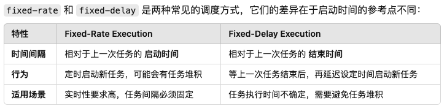

# <center>Timer</center>
> 这一章是为了学习 Java 的 Timer 类来写的，同时也来学习一下源码。

## Introduce
简单的了解一下 `Timer` 这个类的作用, `Timer` 类是用来执行计划任务的，它可以在指定的时间执行某一个任务，也可以在指定的时间开始执行某一个任务，还可以在指定的时间开始执行某一个任务，并且按照固定的速率重复执行。 

**但是 `Timer` 仅仅是按照需要执行的时间进行一个调度，但是没有考虑到优先级，因为可能会出现同一的执行时间下，进行相关的调度。**


```java
Timer timer = new Timer();
TimeTask task = new TimeTask(){
    public void run(){
        System.out.println("Hello World");
    }
};

// 延迟 1s 后执行
timer.schedule(task,1000);
// 延迟 1s 固定间隔 1s 周期打印一次
timer.schedule(task,1000,1000);
// 延迟 1s 固定速率每隔 1s 执行一次
timer.scheduleAtFixedRate(task,1000,1000);
```


## Timer 的实现原理

我们先来看一下 `Timer` 的内部结构
```java
public class Timer {

    // 任务队列
    private final TaskQueue queue = new TaskQueue();

    // 工作线程，循环取任务
    private final TimerThread thread = new TimerThread(queue);

    private final Object threadReaper = new Object() {
        protected void finalize() throws Throwable {
            synchronized(queue) {
                thread.newTasksMayBeScheduled = false;
                queue.notify(); // In case queue is empty.
            }
        }
    };

    // Timer的序列号，命名工作线程（静态变量，在启动多个Timer的情况可以用于区分对应的工作线程）
    private final static AtomicInteger nextSerialNumber = new AtomicInteger(0);  
}
```

我们先看一个 `Timer` 对象的内部定义，它有一个 `TaskQueue` 对象，一个 `TimerThread` 对象，一个 `threadReaper` 对象，一个 `nextSerialNumber` 对象。

- `TaskQueue` 对象是一个任务队列，用来存储任务，我们每创建一个任务就往任务队列中添加一个任务。因为我们要考虑并发的问题，所以我们需要对任务队列进行加锁。  

- `TimerThread` 对象是一个工作线程，它是一个循环取任务的线程，我们每次往任务队列中添加一个任务，它就会去取任务。因为我们需要管理这些任务线程。

- `threadReaper` 对象是一个线程回收器，它是一个内部类，用来回收线程的。

- `nextSerialNumber` 对象是一个静态变量，用来命名工作线程的，因为我们可能会启动多个 `Timer` 对象，所以我们需要对工作线程进行命名。


### `TaskQueue`

这里是有关 `TaskQueue` 的源代码
```java
class TaskQueue {

    private TimerTask[] queue = new TimerTask[128];

    private int size = 0;

    int size() {
        return size;
    }
    
    // 需要值得注意的是，每次我们添加一个任务元素的时候，都需要向上维护这个最小堆，因为是将它置于数组的末尾。
    void add(TimerTask task) {
        if (size + 1 == queue.length)
            queue = Arrays.copyOf(queue, 2*queue.length);

        queue[++size] = task;
        fixUp(size);
    }

    TimerTask getMin() {
        return queue[1];
    }

    TimerTask get(int i) {
        return queue[i];
    }

    void removeMin() {
        queue[1] = queue[size];
        queue[size--] = null;  // Drop extra reference to prevent memory leak
        fixDown(1);
    }

    /**
     * Here the quickRemove is used to remove the specific
     * task in the queue,but it do not guarantee the
     * order of the queue.
     */
    void quickRemove(int i) {
        assert i <= size;

        queue[i] = queue[size];
        queue[size--] = null;  // Drop extra ref to prevent memory leak
    }

    void rescheduleMin(long newTime) {
        queue[1].nextExecutionTime = newTime;
        fixDown(1);
    }

    boolean isEmpty() {
        return size==0;
    }

    void clear() {
        for (int i=1; i<=size; i++)
            queue[i] = null;

        size = 0;
    }

    // 向上维护这个最小堆 ;
    private void fixUp(int k) {
        while (k > 1) {
            int j = k >> 1;
            if (queue[j].nextExecutionTime <= queue[k].nextExecutionTime)
                break;
            TimerTask tmp = queue[j];  queue[j] = queue[k]; queue[k] = tmp;
            k = j;
        }
    }

    // 向下维护这个最小堆 ;
    private void fixDown(int k) {
        int j;
        while ((j = k << 1) <= size && j > 0) {
            if (j < size &&
                queue[j].nextExecutionTime > queue[j+1].nextExecutionTime)
                j++; // j indexes smallest kid
            if (queue[k].nextExecutionTime <= queue[j].nextExecutionTime)
                break;
            TimerTask tmp = queue[j];  queue[j] = queue[k]; queue[k] = tmp;
            k = j;
        }
    }

    void heapify() {
        for (int i = size/2; i >= 1; i--)
            fixDown(i);
    }
}


```

首先，我们观察`TaskQueue` 的源代码可以发现，这个其实就是一个以`execTime` 作为维护的变量的一个最小堆。我们需要保证他们按照执行时间进行排序。我们可以看到这里有一个`fixUp` 和 `fixDown` 方法，这两个方法就是用来维护这个最小堆的。这个最小堆同时也具有自动扩容的功能。


### `TimerThread`

首先来看这个类的内部组成
```java
class TimerThread extends Thread{
    boolean newTasksMayBeScheduled = true;

    private TaskQueue queue;

    TimerThread(TaskQueue queue){
        this.queue = queue;
    }
}
```

其实就是一个类，它用来维护执行那个任务队列。我们可以看到这个类是继承了`Thread` 接口，也就是说它是一个一直进行的线程。同时我们可以看到这个类有一个`newTasksMayBeScheduled` 变量，这个变量是用来控制是否可以添加新的任务的。也就是换句话说，其实就是一种告知我们已经启用了 `ThreadReaper` 这个线程了，作为`Timer`的对象清理处理程序。当计时器对象没有实时引用且计时器队列中没有任务时，这会导致执行线程优雅地退出。


然后继续来看这个类是怎么运行的 
```java
public void run() {
        try {
            mainLoop();
        } finally {
            // Someone killed this Thread, behave as if Timer cancelled
            synchronized(queue) {
                newTasksMayBeScheduled = false;
                queue.clear();  // Eliminate obsolete references
            }
        }
    }
private void mainLoop() {
        while (true) {
            try {
                TimerTask task;
                boolean taskFired;
                synchronized(queue) {
                    // Wait for queue to become non-empty
                    while (queue.isEmpty() && newTasksMayBeScheduled)
                        queue.wait();
                    if (queue.isEmpty())
                        break; // Queue is empty and will forever remain; die

                    // Queue nonempty; look at first evt and do the right thing
                    long currentTime, executionTime;
                    task = queue.getMin();
                    synchronized(task.lock) {
                        if (task.state == TimerTask.CANCELLED) {
                            queue.removeMin();
                            continue;  // No action required, poll queue again
                        }
                        currentTime = System.currentTimeMillis();
                        executionTime = task.nextExecutionTime;
                        if (taskFired = (executionTime<=currentTime)) {
                            if (task.period == 0) { // Non-repeating, remove
                                queue.removeMin();
                                task.state = TimerTask.EXECUTED;
                            } else { // Repeating task, reschedule
                                queue.rescheduleMin(
                                  task.period<0 ? currentTime   - task.period
                                                : executionTime + task.period);
                            }
                        }
                    }
                    if (!taskFired) // Task hasn't yet fired; wait
                        queue.wait(executionTime - currentTime);
                }
                if (taskFired)  // Task fired; run it, holding no locks
                    task.run();
            } catch(InterruptedException e) {
            }
        }
    }
```

我们来看上面的逻辑，其实就是分成了两步。

- 其实就是一直维护运行着`mainLoop`的循环，直到我们执行`finally`子句的时候，就会对`queue`上`synchronized`同步锁（任何想进入`synchronized(queue)`这个线程的代码块都会被阻塞），然后清空队列，然后退出线程。`synchronized(queue)`


#### `TimerTask`
> 我们先对 `TimerTask` 进行一个解释，`TimerTask` 是一个抽象类，它是一个任务类，我们可以继承这个类来实现我们的任务。

里面有几个值得注意的成员变量，来方便我们理解

- `period` 表示的其实就是我们的周期。如果`period == 0` 表示的是这个任务不会重复执行。如果`period>0` 表示的是这个任务会以固定的速率执行。如果`period<0` 表示的是这个任务会以固定的延迟执行。

    > Period in milliseconds for repeating tasks. A positive value indicates fixed-rate execution. A negative value indicates fixed-delay execution. A value of 0 indicates a non-repeating task.



同时，`TimerTask` 有几个状态常量需要注意:

- `static final int VIRGIN = 0` : 表示的是这个任务还没有被调度
- `static final int SCHEDULED = 1` : 表示这个任务已经被调度，特别的如果是单执行的任务，这个说明还没有被执行。我们这里的调度是指已经加入了任务队列。
- `static final int EXECUTED = 2` : 表示这个任务已经被执行了
- `static final int CANCELLED = 3` : 表示这个任务已经被取消了


下面继续看源代码
首先，这个 `mainLoop()` 主循环的逻辑是这样的：

- 先查看这个任务队列是否为空？如果为空，那么就会一直等待，直到有任务加入。除非已经 `newTasksMayBeScheduled` 为 `false`, 那么就会退出这个主循环。

- 由于`queue`是一个共享资源，也就是说很多线程都可能会同时来访问这个共享资源，会造成 竞态问题，所以我们选择了给`queue`加上同步锁，来避免线程冲突。

- 然后就是进行任务调度的阶段了
    - 我们取出执行时间最近的任务，来进行判断。
        -  如果取出的这个任务被取消了，那么就直接跳过这个任务。
        -  我们这里使用了一个 `taskFired` 变量，来作为标志，判断这个任务是否被触发了？
           - 倘若没有被触发，也就是执行时间在我们当前时间之后，那么就会等待这个任务的执行时间。
           - 倘若触发了，那么我们会通过判断这个任务的`period`来进行相应的逻辑处理。
               - 如果`period == 0` 表示的是这个任务不会重复执行，那么就会将这个任务从队列中移除。
               - 如果`period > 0` 表示的是这个任务会以固定的速率执行，那么就会重新调度这个任务。
               - 如果`period < 0` 表示的是这个任务会以固定的延迟执行，那么就会重新调度这个任务。


接下来来分析`Timer`的具体实现逻辑，因为有几个方法

### `schedule` 方法


#### `private void sched(TimerTask task, long time, long period)` 方法

```java
/**
 * Schedule for the task;
 */
private void sched(TimerTask task, long time, long period) {
        if (time < 0)
            throw new IllegalArgumentException("Illegal execution time.");

        // Constrain value of period sufficiently to prevent numeric
        // overflow while still being effectively infinitely large.
        if (Math.abs(period) > (Long.MAX_VALUE >> 1))
            period >>= 1;

        synchronized(queue) {
            if (!thread.newTasksMayBeScheduled)
                throw new IllegalStateException("Timer already cancelled.");

            synchronized(task.lock) {
                if (task.state != TimerTask.VIRGIN)
                    throw new IllegalStateException(
                        "Task already scheduled or cancelled");
                task.nextExecutionTime = time;
                task.period = period;
                task.state = TimerTask.SCHEDULED;
            }

            queue.add(task);
            if (queue.getMin() == task)
                queue.notify();
        }
    }
```

需要注意的是主要是进行几个边界处理

- `time<0` 防止添加的时间是一个负数，那么就会导致最小堆里永远都是这个任务，但是始终不会执行
- `period` 的绝对值不能太大，防止溢出
- `newTasksMayBeScheduled` 为 `false` 的时候，就会抛出异常，也就是说我们这个`Timer`对象已经进行了`clean`操作，那么就不能再添加任务了。

因为要防止其他的线程对当前要添入任务队列的任务进行操作，我们需要对这个任务进行加锁，然后进行相应的操作。同时因为`queue`是一个共享的资源，我们如果发现当前的任务最小值就是我们刚添入的任务，那么就会`queue.notify()`，告知其他正在等待消费的线程，我们已经添加了一个即将执行的任务。


#### `public void schedule(TimerTask task,Data firstTime, long period)` 

```java
public void schedule(TimerTask task, Date firstTime, long period) { 
    if (period <= 0) 
        throw new IllegalArgumentException("Non-positive period."); 
    sched(task, firstTime.getTime(), -period); 
}

```
  
... 后续的几个方法都类似，就不再赘述了。

