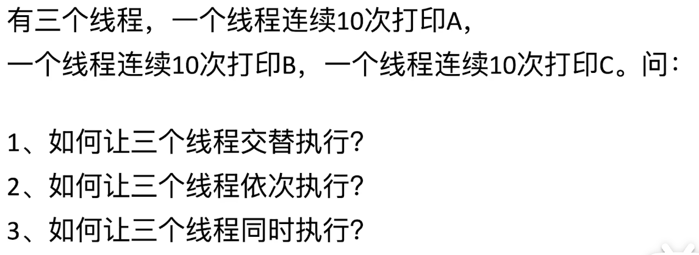

# <center>并发编程</center>
> 我们以 `Java` 语言为例，来讲解一下并发编程的基础知识。

JUC 编程 `Java.util.concurrent` 包的缩写

## 基础知识

### 生产者和消费者模型

详细见 这个链接🔗

### 进程、线程与协程的区别

- 进程 ：**是操作系统中进行资源分配的基本单位**

    每个进程都是独立的，他们都拥有自己的独立的内存空间，不进行共享。每个进程都拥有自己的独立的堆和栈。所以进程之间的通信就需要消息队列、管道、共享内存等方式来进行通信。
    
    - 优点： 进程之间不会互相干扰，一个进程崩溃了，不会影响其他进程，具有比较高的稳定性和安全性
    - 缺点： 进程之间的切换开销比较大，因为进程之间的通信需要通过内核来进行通信，所以开销比较大。每次上下文切换会需要比较大的开销。

- 线程 ： **是操作系统中CPU调度基本单位**

    同一个进程内的线程都是共享内存和全局变量的，所以通信的成本很低。但是也要注意线程安全性。

    - 优点： 线程之间的切换开销比较小，因为线程之间的通信是通过共享内存来进行通信的，所以开销比较小。
    - 缺点： 线程之间的通信需要考虑线程安全问题，因为线程之间是共享内存的，所以需要考虑线程安全问题。由于线程共享资源，所以很容易出现 **死锁** 和 **数据竞争** 的问题。需要使用到锁来进行保护。
    - 【使用场景】：适合 Web 服务器的线程池，每个线程处理一个 `http` 请求

- 协程 ： **是用户级的轻量线程，由用户程序自己调度，不依赖操作系统**

    协程，就是字面意思， **协助**。这种轻量线程是由用户程序自己控制暂停与执行，属于 **非抢占式调度**.(与之相对的就是 **抢占式调度，由CPU的调度来决定线程的进行，而不是由程序可以自发控制**)

    **协程** 拥有自己的栈和寄存器上下文，但是与其他的协程序共享堆内存。

    - 优点：协成是属于极其轻量多线程，不需要内核态的切换、创建、上下文切换的成本很低。协程通常运行在一个线程中，因此不会存在多线程的数据竞争问题
    - 缺点：但是也无法利用多核 CPU。
    - 【使用场景】：适合 IO 密集型的场景，比如爬虫、网络请求等。非常适合处理异步任务，如网络IO、文件IO等。

## Q1 : 如何控制线程的执行顺序？



我们下面以一个简单的例子来说明一下

```java
// thread A 
Thread t1 = new Thread(()->{
    System.out.println("A");
})

// thread B
Thread t2 = new Thread(()->{
    System.out.println("B");
})

// thread C
Thread t3 = new Thread(()->{
    System.out.println("C");
})

```
时间片是轮换的，所以我们无法控制线程的执行顺序，但是我们可以通过一些方法来控制线程的执行顺序。

我们先了解一下三个工具来进行线程的控制：

- `Semaphore` : 信号量，用来控制同时访问特定资源的线程数量
- `CountDownLatch` : 闭锁，用来等待其他线程完成 3,2,1 跑
- `CyclicBarrier` : 栅栏，用来等待其他线程完成，然后再一起执行

#### Semaphore 信号量
用于限制资源的访问数量，可以用来控制同时访问某个资源的线程数量，例如限制某个服务的最大并发请求次数。

两个常用的方法: 

- `acquire` : 获取一个许可
- `release` : 释放一个许可

对于 `Semaphore` 来说，我们定义信号量数目 `permits` 表示的是可以最大访问的线程数目。

```java
import java.util.concurrent.Semaphore;

public class SemaphoreExample {
    public static void main(String[] args) {
        // 创建一个信号量，最多允许3个线程同时访问
        Semaphore semaphore = new Semaphore(3);

        // 模拟多个线程
        for (int i = 1; i <= 10; i++) {
            new Thread(() -> {
                try {
                    System.out.println(Thread.currentThread().getName() + " 尝试获取许可...");
                    semaphore.acquire(); // 获取许可
                    System.out.println(Thread.currentThread().getName() + " 获取许可，开始执行任务");
                    Thread.sleep(2000); // 模拟任务执行
                } catch (InterruptedException e) {
                    e.printStackTrace();
                } finally {
                    System.out.println(Thread.currentThread().getName() + " 释放许可");
                    semaphore.release(); // 释放许可
                }
            }, "线程-" + i).start();
        }
    }
}

```


#### CountDownLatch 闭锁
用于等待其他线程完成，例如主线程等待其他线程完成后再执行。
也就是说 `CountDownLatch` 允许多个线程等待其他线程完成操作之后再进行。

两个关键的方法:

- `countDown()` : 减少计数器的值
- `await()` : 等待计数器的值为0

同时，我们也可以很自然的知道，这个闭锁的使用是一次性的，也就是说，一旦计数器为0，那么就不能再次使用了。

```java
import java.util.concurrent.CountDownLatch;

public class CountDownLatchExample {
    public static void main(String[] args) throws InterruptedException {
        // 创建 CountDownLatch，计数器初始值为3
        CountDownLatch latch = new CountDownLatch(3);

        // 模拟三个子任务
        for (int i = 1; i <= 3; i++) {
            new Thread(() -> {
                System.out.println(Thread.currentThread().getName() + " 正在执行任务...");
                try {
                    Thread.sleep(2000); // 模拟任务耗时
                } catch (InterruptedException e) {
                    e.printStackTrace();
                }
                System.out.println(Thread.currentThread().getName() + " 完成任务");
                latch.countDown(); // 任务完成后计数器减一
            }, "子任务-" + i).start();
        }

        System.out.println("主线程等待所有子任务完成...");
        latch.await(); // 等待计数器归零
        System.out.println("所有子任务完成，主线程继续执行");
    }
}
```

上面这个代码段的逻辑也很清晰，也就是说让主线程等待其他的线程运行完毕之后再进行。


#### CyclicBarrier 栅栏
就像是字面意思一样，循环栅栏的目的就是,允许一组线程互相等待，直到所有的线程都达到某个共同点的，可以选择执行一个可选的回调任务(由`Runnable`实现)。

一个关键的方法:

- `await()` 让线程等待，知道所有的线程都调用了该方法。
- 可选的回调函数

```java
import java.util.concurrent.BrokenBarrierException;
import java.util.concurrent.CyclicBarrier;

public class CyclicBarrierExample {
    public static void main(String[] args) {
        // 创建 CyclicBarrier，设置栅栏点为3，指定一个回调任务
        CyclicBarrier barrier = new CyclicBarrier(3, () -> {
            System.out.println("所有线程已到达栅栏，执行统一任务...");
        });

        // 模拟三个线程
        for (int i = 1; i <= 3; i++) {
            new Thread(() -> {
                try {
                    System.out.println(Thread.currentThread().getName() + " 正在执行第一阶段任务...");
                    Thread.sleep(2000); // 模拟第一阶段任务耗时
                    System.out.println(Thread.currentThread().getName() + " 完成第一阶段任务，等待其他线程...");
                    barrier.await(); // 等待其他线程到达栅栏点
                    System.out.println(Thread.currentThread().getName() + " 开始执行第二阶段任务...");
                } catch (InterruptedException | BrokenBarrierException e) {
                    e.printStackTrace();
                }
            }, "线程-" + i).start();
        }
    }
}

```


- 三个线程交替进行 
 
我们很自然的第一个思路就是如下代码所示，但事实上，这个代码是无法保证三个线程的执行顺序的。因为 我们要考虑操作系统中的时间片。

```java
t1.start();
t2.start();
t3.start();
```

如果这样不行，那么我们就考虑信号量 `semaphore` ,另一个很自然的想法是我们设置一个信号量由三个人一起共享。然后我们就可以控制三个线程的执行顺序，但是我们又如何控制他们的顺序呢？又怎么来保证他们可以交替的进行呢？

所以另一个很自然的想法就是，我们可以设置三个信号量，由三个线程共享，这样子就可以保证三个线程的交替进行了。

```java
public static void main(){
    int size = 3;
    Semaphore semaphore1 = new Semaphore(1);
    Semaphore semaphore2 = new Semaphore(1);
    Semaphore semaphore3 = new Semaphore(1);

    // The task which we want to implement is that we want to print A,B,C in order

    try{
        // 我们先让下一个要轮到的线程先得到了两把锁
        semaphore2.acquire();
        semaphore3.acquire();
    }catch(InterruptedException e){
        e.printStackTrace();
    }

    new Thread(()->{
        while(true){
            try{
                semaphore1.acquire();
                // 此时我们打印A线程的内容已经拥有了三个信号量了.
            }catch(InterruptedException e){
                e.printStackTrace();
            }
            try{
                Thread.sleep(100);
            }catch(Exception e){
                e.printStackTrace();
            }
            System.out.println("A");
            // 放开第二个信号量;
            semaphore2.release();
        }
    }).start();

    // print B ;
    new Thread(()->{
        while(true){
            try{
                // 因为此时 线程A 已经放出了信号量semaphore2的信号量;
                semaphore2.acquire();
                // 此时我们打印A线程的内容已经拥有了三个信号量了.
            }catch(InterruptedException e){
                e.printStackTrace();
            }
            try{
                Thread.sleep(100);
            }catch(Exception e){
                e.printStackTrace();
            }
            System.out.println("B");
            // 放开第二个信号量;
            semaphore3.release();
        }
    }).start();

    // print C;
    new Thread(()->{
        while(true){
            try{
                semaphore3.acquire();
                // 此时我们打印A线程的内容已经拥有了三个信号量了.
            }catch(InterruptedException e){
                e.printStackTrace();
            }
            try{
                Thread.sleep(100);
            }catch(Exception e){
                e.printStackTrace();
            }
            System.out.println("C");
            // 放开第二个信号量;
            semaphore1.release();
        }
    }).start();
}

```

以上的代码就可以控制三个打印交替进行；

- 三个线程按照顺序进行

我们这里的思路就可以跟上面类似，但是不一样的是我们利用`volatile`关键字来进行控制。让三个线程同时可见

```java
public static void main(){
    int size = 3;
    volatile int flag = 1;

    new Thread(()->{
        while(true){
            if(flag == 1){
                System.out.println("A");
                flag = 2;
            }
        }
    }).start();

    new Thread(()->{
        while(true){
            if(flag == 2){
                System.out.println("B");
                flag = 3;
            }
        }
    }).start();

    new Thread(()->{
        while(true){
            if(flag == 3){
                System.out.println("C");
                flag = 1;
            }
        }
    }).start();
}
```

这样就可以保证三个线程按照顺序进行了。同时只会进行一次。不会像上面的代码一样一直进行下去。


- 如何让三个线程同时进行

我们这里就要选择 `CountDownLatch` 来进行控制三个线程。因为`CountDownLatch`的作用就是倒计时线程，一旦发令枪响了 `countDown == 0` 的时候，我们就可以让三个线程同时进行。

    ```java
    public static void main(){
        int size = 3;
        CountDownLatch latch = new CountDownLatch(1);

        for(int i=0;i<size;i++){
            try{
                // Here we wait for the latch to be 0
                // Once the latch is 0,then we can start the thread
                countDownLatch.await();
                System.out.println("System.currentTimeMillis()");
            }catch(InterruptedException e){ 
                e.printStackTrace();
            }
        }
        // simulate the process 
        Thread.sleep(100);
        countDownLatch.countDown();
    }
    ```

但是，我们可以知道的是 `CountDownLatch` 是不能复用的，所以我们需要自己实现可以复用的 `CountDownLatch`。->源码在`RocketMQ`中。也就是说是支持 `reset`的，就不用每次都重新创建一个`CountDownLatch`了。

<a href = "https://blog.csdn.net/u013490280/article/details/112580150">具体的细节</a>


<style>
    img{
        margin-left : auto;
        margin-right: auto;
        display:block;
        width:80%;
        border-radius:15px;
    }
</style>
