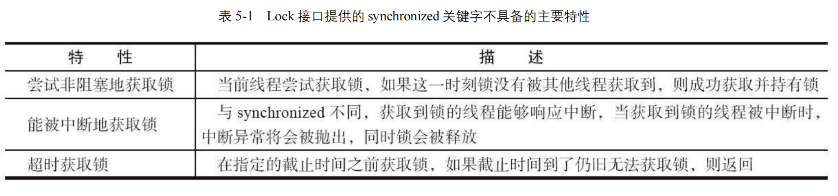
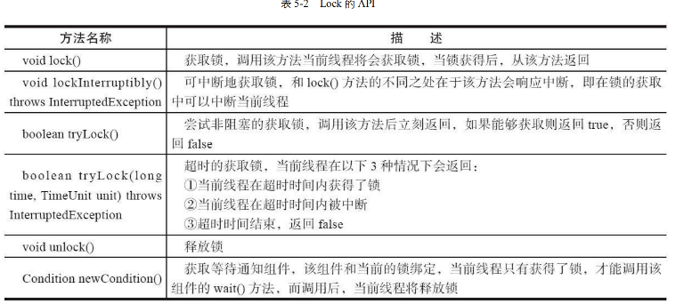
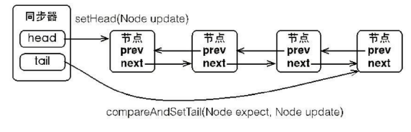
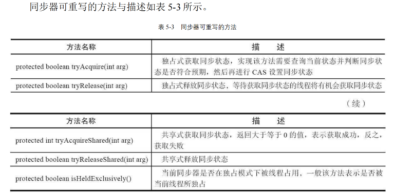
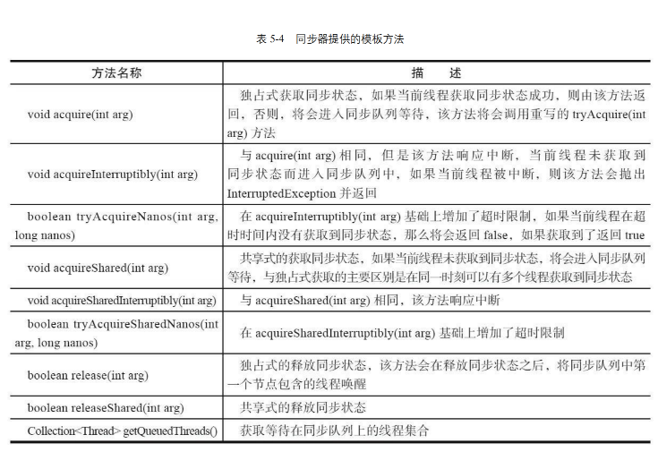

# <center>锁</center>

> 我们知道，在 Java 的处理高并发的时候，本质就是对于竞争资源进行加锁，这样就可以保证资源的安全性。我们下面来看一下 Java 中的锁。

首先，我们知道对于高并发的时候，通常会选择加锁的方式。而在`Java`中的加锁方式一般有两种:

- 使用 `Synchornized` 关键字，对某对象进行同步锁保护，始终保持只有一个线程在执行。

- 使用 `JDK` 的 `Lock` 接口，它提供了更多的方法来控制线程的同步。这个章节我们就详细的进行 `Lock` 接口的分析与学习。


## Introduce 

### Lock 接口

> 自 Java SE 5之后，出现了这个 `Lock` 接口

```java
// 一个关于 Lock 的简单例子
Lock lock = new ReentrantLock();
lock.lock();
try {
    // do something
} finally {
    lock.unlock();
}

```
几个注意事项 :

- 不要将获取锁的过程放在 `try` 的代码块中，因为如果在获取锁的时候出现异常，那么就无法释放锁了。
- 一定要在 `finally` 代码块中释放锁，否则会导致死锁。`finally` 子句的目的就是进行释放资源的操作。

### Lock 接口的特性

> Lock 接口提供的，但是`Syncronized` 不具备的特性



其他两个都比较好理解，但是我们的第一点特别说明一下:

```java
    Lock lock = new ReentrantLock();
    // 尝试获取锁，如果获取不到，就返回 false;
    lock.tryLock();
```

我们看上面的代码。有一个 `tryLock`的方法，如果我们尝试获取锁，但是这个锁仍旧未被释放，则说明这个锁已经被其他线程占用了，那么我们就可以返回 `false`，这样就可以避免一直等待锁的释放。但是如果是 `Syncronized` 的话，我们就只能一直等待锁的释放。也就是进入了 **阻塞状态** 


### Lock API/Method
下面的图中为介绍的 `Lock` 接口的一些方法


其实也就是我们上述的一些`Lock`新加的特性对应的方法。比较通俗易懂，主要就是其中的有个方法 `void lockInterruptibly()`，这个方法是可以中断的，也就是说如果在等待锁的时候，可以被中断。我们会获取到一个异常，然后释放锁。


### 二者的对比
二者都是为了在多线程访问资源的时候保证资源的安全性，但是在使用上有一些区别:

虽然 `Lock` 接口缺少了`Syncronized` 隐式获取释放锁的便捷性，但是却拥有了锁获取与释放的可操作性，可中断性，以及超时获取锁多种功能。

> 一个简单的类比，C 家族语言和 Java 有很大区别，就是后者对于内存是自动管理的，但是前者需要手动管理。我们这里两种锁其实也是一样的。但是虽然实现`Lock`接口，我们对于锁的可操作性更大，更加灵活。可以理解为具有更多的主动权。

在参考书中有这样一句话比较关键 **Lock接口的实现，基本都是通过聚合了一个同步器的子类来完成线程访问的控制**

## 队列同步器
> `AbstractQueuedSynchronizer` 下述同步器

简述一下就是这个同步器的内部是利用 `int` 变量来记录同步状态，通过内置的 `FIFO` 队列来完成资源的获取线程的排队工作。简单的来说就是通过队列来实现线程的排队。 **值得注意的是，这里我们使用的是双向队列**




```java
// 3 个基本的方法
getState();

setState(int newState);

compareAndSetState(int expect, int update);

```

有这样的一段话来理解锁和同步器的关系：

同步器是实现锁的关键，在锁的实现中聚合同步器，利用同步器实现锁的语义。锁是面向使用者的，它定义了使用者与锁交互的接口，隐藏了实现细节。但是同步器是面向锁的实现者的，它定义了锁的实现机制，为锁的实现提供了底层的操作。屏蔽了同步状态管理，线程排队等底层操作。也就是简单来说，他们是一个分离的关系，锁是对外的接口，同步器是对内的实现。


### 同步器的接口实现



上图很清晰的得知，我们的同步器不仅可以独占式的获取资源，还可以共享式
的获取资源。这样就可以实现读写锁的功能。

> 什么是独占式？ 什么又是共享式？ 
> 
独占模式，也就是字面意思的只允许单个线程访问资源(持有锁 ReentrantLock)， 而共享式就是允许多个线程访问资源(读写锁 ReentrantReadWriteLock)。




也就是我们观察到这些方法，其实同步器要干的就是三件事:

- 独占式获取与释放同步状态
- 共享式获取与释放同步状态
- 查询同步队列中的等待线程情况

这就是同步器(AQS)需要完成的事情

### 队列的实现


> 什么时候需要加入队列呢？ 
> 答案是显而易见的，当我们想获取共享资源失败的时候，就需要加入队列，等待资源的释放。

当然，一个节点所需要包含的内容也是很多的，其实主要的还是 `waitStatus`，这个是需要细分的。

- `CANCELLED` : 表示当前节点已经取消了
- `SIGNAL` : 表示当前节点的后继节点在等待当前节点唤醒
- `CONDITION` : 表示当前节点在等待条件
- `PROPAGATE` : 表示当前场景下，下一个节点会被传播唤醒
- `0` : 表示当前节点在 sync 队列中

<span style = "color : red">重点注意:</span>

我们这里由于是并发编程，所以时刻要注意线程的安全性。在将节点加入队列的时候，我们也需要保证线程的安全性。也就是我们单独有个方法为 `compareAndSetTail(Node expect,Node update)` 来保证线程的安全性。我们将当前线程 **认为** 的尾部节点和当前的节点来进行比较。只有真正的设置成功了，才能代表当前线程是队列的尾部节点。

<style>
    img{
        margin-left : auto;
        margin-right: auto;
        display:block;
        width:80%;
        border-radius:15px;
    }
</style>

