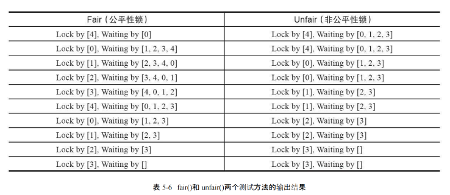
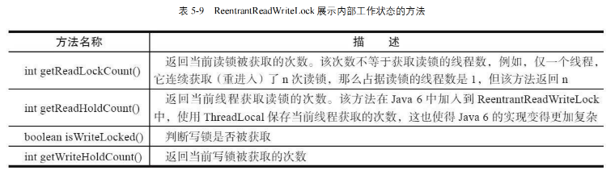
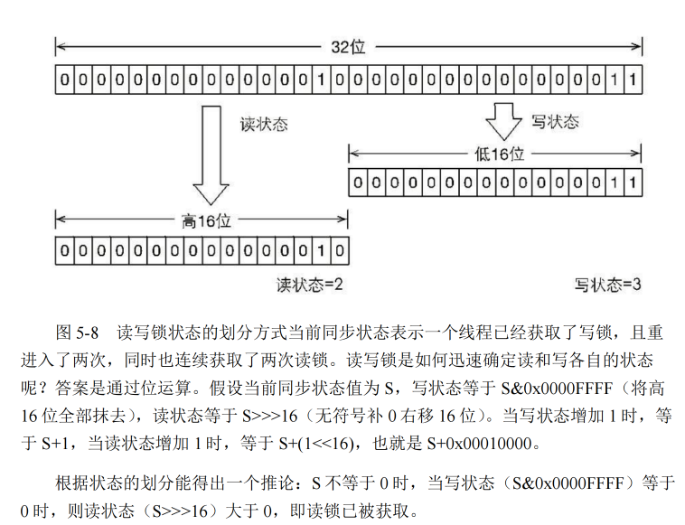
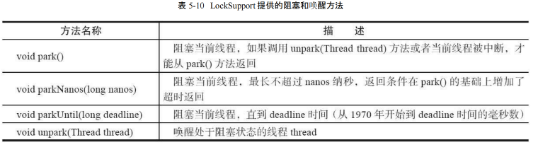
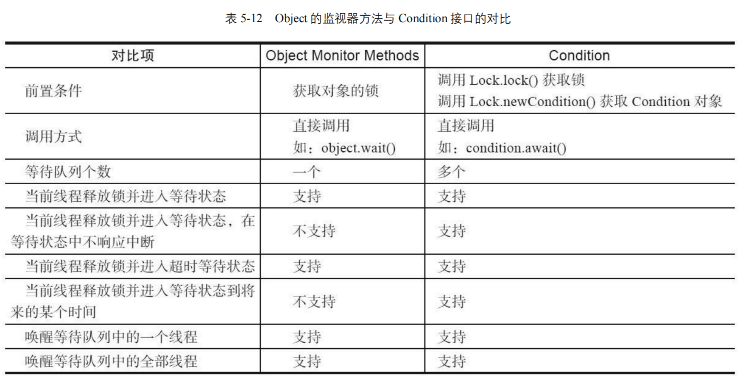
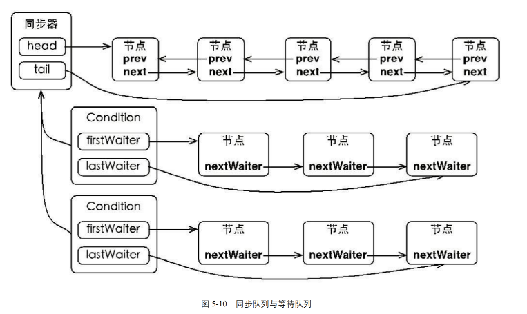

# <center>锁</center>

> 我们知道，在 Java 的处理高并发的时候，本质就是对于竞争资源进行加锁，这样就可以保证资源的安全性。我们下面来看一下 Java 中的锁。

首先，我们知道对于高并发的时候，通常会选择加锁的方式。而在`Java`中的加锁方式一般有两种:

- 使用 `Synchornized` 关键字，对某对象进行同步锁保护，始终保持只有一个线程在执行。

- 使用 `JDK` 的 `Lock` 接口，它提供了更多的方法来控制线程的同步。这个章节我们就详细的进行 `Lock` 接口的分析与学习。


## Introduce 

### Lock 接口

> 自 Java SE 5之后，出现了这个 `Lock` 接口

```java
// 一个关于 Lock 的简单例子
Lock lock = new ReentrantLock();
lock.lock();
try {
    // do something
} finally {
    lock.unlock();
}

```
几个注意事项 :

- 不要将获取锁的过程放在 `try` 的代码块中，因为如果在获取锁的时候出现异常，那么就无法释放锁了。
- 一定要在 `finally` 代码块中释放锁，否则会导致死锁。`finally` 子句的目的就是进行释放资源的操作。

### Lock 接口的特性

> Lock 接口提供的，但是`Syncronized` 不具备的特性


其他两个都比较好理解，但是我们的第一点特别说明一下:

```java
    Lock lock = new ReentrantLock();
    // 尝试获取锁，如果获取不到，就返回 false;
    lock.tryLock();
```

我们看上面的代码。有一个 `tryLock`的方法，如果我们尝试获取锁，但是这个锁仍旧未被释放，则说明这个锁已经被其他线程占用了，那么我们就可以返回 `false`，这样就可以避免一直等待锁的释放。但是如果是 `Syncronized` 的话，我们就只能一直等待锁的释放。也就是进入了 **阻塞状态** 


### Lock API/Method
下面的图中为介绍的 `Lock` 接口的一些方法


其实也就是我们上述的一些`Lock`新加的特性对应的方法。比较通俗易懂，主要就是其中的有个方法 `void lockInterruptibly()`，这个方法是可以中断的，也就是说如果在等待锁的时候，可以被中断。我们会获取到一个异常，然后释放锁。


### 二者的对比
二者都是为了在多线程访问资源的时候保证资源的安全性，但是在使用上有一些区别:

虽然 `Lock` 接口缺少了`Syncronized` 隐式获取释放锁的便捷性，但是却拥有了锁获取与释放的可操作性，可中断性，以及超时获取锁多种功能。

> 一个简单的类比，C 家族语言和 Java 有很大区别，就是后者对于内存是自动管理的，但是前者需要手动管理。我们这里两种锁其实也是一样的。但是虽然实现`Lock`接口，我们对于锁的可操作性更大，更加灵活。可以理解为具有更多的主动权。

在参考书中有这样一句话比较关键 **Lock接口的实现，基本都是通过聚合了一个同步器的子类来完成线程访问的控制**

## 队列同步器
> `AbstractQueuedSynchronizer` 下述同步器

简述一下就是这个同步器的内部是利用 `int` 变量来记录同步状态，通过内置的 `FIFO` 队列来完成资源的获取线程的排队工作。简单的来说就是通过队列来实现线程的排队。 **值得注意的是，这里我们使用的是双向队列**


```java
// 3 个基本的方法
getState();

setState(int newState);

compareAndSetState(int expect, int update);

```

有这样的一段话来理解锁和同步器的关系：

同步器是实现锁的关键，在锁的实现中聚合同步器，利用同步器实现锁的语义。锁是面向使用者的，它定义了使用者与锁交互的接口，隐藏了实现细节。但是同步器是面向锁的实现者的，它定义了锁的实现机制，为锁的实现提供了底层的操作。屏蔽了同步状态管理，线程排队等底层操作。也就是简单来说，他们是一个分离的关系，锁是对外的接口，同步器是对内的实现。


### 同步器的接口实现


上图很清晰的得知，我们的同步器不仅可以独占式的获取资源，还可以共享式
的获取资源。这样就可以实现读写锁的功能。

> 什么是独占式？ 什么又是共享式？ 
> 
独占模式，也就是字面意思的只允许单个线程访问资源(持有锁 ReentrantLock)， 而共享式就是允许多个线程访问资源(读写锁 ReentrantReadWriteLock)。


也就是我们观察到这些方法，其实同步器要干的就是三件事:

- 独占式获取与释放同步状态
- 共享式获取与释放同步状态
- 查询同步队列中的等待线程情况

这就是同步器(AQS)需要完成的事情

### 队列的实现


> 什么时候需要加入队列呢？ 
> 答案是显而易见的，当我们想获取共享资源失败的时候，就需要加入队列，等待资源的释放。

当然，一个节点所需要包含的内容也是很多的，其实主要的还是 `waitStatus`，这个是需要细分的。

- `CANCELLED` : 表示当前节点已经取消了
- `SIGNAL` : 表示当前节点的后继节点在等待当前节点唤醒
- `CONDITION` : 表示当前节点在等待条件
- `PROPAGATE` : 表示当前场景下，下一个节点会被传播唤醒
- `0` : 表示当前节点在 sync 队列中

<span style = "color : red">重点注意:</span>

我们这里由于是并发编程，所以时刻要注意线程的安全性。在将节点加入队列的时候，我们也需要保证线程的安全性。也就是我们单独有个方法为 `compareAndSetTail(Node expect,Node update)` 来保证线程的安全性。我们将当前线程 **认为** 的尾部节点和当前的节点来进行比较。只有真正的设置成功了，才能代表当前线程是队列的尾部节点。

### 独占锁同步状态的获取与释放

下面看一段有关的代码:
```java
/**
 * 
 */
private Node addWaiter(Node mode){
    Node node = new Node(Thread.currentThread(),mode);
    Node pred = tail;
    if(pred != null){
        node.prev = pred;
        if(compareAndSetTail(pred,node)){
            pred.next = node;
            return node;
        }
    }
    enq(node);
    return node;
}


/**
 * 让 node 加入队列
 */
private Node enq(final Node node){
    for(;;){
        Node t = tail;
        // 我们始终要保证存在一个 tail 节点
        if(t == null){
            if(compareAndSetHead(new Node())){
                tail = head;
            }
        }else{
            node.prev = t;
            // 确保能被线程安全的添加;
            if(compareAndSetTail(t,node)){
                t.next = node;
                return t;
            }
        }
    }
}
```

我们可以看到上述的源码中，也是时刻关注线程的安全性，多次利用`compareAndSetHead` 和 `compareAndSetTail` 来保证线程的安全性。


#### Acquire

接下来看一些细节。我们在 CAS 中的头节点正是当前正在获得锁的线程节点，因为是独占式的，所以我们只需要保证当前节点是队列的头节点，那么就可以获得锁。

那么接下来就有一段代码可以来实现这个自旋锁的功能: 因为我们是独占式，所以表示着始终只有一个线程节点能得到这个锁，抑或是这个队列是空的。两种可能性，那么我们下面的实现细节就表示着自旋锁，也就是他们自身在不断的尝试获取锁。倘若条件允许，自己就会退出死循环的状态，从而获得锁并且排到队伍的头部。

```java
/**
 * @param node 是当前线程的节点
 * @param arg 是当前线程的状态
 */
final boolean anquireQueued(final Node node,int arg){
    boolean failed = true;
    try{
        boolean interrupted = false;
        for(;;){
            // 获得这个node节点的前一个节点，查看是否为正在使用锁的节点
            final Node p = node.predecessor();
            // 如果前一个节点就是队首，并且满足获取锁的状态; tryAcquire(1);
            if(p == head && tryAcquire(arg)){
                setHead(node);
                // GC 
                p.next = null;
                failed = false;
                return interrupted;
            }
            if(shouldParkAfterFailedAcquire(p,node) && parkAndCheckInterrupt()){
                interrupted = true;
            }
        }
    }finally{
        if(failed){
            cancelAcquire(node);
        }
    }
}

```

#### Release


下面是一段 `Release` 的方法实现

```java
public final boolean release(int arg){
    if(tryRelease(arg)){
        Node h = head;
        // 对当前队列的头节点进行检查;
        if(h != null && h.waitStatus != 0){
            // 唤醒后面的节点; 
            unparkSuccessor(h);
        }
        return true;
    }
    return false;
}
```

### 共享式同步状态获取与释放
> BackGround : 共享式和独占式的区别就是是否允许多个线程在同一时间对资源获取到同步状态。我们以文件的读写为例，写一定是独占的，但是读操作是共享的。

那么具体怎么实现呢？我们看下来的代码:


#### Acquire 

```java
public final void acquireShared(int arg){
    // 因为是共享式，所以我们需要检查当前仍旧允许的线程数是否为0，也就是说是否能够尝试获取到锁
    if(tryAcquireShared(arg) < 0){
        doAcquireShared(arg);
    }
}

private void doAcquireShared(int arg){
    final Node node = addWaiter(Node.SHARED);
    boolean failed = true;
    try{
        boolean interrupted = false;
        for(;;){
            final Node p = node.predecessor();
            // 因为队列的有序性，我们依旧需要考虑前一个节点是否是队首节点，因为先来后到，虽然是共享式，但我们依旧要考虑这个问题。如果不要求前驱节点为头节点，就会可能出现队列中的所有节点都同时尝试获取锁的情况。
            if(p == head){
                int r = tryAcquireShared(arg);
                // 允许获取锁/资源访问;
                if(r >= 0){
                    // 将 node 设置为头节点;
                    setHeadAndPropagate(node,r);
                    p.next = null;
                    if(interrupted){
                        selfInterrupt();
                    }
                    failed = false;
                    return;
                }
            }
            if(shouldParkAfterFailedAcquire(p,node) && parkAndCheckInterrupt()){
                interrupted = true;
            }
        }
    }finally{
        if(failed){
            cancelAcquire(node);
        }
    }
}
```

#### Release 

```java
public final boolean releaseShared(int arg){
    if(tryReleaseShared(arg)){
        doReleaseShared();
        return true;
    }
    return false;
}
```


分析完上述的两种情况(独占式/共享式)，我们始终应该铭记的是都是基于队列来实现的，所以无论是否共享，我们访问资源都是有序的。

### 独占式超时获取同步状态

> 有时候我们在获取锁的时候，我们不希望一直等待，我们希望在一定的时间内获取到锁，如果超时了，我们就不再等待了。这个时候我们就需要超时获取同步状态。  

简单的来说，就是我们通过调用同步器的 `doAcquireNanos(int arg,long nanosTimeout)` 方法来实现超时获取同步状态。在指定时间段内获取锁的情况。如果获取到同步状态，则返回true.其实目的就是为了防止某个线程长时间处于等待阻塞状态，导致资源的浪费。

我们有 `nanosTimeout` , 其实逻辑也很简单，就是每次通过 `nanosTimeout = nanosTimeout - (now - lastTime)` 的正负，来判断是否已经超时了。

- now -> 当前的时间戳
- lastTime -> 上一次唤醒的时间戳

```java
private boolean doAcquireNanos(int arg,long nanosTimeout) throws InterruptedException{
    long lastTime = System.nanoTime();
    final Node node = addWaiter(Node.EXCLUSIVE);
    boolean failed = true;
    try{
        // 依旧是进行自旋锁的操作;
        for(;;){
            final Node p = node.predecessor();
            if(p == head && tryAcquire(arg)){
                setHead(node);
                p.next = null;
                failed = false;
                return true;
            }
            // 说明已经超时了，我们就不再等待了;
            if(nanosTimeout <= 0){
                return false;
            }
            if(shouldParkAfterFailedAcquire(p,node) && nanosTimeout > spinForTimeoutThreshold){
                LockSupport.parkNanos(this,nanosTimeout);
            }
            long now = System.nanoTime();
            nanosTimeout -= now - lastTime;
            lastTime = now;
            if(Thread.interrupted()){
                throw new InterruptedException();
            }
        }
}
```

超时等待的线程，并不会直接的将别的线程的锁给释放，而是说会直接告知你，我们已经超时了，不能再继续等待了。这点就是和`Syncronized`的区别。后者是会一直等待的。

### TwinsLock

> 设计一个双胞胎锁，也就是最多同时拥有两个线程同时访问资源。这个锁的设计是基于`AQS`的，我们可以看一下下面的代码:

```java
public class TwinsLock implements Lock{
    private final Sync sync = new Sync(2);
    private static final class Sync extends AbstractQueuedSynchronizer{
        Sync(int count){
            if(count <= 0){
                throw new IllegalArgumentException("count must large than zero");
            }
            setState(count);
        }

        public int tryAcquireShared(int reduceCount){
            for(;;){
                int current = getState();
                int newCount = current - reduceCount;
                if(newCount < 0 || compareAndSetState(current,newCount)){
                    return newCount;
                }
            }
        }

        public boolean tryReleaseShared(int returnCount){
            for(;;){
                int current = getState();
                int newCount = current + returnCount;
                if(compareAndSetState(current,newCount)){
                    return true;
                }
            }
        }
    }

    public void lock(){
        sync.acquireShared(1);
    }

    public void unlock(){
        sync.releaseShared(1);
    }

    public void lockInterruptibly() throws InterruptedException{
        sync.acquireSharedInterruptibly(1);
    }

    public boolean tryLock(){
        return sync.tryAcquireShared(1) >= 0;
    }

    public boolean tryLock(long time,TimeUnit unit) throws InterruptedException{
        return sync.tryAcquireSharedNanos(1,unit.toNanos(time));
    }

    public Condition newCondition(){
        return null;
    }
}
```
因为我们设置了 `private final Sync sync = new Sync(2);` 也就是说状态量始终只会有 `0,1,2` 三种情况。


#### 测试代码
为了比较好理解上述的`TwinLock`这里有一段代码可以方便理解:
```java
public class TwinsLockTest{
    @Test
    public void test(){
        final Lock lock = new TwinsLock();
        class Worker extends Thread {
            public void run(){
                lock.lock();
                try{
                    SleepUtils.second(1);
                    System.out.println(Thread.currentThread().getName());
                    SleepUtils.second(1);
                }finally{
                    lock.unlock();
                }
            }
        }

        //启动10个线程
        for(int i = 0; i < 10; i++){
            Worker w = new Worker();
            w.setDaemon(true);
            w.start();
        }
        // 每隔1秒换行
        for(int i = 0; i < 10; i++){
            SleepUtils.second(1);
            System.out.println();
        }
    }
}
```

## 重入锁 ReentrantLock
> 我们上面分析的同步队列器都是不重入锁的实现。也就是说不支持一个线程多次获取同一个锁。但是我们在实陫中，有时候我们需要支持重入锁的实现。这个时候我们就需要使用 `ReentrantLock` 来实现。

> 小 Question : `Syncronized` 是支持重入锁的吗？ 答案是肯定的，一个`Syncronized` 在修饰递归方法的时候，是支持重入锁的。 上面的`Mutex`会出现获取了锁之后，而下一次获取锁的时候，会把自己给阻塞住。

### 获取锁的公平性 
其实很好理解，也就是是否要依据队列的顺序来获取锁。如果是公平的，那么就是依据队列的顺序来获取锁。如果是非公平的，那么就是不依据队列的顺序来获取锁。等待时间最长的线程最优先获取到锁，这个是公平的获取锁。
<span style = "color : red">但是，事实上也很好理解，公平的获取锁虽然可以解决线程饥饿的问题，但是效率肯定是比不上非公平的获取锁的。</span>

### 实现重进入
> 这里定义一下重进入，其实就是某个线程已经获得了共享资源，那么在释放资源之前，再次获取资源的时候，是可以再次获取到的。这个就是重进入。
> 值得注意的是，锁的重进入默认是 **非公平的**


- 线程再次获得锁

    我们的线程重新获得锁的时候，是不会额外消耗共享资源的，但是会有专属的计数器进行记录。我们可以在操作系统中的 `cow` 的操作中，也有类似的操作。在某些物理地址上进行页引用的计数。

- 线程结束时候释放锁 

    直到所有的计数器为0的时候，就说明线程可以去释放。

#### 非公平 `Acquire`

> 一般情况下，重入锁都是针对于独占锁的。我们的 `state` 就是表示的是这个锁被占用的次数。


我们可以看下面的代码:

```java
/**
 * 非公平的获取锁
 * @param acquires 请求获得锁的次数
 * @return 是否获得锁
 */
final boolean nonfairTryAcquire(int acquires){
    // 获取当前锁的状态
    final Thread current = Thread.currentThread();
    int c = getState();
    // 如果锁的状态为0，表示当前没有线程占用锁
    if(c == 0){
        // 设置锁的状态为 acquires
        if(compareAndSetState(0,acquires)){
            // 将当前的线程设置为独占线程
            setExclusiveOwnerThread(current);
            return true;
        }
    }else if(current == getExclusiveOwnerThread()){
        // 接下来的部分是表面当前的线程是已经获取到锁了
        int nextc = c + acquires;
        if(nextc < 0){
            throw new Error("Maximum lock count exceeded");
        }
        // 设置锁的状态为 `nextc` 我们到时候释放锁的时候，就是减去这个值
        setState(nextc);
        return true;
    }
    return false;
}
```

#### 非公平锁的 `Release`

```java
/**
 * @param releases 释放锁的次数
 */
protected final boolean tryRelease(int releases){
    int c = getState() - releases;
    // 因为我们默认是独占锁，所以如果当前线程并不是那个占据锁的线程，就会抛出异常;
    if(Thread.currentThread() != getExclusiveOwnerThread()){
        throw new IllegalMonitorStateException();
    }
    boolean free = false;
    // 只有当锁完全释放的时候，我们才会释放资源
    if(c == 0){
        free = true;
        setExclusiveOwnerThread(null);
    }
    setState(c);
    return free;
} 
```

### 非公平锁和公平锁的区别

我们在上面的代码实现都是基于 **非公平锁的**，这个时候我们会考虑公平锁，也就是按照 **FIFO** 的原则来进行资源获取的排队。并不会因为你这个线程正在等待，而让你提前获取资源。这个时候我们就需要考虑公平锁的实现。

#### 公平锁的 `Acquire`

```java
protected final boolean tryAcquire(int acquires){
    final Thread current = Thread.currentThread();
    int c = getState();
    // 如果锁的状态为0，表示当前没有线程占用锁
    if(c == 0){
        // 如果队列中没有线程在等待，或者当前线程是队列中的第一个线程
        if(!hasQueuedPredecessors() && compareAndSetState(0,acquires)){
            setExclusiveOwnerThread(current);
            return true;
        }
    }else if(current == getExclusiveOwnerThread()){
        int nextc = c + acquires;
        if(nextc < 0){
            throw new Error("Maximum lock count exceeded");
        }
        setState(nextc);
        return true;
    }
    return false;
}
```

看上面的内容就是，**我们只有当这个线程处于的队列为空，或者这个线程在线程的队首的时候**，才会给他分配锁。这个就是公平锁的实现。而对于锁次数的增加是不受影响的。




观察上图，其实可以发现就是说我们利用 **非公平锁** 进行的资源申请访问的次数是更少的。


## 读写锁 ReadWriteLock
> 我们可以知道的是 前面的两种 `Mutex` 和 `ReentrantLock` 都是排他锁，但是读写锁是一种共享锁。也就是说，读写锁允许多个线程同时读共享资源，但是对于写资源是排他的。也就是说，写锁是独占的，读锁是共享的。

我们考虑到一个计算机的设计原则 **make common faster**,因为在正常的情况下，读的次数是远远大于写的次数的，所以读写锁的性能会比排他锁的性能要好很多。

简单的理解就是 读写锁 其实是**一对锁**,维护的是两把锁，一个负责读，一个负责写。读写锁的实现是基于 `AQS` 的，我们可以看下面的代码:



首先是为了熟悉 读写锁的接口，我们看一下下面的示例代码:是一段关于 `Cache` 中对于读写锁的使用

```java
public class Cache{
    static Map<String, Object>map = new HashMap<String,Object>();
    static ReentrantReadWriteLock rwl = new ReentrantReadWriteLock();   

    // 获取两个锁的对象;
    static Lock r = rwl.readLock();
    static Lock w = rwl.writeLock();

    /**
     * 这个是一个读的操作，所以是读锁来进行管理
     * @param key 需要读取value的键值
     */
    public static final Object get(String key){
        r.lock();
        try{
            return map.get(key);
        }finally{
            r.unlock();
        }
    }

    public static final Object put(String key,Object value){
        // 当获取到了写锁的时候，我们所有的读锁包括其他的写锁都会被阻塞
        w.lock();
        try{
            return map.put(key,value);
        }finally{
            w.unlock();
        }
    }

    // 清空所有内容
    public static final void clear(){
        w.lock();
        try{
            map.clear();
        }finally{
            w.unlock();
        }
    }
}
```

因为 `HashMap` 是非线程安全的，我们这里使用了**读写锁**来保证线程的安全性。

### 读写锁的实现
> 如果没有特别声明，读写锁都是 `ReentrantReadWriteLock`，也就是说允许重进入的读写锁。

#### 读写锁的设计
在上述的重入锁的设计中，我们明确的知道了，我们的读写锁是基于 `AQS` 来实现的。现在的读写锁，我们也是基于 `AQS` 来实现的。而作为读写锁，我们需要的一个关键性质就是 **读写锁的自定义同步器需要在同步状态（一个整型变量）上维护多个读/单个写的状态**

也就是说我们现在要利用到 **位运算** 来让单个整型变量支持多个读线程和一个写线程。我们可以看下面的代码:



上面维护的一个读写锁的变量可以明显的看到，我们高`16`位是读锁的状态，低`16`位是写锁的状态。这样我们就可以很好的实现读写锁的功能。


#### 写锁的获取与释放
```java
protected final boolean tryAcquire(int acquires){
    Thread current = Thread.currentThread();
    int c = getState();
    // w 表示的是读锁的数目/状态
    int w = exclusiveCount(c);
    if(c!=0){
        // 说明当前已经有线程获取到了写锁
        if( w==0 || current != getExclusiveOwnerThread()){
            return false;
        }

        if(w + exclusiveCount(acquires) > MAX_COUNT){
            throw new Error("Maximum lock count exceeded");
        }
        setState(c + acquires);
        return true;
    }

    if(writeShouldBlock()||!compareAndSetState(c,c+acquires)){
        return false;
    }

    setExclusiveOwnerThread(current);
    return true;
}
```

我们看上面的代码，首先要知道的是 在写锁中，它是**排他锁**并且是 **允许重入锁的**。所以我们分析上述的代码，分为以下的几种`cases`:

- Case1 : 如果这个锁没有被占用过，并且不是 `writeShouldBlock` 的情况下，我们就可以获取到锁
    - Case 1.1 : 倘若存在读锁，那么我们也是不能获取到写锁的。 `c!=0 && w==0`; 
- Case2 : 如果当前线程已经获取到了写锁，那么我们就可以继续获取锁。
 
    - Case2.1 : 如果当前线程已经获得过写锁，但是当前线程不是写锁的拥有者，那么我们就不能获取锁。
    - Case2.2 : 如果当前线程已经获得过写锁，但是当前线程是写锁的拥有者，那么我们就可以继续获取锁。而且需要重新记录重入的次数 `setState(c + acquires)`

> 记得进行一些边界处理

#### 读锁的获取与释放
```java
protected final int tryAcquireShared(int unused){
    for(;;){
        int c = getState();
        int nextc = c + (1<<16);
        if(nextc < c)
            throw new Error("Maximum lock count exceeded");
        // 存在写锁 并且当前的 owner 不是当前线程
        if(exclusiveCount(c) != 0 && owner != Thread.currentThread()){
            return -1;
        }

        // 更新读锁的状态，时刻保证线程安全
        if(compareAndSetState(c,nextc)){
            return 1;
        }
    }
}
```

读锁是一个支持重进入的共享锁，它能够被多个线程同时获取，在没有其他写线程访问的时候，读锁总是可以被成功的获取。

#### 锁降级

> BackGround : 锁降级是指写锁降级为读锁，而不是升级。这个是为了保证数据的一致性。
> 
> **Case1 : 如果当前的线程存在写锁，然后将其释放，最后获得读锁，这个过程不是锁降级**
> 
> **Case2 : 把持住当前的写锁，再获取到读锁，然后再释放掉原先的写锁，这个过程才是锁降级**


来看一段锁降级的代码:

```java
public void processData{
    readLock.lock();
    if(!update){
        // 先释放读锁
        readLock.unlock();
        // 锁降级从写锁的获取开始
        writeLock.lock();
        try{
            if(!update){
                // 准备数据，时刻保持阻塞
                update = true;
            }
            readLock.lock();
        }finally{
            writeLock.unlock();
        }
        // 锁降级完成，释放写锁
    }
    try{

    }finally{
        readLock.unlock();
    }
}

```
> 锁降级的本质 : 
> **锁降级的本质是释放掉独占锁，使其他线程可以获取到读锁，提高并发，而当前线程持有读锁来保证数据的可见性。**


我们上述的 `update` 变量是用 `volatile` 修饰的，也就是说其他所有线程都是可见这个变量的。
当数据发生变化的时候，`update` 会变成 `false`.也就是说会进入`if`之后的子句。我们释放读锁，开始进行一个模拟锁降级的过程。我们先获取到写锁，然后获取到读锁之后，等所有过程完成之后，通过`finally`子句来完成写锁的释放。

思考几个问题:

- 锁降级的目的是什么？ 

    - 提高系统性能 : 在一些操作中，某些线程只需要较低级别的锁（如读锁），但是在操作开始时可能获得了较高级别的锁（如写锁）。如果在操作过程中没有修改共享资源，降级为较弱的锁（如从写锁降级为读锁）可以提高并发性，允许更多的线程同时访问资源，从而提升系统性能。
    - 减少死锁的可能性 : 锁降级可以在某些场景中减少死锁的发生。如果多个线程持有不同的锁并试图获取对方的锁，可能会导致死锁。在一些特定的场景下，将锁降级可以避免互相等待的情况，从而降低死锁的风险。**因为我们如果直接释放写锁，可能会立马有其他的线程进入竞争到这个共享资源，给它上了写锁，很难保证数据的一致性**


- 锁降级中读取锁是否必要 ? 

    - 必要，因为主要是 **为了保证数据的可见性**,如果当前线程不获取读锁，而是直接释放写锁。假设此时刻另一个线程获取了写锁，并且修改了数据，那么当前线程是无法感知到线程的数据变化。但是如果我们进行了 **加一步读锁** 之后，就是给想获取写锁的线程进行了一个阻塞，这个时候我们就可以保证数据的一致性。


### LockSupport 工具

> `LockSupport` 是一个非常方便的工具，它可以在线程中挂起和唤醒线程。我们可以看下面的代码:

`LockSupport` 工具类提供的常见方法,主要就是为了方便唤醒/阻塞线程.




在 `Java 6` 中，给上述的`park`有关的方法中，都加入了一个 `Object block` 参数，用于实现阻塞当起啊你线程的功能，其中的这个参数适用来标识当前线程在等待的对象，该对象是用来问题的排查和系统监控。

### Condition 条件


#### 为什么所有对象都有 `wait` 和 `notify` 方法？
任意一个 Java 对象，都拥有一组监视器方法，主要包括 `wait()`,`wait(long timeout)`,`notify()`,`notifyAll()` 方法，这些方法用来和`synchronized` 同步关键字配合，可以实现等待/通知模式。

我们可以这样理解，我们的 `synchronized` 关键字的作用本质上就是，对某些选中的对象进行加锁，而 `wait` 和 `notify` 方法就是对这个对象进行等待和通知的操作。

假设我们用 `Syncronized(Obj)` 那么所有进入这个代码块的线程会被阻塞，此时我们用 `Obj.wait()` 方法，这个线程就会被阻塞，直到其他线程调用 `Obj.notify()` 方法，这个线程才会被唤醒。


这个是 `Object Monitor Methods` 和 `Condition` 的区别:



我们可以看到 `Condition` 的方法更加的丰富，也就是说我们可以更加的灵活的控制线程的等待和唤醒。

#### Condition 的接口与示例

本质上，`Condition` 还是提供的为 `等待/通知` 两种方法。当前线程需要调用这些方法都是好，需要提前获取到`Condition`对象关联到的锁。`Condition`对象是由`Lock`对象创建出来的，换句话说，`Condition`是依赖`Lock`对象的。


```java
Lock lock = new ReentrantLock();
Condition condition = lock.newCondition();

public void conditionWait() throws InterruptedException{
    lock.lock();
    try{
        condition.await();
    }finally{
        lock.unlock();
    }
}

public void conditionSignal(){
    lock.lock();
    try{
        condition.signal();
    }finally{
        lock.unlock();
    }
}

```

我们一般都会把`Condition` 对象作为成员变量，方便调用。那么优势在于，我们可以更加灵活的控制线程的等待和唤醒。也就是说可以多条件的进行等待和唤醒。但我们上面提到的基于对象本身的 `wait` 和 `notify` 方法，只能实现一种等待和唤醒的操作。

#### 通过一个`BoundedQueue` 来理解 `Condition` 的使用

先来介绍一下上面是有界队列，有界队列就是一个特殊的队列，当队列为空的时候，队列的获取操作会阻塞获取线程，直到队列中有新的元素出现。当队列已经满的时候，队列的插入操作也会阻塞插入线程，直到队列中有空的位置出现。其实也就是通过一个数据结构来实现的生产者消费者模型。达到控制线程的目的。

```java
public class BoundedQueue<T>{
    private Object[] items;

    private int addIndex,removeIndex,count;
    private Lock lock = new ReentrantLock();

    // 在 `get` 的时候进行等待
    private Condition notEmpty = lock.newCondition();

    // 在 `add` 的时候进行等待
    private Condition notFull = lock.newCondition();

    public BoundedQueue(int size){
        items = new Object[size];
    }

    // 添加一个新的元素，如果数组满了，则添加线程进入等待状态，直到有新的元素加入
    public void add(T t) throws InterruptedException{
        lock.lock();
        try{
            // 判断此时队列是否已经满了
            while(count == items.length){
                // 队列已经满了，添加线程进入等待状态 -> 因为 notFull 这个condition所产生的等待
                notFull.await();
            }
            items[addIndex] = t;
            if(++addIndex == items.length){
                addIndex = 0;
            }
            ++count;
            notEmpty.signal();
        }finally{
            lock.unlock();
        }
    }


    // 由头部删除一个元素，如果数组为空，则删除线程进入等待状态，知道有新的元素加入;
    @SuppressWarnings("unchecked")
    public T remove() throws InterruptedException{
        lock.lock();
        try{
            // 判断是否为空
            while(count == 0){
                // 队列为空，删除线程进入等待状态 -> 因为 notEmpty 这个condition所产生的等待
                notEmpty.await();
            }

            // 我们获取到了 removeIndex 的元素
            Object x = items[removeIndex];
            if(++removeIndex == items.length){
                // 表示我们已经到了队列的尾部
                removeIndex = 0;
            }
            --count;
            // 直接唤醒上面的 add 线程
            notFull.signal();
            return (T)x;
        }finally{
            lock.unlock();
        }
    }


}
```

就可以这样理解 `add` 和 `remove` 是有点类似共轭的操作，互相可以唤醒对方。


#### Condition 的实现

其实在理解了 `Condition` 和 `Object Monitor Methods` 的区别之后，我们就可以很好的理解 `Condition` 的实现了。
其实就是在每次创建 `condition` 对象的时候，都会单独的维护一个等待队列，这个队列是用来存放等待的线程的。

同步队列和等待队列中的节点类型都是 **AbstractQueueSynchronizer.Node**




这里就不多多赘述了。有空再来写;

## 总结
但是我们通过对锁的分析，其实很简单，就是分成了两部分，同步队列和等待队列。分别对应的就是 `Lock` 和 `condition` 两部分。同步队列就是用来获取已经获取到锁的线程，等待队列就是用来存放等待的线程。那么不同的 `condition` 对象就是维护不同的等待队列。我们无论在哪个等待队列中进行了 `signal` 的操作，都会唤醒等待队列中的第一个线程。并且将其从等待队列中移除，然后加入到同步队列中。这个时候就可以进行资源的访问了。


<style>
    img{
        margin-left : auto;
        margin-right: auto;
        display:block;
        width:80%;
        border-radius:15px;
    }
</style>

