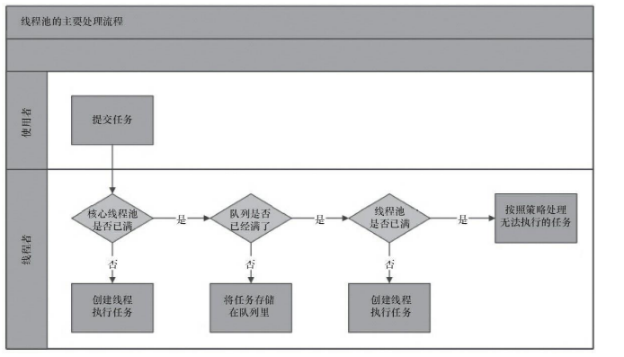
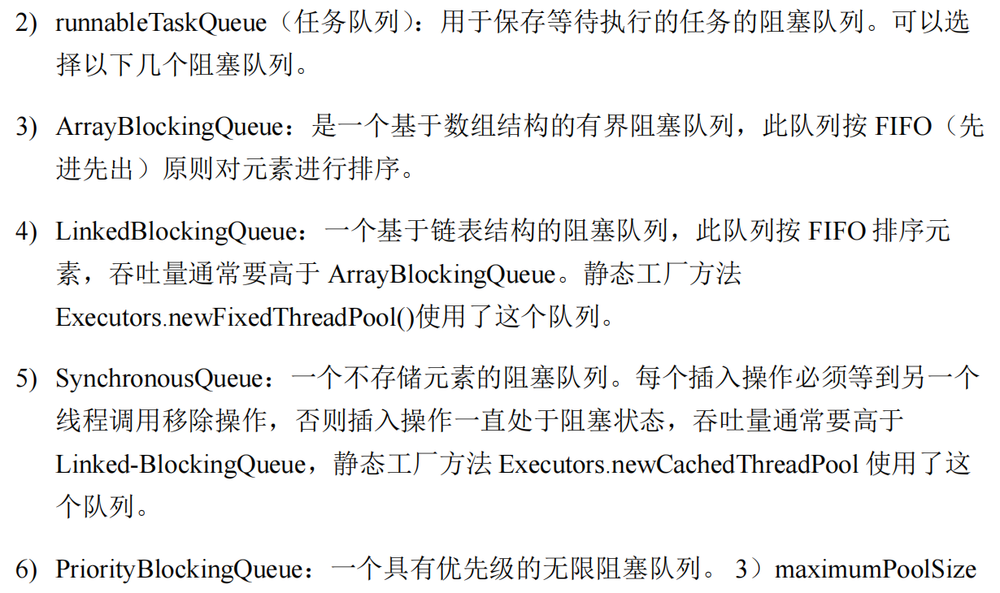

# <center>线程池</center>

## Introduce
Java中的线程池是运用场景最多的并发框架，几乎所有需要异步或并发执行任务的程序都可以使用线程池。线程池的好处在于：

- 降低资源消耗。通过重复利用已创建的线程降低线程创建和销毁造成的消耗。
- 提高响应速度。当任务到达时，任务可以不需要等到线程创建就能立即执行。
- 提高线程的可管理性。线程是稀缺资源，如果无限制地创建，不仅会消耗系统资源，还会降低系统的稳定性，使用线程池可以进行统一分配、调优和监控。
- 提供更多更强大的功能。线程池具备线程池大小控制、线程超时控制、任务取消、定时执行、任务依赖等功能。

其实简单的来说就是提供了一种线程复用的机制，可以避免频繁的创建和销毁线程，提高性能。


## 线程池的实现

### 线程池的具体原理



看上图，我们可以知道线程池的主要工作流程：

首先，当一个任务来的时候，我们会判断线程池中的数目是否达到核心的线程数(换句话说，就是是不是线程池中的每个线程都处于占用状态)

- Case1 : 如果没有达到核心线程数，那么我们就会创建一个新的线程来执行这个任务。

- Case2 : 如果达到了核心线程数，那么我们就会将这个任务放入到任务队列中。
    
    - Case2.1 : 如果任务队列没有满，那么我们就会将这个任务放入到任务队列中。
    - Case2.2 : 如果任务队列满了，那么我们就会判断线程池中的线程数是否达到了最大线程数。
            
        - Case2.2.1 : 如果没有达到最大线程数，那么我们就会创建一个新的线程来执行这个任务。
        - Case2.2.2 : 如果达到了最大线程数，那么我们就会执行拒绝策略。


这里区分一下线程池的 **核心线程数** 和 **最大线程数**: 

- **核心线程数：(corePoolSize)**线程池中的线程数不会小于这个数目，即使线程是空闲的。就是一直预留着的线程数。
- **最大线程数：(maximumPoolSize)**线程池中最大的线程数目，当任务队列满了，且线程数没有达到最大线程数，那么就会创建新的线程来执行任务。
    - **非核心线程数(Non-corePoolSize)** : 当线程池中的线程数目大于核心线程数时，多余的线程会被称为非核心线程。但是过了一段时间，这些非核心线程会被回收掉。
- **任务队列：**用来存放任务的队列，当线程池中的线程数目达到核心线程数时，新来的任务就会放入到任务队列中。
- **拒绝策略：**当任务队列满了，且线程数达到了最大线程数，那么就会执行拒绝策略。

### 线程池的实现

在大概的了解了线程池的原理之后，我们就可以自己进行实现线程池了。我们知道的是有 `BlockingQueue` 来实现线程池这个类中的任务队列。`ThreadPoolExecutor` 采取上述的实现原理，就是为了在执行 `execute()` 方法的时候，尽可能的避免获取全局锁。

```java
public void execute(Runnable command){
    if(command == null) 
        throw new NullPointerException();
    
    // 如果线程数大于等于核心线程数/或者创建任务失败
    if(poolSize >= corePoolSize || !addIfUnderCorePoolSize(command)){
        if(runState == RUNNING && workQueue.offer(command)){    // 将任务放入到任务队列中
            if(runState != RUNNING || poolSize == 0)
                ensureQueuedTaskHandled(command);
        // 如果线程池不处于运行中或者任务无法放入队列，并且当前的线程数小于最大线程数，那么就创建一个新的线程来执行任务
        }else if(!addIfUnderMaximumPoolSize(command))
        //  执行拒绝策略
            reject(command);
    }
}

public void run(){
    try{
        Runnable task = firstTask;
        firstTask = null;
        while(task!= null ||(task=getTask())!=null){
            runTask(task);
            task = null;
        }
    }fianlly{
        workerDone(this);
    }
}

```

### 线程池的使用

`new ThreadPoolExecutor(corePoolSize, maximumPoolSize, keepAliveTime, unit, workQueue, threadFactory, handler);`

我们通过上述的构造函数就可以创建一个线程池，其中的参数分别是：

- `corePoolSize` : 线程池中的核心线程数

    > 线程池是利用 **Lazy-Load** 思想，其实这个思想在很多地方都用到了。我们一开始是0个线程在线程池中。如果我们后续有任务提交了，那么线程池就会创建线程实例`worker`，并且执行任务。如果线程池中的线程数目小于核心线程数，那么就会创建新的线程来执行任务。如果线程池中的线程数目大于核心线程数，那么就会将任务放入到任务队列中。也就是会后续的操作。我们目前创建的小于等于`corePoolSize`的线程将会一直存在，但是如果超过了这个数目，那么就会根据`keepAliveTime`来判断是否需要回收线程。

    这里另外提一个 `prestartPoolThreads` 办法，它就是预先的创建并且启动`corePoolSize`个线程。这个方法是在线程池创建之后，但是在任务提交之前调用的。这个方法是为了提前创建线程，提高线程池的响应速度。

- `maximumPoolSize` : 线程池中的最大线程数
- `keepAliveTime` : 当线程数大于核心线程数时，多余的空闲线程的存活时间
- `unit` : `keepAliveTime` 的时间单位
- `workQueue` : 任务队列，被提交但尚未被执行的任务

    > 这里有很多的任务队列提供给我们进行使用。就不一一罗列了。

    

- `threadFactory` : 线程工厂，用来创建线程
- `handler` : 拒绝策略，当任务太多来不及处理，如何拒绝任务

    > 常见的几种拒绝策略:

    - AbortPolicy : 直接抛出异常，阻止系统正常工作。
    - CallerRunsPolicy : 只要线程池未关闭，该策略直接在调用者线程中，运行当前被丢弃的任务。
    - DiscardOldestPolicy : 丢弃最老的一个请求，尝试再次提交当前任务。
    - DiscardPolicy : 默默的丢弃无法处理的任务，不予任何处理。 

其实这个已经很完全的把整个线程池的几个核心参数都给包含进去了。

#### 向线程池提交任务

> 向线程池提交任务其实就两个方法 `execute()` 和 `submit()`。

二者的区别就是 `execute()` 方法没有返回值,所以不能判断是否这个任务呗线程池正确的执行，而 `submit()` 方法是有返回值的。`submit()` 方法返回的是一个 `Future` 对象，我们可以通过这个对象来获取任务的执行结果。

`execute()` 方法的使用:

```java
threadsPool.execute(new Runnable(){
    @Override
    public void run(){
        System.out.println("Hello World");
    }
})
```

`submit()` 的使用


##### `Future` 类型的对象
我们这里介绍一下 `Java` 中的`Future` 类型的对象。主要`Future<T>` 表示的就是一个异步计算的结果。它提供了一种机制，让你提交了一个任务后，可以**稍后获取任务的执行结果，而不是阻塞主线程**。

```java
public interface Future<V> {
    // 返回任务的状态，是取消了还是执行完成了
    boolean cancel(boolean mayInterruptIfRunning);
    boolean isCancelled();
    boolean isDone();
    // 阻塞该线程，直到任务执行结束
    V get() throws InterruptedException, ExecutionException;
    V get(long timeout, TimeUnit unit) throws InterruptedException, ExecutionException, TimeoutException;
}

```

**基本使用:**

```java
import java.util.concurrent.*;

public class FutureExample {
    public static void main(String[] args) {
        // 创建线程池
        ExecutorService executor = Executors.newFixedThreadPool(2);

        // 提交一个任务，返回 Future
        Future<Integer> future = executor.submit(() -> {
            Thread.sleep(2000);  // 模拟耗时计算
            return 10;
        });

        System.out.println("任务已提交，主线程继续执行...");

        try {
            // 阻塞等待任务完成，获取返回值
            Integer result = future.get();
            System.out.println("异步任务结果: " + result);
        } catch (InterruptedException | ExecutionException e) {
            e.printStackTrace();
        }

        // 关闭线程池
        executor.shutdown();
    }
}

```

上面就是一个简单的使用`Future` 对象的过程，其实也是我们使用线程池的 `submit` 方法来提交任务的过程。


### 线程池的关闭

我们的线程池关闭有两种方法 `shutDown()` 和 `shutDownNow()`。
二者的共同点就是遍历线程池中的所有线程实例，然后逐个 `interrupt` 中断线程。所以无法响应中断的任务可能会永远无法终止。

但是二者的区别其实也很明显，后者的名字就告诉我们了 `Now` 也就是说无论这个线程是否还在工作，我们都会立即关闭线程池。而前者则是等待所有的任务执行完毕之后再关闭线程池。

### 合理地配置线程池

其实也很好理解，为什么要使用 `BoundQueue` 的目的就是限流，避免线程池中的线程数目无限增长。但是这个 `BoundQueue` 的大小也是需要我们进行合理的配置的。

具体的内容可以参考 `《Java 并发编程艺术》`中的 9.2.4章节


### 线程池的监控

其实就是可以通过`get`方法来知道线程池的当前状态 比如:

- `taskCount` : 线程池已经执行的任务数
- `completedTaskCount` : 线程池已经完成的任务数
- `largestPoolSize` : 线程池中曾经出现过的最大线程数
- `getPoolSize` : 线程池的线程数
- `getActiveCount` : 当前线程池中正在执行任务的线程数
- `getQueue` : 获取任务队列

...

有了以上的`get`方法，其实就是方便我们时刻来监控线程池的状态，从而进行合理的调整。


<style>
    img{
        margin-left : auto;
        margin-right: auto;
        display:block;
        width:80%;
        border-radius:15px;
    }
</style>

