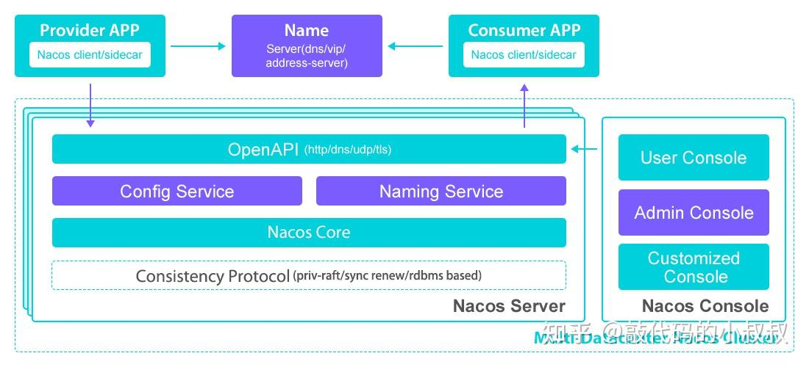

# 
Nacos

## Introduce 

**Nacos** 支持及几乎所有主流类型的 "服务" 发现、配置、管理。

在 RPC 框架中，存在着注册中心。Dubbo服务体系之前使用的是 `Zookeeper` 或者自己的 `Registry`作为注册中心，但是后来就使用了 `Nacos` 作为注册中心。4

`NacosServiceRegistryAutoConfiguration` 会自动配置 `NacosServiceRegistry` 作为注册中心。

## 配置中心你了解么？
首先，对于很多应用程序，他们和自身的配置文件是强相关的。很多时候是进行一个绑定的，比如 `application.properties` 或者 `application.yml` 文件。但是这样的话，我们就会发现，如果我们需要修改配置文件的话，那么就需要重新打包，重新部署。这样的话，就会导致我们的应用程序的停机时间变长。

那么这个时候 **配置中心** 的作用就凸显出来了，负责配置信息的 CRUD.尤其是在很多时候，我们对于不同的应用程序，可能它们的配置文件是一样的。