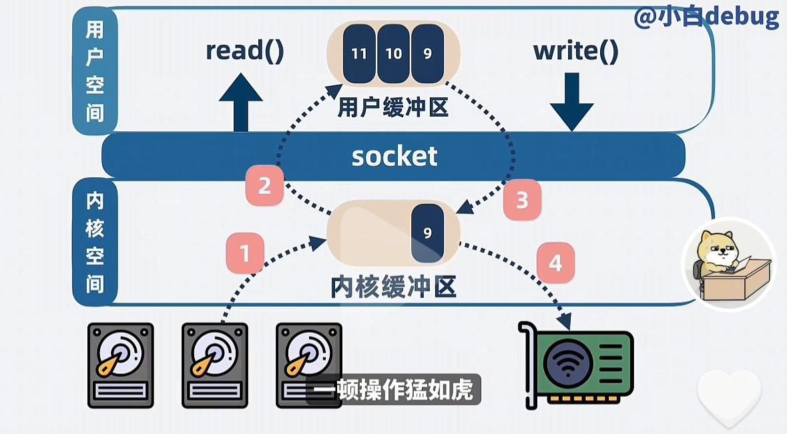
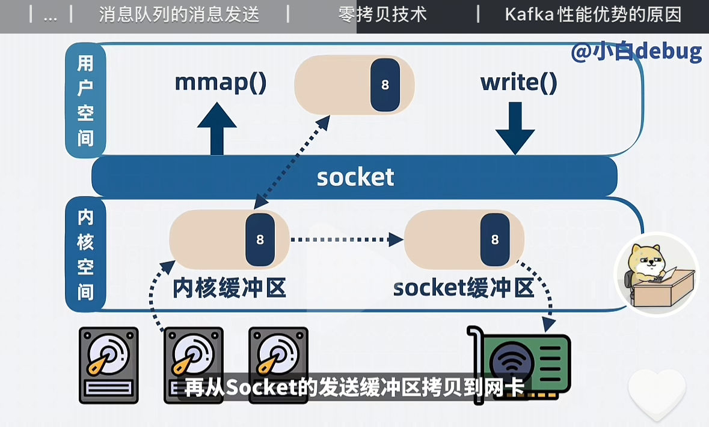

# <center>Kafka</center>

## Introduce

我们按照从头开始介绍 `Kafka` 消息队列。

1. 什么是消息队列

    首先，消息队列模型我认为可以简单的分成三个部分，`consumer`, `producer` 和 `messageQueue`.在三个部分组成了生产者和消费者的消息队列模型。最简单的思路就是，`consumer` 从 `mq`中消费获取消息，但是`producer` 生产消息，并且发送到 `mq` 中去。


2. 为什么需要消息队列

    一个很现实的情况就是，消息的提供者服务A 可能一秒生产 `200` 个消息，但是 服务B 可能一秒只能消费 `100` 个消息。那么我们就需要消息队列来存放这些还没有被轮到消费的消息。这样子就可以起到削峰填谷的作用。所以我们加一层中间层 **kafka** 


3. kafka 的架构

    kafka 的消息队列本质就是一个链表（队列），上面存放着的是每个已经标上序号的消息`offset`,方便我们记录位置。B服务根据自己的能力消费消息。


可能会出现以下的几种问题，我们从问题来展开进行优化:

1. 由于消息存储在B 服务的内存里。**如果此时 B服务更新重启，那么来不及处理掉的消息应该怎么解决呢？**

    这个比较简单，我们将这个内存中的消息队列单独的新开一个进程来进行管理。


2. 高性能怎么实现呢？

    我们看上面截止 **Step1** 的架构，其实已经是一个简陋的消息队列了，但是通常情况会遇到消费者的消费速度赶不上生产者的生产速度，所以这个时候，我们就可以 **拓展消息队列的消费者和生产者**，从而提升消息队列的吞吐量。

- 那么如果多个消费者 去抢夺一个消息队列，其实效率也是低下的，我们可以将消息进行分类，避免他们发生争抢，同时我们也可以保证消息处理的效率。

    1. 这个时候就需要我们将 `kafka` 中的消息分类，分成多个`topic`,然后不同的 `topic` 交由不同的消费者去处理，生产者将相同的消息存放在相同的 `topic` 中。这样子就可以避免消费者之间的相互抢夺了。
    - **问题** ： 问题又来了，如果单个 topic 的消息还是过多，我们应该如何处理呢?
        
        我们会选择使用 **分区** 的办法来处理，也就是将一个 **topic** 中的消息分成多个 **partition**分区，每一个消费者来负责一段的 `partition`,**大大的降低了互相之间的争抢**


3. 高扩展性 -> 高扩展性其实就是和 **分布式** 进行联系

    因为我们会遇到一个很现实的问题，如果我们都将 `partition` 置于同一台机器，优点是延迟会比较小，但是缺点也很明显，**拓展性很差**，会导致单机的 **CPU** 和内存的占用过高，从而性能下降。所以我们在这里考虑 **分布式** 来进行提高拓展性


    - 所以我们可以将多个 **partition** 分布到不同的机器上，那么不同的机器其实就分别代表着 **不同的Broker**.我们通过增加 **Broker** 来提高消息队列处理的性能问题

4. 高可用 

    我们依旧来考虑一个问题，就是如果 某个 **Broker** 挂了，那么这个时候怎么办？那么这个时候就会考虑主从节点来进行备份了。

    - 我们对每个 **Broker** 多加几个副本，也就是从节点，简称 **replicas**, 将他们分成 **Leader** 和 **Follower**,**Leader** 来负责消息队列中消费者和生产者的读写请求，而 **Follower** 来负责备份数据。这样子就可以保证 **高可用** 了。-> 分散到不同的 **Broker** 上。

5. 持久化

    如果所有的 **Broker** 都挂了，那么我们可能还需要考虑的问题就是因为我们存储在 **Broker**的内存中，那么我们需要将他们定期的持久化到磁盘中，这样才能保证数据不会丢失。

    - **过期淘汰策略(retention policy)** : 磁盘总是有限的，一直往磁盘中添加消息进行同步，肯定会导致磁盘空间不够用，所以我们需要定期的将过期的消息进行删除。可以设置一个过期时间，或者是达到多少条消息进行删除。这些就是我们需要考虑的 **过期淘汰策略** 了。

6. Consumer Group

    不同消费者组维护自己的消费进度，互不打搅

7. Zookeeper

    我们现在回过头来看，其实是有很多的组件了，那么就需要对他们进行管理和协调，这个时候我们就需要一个协调者来进行管理了。这个协调者就是 **Zookeeper**.它主要负责 **Broker** 的选举，负载均衡，配置管理，集群管理等功能。**Zookeeper** 作为一个分布式协调服务，可以帮助我们更好的管理分布式系统中的各个组件。

    - **Zookeeper** 可以定期的和这些 **Broker** 进行通信，从而来获取整个消息队列集群的状态，来监听消费者的消费进度，以及包括各个 **Broker** 的状态，是否会出现宕机的情况。这样子就可以保证整个消息队列的高可用性和高扩展性了。

## 底层存储 

**Kafka** 的底层存储，首先我们知道的是在 **topic** 中的理论处理的最小单位是 **partition**,但是事实上其实 **partition** 中的最小单位是 **Segment**,可以认为是一些小文件。本质上就是需要将数据写入到某个 **Segment** 文件下。

我们知道的是 在磁盘中的读写速度和读写的方式是有差别的，最快的办法就是 **顺序存储**，但是 **Kafka** 对于每个 **Segement** 的文件都是采用的是同时存储，但是这个问题就来了，如果对多个文件进行同时的写，那么就会导致磁盘的读写速度变慢。虽然每个文件都是顺序写，但是不同的文件存储在磁盘的不同位置，就会导致磁盘的读写头来回的跳动 **变成了近似的 随机读写**，从而降低了读写速度。


## 应用场景

> 主要的目的就是 **削峰填谷**

1. 秒杀活动
2. 大数据的异步同构
3. 日志的异步同构


### 零拷贝



我们通过上图来进行分析:

用户如果想要将数据发送到网络，其实需要发生上图的过程。 **2次系统调用** 和 **4次的拷贝**

**具体的过程如下:**
1. 我们在用户程序向系统发起了系统调用 **Read()** 想要读取磁盘中的数据
2. 内核空间接收到了系统调用请求，首先将数据拷贝到 **内核缓冲区**，然后从 **内核缓冲区** 拷贝到 **用户空间缓冲区** 
3. 此时，用户程序会调用 **Write()** 的系统调用，将数据从 **用户空间缓冲区** 拷贝到 **内核缓冲区** 中
4. 从 **内核缓冲区** 拷贝到 **网络设备缓冲区** 中，也就是网卡中。从而完成可以将数据发送到网络。

但是我们纵观上面的过程，其实拷贝的次数过多了，导致了性能的下降。


#### mmap 

`mmap` 其实是操作系统中的一个方法，目的是可以将 **内核空间** 中的缓冲区映射到了 **用户空间**，可以减少一次拷贝到过程。我们可以如下图进行所示:



我们同样需要两次 **系统调用**，但是 这次 **mmap** 的系统调用可以直接的省去了从 **内核缓冲区** 拷贝到 **用户态缓冲区** 这个过程。然后可以直接在内核缓冲区拷贝到 **Socket** 缓冲区，然后从 **Sokect** 缓冲区拷贝到网卡中。这样子就减少了一次拷贝的过程。


#### SendFile

我们继续优化，首先要明确的是， **零拷贝** 并不是指在用户态程序要发送消息给网络的过程零拷贝，而是不需要从内核态拷贝数据到用户态这个过程。

**SendFile** 也是操作系统提供的一种系统调用的方法，目的就是用来发送数据的。
在用户程序中发起 **sendFile** 这个系统调用的时候，就可以将磁盘中的文件拷贝到 **内核缓冲区** 中，同时可以将 **内核缓冲区** 的数据直接的拷贝到网卡。

**综上** 这个过程中其实发生了 一次系统调用，和两次的拷贝过程。这样子就减少了一次拷贝的过程。

这里的 **零拷贝** 其实指的是 **0CPU** 拷贝，也就是不需要 **CPU** 的参与，直接的通过 **DMA** 来进行数据的传输。不耽误 **CPU** 跑程序。


### Q1 为什么 Kafka 高性能？比 RocketMQ 高性能？

理由就是虽然都使用的是 **零拷贝** 技术，但是二者其实使用的系统调用是不同的。
两者的 **零拷贝** 对应的含义也是不同的:

- `RocketMQ` : 零拷贝指的是 **用户态** 和 **内核态** 之间的零拷贝，他使用的是系统调用 **mmap**

- `Kafka` : 零拷贝指的是 **内核态** 和 **内核态** 之间的零拷贝，也就是 **0CPU** 拷贝，利用 **DMA** 直接来进行管理和拷贝数据，而不耽误 **CPU** 的运行。而 **Kafka** 使用的是 **sendFile** 系统调用。

#### Q1.1 为什么 RocketMQ 使用 mmap 而不是 sendFile 呢？

我们或许可以从两个函数的调用方法可以看出端倪:

```c
int sendfile(int out_fd, int in_fd, off_t *offset, size_t count);


void *mmap(void *addr, size_t length, int prot, int flags, int fd, off_t offset);
```

- **mmap** 返回的是数据的具体内容，应用层能获取到消息的内容，并且能进行逻辑处理。 这个就和 **RocketMQ 在消息队列中的功能性做加法形成了闭环**，举个简单的例子，我们会考虑到 **死信队列**，那么就需要知道这个消费失败的消息的具体内容， 并且将它放到对应的队列中。而 **Kafka** 就需要程序员自己来实现这样的功能。 **Rocket** 可以算是在 **性能和功能性上做了一个折中**

- **sendFile** 返回的是发送的字节数，应用层只能知道发送了多少字节的数据，但是不能获取到具体的内容，也就是说应用层不能对消息进行逻辑处理。**sendFile** 会使得应用层不知道具体发生了什么数据，不能进行对应的逻辑处理，只是完成了数据的发送这个功能。

#### Q2 什么时候用 **Kafka** ? 什么时候用 **RocketMQ** ?

在大数据的时候，我们通常会使用 **Kafka**,追求极致的性能,但是其他的时候，尤其是和业务的逻辑处理相关的时候，我们尽可能的会使用 **RocketMQ**,因为它提供了更多的功能性，比如 **死信队列**，**消息回溯**等功能。