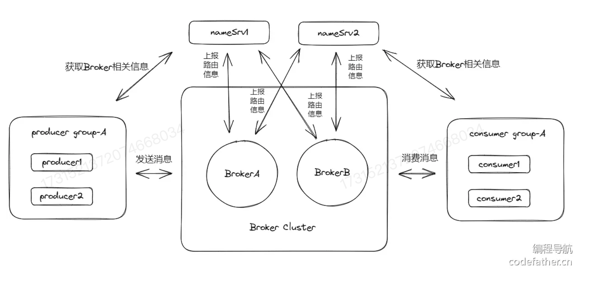
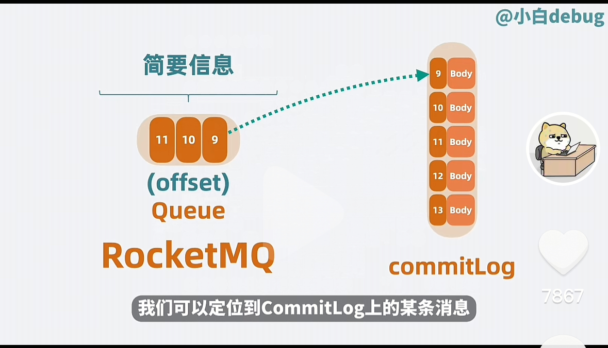

# 
RocketMQ

## 总览

我们观察上图，几个核心的角色:

- **Producer** : 生产者，负责生产消息
- **Producer Group** : 就是一个生产者的集合，里面可以是一些有相同功能的生产者
- **Consumer** : 消费者，负责消费消息
- **Consumer Group** : 就是一个消费者的集合，里面可以是一些有相同功能的消费者
- **Broker Cluster** : 就是一个集群，里面有很多个 Broker
- **Broker** : 就是一个消息的存储中心，负责存储消息
- **Topic** : 就是一个主题，里面包含了很多的消息
- **Message** : 就是一个消息，里面包含了消息的内容
- **nameServer** : 轻量级的服务发现和配置服务，是 `Zookeeper` 的替代品

我们在 **Kafka** 的部分中已经讲述了消息队列的基本原理和架构。接下来就重点介绍的是 **RocketMQ** 和 **Kafka** 之间的区别。
   
**进行综述** 我认为 **RocketMQ** 和 **Kafka** 之间是在架构上做减法，在功能性上做加法。

### 在架构上做加法

#### 简化协调节点

在 **Kafka** 中我们会使用 **Zookeeper** 进行协调节点和 **Broker** 进行通信，维护 **Kafka** 的集群信息，一个新的 **Broker** 加入到集群中，需要通过 **Zookeeper** 来进行协调。(在分布式环境下，能让多个分布式实例能够同时的获取到同一份信息的服务，就是 **分布式协调服务**) 

但是 **ZooKeeper** 存在以下的几种功能:

1. 服务注册和发现
2. 分布式锁配置和管理
3. 负载均衡...

但是 **Kafka** 其实并不需要那么多的功能，引入 **Zookeeper** 会使得整个系系统项目加重。我们在 **RocketMQ** 中就会放弃使用 **Zookeeper**,而选择了 **NameServer** 来进行轻量级的节点配置与维护。管理消息的集群信息。

 这里另外提一下，Kafka 也意识到了这个问题，在 **2.8.0** 版本的时候就已经移除了 **Zookeeper**,在 **Kafka** 中加入了 **Raft 一致性算法** 来替代分布式协调服务

1. 简化分区

在 **RocketMQ** 中也会将多个 **Topic** 进行分区，它选择了另一种 **名称** queue. 在 **Kafka** 中会将在 **patition** 中存放完整的信息，而 **queue** 中仅仅存放的是一些简要的信息(offset)，而消息的完整体会存储在 
**CommitLog** 中。这样子就可以简化分区的概念。

具体可以如下图所示:

我们在 **kafka** 中只需要阅读一次即可，但是在 **RocketMQ** 中则需要阅读两次，一次是从 **queue** 中读取到简要的信息，然后再去 **commitLog** 文件中读取完整的信息。

#### Rocket MQ 的底层存储

我们在 **Kafka** 的底层存储中已经知道，其实 **Kafka** 的底层存储是比较慢的，因为会出现随机的读写。**Rocket MQ**索性将单个 **Broker** 底下的多个 **Topic** 的数据全部的写到了一个文件 **CommitLog**上，就消除了随机写多文件的问题，将所有的写操作都变成了顺序写。这样子就大大的提高了读写的性能。

#### 简化备份模型

**RocketMQ** 的做法是同步 **CommitLog** 文件，而不是同步单个 **Topic** 底下的 **segement** 文件，尽可能保证磁盘上的读写是顺序的。这样子就可以简化备份模型。我们以 **Broker** 为单位进行备份，区分主从。

### 在功能性上做加法

1. **消息过滤** Kafka 中需要程序员来进行自行的过滤，但是 **RocketMQ** 中则是提供了 **Tag** 和 **SQL92** 语法来进行过滤。从而剩下了消费者在资源过滤的时候消耗
2. **支持事务** 但是其实 **Kafka** 中的事务定义和 **RocketMQ** 中的事务定义不太一样
    - **Kafka** 中的事务是指，消息生产者同时发送三条消息，那么就需要这三者同时的发送成功，或者发送失败
    - **RocketMQ** 中的事务是指，执行一些业务逻辑+生产者发送消息，如果业务逻辑执行成功，那么就发送消息，否则就不发送消息。
3. **延迟队列** 具有延迟消费的功能，比如定时外卖场景，到点了，订单才会投递给商家进行处理。
4. **死信队列** 消费消息如果失败，那么就可以利用重试功能进行重试，如果消息的多次重试失败了，那么 **RocketMQ** 会将消息放到一个 **死信队列** 方便我们后续进行单独的处理

5. **消息回溯** kafka 中不支持消息回溯，而 **RocketMQ** 中支持消息回溯，方便我们进行一些数据的统计和分析。不仅可以回溯 **offset** 还可以回溯 **时间**，也就是其实 **RocketMQ** 中的消息会附带 **时间戳**。

## 但事实上 **RocketMQ** 在性能上，或者更严谨的 **吞吐上** 是不如 **Kafka** 的。这个是什么原因呢？

**零拷贝** 具体的内容可以见 **Kafka** 中的讲解
