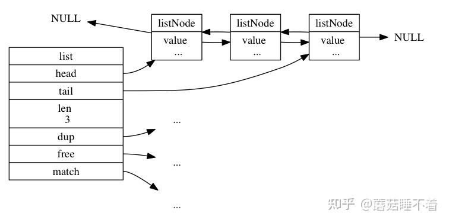
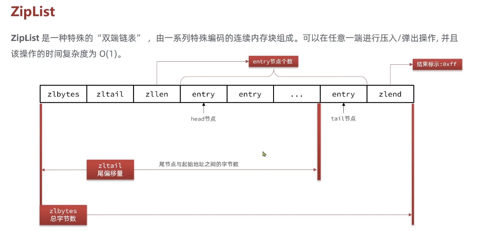

# <center>数据结构</center>

## Introduce
我们的 `value` 的类型中的底层实现，就是利用一些内置的数据结构来实现的

下面来介绍一下 `Redis` 中的一些底层数据结构

## 数据结构
### SDS 简单动态字符串 
在C语言中，默认是没有字符串类型的，只有 `char*`,这样子获得字符串长度都需要遍历一遍，所以 `Redis` 自己实现了一个动态字符串类型 `SDS` 来存储字符串。


它的本质是 `C语言` 中的一个结构体，具体如下:
```c
#define SDS_TYPE_5 -> 0 
#define SDS_TYPE_8 -> 1
// ... 用来声明不同的类型 


struct __attribute__ ((__packed__)) sdshdr8 {
    uint8_t len; // 记录当前字符串的长度，字节数
    uint8_t alloc; // buf 申请的总字节数
    unsigned char flags; // 不同 SDS 的头类型，用来控制SDS的头大小
    char buf[]; // 存储字符串的地方
};
```

能够支持多种类型的字符串,其实也是利用了空间来换取时间。我们不需要直接的遍历整个字符串来获取长度，而是直接的通过 `len` 来获取长度。

- 如果新字符串小于 1M，则新空间就会拓展字符串长度的两倍 +1
- 如果新的字符串大于 1M，则新空间为扩展后的字符串长度+1M+1 **内存预分配**

- 获取字符串长度的时间复杂度为 $O(1)$
- 二进制安全
- 减少内存分配次数
- 支持动态扩容


### InSet
`InSet` 是Redis中set集合的一种实现方式，基于**整数数组**来进行实现，并且具备长度可变，有序的特征。

```c
#define INSERT_ENC_INT16 (sizeof(int16_t)) //2字节整数，范围类似 java 的short
#define INSERT_ENC_INT32 4 // 4字节整数
#define INSERT_ENC_INT64 8 // 8字节整数 long 

typedef struct intset{
    // 编码方式，用来记录支持存放几位整数;
    uint32_t encoding;
    // 元素个数
    uint32_t length;
    // 整数数组，保存集合数据 int8_t
    int8_t contents[];
}intset;
```

我们对于 `contents` 的大小是由 `encoding`来决定的。
`InSet` 的元素是有序的，但是不支持重复元素的插入。统一编码原则就是为了方便来进行寻址。

InSet 的扩容，当出现插入的元素已经在 `Inset` 编码规定的大小之外:

- 那么就会升级一种编码方式
- 并且倒序的将原来的数据拷贝到新的 `Inset` 中。也就是先将最后面的元素进行拷贝，然后再将前面的元素进行拷贝。
- 将最后的元素进行插入


### Dictionary 
我们根据键实现快速的增删改查，键与值的映射关系用Dict来实现。

它是由三部分组成的:

- `DictHashTable` 哈希表
- `DictEntry` 哈希节点
- `Dict` 字典


```c
// 
typedef struct dict{
    dictType *type; // 类型特定函数
    void *privdata; // 私有数据
    dictht ht[2]; // 哈希表
    long rehashidx; // rehash 索引
    int16_t pauserehash; // 是否暂停rehash 0->继续，1->暂停
}

// 定义了HashTable的结构
typedef struct dictht{
    dictEntry **table; // 哈希表数组
    unsigned long size; // 哈希表大小
    unsigned long sizemask; // 哈希表大小掩码，用来计算索引
    unsigned long used; // 已经使用的节点个数 -> 也就是Entry个数
}dictht;

// 定义Node;
typedef struct dictEntry{
    void *key;
    union{
        void *val;
        uint64_t u64;
        int64_t s64;
        double d;
    }v;
    struct dictEntry *next; // 指向下一个节点，形成链表
}dictEntry;

```

Redis 先根据Key计算出 hash 值(h),然后利用 `h&sizemask` 来计算出索引值。

其实有点像`Java`中的`HashTable`的实现方式类似。
为什么需要两个 `HashTable`就是因为为了在 `rehash` 的时候进行数据的迁移使用。

<span style = "color : red">Redis 发生Hash冲突的时候</span>
使用的是 头插法，也就是将冲突的新节点放到链表的头部，这样子可以减少冲突的概率。


**ReHash 的过程:**
> Rehash 的过程是渐进的，也就是说不是一次性的。而是分多次的，因为当数据量大的时候，如果一次性的进行迁移会造成服务器的阻塞。因为 **我们有一个 **rehashidx** 的坐标作为标识来维护这个是否仍然在Rehash. 会在每一次进行对这个字典的 添加、删除、查找、更新的操作的时候，顺带将rehashidx索引上的所有键值对rehash到ht[1]，然后`rehashidx+1`

- 为 ht[1] 哈希表分配空间，这个哈希表的空间大小取决于执行的操作:

    - 如果是扩展操作，`ht[1]` 的大小为第一个大于等于`ht[0].used*2` 的$2^n$ 
    - 如果是执行的是收缩操作，那么 `ht[1]`的大小是第一个大于等于`ht[0].used`的$2^n$

- 将保存在`ht[0]` 的所有简直对rehash到 `ht[1]` 上

- 释放`ht[0]`,并且将`ht[1]`设置为`ht[0]`,并且将`ht[1]`设置为`NULL`


- 如果服务器执行了`BGSAVE` 或者`BGREWRITEAOF`命令，并且此时的负载因子大于等于1，那么就会进行rehash

- 或者负载因子大于5，并且在执行上述的命令的。


### Linked-List



对于链表，就比较简单了 **发布与订阅，慢查询、监视器等功能**
也会用到了链表。Redis服务器本身还是用了链表来存储多个客户端的状态信息，以及使用了链表来构建客户端的输出缓冲区。

```c
// 结点值
typedef struct listNode{
    // 前置节点
    struct listNode *prev;

    // 后置节点
    struct listNode *next;

    // 节点值
    void* value;
}listNode;

// 链表
typedef struct list{
    // 表头节点
    listNode* head;
    // 表尾节点
    listNode* tail;

    unsigned long len;

    // 节点复制函数;
    void *(*dup)(void* ptr);

    // 节点值释放函数;
    void (*free)(void* ptr);

    // 节点值对比函数
    int (*match)(void* ptr, void *key);

}
```


简单的来说就是底层的链表是一个双向链表，还有个特性是多态，就是通过 `list` 结构的 `dup`,`free`,`match` 三个属性为节点值设定特定类型的函数，所以链表可以用于保存不同类型的值。


### SkipList
跳表是一种有序的数据结构，它通过每个节点中维持多个指向其他节点的指针，从而达到快速访问某些节点的目的。而且大部分情况下，跳表是能够和平衡树媲美的，并且跳表的实现要比平衡树来的简单。


**用途:**

- 实现有序集合键
- 集群节点中用作内部数据结构

```c
typedef struct zskiplistNode{
    // 后退指针
    struct zskiplistNode *backward;

    // 分值
    double score;

     // 成员对象
    robj *obj;

    // 层
    struct zskiplistLevel {

        // 前进指针
        struct zskiplistNode *forward;

        // 跨度
        unsigned int span;

    } level[];

} zskiplistNode;
```

**幂次定律，越大的数出现的概率越小，选择了给每个节点随机生成一个 0~32 大小的数组来作为 level**

### zipList 



压缩列表，主要是Redis为了优化内存使用而设计的一种紧凑的数据结构，用来存储少量元素的 **列表键** 和 **哈希键** 的底层实现。

核心思想就是 通过连续内存布局和特殊的编码，减少指针和元数据的内存开销，从而在小数据场景下显著节省内存。可以堪称看成一种 **特殊的双向链表**


压缩表的组成:

- `zlbytes` : 保存整个压缩列表的长度
- `zltail` : 保存压缩列表的尾节点的偏移量
- `zllen` : 保存压缩列表的长度

`zipList` 中的每个entry的内存大小是不固定的，它的大小是由entry的内容决定的，所以它的内存大小是不固定的。

```c
typedef ziplistNode{
    // 前一个entry的长度 1/5
    unsigned int prevrawlensize;
    // 当前entry的长度 
    unsigned int len;
    // 当前entry的内容 1 2 5
    unsigned char encoding;
    unsigned char content[];
}
```

因为是利用地址偏移来获取下一个节点的地址，所以我们对于比较小的数据来说吗，它的效率是比较高的。而且它的内存是连续的，所以查询也会比较快。但是如果当数据比较大的时候，它的效率就会比较低了。因为是通过遍历每一个节点来获取下一个节点的地址，**地址偏移**，所以它的时间复杂度是 $O(N)$


#### Encoding 编码

- 字符串 -> `00,01,10` 开头，则证明content 
    - `00` -> 1字节
    - `01` -> 2字节
    - `10` -> 5字节

- 整数 -> `11` 开头

    - `11000000` -> int16_t 2 字节
    - `11010000` -> int32_t 4 字节
    - `11100000` -> int64_t 8 字节
    - `11110000` -> 24位整数
    - `11111110` -> 8位整数
    - `1111xxxx` -> 4位整数

但是 事实上 `Redis 7.0` 压缩列表已经废弃了，因为它的性能不是很好，所以在新的版本中已经不再使用了。改成了listPack的底层实现。

#### ListPack

在 `Redis5.0` 中已经不适用 `zipList`了，而是使用`listPack`,进行的改动是 每个 `entry` 不再保存的是前一个节点的`len`,而是保存了本身的这个节点的`len`了，虽然看起来优化不那么大，其实比较重要的优化就是 在进行插入/删除操作的时候，就不用严重的依赖前一个节点的更新了，只用保存当前变化的节点的数据即可。  


### Questions:

#### Q1 为什么 Redis 中使用跳表，而不是使用B+Tree呢？
1. 内存结构与访问模式的差异

    - B+Tree 是属于磁盘友好型，目的是优化磁盘I/O,通过减少树的高度来降低磁盘的寻址次数。
    - 节点填充率比较高
    - 范围查询高效

    - Redis中的SkipList,通过多级索引来加速查询，内存访问的模式更符合CPU的缓存局部性(指针跳跃更少)
    - 简单灵活：插入/删除时仅需要调整局部指针
    - 概率平衡，避免了严格的平衡约束，实现更简单

2. 实现复杂度的对比

    - B+Tree的实现复杂度更高，需要考虑平衡性，节点分裂与合并等操作
    - SkipList的实现更简单，只需要考虑插入与删除操作，对于Redis这种追求高性能和代码简介的项目，跳表的低实现复杂度更具吸引力

3. 查询性能

    - 单表查询：跳表和B+Tree的查询性能相差不大，但是跳表的实际查询常数会更小，因为在内存中的操作是要快于磁盘的。
    - 范围查询，B+Tree的范围查询更高效，因为B+Tree的叶子节点是有序的，可以通过范围查询的方式来获取数据。但是跳表支持双向链表，所以也是能够稍微高效的支持 `ZRANGE`操作的

4. 写入性能

    - B+Tree 插入可能会触发节点分裂，有较高的维护成本
    - 跳表插入只需要调整局部指针，维护成本更低

5. 内存占用

    - B+Tree的节点结构更复杂，占用更多的内存
    - 跳表的节点结构更简单，占用更少的内存


#### String 是使用什么保存的？为什么不适用C语言中的字符串？

是使用 Redis 新建的数据结构，**SDS(Simple Dynamic String)**来进行保存字符串，好处就是：

1. 二进制安全，因为在C语言中的字符串的末尾都是 '\0'作为终止符，倘若如果存在某个字符串存于缓存的时候，也是这样存储，那么就会导致二进制不安全，会出现取`value`的时候会出现遗漏的情况。

2. 方便直接读取字符串的长度，因为 `char* `类型如果想要获得字符串的长度，我们需要直接的遍历整个字符数组，从而导致在获取长度的时候，需要 $O(N)$的时间复杂度。

3. <span style="color :red">这个是我没想到的: </span> 避免缓冲区溢出，因为在 `SDS` 这个数据结构中，会有一个 `alloc` 的成员变量，好处就在于因为我们也存了 `len` 这个成员变量，所以可以通过比较这两个值来判断是否需要进行扩容，从而避免了缓冲区溢出的情况。