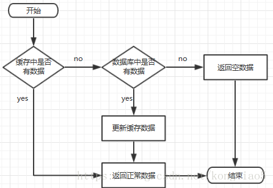
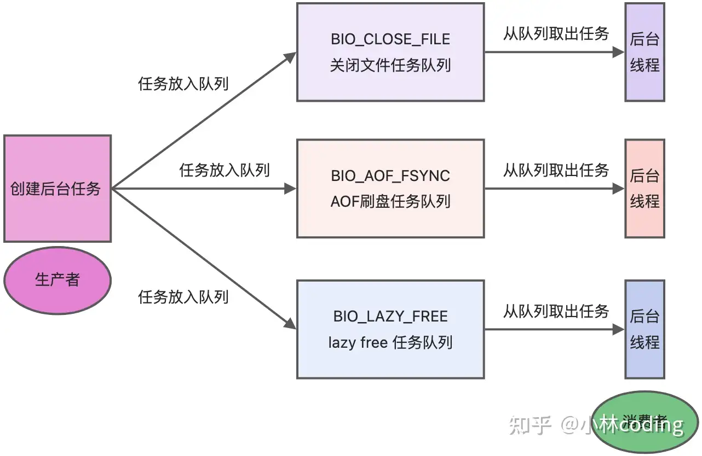
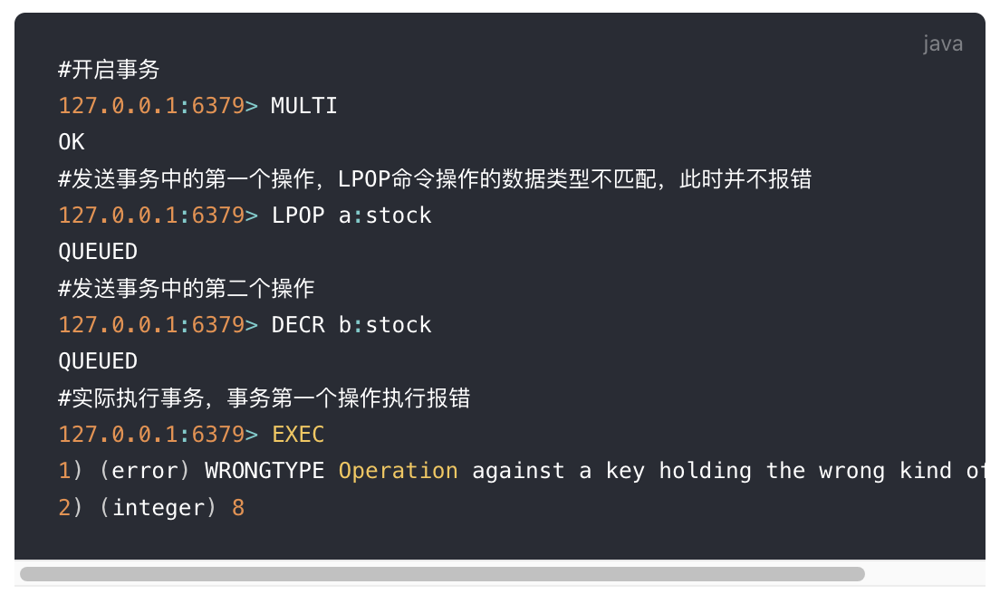
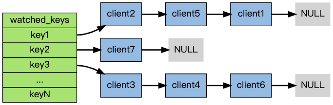

# <center>Introduce</center>

## Introduction

**Redis** 是一个后端开发常用的中间件，用于缓存数据库。它的全称其实是 (Remote Dictionary Server) 远程字典服务。 NoSql 数据库的一种。

为什么会引入呢？

- 分布式缓存，提高数据访问速度，分担Mysql的压力
- 因为我们平时的应用基本是都是读多写少，那么Mysql更侧重于存储，一致性，硬盘，而Redis更侧重于读取，所以可以提高效率
  
    - 硬件角度 : Redis -> memory ,Mysql -> disk
    


### 特点:

- 键值型 ： value 支持有多种数据结构,功能丰富
- 单线程 ：每个命令都是具备原子性
- 低延迟，速度快 (**基于内存(核心)**，IO多路复用，良好的编码)
- 支持数据持久化
- 支持主从集群(备份)，分片集群
- 支持多语言客户端


## 命令
### 基本命令

- `KEYS` : 查询所有符合模版的 `Key`

- `DEL` : 删除某个指定的/某些指定的 `Key`

- `EXISTS` : 判断某个 `Key` 是否存在

- `EXPIRE` : 设置某个 `Key` 的过期时间,等时间到了之后，会自动删除

- `TTL` : 查看某个 `Key` 的剩余时间

    - `-2` : 不存在，已经过期了
    - `-1` : 没有设置过期时间，说明永久有效

## 数据结构 
### 值的数据结构类型
> Redis的 key 值都是`string`,而 value 值是支持多种数据结构的，比如常见的五种: `string`,`Hash`,`List`,`Set`,`Zset（有序集合）` (基本类型)

#### String 
> 最大空间不能超过 512 MB 
对于 val 为 `String` 的类型，可以分成三种:

- `string`
- `int` 

    在`Redis`中的 `int` 类型是以二进制数直接存储的，一个字节可以表示很大的数。但是字符串类型的话还是正常的字符串存储。

- `float`

首先看一张图:


#### List类型

- 消息队列

#### Hash类型
- 缓存对象 因为Hash有标识性的特点，可以用来存储对象，比如用户信息，商品信息等等，能让我们更快的找到这个对象。且唯一性。
- 购物车

#### Set类型
- 聚合运算 : 点赞，共同关注，抽奖活动...

#### Zset类型
**运用场景:**
- 排序场景，排行榜，姓名电话的排序

**怎么实现的呢？**
底层是通过 跳表/压缩列表


以排行榜为例:

- `ZADD` 指令，用于增加元素
- `ZINCRBY` 指令，递增某个元素的值
- `ZREVRANGE` 获取某个范围的元素


## 日志 

日志是很重要的，可以帮助我们进行溯源，排查问题。一个很现实的问题就是，因为我们的 Redis 虽然是在内存中进行读写操作，但是缓存中记录的数据是很重要的，我们不能让它丢失，那么持久性的问题就是一个很重要的问题。<span style = "color:red">那么日志就是一个很重要的组成了</span>

主要的日志分成两种:

- `AOF日志` : Append Only File,也就是刷盘操作的日志,刷盘操作的日志已经详细介绍过了。目的就是同步的将Redis中的数据及时的写入磁盘中。但是会有一定的性能损耗，尤其是对于 `Always` 这种类型的 AOF 日志。
- `RDB日志` : Redis DataBase,也就是快照的日志，**将某一时刻的内存数据，以二进制的方式写入磁盘中**

**这里有一个很现实的问题:**

我们的 AOF 日志记录是操作指令，所以会将所有的操作都进行记录下来，所以在发生故障的时候，也需要进行遍历才能恢复数据，这样明显是一种效率低下的方式。所以我们引入了 RDB 的快照日志的方式。字面意思就是 记录某一个时刻的数据。所以 RDB 快照就是记录某一个瞬间的内存数据，记录的是实际数据，而AOF记录的是命令操作的数据。我们只需要将RDB文件读入内存即可。<span style = "color:red">对于 AOF 日志，虽然是最完善的，但是如果想要恢复数据，那么需要重新模拟操作一遍，才能算是恢复数据</span>

### RDB 日志的命令

- `save` : 会在主线程中记录下当前内存的数据，由于执行操作命令和`save` 都是由`redis-server`这个线程进行操作的，所以能保证数据的一致性。但是会阻塞住主线程，所以不适合生产环境。

- `bgsave` : 后台保存，会创建一个子进程来进行保存操作，不会阻塞主线程，适合生产环境。

### 两种日志之间有什么优缺点呢？

- `AOF` : 

    - 优点 : 这个是最可靠的恢复方式，因为记录的是每个操作的详细情况。而且会保存到直到宕机的时候到最后一条操作，在恢复数据的时候，只需要重新执行一遍就可以了。
    - 缺点 ： 
        - 会有一定的性能损耗，尤其是 `Always` 这种类型的 AOF 日志。
        - 而且另一个缺点也很明显，就是在恢复数据的时候，需要重新执行一遍，这样会导致恢复数据的时间会比较长。
        - 会占用更多的磁盘空间，因为是每个操作都会记录下来，所以会占用更多的磁盘空间。

- `RDB(Redis DataBase)`:

    - 优点 :
        - 损耗的磁盘空间会比较小
        - 而且比较方便，只需要定期异步子线程进行保存当前内存的数据即可。
    - 缺点 :
        - 也正是定期进行保存的，所以如果宕机发生在两次保存之间，那么就会丢失部分数据。

### 二者是独立的

就是一个很现实的问题，首先 RDB 肯定是会覆盖的，我们每次保存一次快照读的时候，都会覆盖上一次的快照。但是 AOF 日志是不会覆盖的。

<span style = "color:red">但是，有趣的是，我们可以 `Rewrite` 日志，也就是说 每次让对应的键值对都保证为最新的值，因为在这之前的操作都是无效的，会自己进行覆盖，那么我们为了节省磁盘的损耗，可以选择定期的对AOF日志进行重写</span>

Redis恢复数据的时候，是优先选择 **AOF** 进行恢复的，因为它是最可靠的。如果AOF日志丢失了，那么就会选择 **RDB** 进行恢复。


## 八股 

### Q1 什么是缓存穿透

缓存穿透是指 *在缓存和数据库中都不存在这个待找数据的情况下，但是用户在不断的发送请求。由于缓存是不命中的时候进行被动写入的，如果存储层查不到数据，就不写入缓存。所以这种情况就会失去了缓存的意义。 

**-> 问题所在：**当流量过大的时候，DB会被直接挂掉，所以可能会出现有人刻意用不存在的数据进行攻击。这个就是缓存穿透的问题。

**解决办法：** 

1. 接口层进行校验，先筛去一部分可以明显校验出不符合规范的请求，比如 **ID<0** 云云，就可以避免了进行后续的检查的两步。

2. 我们选择如果不存在的数据，进行插入 `key:null` 的空值，并且设置缓存的有效时间，比如这个空值设置断点 30s,防止某个用户对同一个不存在的数据进行反复的请求。我们只需要后面一直返回 `null` 即可。


### Q2 缓存击穿

是指 缓存中没有数据，但是MySql中有，这种时候由于 **并发** 用户特别多，同时读缓存没有读取数据，又同时去数据库取数据等情况，就会导致数据库压力过大。


**->问题所在** 因为频繁的查询数据库会导致数据库的压力过大，甚至会导致数据库的宕机。

**解决方案** 

1. 将热点的数据设置为 **用不过期**

2. 接口限流，熔断与降级，对于重要的接口来进行保护，防止用户恶意刷接口 

3. 布隆过滤器 `bloomfilter` 类似一个HashSet 用于快速判断某个元素是否在集合中，不存在就直接返回。

    - 优点 : 空间利用率和查询时间都远远超过一般的算法
    - 缺点 : 有一定的误判，删除困难

4. 加互斥锁，因为是同一时间对于同一个数据的并发访问，这个是最自然的想法.

```java
public static String getData(String key) throws InterruptedException
{
    // 从缓存中读取数据;
    String result = getDataFromRedis(key);
    // 缓存中如果不存在数据
    if(result == null){
        // 去获取锁，获取成功就去数据库中取数据
        if(reenLock.tryLock()){
            result = getDataFromMysql(key);
            if(result!=null){
                // 预热缓存
                setDataToRedis(result);
            }
            // 释放锁
            reenLock.unlock();
        }else{
            // 等待锁
            Thread.sleep(100);
            result = getData(key);
        }
    }
    return result;
}
```

### Q3 缓存雪崩
缓存雪崩，怎么理解雪崩？是指**缓存中数据大批量到期过时**，而查询的数据量巨大，导致数据库压力过大，甚至宕机。与缓存击穿不同的是，缓存击穿时并发查同一条数据，但是雪崩是指不同数据都过期了，很多数据都查不到从而查数据库。

**解决方案**
1. 给缓存的数据加随机的过期时间，也就是不让他们在相同的时间过期，防止同一时期内大量数据过期导致的数据库压力过大。

2. 如果缓存数据是分布式的部署，将热点数据均匀分布到不同的缓存节点上，这样即使某个节点挂掉，也不会导致热点数据全部失效。

3. 设置热点数据永不过期。


### Q4 为什么会使用Redis,而不是使用Mysql来做缓存呢？

- **高性能** `Redis` 支持高速查询，因为Redis的数据是存储在内存中的，和Mysql在磁盘上进行操作，性能要快很多，大概是10倍的差距。

- **高并发** 单台设备的Redis 的 QPS (Query per Second) 可以达到 10w/s,但是Mysql的话只有 1w/s。


### Q5 怎么理解 Redis 的单线程的呢？这个不是又与它支持高并发矛盾了吗？

我们常说的 Redis 是单线程，其实是指

- 接受到客户端的请求
- 解析请求
- 进行数据读写等操作
- 发送数据给客户端

以上的四个过程。但是 Redis 的程序并不是单线程的，Redis启动的时候，是会启动 **后台线程(BIO)的**

- 关闭文件 会单独启动一个线程来关闭文件
- AOF 刷盘(Append Only File) 会单独启动一个线程来进行 AOF 的刷盘操作

    - AOF 是Redis持久化机制的核心之一。通过记录所有写的操作命令来保证数据的持久化。将AOF 缓冲区中的数据写入磁盘，直接影响数据的安全性与性能。
        -  当然，目的也很明显 **防止在系统当即的时候丢失存储于缓冲区中的写数据**
        -  但是相比之下，有不好的点就在于，<span style = "color : red">AOF操作是有内存损耗的，同时这个操作不是实时更新的</span>，因为可能有些写的操作还只是记录在 AOF 缓冲区，但是此时系统宕机了，那么这部分的缓存数据就丢失了，需要到时候用到的时候，从Mysql的磁盘中进行及时的恢复。
    - AOF 也是分成几种类型的,分别对应不同的使用场景:
        - `always` : 每次写操作都会记录到AOF文件中,对于金融等高敏感的使用场景,但是会频繁的阻塞主线程。保证了安全，但是性能会有所下降 **always 是同步刷盘，而不是异步，严格的保证了安全性**
        - `everysec` : 每秒记录一次,异步批量写入,性能和安全的一个平衡点
        - `no` : 不记录

- 异步释放Redis的内存，也就是 `lazyFree` 线程。之所以需要异步的来进行内存的释放，是因为如果存在那么比较大的`Key`的时候，我们同步的进行释放，那么就会导致我们的主线程阻塞，所以我们需要异步的来进行释放。

其实这里 也是一个 任务队列的模型。生产者就是 **创建后台任务**，比如 需要 AOF 刷盘了，或者关闭文件了，抑或是需要把内存Lazy_Free了，那么就会把这些待执行的任务放入队列之中，交由 `BIO` 后台线程来进行处理。 世界是一个巨大的任务队列。



**BIO**后台线程要做的就是不断的轮询这个任务队列，然后进行任务的处理。


Redis 依旧是利用 **单线程** 来处理命令的执行，但是利用多线程来完成网络请求的。默认情况下 IO 多线程只针对发送响应数据(write client socket)，并不会以多线程的方式处理读请求。

所以我们可以知道的是 Redis 6.0 之后，引入了多线程的方式，也就是说会额外创建6个线程:

- Redis-server : 主线程负责接收客户端的请求，解析请求，执行命令，返回结果

- Redis-bio : 

    - 负责 AOF 的刷盘操作
    - 异步处理关闭文件
    - 释放内存文件

- io_thd_1 *3 : 3个线程负责读取客户端的请求

多线程只是为了 **提高网络IO的并行度，但是对于命令的执行，Redis仍然使用单线程来进行处理**


### Q6 怎么保证 Redis 是原子性的呢？

其实很好理解，我们从本质上出发，**Redis本身就是单线程的。不存在线程安全的问题**，所以 Redis 的每个命令都是原子性的。
 
#### Q6.1 那么如果让Redis保证2条指令是原子性的呢？
- **lua 脚本** : 我们可以使用 lua 脚本来进行执行.把整个Lua脚本当成一个整体执行，执行的过程不会被其他的命令打断。其实就有点像整理一个绑定的事件，看成了一个整体。

- **事务** : 如果 Redis 的事务正常执行，没有发生任何错误，那么 `MULTI` 和 `EXEC` 之间配合起来使用，就可以保证原子性。



Redis 的事务只有在正确的前提下，才能保证原子性。Redis事务执行中如果某一个操作执行失败，就不能保证原子性了。 <span style = "color : red">Redis 没有回滚机制 RollBack</span>


- `MULTI` : 就是声明了一个任务队列，来放置后续的这个事务中需要执行的命令

    - 开始事务 -> 此时Redis会进入一个事务的状态，后续的命令都会被放入一个队列中，等待执行，不会立即的执行
    - 命令入队
    - 执行事务
    - <span style = "color :red">倘若出现了命令性的错误，那么在执行EXEC命令的时候，就都不进行执行操作</span>

- `DISCARD` : 取消事务，清空队列
- `UNWATCH` : 取消 `WATCH` 命令对所有 key 的监视
- `WATCH` : 监视一个或多个 key ，如果在事务执行之前这个 key 被其他命令所改动，那么事务将被打断

### Q7 你知道 watch 命令的实现原理吗？

`WATCH` 命令的作用:

`WATCH` 命令是用来监视一个或多个 key ，如果在事务执行之前这个 key 被其他命令所改动，那么事务将被打断。



其实就是很简单的一个Map(Dictionary)来进行记录了被 `WATCH` 的键值对，然后后面的`value`跟的是一个链表，表示的是这个键值对被哪些客户端监视着。


触发条件：

在任何对`Key Space` 进行修改命令的成功执行之后，`multi.c/touchWatchedKey`函数都会被调用，来查看这些命令中指明的键是否被监视，如果被监视，那么程序就会将所有监视这个/些被修改的键的客户端 的 `REDIS_DIRTY_CAS` 标识打开。


