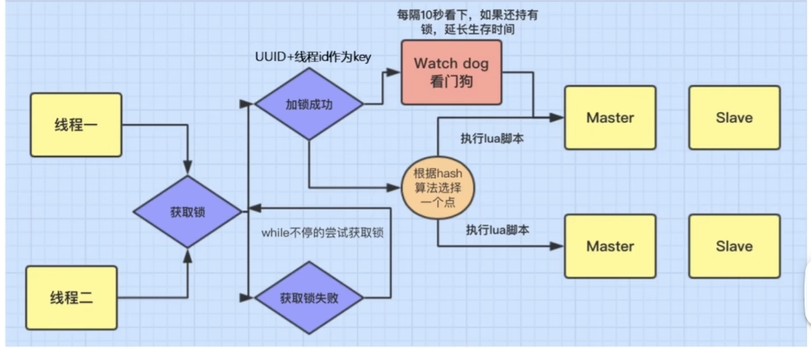

# <center>场景题</center>

### Q1 Redis 和 本地缓存的区别是什么？

其实，`Redis`的优势就在于，它是分布式的存储而且基于内存。而本地缓存是存储在本地引用程序以及服务器上，但是 **只能是本地**。所以二者的优缺点就很明显了:

- **速度** : 速度方面，`Redis`是基于内存的，所以速度是非常快的。而本地缓存是存储在本地的，所以速度也是很快的。但是 `Redis`可能会涉及分布式的问题，所以速度可能会慢一些。而本地缓存是从本地直接读取，因此速度会更快一点。刚好，有时候对于存储会分成三级，分别是本地缓存、Redis、数据库。**最大限度的提高数据访问的性能，同时保证了数据的一致性**

- **网络延迟方面:** 其实很好理解，因为是分布式存储缓存，那么如果遇上网络通信不好的情况，那么就会导致延迟。而本地缓存是存储在本地的，所以不会有网络延迟的问题。

- **拓展性:** 其实也很自然，Redis是分布式缓存，可以进行拓展，而本地缓存是存储在本地的，所以不具备拓展性。所以 前者的使用范围更广。


### Q2 Redis 的应用场景:

- **缓存** : 这个很好理解，存储方便，同时读取缓存的速度也是快的。
- **排行榜** : 因为`Redis`中有一个`Zset`的数据类型，可以进行排行榜的存储。
- **分布式锁** : 因为`Redis`是单线程的，所以可以用来进行分布式锁的存储。
- **消息队列** : 因为`Redis`有`List`的数据类型，可以用来进行消息队列的存储。可以实现一个轻量的消息队列。
- **计数器** : Redis 中的操作都是原子性的，可以进行计数器和统计数据的存储，比如网站访问量的统计，点赞功能的统计。

### 什么是分布式锁呢？

**分布式锁** 是一种在分布式系统中协调多个节点（服务实例、进程或线程）对共享资源进行互斥访问的机制。其核心目标是确保在分布式环境下，同一时刻只有一个节点可以执行某个关键操作（如修改共享数据、访问外部服务等），从而避免并发导致的资源竞争和数据不一致问题。


我们也可以这样理解，之前遇到的锁都是 **线程之间对于共享资源的占用，所以需要加锁**，但是这里我们需要考虑的是 **分布式中的不同节点的需要加锁，来对共享资源的互斥访问**

**场景:** 一个简单的场景，电商系统中的不同用户同时抢购同一个商品，要保证库存的原子性增减，就需要使用分布式锁

- 通过 **分布式锁** 可以保证在同一时刻只有一个用户可以抢购成功，避免超卖的情况

我们在单服务器的时候，只用考虑 **线程之间的锁**，但是在分布式的情况下，我们需要考虑 **不同节点之间的锁**，所以就需要引入 **分布式锁** 的概念。因为 如果是分布式的情况，那么每一台服务器，其实就可以允许 一个线程来访问，这样子 多台服务器又回到了多个线程的情况，所以就需要引入 **分布式锁** 的概念。不然的，我们的同步锁也只是锁住了一台服务器的线程，而不是多台服务器的线程。 <span style : "color:red">在处理负载均衡的时候，就会出现问题，所以我们需要用到分布式锁来处理</span>

为了解决超卖问题，我们逐步来进行分析:

1. 当服务器压力不是很大的时候:
    - 如果我们只是进行不用锁的保护，会出现超卖的情况
    - 如果使用 **锁保护**，我们进行单一服务器，那么的确可以做到保护的情况，但是如果有多台服务器，那么就会出现问题。

2. 当服务器压力很大的时候，我们通常会选择 `Nginx` 进行负载均衡，输送流量给不同的服务器来减轻同一服务器的负担。但是这样子就会出现问题，因为每一台服务器都是独立的，所以就会出现超卖的情况。<span style = "color:red">因为 对于不同的服务器来说，他们本身也可以支持单线程，**加锁情况下**，但是我们把所有的服务器放在一起来看，就会发现，其实又回到了多线程的情况了。</span>

    - 同步锁是 **JVM** 级别的，只能锁住该台服务器的该个线程。
    - 使用分布式锁，也就是能保证了所有的服务器下，对于一个共享资源，只有单一的一台服务器的一个线程可以访问，这样就可以避免超卖的情况。

接下来我们来看看具体是怎么实现的:


#### 分布式锁的实现？

##### Mysql 数据库中的分布式锁

我们可以利用数据库的唯一索引来进行实现:
```sql
CREATE TABLE distributed_lock (
    id INT PRIMARY KEY,
    lock_key VARCHAR(255) UNIQUE,
    owner VARCHAR(255),
    expire_time TIMESTAMP
);
```

##### Redis 中的分布锁保护 SetNx

setNx 全称就是 **(Set if Not Exist)**
当且仅当指定的 **KEY**不存在的时候，设置该 **KEY**的值，如果键存在，那么就不做任何操作。

```bash
SETNX lock_key unique_value

# return 1 设置成功（也就是获取到锁了）
# return 0 设置失败（也就是没有获取到锁） 因为 it exists
```


所以我们就可以在对每次请求/操作的时候，统一一个指定的键来进行区分。就是在进行操作的时候，设置这个 `SetNx` 的值，如果返回的是 `1`，那么就说明获取到了锁，可以进行操作，如果返回的是 `0`，那么就说明没有获取到锁，就需要等待。接下来其他并发的线程就进入了自旋状态。

<span style = "color:red">Warning:</span>

问题1 : **死锁问题**

我们需要在这里 利用 `Expire`对这个`Key`值添加一个过期时间。为的避免的就是在进行操作的时候，万一服务器挂掉了，这个时候就可以避免死锁的情况。

问题2 : **释放锁问题**

同样的，有一种情况就是，我们设置了锁的过期时间，但是万一在锁过期的时候，我们操作还没有完成，这个时候就会出现问题。所以我们需要在这里进行释放锁的操作。也就是可以对锁进行续租的操作。

- 可以增加锁的过期时间
- 我们可以增加一个子线程，目的是用来心跳检测，也就是每10s的时候来确定一下目前这个上锁的线程是否仍然在进行。
    - 如果不在进行了，那么就可以释放锁。
    - 如果在线的话，就重新续约。

问题3 : 这个问题是根据上面的问题衍生而来的

可能出现的一种情况就是，万一锁在该线程完成前就释放了，其他的线程就会乘虚而入，**等线程1完成的时候，就会释放线程2的锁**，这个时候就会导致 **锁的紊乱**，所以我们采用了 **UUID** 来进行区分。来让锁和线程的 ID强绑定，保证了锁的唯一性。


##### Redis 中的 Redisson
> Redisson 这个组件就可以来帮助我们来完成上述的操作，它是一个基于 `Redis` 的 **Java** 的框架，可以用来进行分布式锁的操作。




```java

public static final String LOCK_KEY ="lock::productId";

@AutoWired
RedissonClient redisson;

public void placeOrder(){
    RLock lock = redisson.getLock(LOCK_KEY);
    lock.lock();
    try{
        // 业务逻辑...
    }
}

```
Redisson的原理其实很好理解，我们根据上图来进行分析:

首先我们定义了 **线程1** 和 **线程2** 来帮助我们进行理解。两个线程的目的就是为了对同一个商品的商品数量进行更改，此时发生了冲突。所以我们接下来进行分析:

- **线程1** 率先开始获取了锁，在获取锁的时候，线程2就只能陷入自旋。从而此时只有线程1在进行操作。

- 我们利用 **线程id+uuid** 来作为唯一的标识，来保证了锁的唯一性。

- 在处理业务的时候，出现了 **watchDog** 看门狗来帮我们进行续约的操作，也就是在锁的过期时间到了之后，我们可以进行续约的操作。

    - 每10s会检查一下当前这个锁的线程是否还在进行中，从而进行了锁的续命操作。

同时我们的 Redisson 也会帮助我们进行负载均衡操作，通过Hash一致性算法来进行负载均衡的操作。


### Q3 你说你知道了 Redisson 来帮助你实现了分布式锁，那么接下来有这样一个场景，如果你使用的是主从集群，但是主节点挂掉了，那么你的分布式锁还能继续使用吗？

首先，我们知道的是 Redis 是 **AP** 的数据库，也就是 高性能，高可用，但是不保证高一致性。所以可能会遇到的问题就是，我们选择了一个主节点进行设置一个锁，然后从节点进行同步。但是会出现一个问题就是 **如果此时主节点挂掉了，但是从节点还没有同步到信息**，这个时候就会出现不一致性到问题。

其实这个问题是比较好解决的，因为首先，我们知道了我们找到对应的 主节点 进行设置锁的操作完成的时候会返回一个 `true`.那么上述的问题就会发生在已经返回了 `true`,但是还没有同步到从节点的时候。这个时候就会出现问题。那么我们不妨延后一点时间，等待一下，看看从节点是否同步完成了。如果同步完成了，那么就可以进行操作，如果没有同步完成，那么就可以进行重试操作。

也就是 **RedLock**，保证了所有的节点存储完毕了，才可以进行操作。

### Q4 Redis 的大Key是指什么呢

Redis 的大Key是指的是 **单个Key** 的值`value` 很大，比如说一个 `List` 的值很大，或者一个 `Hash` 的值很大。这样子就会导致 **内存的占用** 过大，从而导致了 **内存的泄漏**。

那么对于到底多大的 `Key` 是大`key`,这个是相对而言的，没有绝对的标准。

比如在 **高并发，低延迟** 的环境下，仅仅 `10KB` 就可以构成大`KEY` 了，但是在 **低并发，高延迟** 的环境下，`1MB` 也不算大`KEY`。我觉得这个更多的是看你的**业务场景**来决定的。也就是在当时的场景下，这个 `Key` 的大小时候比较明显的影响到了性能。


#### Q4.1 大Key的缺点

<span style = "color :red">其实就是很明显的知道，本质就是性能下降带来的各种负面影响，因为占用的内存更大，那么就需要更多的时间来完成数据的读写/删除的操作，这样就会占用更多的CPU的时间和内存资源。对于网络拥塞也是如此，包括后续的集群中的主从集群，对于大`key`,主节点和从节点之间需要进行的同步的时间也更长，从而在高并发的环境下，更容易产生主从的数据不一致性</span>

1. 内存占用过高，甚至可能在高并发的情况下会导致内存耗尽
2. 性能下降，因为大Key会占用大量的内存空间，从而很直接导致的问题就是 **内存碎片的增加**，从而会影响Redis的性能。同时对于 `大Key` 的操作都会需要更多的时间来进行完成读写。
3. 阻塞其他的操作，类似上面2的问题
4. 网络拥塞，每次获取 大`Key`产生大网络流量较大，可能会波及其他的服务。比如一个`key`占用的空间是 `1MB`,每秒访问1000次，那么就有`1000MB`的流量


#### Q4.2 怎么解决大`Key`问题呢

1. **实时监控内存水位** ： 很自然的想法就是因为 大`Key` 的定义是相对的，也就是是否已经影响到了性能。我们会时刻检测内存的使用情况，如果当前 Redis 的内存使用率已经超过了`70%`, 而且在一段时间内的内存使用增长率超过了20%... 也就是检测到了内存的使用情况的激增，这个时候就需要进行提醒。

2. **定期清除过期数据** : 很多大`Key`的形成是因为数据的增量，也就是类似如果 `value` 的类型是一个Hash，或者是一个 List,那么一开始的时候，数据量是很小的，但是随着时间的增长，数据量就会越来越大。所以我们可以定期的清除过期的数据，从而减少了内存的占用。

3. **数据分片** : 对于大`Key`的数据，我们可以进行数据的分片，也就是将数据进行分割，从而减少了单个`Key`的数据量，从而减少了内存的占用。


