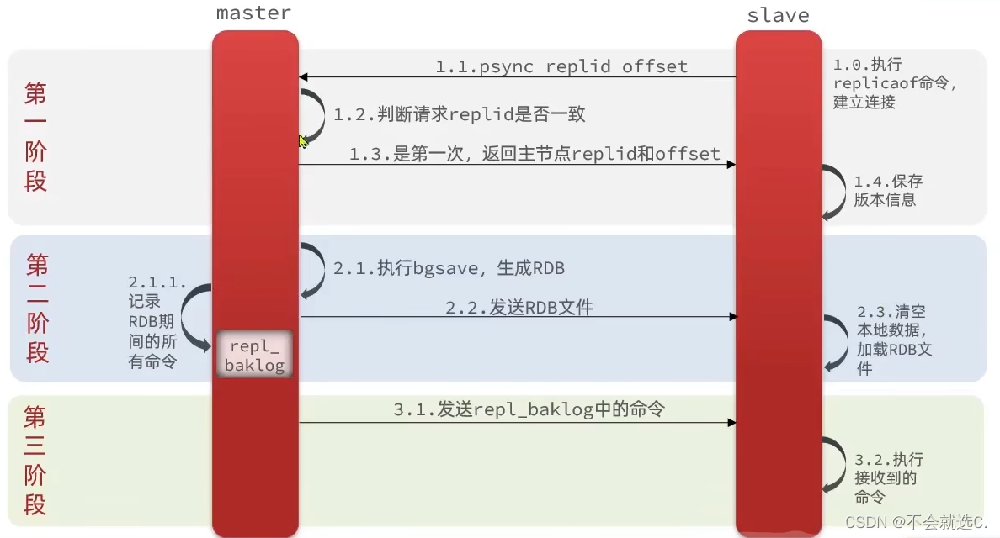

# <center>Redis分布式</center>

## 主从复制
> 我们这里介绍一下 完全同步 与 增量同步

### 前情提要

首先，就是 Redis 是可以用于分布式，也就是 Redis 集群的。他有一个 主节点 **(负责写的操作)** ，多个从节点 **(负责读的操作)**.那么就已经简化操作了，我们只会在一个 **主节点** 进行写的操作，只需要在 **从节点** 上进行更新了。

如何让 A 成为 B 的从节点，可以使用 `slaveof masterlp masterport` 命令来进行设置。


### 原理

首先就是 主和从的角色定位的区分。我们上面已经阐述过了，所以不做过多的阐述。接下来就是讲一下**主从同步**的原理。



主从复制，我认为最主要的两个方面就是 : 

- 何时进行同步
- 怎么同步

一个个看，我们先来看 **何时进行复制**? 
那么自然是在 **主节点** 进行写操作的时候，就会将这个操作同步到 **从节点** 上。那么 **怎么同步** 呢？这里就是通过 **RDB快照** 和 **AOF日志** 来进行同步的。

- `replid` : 主节点的唯一标识
- `offset` : 主节点的偏移量 **作用也很明显，可以看成是versionLog,也就是用来区分主从两个服务节点是否一致的标识，每次主节点需要进行写的操作，offset就+1，当从节点完成了一次主从同步，offset也会更新，一旦二者的offset不一样，那么就会进行主从复制**

如上图所示:

- 先判断 `replid` 是否相同，如果不同，就说明是第一次建立连接。-> **我们需要修改从节点的 replid 使得其与主节点一样**
- 主节点执行 `bgsave` 命令，然后将 RDB 文件发送给从节点，从节点接收到 RDB 文件后，会将 RDB 文件加载到内存中。

    - 这个时候 **快照保存的作用就体现出来了**，我们可以直接利用快照文件来进行数据的同步。而不是需要重新模拟操作一遍。
    - 但是这个时候，我们的数据是不一致的，因为主节点还在继续写操作，所以我们需要进行增量同步。 但是具体怎么操作 我们等下会分析,会记录到 **repl_baklog** 文件中。

- 主节点会将 **repl_baklog** 文件发送给从节点，从节点接收到 **repl_baklog** 文件后，会将 **repl_baklog** 文件加载到内存中。

这个就是 **主从复制** 的原理了。其实就是二句话简单的概括就是 ：

- 主节点先进行**快照的同步**
- 然后再进行**增量的同步**，因为我们不能保证主节点和从节点的数据是一致的。主节点的数据是实时的，我们只能先进行快照的同步，然后再进行**增量的同步**。


### 全量同步和增量同步

**全量同步 :**

- 第一次建立连接的时候
- 从节点宕机的时候，需要重新建立连接
- 从节点长时间没有与主节点数据同步的时候，可能会有定期的全量同步

**实现原理 :**

- **从服务器发送SYNC命令:** 从服务器向主服务器发送 `SYNC` 命令，请求开始同步.
- **主服务器生成RDB快照:** 接收到 `SYNC` 命令之后，会保存当前主服务器中的数据到一个临时文件中，这个过程是 RDB 快照

- **传输RDB文件:** 主服务器将RDB传输到从服务器，进行一次全量同步

- **主服务器记录写命令:** 在RDB文件生成和传输期间，主服务器会记录当前期间所有的写命令到一个缓冲区中，这个缓冲区就是 **repl_baklog** 文件

- **从服务器载入RDB文件:** 从服务器接收到RDB文件之后，会将RDB文件载入到内存中，这个时候从服务器的数据就和主服务器的数据一致了。 至少保证了当前的数据是一致的。


**增量同步 :**

- 增量同步允许 从服务器从断点处开始继续同步，它基于`PSYNC`命令，使用了 `runID` 和 `offset` 概念。

- **runID** : 用来标识主服务器的唯一标识

**主要有三个步骤 :**

- 从服务器恢复网络之后，会发送 `PSYNC` 命令给主服务器，表示现在需要进行同步操作。

- 主服务器接收到了`runID` 和 `offset` 以及`PSYNC`命令之后，会发送一个 `CONTINUE` 的命令表示标识，表示的是可以开始增量同步了。

- 主服务器将主从服务器之间的数据进行同步，这个时候就是增量同步了。

#### 主服务器如何知道哪些增量数据发送给从服务器呢？

我们需要知道两个东西:

- `repl_backlog_buffer` : 是一个 **环形** 的，目的是用来有点类似 `git diff`,方便记录主从服务器断联之后的增量数据差异。

- `replication offset` : 标记上面的缓冲区的同步进度，主从服务器各自有各自的偏移量，主服务器使用 `master_repl_offset` 来进行标记，从服务器使用 `slave_repl_offset` 来进行标记。


那么其实就是很好理解，我们结合 全量同步 提到的`repl_backlog` 文件来进行叙述，因为我们会将在进行全量同步的时候，所有写的操作都会记录在这个文件中，所以我们可以直接利用这个文件来进行增量同步。因为我们在上面已经有两个类似指针的记录到了主和从服务器的偏移量。

然后我们设想一个场景，假设现在从服务器已经断电重连了，我们需要做的就是 **和 主服务器进行校验**，如果要读取的数据还在环形缓冲区中，那么就进行增量同步，如果不在，那么就进行全量同步。因为已经落下了比较多的数据了。


### 哨兵机制
对于哨兵机制的存在，其实就是 **可能有时候 主节点挂了**，需要哨兵机制来进行 **自动的选举**，然后将从节点变成主节点，从而保证服务的正常运行。

主要的作用 ：

- **监控** : 对于主从节点的状态进行监控
- **通知** : 一旦发现主节点挂了，就会通知其他的从节点，进行选举
- **自动故障转移** : 选举出新的主节点，然后将从节点变成主节点


#### 哨兵选Leader的算法原理？

主要的选择Leader的过程分成4步:

- 故障的节点主观下线 

    - 其实也就是哨兵提出了需要这个节点下线的建议，但是这个节点还没有真正的下线

    - 什么时候会提出这个建议呢？是在 **哨兵定期进行心跳检测的时候，如果定期的心跳检测到有一个节点在 TTL 内没有正常的回复，那么这个哨兵就会默认这个节点故障了，需要主动的下线**
- 故障的节点客观下线

    - 这个时候，哨兵会进行投票，如果超过半数的哨兵认为这个节点需要下线，那么就会进行客观下线

    - 如果这个客观下线的节点是 从节点，那么我们就直接的下线，到此为止。但是如果是 **主节点**，那么我们就会进行后续的操作:

- Sentinel 集群选举Leader

    - 原则还是需要过半数，这个哨兵会提出一个建议，让自己成为Leader，被请求的节点如果没有过半数同意这个哨兵的选举，那么就会继续的进行选举，直到有一个哨兵被过半数同意为止。

- Sentinel Leader来决定新主节点

    - 新选举出来的Leader会来决定Redis 的从节点来变成新的主节点。

#### 是如何决定新节点的呢？

1. 过滤 **故障的节点**
2. 选择优先级 `slave-priority`最高的从节点作为主节点

    - 什么是 `slave-priority`呢？
       - 数值越小，优先级越高
       - `slave-priority`是在一开始就默认设置好的，如果没有设置，那么就是默认为 100

3. 如果存在优先级最高的几个从节点，那么就会选择下面的策略来进行选择从节点。

    - 我们会选择 **offset** 复制偏移量最大的从节点来作为主节点，因为复制偏移量最大表示这个节点的数据是最新的。
    - 如果不存在最大的 **offset**,那么就会选择 **runID** 最小的从节点来选择主节点。因为 `RunID` 是唯一标识，所以就不会出现重复的情况。

## 集群模式

> 当一台服务器无法存储当前 Redis 的所有缓存的时候，我们就会选择利用多台服务器来进行存储，这就是 Redis 集群的模式。

我们会选择将数据部署在不同的服务器上，从而降低系统对单主节点的依赖，从而提高 Redis 服务的读写性能.

### 核心模式

- **数据分片:** 我们选择将数据分片成`16384`个哈希槽，每个节点负责一部分哈希槽。

    - 我们对 `KEY` 用 `CRC16` 算法进行哈希，然后对 `16384` 取模，得到的结果就是对应的哈希槽。也就是知道了可以将数据存储在哪个节点上。

    ```bash
    slot = CRC16(key) % 16384
    ```
    -  **槽分配:** 集群启动的时候，需要手动/自动的将槽分配给不同的节点


- **节点角色:** 集群中的节点有三种角色

    - **Master:** 负责数据的读写操作
    - **Slave:** 从节点，负责数据的备份
    - **Sentinel:** 监控节点的状态，进行故障转移
    - 存在多个主节点，每个主节点都有多个从节点，我们的分槽也只是对于主节点来说的。

#### Redis 集群模式优缺点

- 优点: 

    - **高可用性:** Redis 集群的最主要的优点是提供了高可用性，节点之间采用主从复制机制可以保证数据的持久性和容错性。
    - **高性能:** Redis集群采用了分片的技术，将数据分散到多个节点，从而提高读写的性能。
    - **拓展性好:** 可以根据自己的需求，动态的增加或者减少节点，从而提高了系统的拓展性。

- 缺点: 缺点也很明显

    - **维护的成本更高:** 因为我们进行了更多的分片规则和节点的拓展，那么维护的成本也更高。如果出现故障了，那么排查的成本也更高。

    - **集群的同步问题:** 当某些节点失败或者网络发生故障的时候，集群中数据同步的问题也会出现，随着节点数量的增多，数据同步的问题也会变得更加复杂。延迟也会变得更加的大。
    - **数据分片的限制:** Redis 集群的数据分片也限制了一些功能的实现，如在一个Key上修改了多次，可能会为该key所在的节点位置变化而失败。此外，由于数据分散存储到各个节点，某些操作不能跨节点，不同节点之间的操作也需要注意。