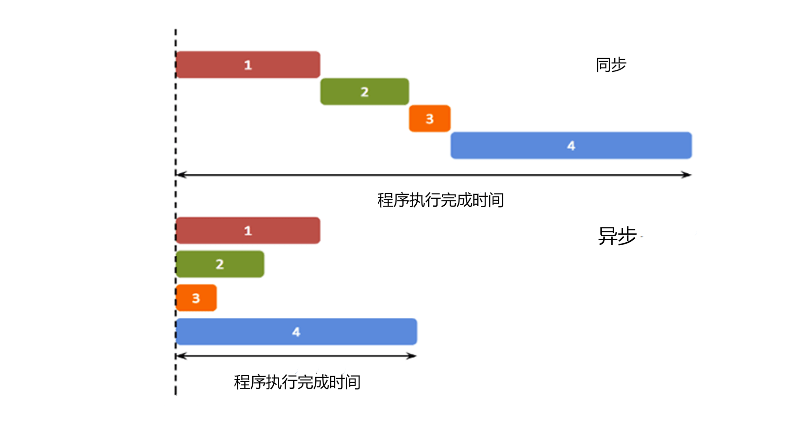
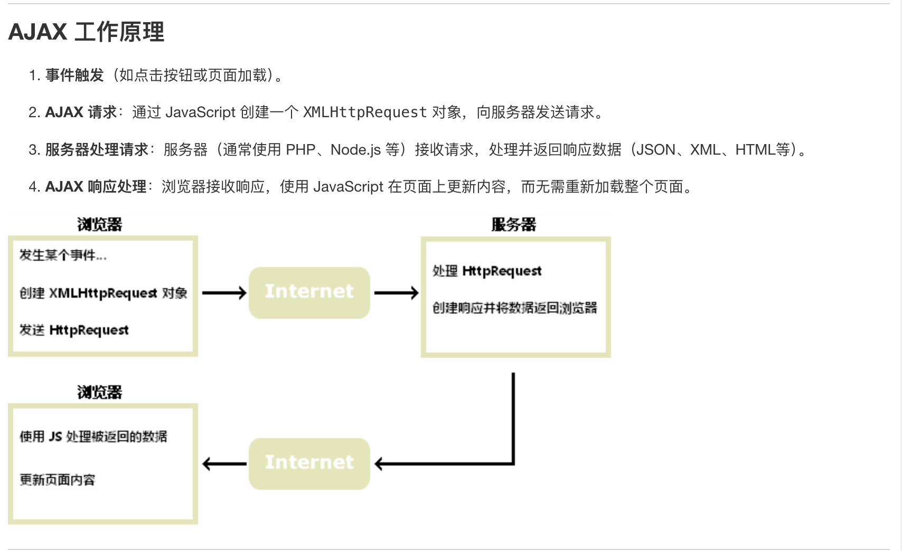

# Asynchronous with Synchronous
> 异步与同步编程

- 首先区分一下概念，什么是同步/异步？
  - 同步: 表示的是程序按照顺序执行
  - 异步: 表示的是程序不按照顺序执行,也就是主线程发射一个子线程来执行，这样的效率更高 

下面给张图比较好理解:



具体来理解一下异步编程：
**异步编程的本质是什么？**
**本质是从主线程发射子线程，因为子线程是不会影响主线程**，在操作系统里学过对于子线程来说，我们进行了`fork`操作，二者共享代码，数据等"相对静态"的资源，而维护属于各自的寄存器，栈，PC等“相对动态”的资源。或者说这样理解，线程是只享有自己的独立动态资源，但那些静态的资源就是共享的了。而在前端编程中，我们在处理一些简短、快速的操作时候，往往在主线程中就可以完成，**主线程作为一个线程，不能接受多方面的请求，也就是说单个事件没有完成的时候，是不会处理其他的请求。** 
我们现在有一个按钮，按下就会形成死循环，整个页面会失去响应，所以我们这种时候就不能使用主线程来完成这个事件，因为可能会导致后续事件的`terminated`,因此我们选择使用子线程来并行完成这个事件。所以我们就考虑了<span style = "color : red">异步</span>来处理，由于子线程一旦发射了就会和主线程失去同步，无法确认它的结果，所以需要有`callback`回调函数来处理实现异步任务的结果处理。

这个例子其实就是对于`setTimeout`函数的使用，`setTimeout(event,time)` waiting for time to call the event.
```js
function print(){
    document.getElementById("demo").innerHTML="RUNOOB!";
}
// waiting for 3000 ms call this function;
setTimeout(print,3000);
```

### `Promise` Object
> A `promise object` contains both the producing code and calls the consuming code.

简单的理解就是，一个`promise object` 负责了异步**操作的执行**和**结果的使用**。
换句话说就是，`promise object`对象实现了一个封装，他同时包含了生产和结果反馈两部分内容于一体。

下面看个例子(模板)：
```js
let myPromise = new Promise(function(myResolve, myReject) {
// "Producing Code" (May take some time)

  myResolve(); // when successful
  myReject();  // when error
});

// "Consuming Code" (Must wait for a fulfilled Promise)
myPromise.then(
  function(value) { /* code if successful */ },
  function(error) { /* code if some error */ }
);
```
也就是把一整个过程，执行和反馈结果都封装到了`myPromise`中去。

- 一个`promise object`可以
    - pending 
    - fulfilled
    - rejected
或者一种更本质的方法是把`promise object`看成状态机的某个状态`state`以及接下来的`result`.

|State|pending|fulfilled|rejected|
|:----:|:----:|:----:|:----:|
|result|undefined|a result value|an error object|

#### How to use `Promise object`
```js
function myDisplayer(some) {
  document.getElementById("demo").innerHTML = some;
}

let myPromise = new Promise(function(myResolve, myReject) {
  let x = 0;

// The producing code (this may take some time)

  if (x == 0) {
    myResolve("OK");
  } else {
    myReject("Error");
  }
});

myPromise.then(
  function(value) {myDisplayer(value);},
  function(error) {myDisplayer(error);}
);
```
我们来看上面的例子，我们定义了一个`myPromise`作为`promise object`的实例，`myResolve`和`myReject`是两个内置的函数，分别用于传递成功/失败的结果。我们看上面这段代码，有`x==0`那么始终是`myResolve`中传递了`OK`进入`.then`阶段，然后由于`success`，那么在`Promise`被成功调用的时候，都会执行`myDisplay(value).`

再来一个通俗易懂的例子
```js
// simply use of callback function
setTimeout(function() { myFunction("I love You !!!"); }, 3000);

function myFunction(value) {
  document.getElementById("demo").innerHTML = value;
}


// simply using promise
let myPromise = new Promise(function(myResolve, myReject) {
  setTimeout(function() { myResolve("I love You !!"); }, 3000);
});

myPromise.then(function(value) {
  document.getElementById("demo").innerHTML = value;
});
```
### `async` 关键字
> The keyword `async` before a function makes the funcion return a promise.

现在就比较好理解了，在`function()`之前加上`async`关键字就表示的是`return`的结果是一个`promise object`生产函数之后的`result`.可能现在不太好理解，我们看下面这个例子：
```js
// The function with `async` keyword
async function myFunction(){
    return "hello";
}

// the above function is the same as the function below
function myFunction(){
    return Promise.resolve("Hello");
} 
```
因为这个`return` 的结果我们可以默认他总是`success`,所以可以使用`resolve`.

```js
async function myFunction(){
    return "hello";
}

myFunction().then{
    function(value){
        myDisplayer(value);
    }
    function(error){
        myDisplayer(error);
    }
}
```


### `await` operation
> It expects a Promise object(representing an asynchronous computation) 它显性的表示了一个许诺对象，也就是说明它会进行异步计算。

- It can only be used inside an `async` function.
- The `await` keyword makes the function pause the execution and wait for a resolved promise before it continues. 先等异步的`resolve promise`再继续执行函数的值。

下面给个例子
```js
// waiting for a timeout
async function myDisplay() {
  let myPromise = new Promise(function(resolve) {
    setTimeout(function() {resolve("I love You !!");}, 3000);
  });
  document.getElementById("demo").innerHTML = await myPromise;
}

myDisplay();
```
我们上面给出了一个例子，很好理解，要达到的效果就是在3000ms之后显示`I love you !!`的内容。因为这种比较小，又频繁动态的变动，所以需要用异步来实现。

一个更深入的例子 
```js
async function getFile() {
  let myPromise = new Promise(function(resolve) {
    // 这里生成了一个 XMLHttpRequest的实例对象;
    let req = new XMLHttpRequest();
    req.open('GET', "mycar.html");
    req.onload = function() {
      if (req.status == 200) {
        resolve(req.response);
      } else {
        resolve("File not Found");
      }
    };
    req.send();
  });
  document.getElementById("demo").innerHTML = await myPromise;
}

getFile();
```


我们先看上面这个例子，`onload`是指在请求完成之后，并且完成请求接收响应之后，自动执行这个函数。因为`req.state==200`就是表示的是成功获得响应，否则就是其他的问题`response code`。在成功找到了对应的文件之后，`resolve`就会传递内容到`document.getElementById("demo").innerHTML = await myPromise;`这个语句中，把获取到到内容给打印出来。


## AJAX技术
> 什么是AJAX?

AJAX = Asynochronous JavaScript and XML
异步的JavaScript 和 XML,它不是一种新的编程语言，而是一种使用现有标准的新方法。类似的其实还有`JSX` (JavaScript+XML)

讲人话就是说：
1. AJAX是一种在无需重新加载整个网页的情况下，能够更新部分网页的技术，
2. AJAX通过在后台与服务器交换数据，并能够更新部分网页



很好理解，其实就是事件触发，也就是需要AJAX的时候，会创造一个`XMLHttpRequest`这样一个对象，请求传给服务器，在得到服务器的答复之后，进行对于网页更新来完成消息的反馈。此过程中不需要完成重新加载网页。
-> 多用于动态页面，适合于频繁请求和更新页面，如聊天应用、新消息提醒等，用户会动态触发部分页面更新，而不影响其他的内容。


> **这里讲一下 什么是重新加载网页：**
> 在查询了一下之后发现，想法很自然，为什么二者要区分开来，我们利用两个词来区分 **静态** 和 **动态**，什么时候需要重新加载网页？或者说重新加载网页的本质是什么？**重新从服务器中获取整个网页的数据**，那么这就会设计一个比较大的工程量，多用于需要有大规模变更/状态重置的场景，比如 **用户登陆/主题切换**，不适合频繁的刷新。


<style>
img{
    margin-left: auto;
    margin-right: auto;
    display : block;
    width : 80%;
    border-radius:15px;
}
</style>