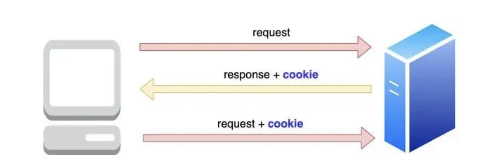
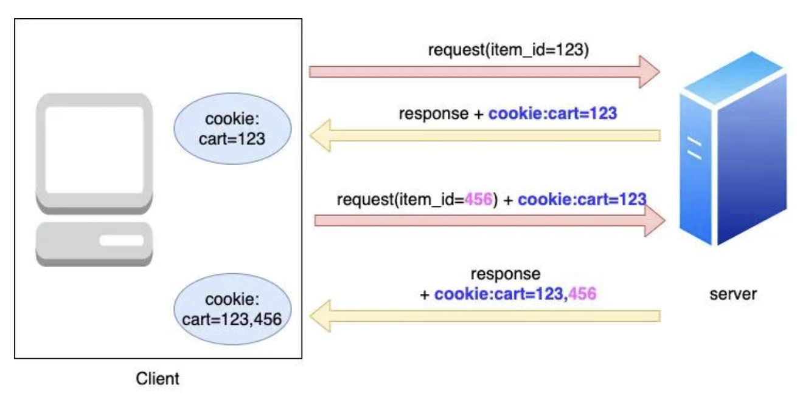
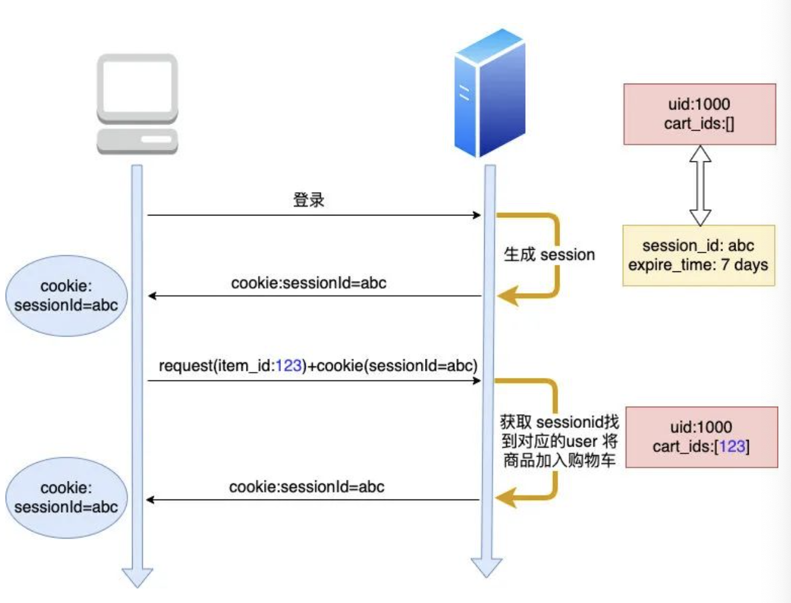
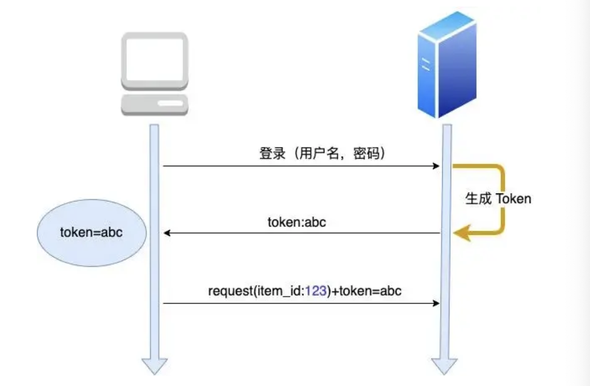
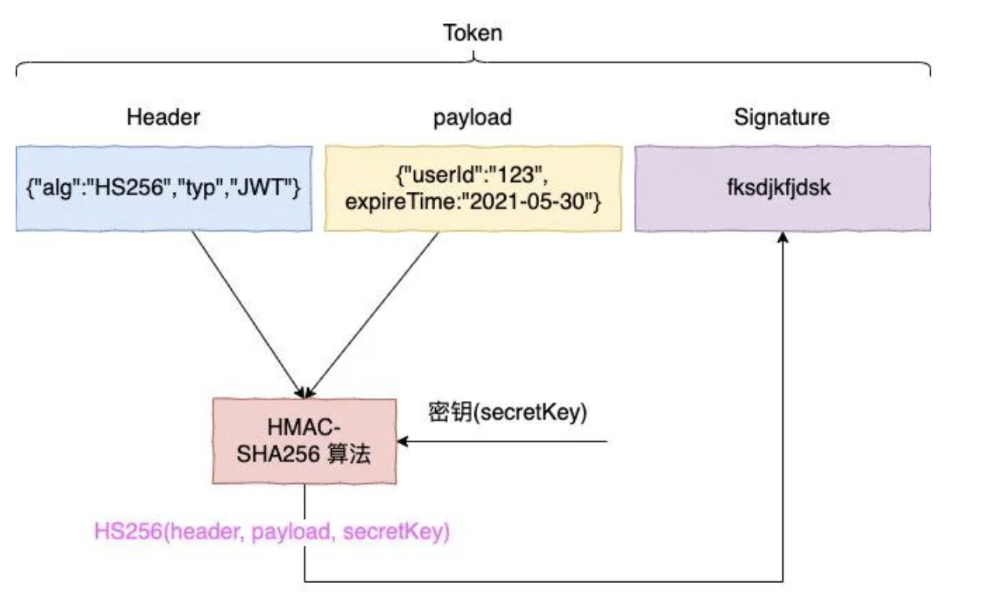

# 
Cookie Session Token

> 这里主要是记录一下 `Cookie` `Session` `Token` 这三者之间的关系，以及他们的区别。这三者在前端开发中是非常重要的，也是面试中经常会被问到的问题。

首先，我们要明确的是目前的开发都是基于前后端分离的架构。那么客户端要向服务端发送请求的时候，为了保证安全性，就需要一些机制来进行保证身份的正确性。这里就是 `Cookie` `Session` `Token` 这三者的作用。

## Introduce 

### HTTP是无状态的
这里要提到一个概念先。**`HTTP`是一个无状态协议**。首先，为什么是无状态，这里有一个历史原因: 最开始的`web`是提供给人们看静态网页的。所以只有 `GET` 请求，浏览完即OK.所以两个链接之间是没有关系的，各自独立的。所以我们的`HTTP`是无状态的。简单的来说就是请求中不会保存用户的状态信息，同时**服务器也不会保存用户的状态信息，否则的话负载有点大了**。

但是我们后来又需要保存用户的状态信息，这个时候就需要 `Cookie` `Session` `Token` 这三者来进行保存用户的状态信息。

所以其实可以这样理解，这三者的本质目的都只有一个，那就是跟踪用户状态，让服务器可以识别并且跟踪这些特定用户请求的状态信息，可以及时的进行提供

### 什么是浏览器的 `local storage`

`local storage` 是浏览器提供的一种存储机制，可以存储一些用户的信息。但是这个存储是永久的，也就是说除非用户手动的去清除，否则的话，这个存储是不会被清除的。这样的话，我们就可以利用这个存储来存储一些用户的信息，比如用户的`id`等等。但是这个存储是不会被发送给服务器的，所以我们还是需要 `cookie` `session` `token` 来进行传递。

简单的来说，就是 `local storage` 也是可以存储用户信息的，它和 `cookie` 存储数据的侧重点不同而已。

## Cookie
> 可以理解为 `small text file` 小文本文件

上图就很简单的把`cookie`的概念和整个过程给展现出来了。`cookie`可以是存放了用户的一些信息，然后存在了本地。只需要在每次请求的时候进行修改与传输给服务器就可以了。但是这样有一个问题，那就是 `cookie` 会变得越来越大，对于每个请求来说就是一个负担了。

但 `cookie` 是一定程度上实现了`HTTP`状态的保持功能。我们可以把cookie理解成一种对于 `HTTP` 无状态的简单补充。

但是 `cookie` 也会有以下的两种问题

1. `cookie` 是存在客户端的，并且大小也是有限制只有4KB.所以对于一些大的数据来说，`cookie` 是不适合的。而且每个浏览器对于每个域名的`cookie`数量也是有限制的。
2. 其次，`cookie` 是明文传输的，所以有可能会被窃取。容易受到`XSS`攻击。 

## Session

那么针对上述的`cookie` 存在的一些问题，我们进一步的使用`session`来解决这样的问题。

首先，`session` 是存储在服务器端的，而不是客户端，这样的好处就是避免了 `cookie` 的 4KB 大小限制，只会取决于服务器的内存大小。

当然，这不代表`cookie` 就没用了，`session`的传递还是需要依靠`cookie`来进行传递的。简单的逻辑可以参考下图:

不要忘记 `session` 存在的本质其实也是进行用户状态的保存与传递跟踪。我们在进行 `cookie` 传递的时候，服务端会给一个响应，里面包含了一个 `sessionID` 来进行用户的身份跟踪。那么接下来的请求，我们不需要在`cookie`中添加一些需要的补充用户信息，只需要利用这个`sessionID`来进行传递即可。每次服务器在给予相应的时候，都从`request`的`cookie`中读取`sessionID`，然后进行相应的处理。这样就避免了`cookie`大小只有4KB无法存入过多的数据以及`cookie`的明文数据泄漏的问题了。

### Session的问题

但是事实上，`Session`这样也是会存在一定的问题。我们大型的项目往往是以集群的形式存在的，也就是说会有多台服务器。那么这样的话，`session`就会有一定的问题。因为`session`是存储在服务器端的，那么如果用户的请求是在不同的服务器上，那么就会出现`session`不一致的问题。这样就会导致用户的状态信息不一致，这样就会出现一些问题。用户请求信息的一致性就会出现问题。这并不是我们想看到的。

首先，我们会想到的一些解决办法其实很简单：

1. 既然有多台服务器，那么我们只需要进行session复制即可。也就是说我们要保证所有的服务器都有一个统一的session.但是小公司其实还行，但是面对大型的公司，他们的服务器都是成千上万，这样的话，session的复制就会变得很困难。而且也是一笔很大的额外开销，也会造成数据的冗余。所以这个方法并不优。

2. 接着，既然不能让所有的服务器都共享一个`session`，这个方法其实是可信的，比如我们把用户的`session`都存在`redis`等中间件中，在每次各个不同的服务端接收到请求的时候，就从`redis`等中间件中读取即可。方法可行是可行，但是这样的话又会多一次内部的链接，消耗了一点性能。可能对于中小厂来说，不太能接受，而且也没有到达使用`redis`的地步。

所以，下面就引入了`Token`来解决这样的问题。

## Token
简单的来说，`Token`要做的就是，首先是依旧秘文，其次是无状态的，最后是可以跨域的。

正如上图所说的，用户先将账号和密码发送请求给了后端服务器，那么会得到一个`token`，那么在接下来的请求中，我们只需要带上这个`token`即可。

看起来很简单，但其实有几个问题需要注意的：

- 如果我随便找一个 `token` 呢？

    事实上，这个办法是不行的，因为服务端有一个校验机制，会校验这个`token` 是否合法，从而判断是哪个用户。

- 那么为什么它不像`session` 那样根据 `sessionID` 来找到userid 呢？
    因为 `token` 本身就自带了用户身份信息。

我们可以把 `token` 视为全家桶，也就是说里面包含了如何解读它。下面是一个 `token` 的构成:

- Header : 用于指定了签名的算法，让服务器知道如何验证这个`token`
- `payload` : 存放的是我们要传递的信息，比如用户的`id`等等

    - `header` 和 `payload` 都是以 `base64` 的形式存在的

- `signature` : 用于验证`token`是否被篡改

当 服务器拿到`header` 和 `payload` 之后，会根据密钥来生成签名，再根据 `token` 中的签名进行比对，是否一致。如果一致，说明`token`是合法的，我们就可以进行相应的操作。

#### JWT 技术  JSON Web Token

## 常见面试题 
### Q1 如果浏览器设置了禁止`cookie`，那么`session`还可以正常使用吗?

**A1** : 不可以，因为我们是利用 `HTTP` 请求中的 `set-cookie` 方法来存放 `sessionID` 的。如果浏览器禁止了`cookie`，那么`session`就无法正常使用了。我们就没有办法传递该用户对应的 `sessionID` 了。

### Q2 在 Q1的背景下，我们有什么办法解决呢？
> 如果遇到这个问题，我们有解决办法，但是比较复杂

1. 我们可以使用 `URL` 重写的办法，简而言之就是在`URL`中添加`sessionID`，进行传递。类似`GET`方法那样会在`URL`中添加参数。但是这样我们的`sessionID`就会被暴露在`URL`中，这样就会有一定的安全性问题。所以这个方法并不推荐。

2. 使用 `token` 的 `JWT` 技术

3. 我们可以从中做梗，也就是说在 `form` 表单中添加隐藏项用来存储`sessionID` .这样我们只需要在`payload` 中读取即可。

### Q3 既然你提到了`local storage`，那么`cookie` 和它二者有什么区别？

同 : 二者都具有存储临时数据的功能，但是二者主要还是有很多不同的侧重点

不同 : 

- `存储大小` : 我们的 `cookie` 一般的容量是 4KB,但是浏览器的`local storage` 可以是很多兆，例如 5MB. 这也决定了二者可以存储的数据可以有很大的不同。 `cookie` 更侧重于是一个身份凭证，而且是要放进 `HTTP` 请求中进行发送的，不能太大，只能存放有用的信息。比如 设置过期时间，跨域访问...
但是 `local storage` 由于有比较大的存储空间，所以一般用来存出同一个域名下不同页面之间的共享数据。这样能达成最大的性能效果。

- `生命周期` : `cookie` 的生命周期是可以有设置一个过期时间的。因为里面传递的是 `sessionID` ,是由服务器端设置的，只要过期时间到了，那么就会失效。但是浏览器的 `local storage` 是永久的储存，只能自己手动删除。

- `安全性` : 打开过 开发者工具都应该知道，`cookie` 值是直接暴露在`HTTP` 的请求头中的，但是 `local storage` 都是存储在本地。所以 `cookie` 是不安全的，而 `local storage` 是安全的。

### Q4 什么是集群部署的呢？

由于我们的后端的服务器可能有很多台，我们的每台服务器之间不共享会话信息，那么就当我们进行需要访问的时候，如果不共享会话信息，就需要一直重新登陆，可能每次访问都需要重新登陆，很麻烦，而且是一种效率低下的方法。

### Q5 什么是 `Session storage` 

它和 `local storage` 是有区别的， `session storage` 是关闭标签页即失效，而 `local storage` 是永久的。我们每次访问了一个页面，都会有一个 `session storage` 与之对应。你可以这样想，因为这个页面是要本地呈现的，它就需要一个地方来存储这些信息。如果需要长期储存的话，会选择储存在 `local storage` 中。

### Q6 既然 `Token` 技术这么好？是不是没有缺点呢？

答案是否定的，我们可以从以下几个角度来看:

- 首先是生命周期， `Token` 是自从颁发之后，就是有效的。这样就会有一定的安全性问题。因为如果 `Token` 被盗了，那么就会有一定的风险。所以我们需要设置一个较短的过期时间，这样就会有一定的安全性问题。

    - 所以相对应的，我们需要设置一个定时刷新`Token`的机制，让颁发出去的 `Token` 定期失效。
    - 或者我们设置一个黑名单制度，每次在进行验证`Token`的时候，都会先在黑名单中确认一下 `Token` 是否存在，如果存在的话，可以直接拒绝进行`Token` 的身份校验。

