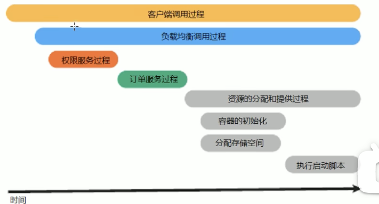

# 
skyWalking

## Introduce

什么是 **SkyWalking** 呢？

**skyWalking** 是一个分布式系统的应用程序性能监视工具，专门为微服务，云原生架构和基于容器的架构而设计的。它是一款 **APM(Application Performance Management)** 工具，包括了分布式追踪、性能指标分析、应用和服务依赖分析等功能。

一句话介绍 **SkyWalking**:

**SkyWalking** 是基于 **OpenTracing**规范，进行分布式链路追踪的一套 APM 系统。同时也是可观测性分析的平台。
### 什么是 APM 系统?

**APM (Application Performance Management)** 可以帮助理解系统行为，用于分析性能问题的工具，以便发生故障的时候，能够快速的定位和解决问题。

openTracing 是一个开放的标准，用于跟踪分布式系统中的请求。而 **SkyWalking** 就是一个实现了 openTracing 标准的一个项目。我们观察下去，其实就有点类似的一个 **甘特图**，来帮助我们理解整个的调用过程: (可能存在并行调用，所以就可以利用甘特图来进行执行，包括调用的时间)

#### 常见的几种 链路式追踪 的中间件

- **Zipkin** : 一个开源的分布式跟踪系统，由 Twitter 公司开发，基于 Google 的 Dapper 论文实现。
- **skyWalking** : 一个开源的分布式 APM 系统，由 Apache 软件基金会管理，支持多种语言，比如 Java,Go,NodeJS,Python等。
    - 追求性能

- **PinPoint** : 一个开源的 APM 系统，由 Naver 公司开发，支持 Java 和 PHP 语言。
    - 收集了非常多的数据，虽然在UI上可以进行凸显，但是就是因为捕获的数据和参数太多，导致了性能的下降。
- **CAT** : 一个开源的分布式系统监控系统，由阿里巴巴开发，支持 Java 和 PHP 语言。
    - 适合大型的分布式系统，但是对于小型的系统，就显得有点大材小用了。
    - 使用是 侵入性的，需要在代码中进行埋点。