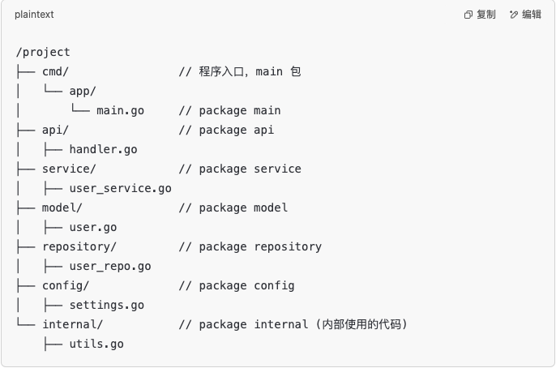

# <center>Go</center>

## Go 优点

1. 高性能/高并发
2. 语法简单 学习曲线平滑
3. 丰富的标准库
4. 完善的工具链
5. 静态链接
6. 快速编译
7. 跨平台
8. 垃圾回收


我们来看`Go`语言的一段代码，十分的简单可以看出它的优势
```go
package main

import{
    net/http
}

func main(){
    http.Handle("/",http.FileServer(http.Dir(".")))
    http.ListenAndServe(":8080",nil)
}
```

### 几个指令
1. `go build` 目的是将目标文件编译成可执行文件，但是不会执行
2. `go run` 目的是编译并执行源文件


### 入门语法

#### 总体的介绍

一个 `go` 程序包含了几个部分

- 包声明
- 引入包
- 函数
- 变量
- 语句 & 表达式
- 注释

```go
// 包声明
package main

// 引入包
import "fmt"

// 函数
func main(){
    fmt.Println("Hello,World")
}
```

-  `package main` 其实可以单独的表示一个可独立执行的 `go` 程序。但是在项目中就需要`package xxx` 来声明包名。



如上图所示, `package main` 是一定存在的，它是一个可独立执行的 `go` 程序的入口。我们的大型项目最终都会编译成一个可执行文件，这个文件就是 `main` 包的入口。

-  `fmt` 包的作用, `fmt` 包是Go语言的标准库，主要用来格式化输入输出。可以简单的理解为 `C` 语言中的 `stdio.h` 包。

- 有一个要注意的是 `{` 不能被单独放在一行，否则会报错。下面这个程序就是例子。
    
    ```go
    package main
    
    import "fmt"

    func main()
    {
        fmt.Println("Hello,World")
    }
    ```

#### 格式化字符串
- `fmt.Printfln` 根据格式化字符串输出内容
- `fmt.Sprintf` 根据格式化字符串返回一个格式化的字符串

    `var target_url = fmt.Sprintf("http://%s:%d",host,port)`


### 数据类型
> `Go` 语言中声明变量类型都是放在变量名之后的，并非前面 

`var identifier type` 或者 `var identifier1, identifier2 type` 

`var flag bool`


### 短变量声明
> `:=` 属于是 `Go` 语言的语法糖，只允许在函数内部使用。

- 自动推断类型，用于声明新的变量
- 不能用于声明全局变量

```go
variableName := value

var variableName type = value
```

#### 数组

`var a[5]int` // 声明一个长度为5的数组

`var a[5]int {1,2,3,4,5}` // 声明一个长度为5的数组并初始化

`a := [5]int{1,2,3,4,5}` // 声明一个长度为5的数组并初始化

`a := []int`

`go` 中的数组是长度固定，而且长度也是数组类型的一部分。所以 `[5]int` 和 `[10]int` 是不同的类型。由于它的长度固定，我们在项目中其实更多的时候使用的是切片。


#### 切片 Slice
- 切片不同于 数组， 它可以任意的改变长度
- 我们可以利用 `append()` 方法来增加切片的容量，但是必须赋值给原来的切片。

```go
package main

import "fmt"

func main(){
    s := make([]string,3)
    s[0] = "a"
    s[1] = "b"
    s[2] = "c"

    fmt.Println("get:",s[2]); // c
    fmt.Println("len:",len(s)); // 3


    s = append(s,"d") // s : a b c d
    s = append(s,"e","f") // s : a b c d e f

    c := make([]string,len(s))
    copy(c,s) // we can copy the slice


    fmt.Println(s[2:5]) // print the slice from 2 to 5 (not include 5)

}
```


需要注意的是 `slice` 
 
- 不支持比较的，所以我们不能使用 `==` 来比较两个 `slice` 是否相等。
 
- 同时 slice 也不支持负数索引，不能像 `python` 那样

#### map 
> 我们这里介绍一下 `map` 数据结构

- `map` 是一种无序的键值对的集合 

下面看一段例子，就能知道 `map` 的使用

**go 中的 map 是完全无序的，不像Java的Collections中的封装的数据结构一样有序**


```go
package main

import "fmt"

func main() {
	m := make(map[string]int)
	m["one"] = 1
	m["two"] = 2
	fmt.Println(m)           // map[one:1 two:2]
	fmt.Println(len(m))      // 2
	fmt.Println(m["one"])    // 1
	fmt.Println(m["unknow"]) // 0

	r, ok := m["unknow"]
	fmt.Println(r, ok) // 0 false

	delete(m, "one")

	m2 := map[string]int{"one": 1, "two": 2}
	var m3 = map[string]int{"one": 1, "two": 2}
	fmt.Println(m2, m3)
}


```


go 允许直接通过`m[key]` 来访问 `map`,即使 `key` 不存在，也不会发生运行时候的错误。而是返回`map` 的值的类型的 **零值**，同时 `ok` 会返回 `false`。


#### range
> `range` 关键字用于 `for` 循环中迭代数组、切片、通道或集合的元素

```go
package main

import "fmt"

func main() {
	nums := []int{2, 3, 4}
	sum := 0
	for i, num := range nums {
		sum += num
		if num == 2 {
			fmt.Println("index:", i, "num:", num) // index: 0 num: 2
		}
	}
	fmt.Println(sum) // 9

	m := map[string]string{"a": "A", "b": "B"}
	for k, v := range m {
		fmt.Println(k, v) // b 8; a A
	}
	for k := range m {
		fmt.Println("key", k) // key a; key b
	}

    for _,v := range m{
        fmt.Println(v) // A; B
    }
}

```
我们可以利用 `range` 来快速遍历数组，切片，map等数据结构。同时我们可以获得的是 `index` 和 `value`.世界是一个巨大的 `KV` 。
如果不需要 `索引` 我们可以利用 `_` 来忽略。


#### 函数
> Go 函数是基本的代码块，用于执行一个任务

它的函数和`python` 一样，可以返回多个值。但是我们日常使用的时候其实是会返回两个值，一个是结果，一个是错误信息。

```go
package main

import "fmt"

func add(a int, b int) int {
	return a + b
}

func add2(a, b int) int {
	return a + b
}

// exists function return value and ok 
// Because it may not exist some specific key
func exists(m map[string]string, k string) (v string, ok bool) {
	v, ok = m[k]
	return v, ok
}

func main() {
	res := add(1, 2)
	fmt.Println(res) // 3

	v, ok := exists(map[string]string{"a": "A"}, "a")
	fmt.Println(v, ok) // A True
}
```

#### 指针

Go 语言中也支持 `pointer`，但是它支持的功能比较有限，主要的用处就是传入参数并且进行修改

下面的代码就是一个例子，我们通过指针来进行对 `n` 的修改，先通过指针寻址了之后，再进行修改。
```go
package main

import "fmt"

func add2(n int) {
	n += 2
}

func add2ptr(n *int) {
	*n += 2
}

func main() {
	n := 5
	add2(n)
	fmt.Println(n) // 5
	add2ptr(&n)
	fmt.Println(n) // 7
}

```


#### 结构体

Go 中也存在结构体，它是一种自定义的数据类型，可以包含多个字段。

```go
package main

import "fmt"

type user struct {
	name     string
	password string
}

func main() {
	a := user{name: "wang", password: "1024"}
	b := user{"wang", "1024"}
	c := user{name: "wang"}
	c.password = "1024"
	var d user
	d.name = "wang"
	d.password = "1024"

	fmt.Println(a, b, c, d)                 // {wang 1024} {wang 1024} {wang 1024} {wang 1024}
	fmt.Println(checkPassword(a, "haha"))   // false
	fmt.Println(checkPassword2(&a, "haha")) // false
}

func checkPassword(u user, password string) bool {
	return u.password == password
}

func checkPassword2(u *user, password string) bool {
	return u.password == password
}

```


终于有点 OOP 那味儿了，我们可以通过 `type` 关键字来定义一个结构体，然后通过 `.` 来访问结构体的字段。同时我们也可以通过 `&` 来获取结构体的指针。结构体也支持指针，这样能够实现对结构体的修改，也可以在某种情况下避免一些大结构体的拷贝开销


#### 结构体方法

```go
package main

import "fmt"

type user struct {
	name     string
	password string
}

func (u user) checkPassword(password string) bool {
	return u.password == password
}

func (u *user) resetPassword(password string) {
	u.password = password
}

func main() {
	a := user{name: "wang", password: "1024"}
	a.resetPassword("2048")
	fmt.Println(a.checkPassword("2048")) // true
}

```

相比上面提到的 `checkPassword` 函数，我们在定义结构体方法中的 `checkPassword` 的时候，会在方法名前面加上一个括号，然后在括号中加上一个参数，这个参数就是接收者，它可以是值接收者，也可以是指针接收者。如果我们给参数带上了指针，那么就表明是可以对这个结构体进行修改的。否则的话其实就是对这个结构体的值进行拷贝。

#### 错误处理

在 `Go` 语言中，错误处理是一个很重要的概念，它能通过返回错误值来告知是哪个函数出现了问题，并且能够简单的 `if-else` 来进行处理错误。
在函数里面，我们可以在函数的返回值类型加一个 `error`.就代表这个函数可能会出现返回错误。那么在函数实现的时候，就应该返回两个值，要么是结果，要么是错误。
`return nil 和 error` 或者 `return value 和 nil`

```go
package main

import (
	"errors"
	"fmt"
)

type user struct {
	name     string
	password string
}

func findUser(users []user, name string) (v *user, err error) {
	for _, u := range users {
		if u.name == name {
			return &u, nil
		}
	}
	return nil, errors.New("not found")
}

func main() {
	u, err := findUser([]user{{"wang", "1024"}}, "wang")
	if err != nil {
		fmt.Println(err)
		return
	}
	fmt.Println(u.name) // wang

	if u, err := findUser([]user{{"wang", "1024"}}, "li"); err != nil {
		fmt.Println(err) // not found
		return
	} else {
		fmt.Println(u.name)
	}
}

```

我们看上面的代码 `v *user` 表示的是返回的为 `user` 类型的指针

#### 字符串

```go
package main

import (
	"fmt"
	"strings"
)

func main() {
	a := "hello"
	fmt.Println(strings.Contains(a, "ll"))                // true
	fmt.Println(strings.Count(a, "l"))                    // 2
	fmt.Println(strings.HasPrefix(a, "he"))               // true
	fmt.Println(strings.HasSuffix(a, "llo"))              // true
	fmt.Println(strings.Index(a, "ll"))                   // 2
	fmt.Println(strings.Join([]string{"he", "llo"}, "-")) // he-llo
	fmt.Println(strings.Repeat(a, 2))                     // hellohello
	fmt.Println(strings.Replace(a, "e", "E", -1))         // hEllo
	fmt.Println(strings.Split("a-b-c", "-"))              // [a b c]
	fmt.Println(strings.ToLower(a))                       // hello
	fmt.Println(strings.ToUpper(a))                       // HELLO
	fmt.Println(len(a))                                   // 5
	b := "你好"
	fmt.Println(len(b)) // 6
}

```

字符串没什么好说的，就是一些内置的函数，可以用来处理字符串。前提是我们需要引入 `strings` 包来进行处理。不然的话无法调用这些函数。

对于 字符串的格式化输出，`go` 语言中的`printf` 函数 可以用 `%v` 来支持各种类型的输出，我们也可以利用 `%+v` 来进行更详细的结果，比如在打印结构体的时候。也可以用 `%#v` 来进行更详细的输出，比如在打印切片的时候。


我们既然有字符串了，其实很多时候我们就会遇到一种问题就是其他值类型的转化成字符串，抑或是字符串转化成其他值类型。这个时候我们就可以利用 `strconv` 包来进行转化。

```go
package main

import (
	"fmt"
	"strconv"
)

func main() {
	f, _ := strconv.ParseFloat("1.234", 64)
	fmt.Println(f) // 1.234

	n, _ := strconv.ParseInt("111", 10, 64)
	fmt.Println(n) // 111

	n, _ = strconv.ParseInt("0x1000", 0, 64)
	fmt.Println(n) // 4096

	n2, _ := strconv.Atoi("123")
	fmt.Println(n2) // 123

	n2, err := strconv.Atoi("AAA")
	fmt.Println(n2, err) // 0 strconv.Atoi: parsing "AAA": invalid syntax
}

```

#### JSON
为什么要在 `go` 语言中把 `JSON` 单独拿出来说，就是因为 `go` 语言中的结构体的优势，让它处理 `JSON` 特别方便。我们只要保证每个字段的首字母大写，就可以直接利用`JSON.MarshalIndent`来进行序列化变成一个 `JSON` 的字符串。同时我们也可以利用 `JSON.Unmarshal` 来进行反序列化。


当然，我们也可以利用 `JSON` 中的 `tag` 进行相关的操作来满足我们的需求。比如我们可以在结构体中加上 `tag` 来进行序列化的时候的字段名的修改。

```go
package main

import (
	"encoding/json"
	"fmt"
)

type userInfo struct {
	Name  string
	Age   int `json:"age"`
	Hobby []string
}

func main() {
	a := userInfo{Name: "wang", Age: 18, Hobby: []string{"Golang", "TypeScript"}}
	buf, err := json.Marshal(a)
	if err != nil {
		panic(err)
	}
	fmt.Println(buf)         // [123 34 78 97...]
	fmt.Println(string(buf)) // {"Name":"wang","age":18,"Hobby":["Golang","TypeScript"]}

	buf, err = json.MarshalIndent(a, "", "\t")
	if err != nil {
		panic(err)
	}
	fmt.Println(string(buf))

	var b userInfo
	err = json.Unmarshal(buf, &b)
	if err != nil {
		panic(err)
	}
	fmt.Printf("%#v\n", b) // main.userInfo{Name:"wang", Age:18, Hobby:[]string{"Golang", "TypeScript"}}
}

```

#### 时间处理
这个没什么好说的，就是可以利用 `time.Now()` 来获取一个时间的对象结构体。直接看例子代码

```go
package main

import (
	"fmt"
	"time"
)

func main() {
	now := time.Now()
	fmt.Println(now) // 2022-03-27 18:04:59.433297 +0800 CST m=+0.000087933
	t := time.Date(2022, 3, 27, 1, 25, 36, 0, time.UTC)
	t2 := time.Date(2022, 3, 27, 2, 30, 36, 0, time.UTC)
	fmt.Println(t)                                                  // 2022-03-27 01:25:36 +0000 UTC
	fmt.Println(t.Year(), t.Month(), t.Day(), t.Hour(), t.Minute()) // 2022 March 27 1 25
	fmt.Println(t.Format("2006-01-02 15:04:05"))                    // 2022-03-27 01:25:36
	diff := t2.Sub(t)
	fmt.Println(diff)                           // 1h5m0s
	fmt.Println(diff.Minutes(), diff.Seconds()) // 65 3900
	t3, err := time.Parse("2006-01-02 15:04:05", "2022-03-27 01:25:36")
	if err != nil {
		panic(err)
	}
	fmt.Println(t3 == t)    // true
	fmt.Println(now.Unix()) // 1648738080
}

```


<style>
img{
    display : block;
    margin-left : auto;
    margin-right : auto;
    width : 85%;
    border-radius : 15px;
}
</style>

