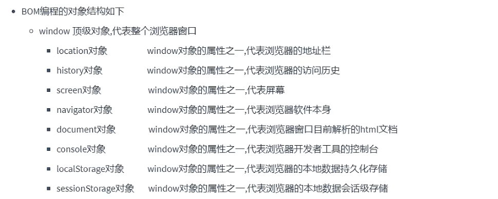
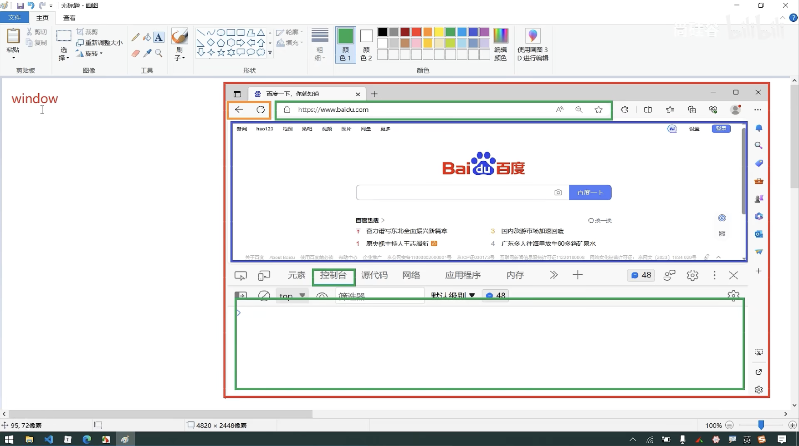
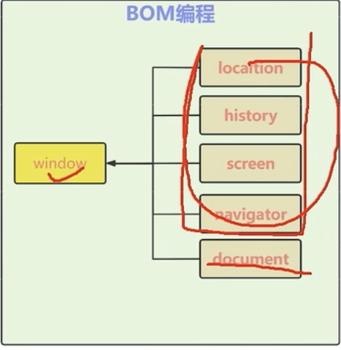
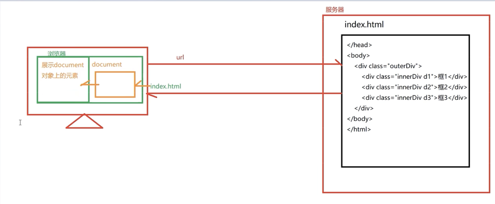
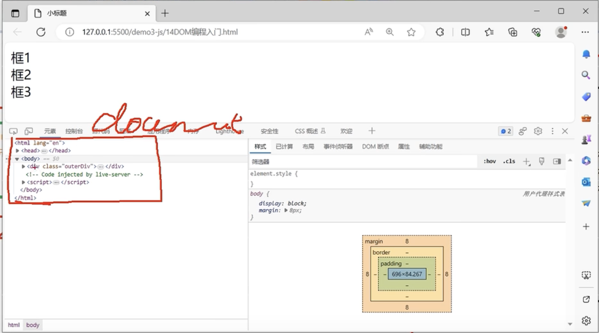
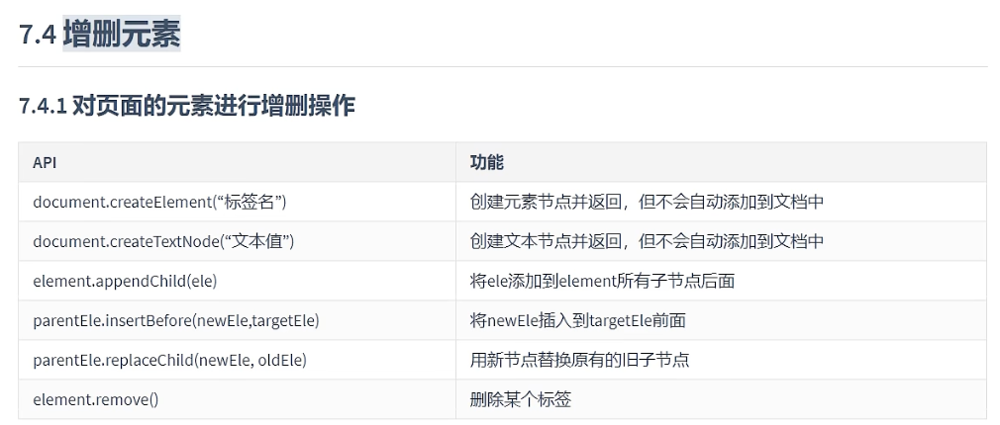
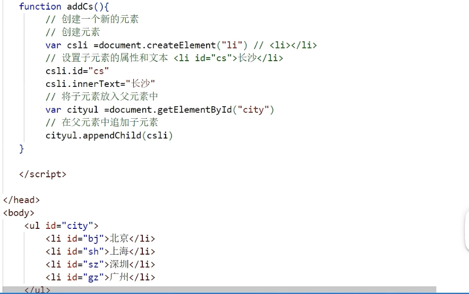

# <center>JavaScript</center>
事件驱动

## 正则表达式
> 正则表达式是描述字符模式的对象。正则表达式用于对字符串模式匹配及检索替代，是对字符串执行匹配的强大工具。

In JS,regular expressions are represented by RegExp objects.RegExp objects may be created with the `RegExp()` constructor, of course, but they are more often created using a special literal syntax.

- `let pattern = new RegExp("s$")`

    -> It represents all the strings that ends with the letter `s`
- `$`, a special meta-character that match the end  of  a substring.


The Syntax is `/pattern/modifiers`
- Example : 
  - `/w3schools/i` 表示的是`w3schools` 这个需要被查找的字符串，`i`表示的是忽略大小写
    `/w3schools/` represents that **matches any string that contains** the substring "w3school"/

-  `search()`
> 这个方法的作用是利用一个表达式来查找和返回找到的字符串的位置

```js
let text = "Visit W3Schools!";
let n = text.search(text);
console.log(n) // 6
```


- `replace()`
> This method replaces a specified value with another value in string


```js
let text = "Visit Microsoft!";
let reuslt = text.replace("Microsoft","W3Schools");
```

下面，我们结合一下RegExp来进行查找
```js
let text = "Visit Microsoft!";
// 将字符串中所有包含 忽略大小写的 `microsoft` 的字符串替换成`W3Schools`
let result = text.replace(/microsoft/i,"W3Schools");
```

#### Regular Expression Modifiers
- `i` Perform case-intensitive matching 忽略大小写
- `g` Perform a global match (find all) 寻找所有
这个怎么理解呢？就是将待查找的字符串中的所有符合标准的字符串都查找出来

- `m` Perform multiline matching
用于多行字符串中的查找， 并且`^` 和 `$` 应该匹配字符串的开始和结束
```js
const str = "hello\nworld";
const regex = /^world/m
console.log(str.match(regex)); // 输出 ["world"]
```

- `d` perform stat and end matching


## BOM编程
> Browser Object Model 浏览器对象模型

- BOM 是由一系列对象组成，访问、控制、修改浏览器属性和方法（通过window对象及属性的一系列方法控制浏览器行为的一种编程）





我们比较上下两个图分析，可以发现一个网页其实是由很多个`window`对象组成的
  - `history` 对象 访问浏览器的浏览历史
  - `location` 对象 浏览器的地址栏
  - `console` 对象 浏览器开发者工具的控制台
  - `screen` 对象 代表屏幕
  - `document` 对象 代表的是浏览器打开的html文档
  - `navigator` 对象 当前浏览器软件本身  
  - `sessionStorage` 对象 会话级存储
  - `localStorage` 对象 持久级存储
`window` 对象 API
`window` 对象属性 API 
通过`window`对象及其属性的API，控制浏览器的属性和行为

我们其实就是对不同的对象进行编辑工作 那么BOM编程其实就是通过`window`对象及属性来控制浏览器行为的一种编程。


### BOM常见编程
#### 三种弹窗方式
- `alert`
- `prompt`
- `confirm`
> `window` 对象无需自己创建，是自带的

```js
function fun1(){
    window.alert("hello");

    // res 是输入的内容
    var res = window.prompt("hello,请输入姓名");
    console.log(res)

    var res1 = window.confirm("确定要删除吗?");
    console.log(res1)

}
```

#### 定时任务

```js
function func4(){
    window.setTimeout(function(){
        console.log("hello")
    },2000);
}
```


#### history 属性 访问历史
- 上一页
- 下一页


```js
function funA(){
    // 向前翻页
    history.back()
}

function funcB(){
    // 向前翻页
    history.forward()
}
```

#### location 

```js
function func(){
    // 修改地址栏中的URL -> 超链接
    // The fields but not method;
    window.location.href = "http://www.atguigu.com"
}
```

#### session Storage 会话级数据

```js
function funcE(){
    window.sessionStorage.setItem("keyA","valueA")
    // 键名
    console.log(sessionStorage.getItem("keyA"))
}

```
> 浏览器重启的时候，`session Storage`中的数据就会被清空，但是`local Storage`中的数据仍然会存在

#### local Storage 持久级存储数据

```js
function funcF(){
    window.localStorage.setItem("keyA","valueA")
}

```


## DOM 编程 
> DOM -> Documentation Object Model 



通过`documentation`的API实现页面元素的更改。
首先，为什么会有`DOM`单独的分开呢？因为`DOM`中所包含的API过于丰富，就单独的单开了一个。还有就是可能有人会觉得我可以在`html`上的源代码进行更改啊，但是事实上是当项目整个发布了之后，我们基本上不会大概前端的源代码，而且对于不同的用户，所面对的都是不同的。那么这种情况我们就需要`DOM`编程了。无法满足实时修改源代码。



我们的源代码`index.html`是部署在服务器上的，但是你浏览器所做的只是利用服务器上的源代码来渲染生产了一个`document`的对象，你所呈现的都是`document`这个对象所展示出来的内容，你可以如下图一样，在工具栏内部进行对`document`对象的修改，但是这并不会影响到你服务器上的源代码.
但是你刷新浏览器，其实就是重新从服务器获取`document`的内容，重新渲染。



document 中的对象是层层包含关系，树形结构

**DOM 树的节点类型**
- 元素节点 element 标签
- 属性节点 attribute 属性
- 文本标签 text 两个标签中间包含的文本;

### DOM 获取元素的几种方式

1. 获得`document` dom 树
2. 从`document`中获取要操作的元素
   1. 直接获取
   2. 间接获取
3. 对元素进行操作
   1. 操作元素的属性
   2. 操作元素的文本
   3. 操作元素的样式
   4. 增删元素

- 直接获取
  - `documentById`
  - `documentByTagName`
  - `documentByClass`
- 间接获取
  - 根据父元素
    ```js
    function fun5(){
        var div01 = document.getElementById("div01");
        var cs = div01.children //通过父元素，获取全部子元素
        var cs1 = div01.firstElementChild;
        var cs2 = div01.lastElementChild;
        for(var i=0;i<cs.length;i++)
            console.log(cs[i])
    }
    ```
  - 根据子元素，获取父亲元素
  - 根据子元素，获取兄弟元素
    ```js
    function func6(){
        var child = document.getElementById("1")
        var sibling = child.previousElementSibling
        var nextSibling = child.nextElementSibling
    }
    ```
### DOM 操纵元素
- 操纵元素的属性
  ```js
  function changeAttribute(){
    var in1 = document.getElementById("in1")
    // 修改属性值
    in1.style.color = "green"
  }
  ```

- 操纵元素的样式
  ```js
  function changeAttribute(){
    var in1 = document.getElementById("in1")
    // 修改样式值
     in1.style.color = "green"
    // 原始样式中的 - 变成驼峰式子 
     in1.style.borderRadius = 13px 
  }
  ```

- 操纵元素的文本
  - `document.innerHTML`
  - `document.innerText`

### DOM 中的增删元素





<style>
img{
    display : block;
    margin-left : auto;
    margin-right : auto;
    width : 85%;
    border-radius : 15px;
}
</style>